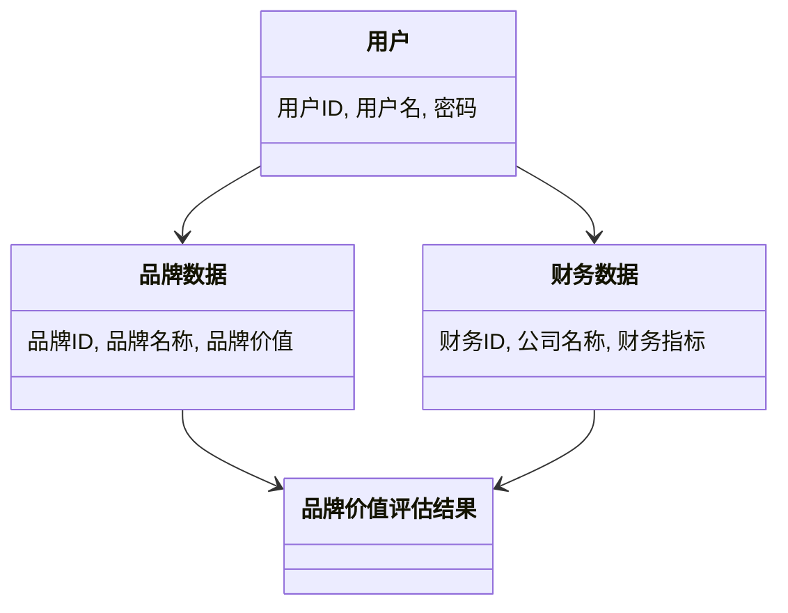

                 


# 股市估值在国际品牌价值评估标准化中的应用

> 关键词：股市估值，品牌价值评估，标准化，多因子模型，财务指标

> 摘要：本文探讨了股市估值方法在国际品牌价值评估中的应用，分析了标准化体系的构建，结合实际案例和算法模型，详细阐述了如何利用股市估值技术来提升品牌价值评估的准确性和科学性。

---

## 第1章：股市估值与品牌价值评估的背景与概念

### 1.1 股市估值的基本原理

#### 1.1.1 股票估值的核心概念
股票估值是通过分析公司财务状况、行业地位和市场前景等多方面因素，计算其内在价值的过程。核心概念包括：

- **内在价值**：公司未来现金流的现值，基于DCF模型计算。
- **市场价值**：股票在市场上的实际交易价格。
- **估值方法**：包括市盈率（P/E）、市净率（P/B）等相对估值方法，以及现金流折现模型（DCF）等绝对估值方法。

#### 1.1.2 股市估值的主要方法
- **相对估值法**：通过比较同行业公司或指数的倍数（如P/E、P/B）来确定股票价值。
- **绝对估值法**：基于公司未来现金流的折现计算内在价值，如DCF模型。
- **情景分析法**：考虑不同市场情景对股票价值的影响。

#### 1.1.3 股市估值与品牌价值的关系
品牌价值是企业市场价值的重要组成部分，而股市估值通过分析企业整体价值，间接反映了品牌的价值。品牌价值的提升通常会带来股票价格的上涨，因此股市估值可以作为品牌价值评估的参考指标。

### 1.2 国际品牌价值评估的标准化需求

#### 1.2.1 品牌价值评估的定义与特征
品牌价值是指品牌为企业带来的超额收益，具有无形资产的特征。其评估需要考虑品牌知名度、忠诚度、形象和创新能力等因素。

#### 1.2.2 国际品牌价值评估的现状与挑战
- **现状**：品牌价值评估方法多样，但缺乏统一的标准化体系。
- **挑战**：品牌价值受主观因素影响较大，难以量化；不同行业和地区的评估标准差异显著。

#### 1.2.3 标准化评估体系的必要性
建立统一的评估标准有助于提高品牌价值评估的准确性和可比性，为投资者和企业管理者提供可靠的决策依据。

### 1.3 股市估值在品牌价值评估中的应用前景

#### 1.3.1 股市估值与品牌价值的关联性
股市估值通过分析企业的财务表现和市场地位，间接反映了品牌价值。品牌价值的提升会带动企业盈利能力和股票价值的增长。

#### 1.3.2 股市估值在品牌价值评估中的优势
- **数据丰富**：股市估值基于公开的财务数据，具有较高的可获得性和透明性。
- **方法成熟**：股市估值方法经过长期实践验证，具有较高的可靠性和可操作性。

#### 1.3.3 应用中的潜在问题与解决方案
- **问题**：品牌价值受主观因素影响较大，难以完全量化。
- **解决方案**：结合定量分析和定性分析，建立多维度的评估体系。

---

## 第2章：国际品牌价值评估的核心要素与方法论

### 2.1 品牌价值评估的核心要素

#### 2.1.1 品牌知名度
品牌知名度是品牌价值的重要指标，可以通过市场调研、品牌曝光度等方法进行评估。

#### 2.1.2 品牌忠诚度
品牌忠诚度反映了消费者对品牌的忠诚程度，可以通过客户满意度调查和重复购买率等指标衡量。

#### 2.1.3 品牌形象与声誉
品牌形象与声誉是品牌价值的重要组成部分，可以通过媒体分析、社会责任评估等方法进行量化。

#### 2.1.4 品牌创新能力
品牌创新能力反映了品牌在市场中的竞争力，可以通过专利数量、新产品发布频率等指标评估。

### 2.2 品牌价值评估的主要方法

#### 2.2.1 市场法
- **方法**：基于市场交易数据，通过比较同行业公司的情况进行评估。
- **优点**：数据来源丰富，易于操作。

#### 2.2.2 收益法
- **方法**：基于未来现金流的折现值计算品牌价值。
- **优点**：考虑了品牌未来的盈利能力。

#### 2.2.3 成本法
- **方法**：基于品牌建设的投入成本进行评估。
- **缺点**：难以准确反映品牌实际价值。

### 2.3 国际品牌价值评估的标准化方法

#### 2.3.1 标准化指标的设计
- **核心指标**：品牌知名度、品牌忠诚度、品牌形象与声誉、品牌创新能力。
- **权重分配**：根据行业特点和企业实际情况，合理分配各指标的权重。

#### 2.3.2 标准化评估流程
1. 数据收集与整理
2. 指标权重确定
3. 评估模型构建
4. 计算与分析
5. 结果验证与优化

#### 2.3.3 标准化评估结果的验证
- **验证方法**：通过与实际市场表现对比，评估模型的准确性和可靠性。
- **优化措施**：根据验证结果，调整模型参数和指标权重。

---

## 第3章：股市估值模型在品牌价值评估中的应用

### 3.1 股市估值模型的核心原理与实现

#### 3.1.1 股票内在价值的计算公式
股票的内在价值可以通过DCF模型计算：
$$ V = \frac{CF}{(1+r)^n} $$
其中，CF为未来现金流，r为贴现率，n为时间跨度。

#### 3.1.2 股票市场价值的影响因素
包括宏观经济环境、行业竞争状况、公司财务表现等。

#### 3.1.3 股市估值模型的分类
- **相对估值模型**：市盈率模型（P/E）、市净率模型（P/B）。
- **绝对估值模型**：现金流折现模型（DCF）、股利折现模型（DDM）。

### 3.2 常见的股市估值模型

#### 3.2.1 市盈率模型（P/E）
- **公式**：$$ P/E = \frac{股价}{每股收益} $$
- **应用**：适用于盈利稳定的公司，能够反映市场对公司的估值水平。

#### 3.2.2 市净率模型（P/B）
- **公式**：$$ P/B = \frac{股价}{每股净资产} $$
- **应用**：适用于净资产收益率较高的公司，能够反映公司的资产质量。

#### 3.2.3 现金流折现模型（DCF）
- **公式**：$$ V = \sum_{t=1}^{n} \frac{CF_t}{(1+r)^t} + \frac{TV}{(1+r)^n} $$
- **应用**：适用于长期现金流预测准确的公司，能够反映公司的未来盈利能力。

### 3.3 股市估值模型在品牌价值评估中的应用

#### 3.3.1 品牌价值与股市估值的对应关系
- **对应关系**：品牌价值高的公司，通常具有较高的股票市场价值。
- **影响因素**：品牌知名度、品牌忠诚度、品牌形象与声誉等。

#### 3.3.2 基于股市估值模型的品牌价值评估方法
- **步骤**：
  1. 收集公司财务数据和品牌相关数据。
  2. 选择合适的估值模型进行计算。
  3. 结合品牌核心要素进行调整和优化。

#### 3.3.3 案例分析：苹果公司品牌价值的评估
- **案例背景**：苹果公司是全球知名品牌，其品牌价值与其股票市场价值密切相关。
- **评估过程**：
  1. 收集苹果公司的财务数据和品牌相关数据。
  2. 使用DCF模型计算苹果公司的股票内在价值。
  3. 结合品牌知名度、品牌忠诚度等因素进行调整，得出品牌价值。

### 3.4 本章小结

---

## 第4章：基于股市估值的国际品牌价值评估系统设计

### 4.1 系统应用场景与功能

#### 4.1.1 系统应用场景
- **企业内部评估**：帮助企业准确评估品牌价值，制定品牌战略。
- **投资决策支持**：为投资者提供品牌价值评估数据，辅助投资决策。

#### 4.1.2 系统功能设计
- **数据采集**：收集品牌相关数据和财务数据。
- **指标计算**：基于标准化指标体系，计算品牌价值。
- **模型优化**：根据实际数据调整模型参数，提高评估准确性。

#### 4.1.3 系统架构设计
- **前端界面**：用户友好的操作界面，支持数据输入和结果展示。
- **后端逻辑**：实现品牌价值评估的核心算法和数据处理。
- **数据库设计**：存储品牌相关数据和评估结果。

### 4.2 系统功能设计

#### 4.2.1 领域模型类图


#### 4.2.2 系统架构图


#### 4.2.3 系统接口设计
- **输入接口**：支持用户输入品牌相关数据和财务数据。
- **输出接口**：展示品牌价值评估结果和相关分析报告。

#### 4.2.4 系统交互流程
```mermaid
sequenceDiagram
    用户 ->> 系统：提交品牌数据
    系统 ->> 数据库：查询相关财务数据
    数据库 ->> 系统：返回财务数据
    系统 ->> 用户：显示品牌价值评估结果
```

---

## 第5章：项目实战与最佳实践

### 5.1 项目环境配置

#### 5.1.1 系统环境
- **操作系统**：Windows 10 或更高版本
- **编程语言**：Python 3.8 或更高版本
- **开发工具**：Jupyter Notebook 或 VS Code

#### 5.1.2 数据来源
- **品牌数据**：来源于品牌评估机构或企业内部数据。
- **财务数据**：来源于公司财务报表或金融数据库。

### 5.2 核心实现代码

#### 5.2.1 数据预处理代码
```python
import pandas as pd

# 读取品牌数据
brand_data = pd.read_csv('brand.csv')

# 读取财务数据
financial_data = pd.read_csv('financial.csv')

# 合并数据
merged_data = pd.merge(brand_data, financial_data, on='公司名称')
```

#### 5.2.2 品牌价值评估模型
```python
def calculate_brand_value(merged_data):
    # 计算品牌价值
    brand_value = merged_data['品牌价值'] * (1 + merged_data['增长率'])
    return brand_value

# 示例计算
example_company = '苹果公司'
brand_value = calculate_brand_value(merged_data[merged_data['公司名称'] == example_company])
print(f"{example_company}的品牌价值为：{brand_value}")
```

#### 5.2.3 模型优化代码
```python
from sklearn.linear_model import LinearRegression

# 训练模型
model = LinearRegression()
model.fit(X, y)

# 预测品牌价值
predicted_values = model.predict(new_X)
```

### 5.3 实际案例分析

#### 5.3.1 案例背景
以苹果公司为例，分析其品牌价值的评估过程。

#### 5.3.2 数据分析与结果展示
- **数据分析**：通过财务数据和品牌相关数据，计算苹果公司的品牌价值。
- **结果展示**：展示品牌价值评估结果，并进行对比分析。

### 5.4 项目小结

#### 5.4.1 经验总结
- **数据质量的重要性**：确保数据的准确性和完整性。
- **模型选择的合理性**：根据实际情况选择合适的评估模型。
- **结果验证的必要性**：通过实际数据验证模型的准确性和可靠性。

#### 5.4.2 改进建议
- **数据来源多样化**：引入更多维度的数据，如社交媒体数据、消费者反馈等。
- **模型优化**：结合机器学习技术，提高评估的准确性和实时性。

---

## 第6章：最佳实践与未来展望

### 6.1 最佳实践

#### 6.1.1 标准化流程
- **数据收集与整理**：确保数据的全面性和准确性。
- **指标体系设计**：根据行业特点和企业实际情况，合理设计评估指标。
- **模型选择与优化**：结合实际数据，选择合适的评估模型，并进行参数优化。

#### 6.1.2 数据质量管理
- **数据清洗**：去除无效数据，处理缺失值和异常值。
- **数据标准化**：统一数据格式和单位，确保数据的可比性。

#### 6.1.3 模型优化
- **参数调整**：根据实际数据，调整模型参数，提高评估准确度。
- **模型验证**：通过实际数据验证模型的准确性和可靠性。

### 6.2 未来展望

#### 6.2.1 数据来源的扩展
随着大数据技术的发展，未来可以引入更多维度的数据，如社交媒体数据、消费者行为数据等，进一步提高品牌价值评估的准确性。

#### 6.2.2 模型优化与创新
结合人工智能技术，开发更加智能和高效的评估模型，如深度学习模型，进一步提高品牌价值评估的科学性和准确性。

#### 6.2.3 应用场景的拓展
未来，品牌价值评估可以在更多领域得到应用，如企业并购、品牌风险管理、品牌资产保值与增值等。

---

## 作者：AI天才研究院/AI Genius Institute & 禅与计算机程序设计艺术 /Zen And The Art of Computer Programming

---

这篇文章从背景介绍、核心概念、算法原理、系统架构到项目实战，全面探讨了股市估值在国际品牌价值评估标准化中的应用，结合实际案例和最佳实践，为读者提供了丰富的理论和实践指导。

