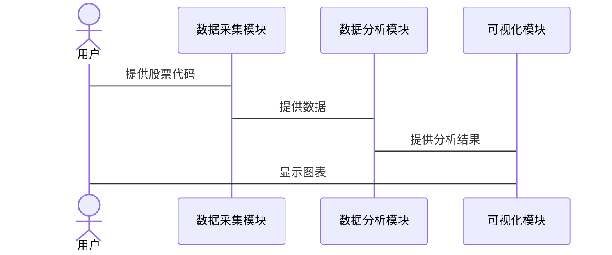

                 


# 股市估值在国际品牌价值链分析中的应用

> 关键词：股市估值，国际品牌，价值链分析，市盈率，市净率，品牌价值

> 摘要：本文探讨了股市估值与国际品牌价值链分析的结合，通过数学模型和算法原理，详细分析了如何利用股市估值方法评估国际品牌的价值链地位，结合实际案例，展示了其在投资决策中的应用。

---

# 第一部分: 股市估值与国际品牌价值链分析的背景与基础

## 第1章: 股市估值的基本概念与方法

### 1.1 股市估值的定义与核心要素

#### 1.1.1 股市估值的基本定义
股市估值是指通过对公司财务数据、市场表现和行业环境的分析，估算公司股票的内在价值或市场价值的过程。其核心在于量化公司的价值，帮助投资者做出投资决策。

#### 1.1.2 股票价值的决定因素
股票价值由多种因素决定，包括但不限于：
- **财务数据**：收入、利润、资产、负债等。
- **市场环境**：宏观经济、行业趋势、政策变化等。
- **公司管理**：管理层的决策能力和战略规划。
- **市场情绪**：投资者的心理预期和市场波动。

#### 1.1.3 市场价值与内在价值的关系
市场价值是股票在市场上的交易价格，而内在价值是基于公司基本面的估值。两者可能不一致，但内在价值为市场价值提供了参考。

### 1.2 国际品牌价值链的构成与特点

#### 1.2.1 价值链的基本概念
价值链是指企业从原材料采购到产品最终交付给客户的整个过程中的价值创造活动。国际品牌价值链涉及全球化的供应链、生产和销售网络。

#### 1.2.2 国际品牌价值链的构成要素
- **供应商管理**：原材料采购和供应商关系。
- **生产过程**：制造和质量控制。
- **销售网络**：分销渠道和零售终端。
- **品牌营销**：广告、推广和客户关系管理。

#### 1.2.3 价值链的协同效应与竞争优势
价值链的协同效应是指价值链各环节的有效配合带来的成本降低和效率提升。竞争优势则体现在品牌价值、成本控制和市场响应速度等方面。

### 1.3 股市估值在国际品牌价值链分析中的意义

#### 1.3.1 股市估值对品牌价值的影响
股市估值能够量化品牌的市场价值，帮助投资者评估品牌在价值链中的地位。

#### 1.3.2 价值链分析对投资决策的作用
通过分析价值链，投资者可以识别企业的竞争优势和潜在风险，做出更明智的投资决策。

#### 1.3.3 两者的结合对企业价值评估的提升
结合股市估值和价值链分析，可以更全面地评估企业的价值，帮助投资者发现被低估或高估的投资机会。

---

## 第2章: 股市估值的核心概念与数学模型

### 2.1 股市估值的核心概念

#### 2.1.1 市盈率（P/E）的定义与计算
市盈率是股票价格与每股收益的比率，用于衡量股票的估值水平。

$$ P/E = \frac{Stock Price}{Earnings Per Share} $$

#### 2.1.2 市净率（P/B）的定义与计算
市净率是股票价格与每股净资产的比率，用于衡量股票的价值是否被低估。

$$ P/B = \frac{Stock Price}{Book Value Per Share} $$

#### 2.1.3 市销率（P/S）的定义与计算
市销率是股票价格与每股销售收入的比率，用于衡量股票的市场价值。

$$ P/S = \frac{Stock Price}{Revenue Per Share} $$

### 2.2 国际品牌价值链的核心要素

#### 2.2.1 品牌影响力与市场地位
品牌影响力决定了企业在市场上的定价能力和市场份额。

#### 2.2.2 供应链管理与成本控制
高效的供应链管理和成本控制是企业竞争优势的重要来源。

#### 2.2.3 营销策略与客户忠诚度
有效的营销策略和客户忠诚度能够提升品牌的市场地位和客户粘性。

### 2.3 股市估值与价值链分析的数学模型

#### 2.3.1 市盈率模型
市盈率模型用于评估股票的合理价格，通过比较行业平均市盈率来判断股票的估值水平。

#### 2.3.2 市净率模型
市净率模型适用于评估资产密集型企业的股票价值，通过比较资产价值来判断股票的低估或高估。

#### 2.3.3 市销率模型
市销率模型适用于评估收入稳定但利润较低的企业，通过比较收入与股票价格的关系来判断股票价值。

---

## 第3章: 股市估值与价值链分析的算法原理

### 3.1 股市估值的算法原理

#### 3.1.1 基于市盈率的估值方法
- **步骤1**：计算目标公司的每股收益（EPS）。
- **步骤2**：确定可比公司的平均市盈率。
- **步骤3**：计算目标公司的理论股价。

#### 3.1.2 基于市净率的估值方法
- **步骤1**：计算目标公司的每股净资产（BVPS）。
- **步骤2**：确定可比公司的平均市净率。
- **步骤3**：计算目标公司的理论股价。

#### 3.1.3 基于现金流的估值方法
- **步骤1**：计算目标公司的自由现金流（FCF）。
- **步骤2**：确定合适的折现率。
- **步骤3**：计算目标公司的理论股价。

### 3.2 国际品牌价值链的分析算法

#### 3.2.1 价值链效率评估模型
- **步骤1**：分析供应链的效率。
- **步骤2**：评估生产过程的成本控制。
- **步骤3**：优化销售网络的覆盖范围。

#### 3.2.2 品牌价值贡献度模型
- **步骤1**：计算品牌收入的占比。
- **步骤2**：评估品牌溢价能力。
- **步骤3**：量化品牌对整体价值的贡献。

#### 3.2.3 价值链协同效应评估模型
- **步骤1**：分析各环节的协同效应。
- **步骤2**：量化协同效应带来的成本节约。
- **步骤3**：评估协同效应对整体价值的提升。

---

## 第4章: 系统分析与架构设计

### 4.1 系统功能设计

#### 4.1.1 数据采集模块
- **功能**：收集股票数据、行业数据和公司财务数据。
- **工具**：使用API接口或数据爬虫。

#### 4.1.2 数据分析模块
- **功能**：应用市盈率、市净率等模型进行估值分析。
- **工具**：Python的pandas和numpy库。

#### 4.1.3 可视化模块
- **功能**：生成图表展示分析结果。
- **工具**：使用Matplotlib或Seaborn。

#### 4.1.4 报告生成模块
- **功能**：输出分析报告。
- **工具**：使用Python的报告生成库。

### 4.2 系统架构设计

#### 4.2.1 系统架构图


#### 4.2.2 接口设计
- **输入接口**：股票代码、时间范围。
- **输出接口**：估值结果、分析报告。

#### 4.2.3 交互流程


---

## 第5章: 项目实战

### 5.1 环境安装
- **Python**：安装Python 3.8及以上版本。
- **库的安装**：安装pandas、numpy、matplotlib。

### 5.2 核心代码实现

#### 5.2.1 数据采集代码
```python
import pandas as pd
import requests

def get_stock_data(stock_code, start_date, end_date):
    url = f'https://api.example.com/stock_data?code={stock_code}&start={start_date}&end={end_date}'
    response = requests.get(url)
    data = response.json()
    df = pd.DataFrame(data['data'])
    return df
```

#### 5.2.2 数据分析代码
```python
import pandas as pd

def calculate_pe_ratio(df):
    pe_ratio = df['stock_price'] / df['eps']
    return pe_ratio.mean()

data = get_stock_data('AAPL', '2020-01-01', '2023-12-31')
pe = calculate_pe_ratio(data)
print(f'平均市盈率: {pe}')
```

### 5.3 案例分析与结果解读

#### 5.3.1 案例分析
以苹果公司为例，分析其市盈率和市净率。

#### 5.3.2 结果解读
- 苹果公司的平均市盈率低于行业平均水平，说明其股票可能被低估。

### 5.4 项目小结
通过实际案例分析，验证了股市估值在国际品牌价值链分析中的应用价值。

---

## 第6章: 最佳实践与注意事项

### 6.1 最佳实践
- **数据来源**：选择可靠的第三方数据源。
- **模型优化**：结合多种估值方法进行交叉验证。
- **动态调整**：根据市场变化及时更新数据。

### 6.2 小结
本文通过理论分析和实际案例，展示了股市估值在国际品牌价值链分析中的应用。

### 6.3 注意事项
- 数据的准确性和完整性。
- 模型的适用性和局限性。
- 市场风险和不可预测因素。

### 6.4 拓展阅读
- 推荐阅读《投资学》和《企业价值链管理》。

---

# 作者：AI天才研究院/AI Genius Institute & 禅与计算机程序设计艺术 /Zen And The Art of Computer Programming

---

通过以上思考和分析，我们可以看到，股市估值在国际品牌价值链分析中的应用是一个复杂但极具价值的领域。通过结合数学模型和实际案例，我们可以更全面地评估企业的价值，为投资决策提供有力支持。

