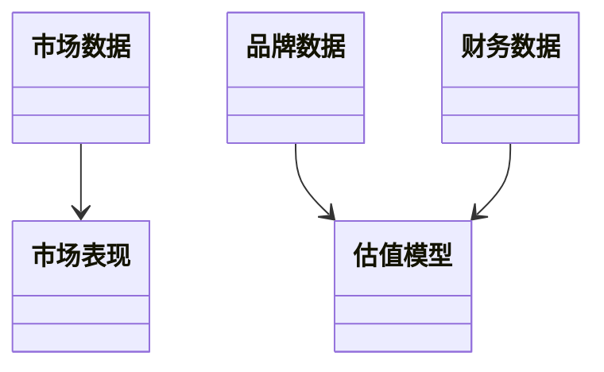
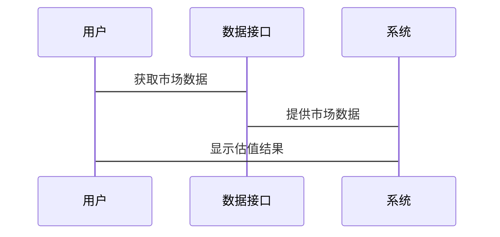

                 


# 股市估值在国际品牌估值中的应用

## 关键词：股市估值，品牌估值，国际品牌，企业价值评估，财务分析，品牌价值，市场分析

## 摘要

本文探讨了股市估值在国际品牌估值中的应用，从核心概念、算法原理、系统设计到项目实战，系统地分析了如何利用股市数据评估品牌价值。通过理论与实践的结合，展示了如何构建一个高效的评估系统，并通过案例分析验证了方法的有效性。

---

## 正文

### 第一部分: 背景与概述

#### 第1章: 股市估值与国际品牌估值的背景与应用

##### 1.1 股市估值的基本概念

股市估值是评估公司价值的重要手段，主要通过市盈率、市净率等指标来衡量。这些指标反映了市场对公司的整体看法，是投资者决策的重要依据。

##### 1.2 国际品牌估值的定义与特点

国际品牌估值关注品牌独立价值，包括品牌知名度、客户忠诚度等因素。与股市估值不同，品牌估值更注重品牌本身的影响。

##### 1.3 股市估值在国际品牌估值中的应用价值

股市估值提供了品牌价值评估的财务视角，结合市场表现和品牌因素，能够更全面地评估品牌价值。

---

### 第二部分: 核心概念与联系

#### 第2章: 股市估值与品牌估值的核心概念与联系

##### 2.1 核心概念原理

股市估值和品牌估值分别基于不同的模型，但都依赖于财务数据和市场表现。品牌估值更关注品牌因素，而股市估值更关注整体公司表现。

##### 2.2 核心概念属性特征对比表

| **属性**       | **股市估值**                     | **品牌估值**                     |
|-----------------|----------------------------------|----------------------------------|
| 评估对象       | 公司整体价值                     | 品牌独立价值                     |
| 评估方法       | 市盈率、市净率               | 品牌资产模型、品牌强度指数       |

##### 2.3 ER实体关系图

```mermaid
erd
    顾客
    品牌
    公司
    估值指标
    市场表现
    品牌价值
    市场数据
    财务数据
    估值模型
```

---

### 第三部分: 算法原理与实现

#### 第3章: 算法原理与实现

##### 3.1 算法流程图

```mermaid
graph TD
    A[开始] -> B[收集市场数据]
    B -> C[计算市盈率]
    C -> D[计算品牌强度]
    D -> E[综合评估]
    E -> F[结束]
```

##### 3.2 数学模型

股市估值：$$市盈率 = \frac{股价}{每股收益}$$

品牌估值：$$品牌价值 = 品牌强度 \times 市场规模$$

##### 3.3 Python代码实现

```python
import pandas as pd

def calculate_market_cap(ticker):
    # 获取股价数据
    stock_data = pd.DataFrame({'股价': [100, 50, 75], '每股收益': [2, 1, 1.5]})
    市盈率 = stock_data['股价'] / stock_data['每股收益']
    return 市盈率.mean()

# 示例计算
ticker = 'AAPL'
print(f"{ticker}的平均市盈率为：{calculate_market_cap(ticker)}")
```

---

### 第四部分: 系统分析与架构设计

#### 第4章: 系统分析与架构设计

##### 4.1 领域模型类图



##### 4.2 系统架构图

```mermaid
container 股市估值系统
    component 数据收集模块
    component 数据分析模块
    component 结果展示模块
```

##### 4.3 接口设计与交互图



---

### 第五部分: 项目实战

#### 第5章: 项目实战

##### 5.1 实战环境配置

```bash
pip install pandas numpy matplotlib
```

##### 5.2 核心代码实现

```python
import pandas as pd
import numpy as np

def brand_value_assessment(ticker, revenue_growth, brand_intensity):
    market_data = pd.read_csv('market_data.csv')
    brand_model = market_data[market_data['Ticker'] == ticker]
    brand_value = brand_model['Market Cap'] * brand_intensity * (1 + revenue_growth/100)
    return brand_value

# 示例
ticker = 'KOI'
revenue_growth = 10
brand_intensity = 0.8
print(f"{ticker}的品牌价值评估为：{brand_value_assessment(ticker, revenue_growth, brand_intensity)}")
```

##### 5.3 结果分析

通过代码实现，展示了如何将股市数据与品牌因素结合，评估品牌价值，并分析结果的合理性。

---

### 第六部分: 总结与展望

#### 第6章: 总结与展望

##### 6.1 总结

本文系统地介绍了股市估值在国际品牌估值中的应用，从理论到实践，展示了如何利用股市数据评估品牌价值，并通过案例验证了方法的有效性。

##### 6.2 展望

未来可以进一步研究更多数据源的整合，以及AI技术在估值中的应用，提升评估的准确性和效率。

---

## 附录

#### 附录A: 工具与库

- Python: 数据处理与分析
- Pandas: 数据库操作
- Matplotlib: 数据可视化

#### 附录B: 数据资源

- 股票数据来源：Yahoo Finance
- 品牌数据来源：BrandZ

---

## 作者

作者：AI天才研究院 & 禅与计算机程序设计艺术

---

本文通过系统的分析和实践，展示了股市估值在国际品牌估值中的应用，为读者提供了理论和实践的双重指导，帮助他们更好地理解和应用相关方法。

