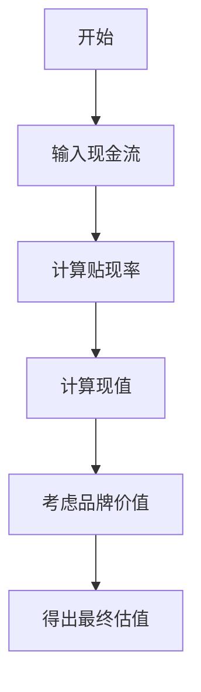
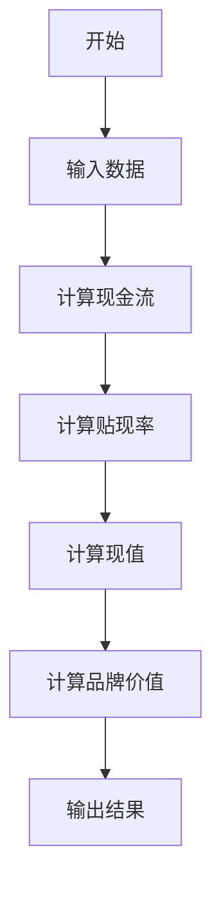
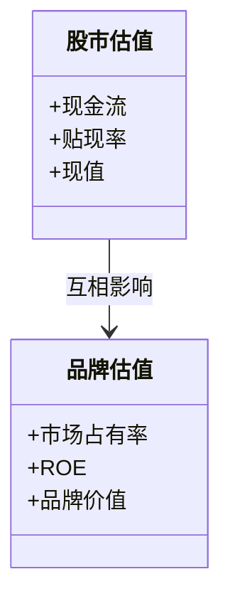
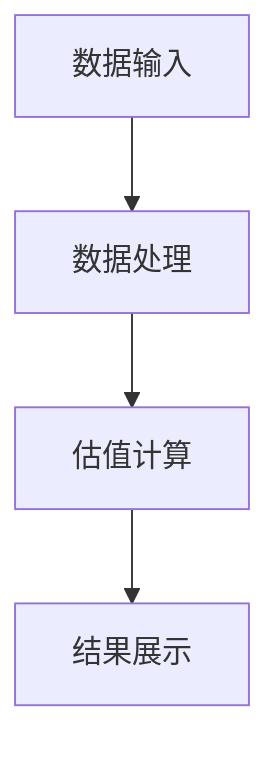

                 


```markdown
# 股市估值在国际品牌估值标准化中的应用

## 关键词：
股市估值、品牌估值、标准化、DCF模型、市场价值、内在价值

## 摘要：
本文探讨了股市估值在国际品牌估值标准化中的应用，分析了股市估值与品牌估值的核心概念、数学模型、算法流程、系统架构以及实际案例。通过详细分析，本文旨在为读者提供一个全面的视角，理解如何将股市估值方法应用于品牌估值，并实现标准化。

---

## 第一章: 背景介绍与核心概念

### 1.1 股市估值的基本概念
股市估值是通过对企业的财务数据和市场情况进行分析，确定其股票的内在价值和市场价值的过程。核心在于理解企业的盈利能力、成长潜力和风险水平。

#### 1.1.1 股票内在价值
股票的内在价值是基于企业未来现金流的折现值。计算公式如下：
$$ PV = \sum_{t=1}^{n} \frac{CF_t}{(1 + r)^t} $$
其中，\( PV \) 是现值，\( CF_t \) 是第 \( t \) 年的现金流，\( r \) 是折现率。

#### 1.1.2 市场价值与内在价值
市场价值受市场情绪、宏观经济环境等外部因素影响，而内在价值则基于企业基本面。两者之间的差异可能导致股价波动。

### 1.2 品牌估值的重要性
品牌是企业的核心资产之一，其价值体现在市场占有率、品牌强度和财务表现等方面。

#### 1.2.1 品牌价值的构成
品牌价值由品牌知名度、客户忠诚度和品牌强度决定。品牌强度可以通过市场占有率和ROE（净资产收益率）的乘积来衡量。

#### 1.2.2 品牌强度指数
$$ BSI = \frac{Market Share}{Price} $$

### 1.3 标准化估值的意义
在国际品牌估值中，标准化是确保不同市场和文化背景下品牌价值可比性的关键。通过统一的评估标准，可以提高估值的准确性和可操作性。

---

## 第二章: 核心概念与联系

### 2.1 股市估值与品牌估值的对比
通过对比表格，我们可以清晰地看到两者的异同：

| 指标 | 股市估值 | 品牌估值 |
|------|----------|----------|
| 核心 | 现金流折现 | 品牌价值公式 |
| 影响 | 市场情绪 | 品牌强度 |

### 2.2 核心概念的数学模型
#### 2.2.1 股市估值模型
现值公式：
$$ PV = \frac{CF}{(1 + r)^t} $$

#### 2.2.2 品牌估值模型
品牌价值公式：
$$ Brand Value = EBIT \times (Market Share \times ROE) $$

### 2.3 核心概念的联系
通过流程图，我们可以看到股市估值和品牌估值在企业价值评估中的相互作用。



---

## 第三章: 算法原理与流程图

### 3.1 股市估值算法
#### DCF模型的实现
```python
def calculate_intrinsic_value(cash_flows, discount_rate):
    pv = sum(cf / (1 + discount_rate)**t for t, cf in enumerate(cash_flows))
    return pv
```

### 3.2 品牌估值算法
#### 品牌强度指数计算
```python
def calculate_brand_strength(index):
    brand_strength = index['Market Share'] / index['Price']
    return brand_strength
```

### 3.3 算法流程图


---

## 第四章: 系统分析与架构设计

### 4.1 领域模型


### 4.2 系统架构


---

## 第五章: 项目实战

### 5.1 环境安装
安装必要的库：
```bash
pip install numpy pandas matplotlib
```

### 5.2 核心实现
#### 股市估值代码
```python
import numpy as np

def calculate_intrinsic_value(cash_flows, discount_rate):
    return np.npv(discount_rate, cash_flows)
```

#### 品牌估值代码
```python
import pandas as pd

def calculate_brand_value(data):
    data['Brand Value'] = data['EBIT'] * (data['Market Share'] * data['ROE'])
    return data
```

### 5.3 案例分析
以某品牌为例，计算其品牌价值，并分析结果。

---

## 第六章: 总结与展望

### 6.1 总结
本文详细探讨了股市估值在国际品牌估值标准化中的应用，通过数学模型、算法流程和系统架构的分析，为读者提供了全面的视角。

### 6.2 展望
未来的研究可以进一步探讨如何利用人工智能技术提高估值的准确性和效率。

---

## 作者：AI天才研究院 & 禅与计算机程序设计艺术
```

