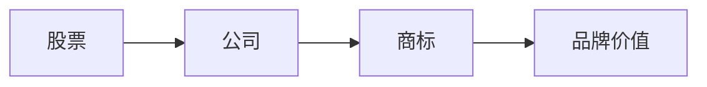
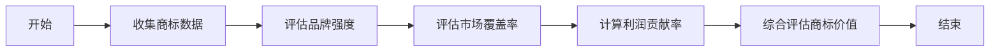
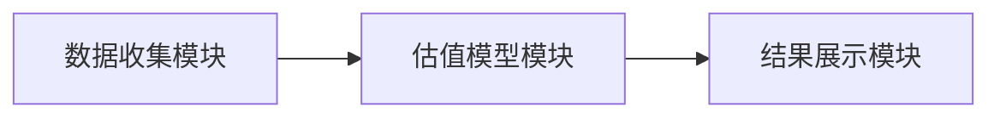
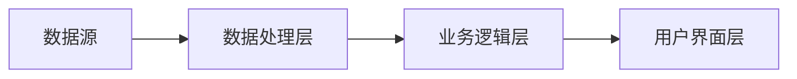

                 


```markdown
# 股市估值在国际商标估值中的应用

> 关键词：股市估值、国际商标估值、市盈率、市净率、商标价值、层次分析法（AHP）、品牌强度

> 摘要：本文探讨了股市估值方法在国际商标估值中的应用，通过分析股票估值的核心指标与商标估值的关键因素，结合数学模型和系统架构设计，展示了如何将股市估值原理应用于商标价值评估。文章详细介绍了商标价值的层次分析法（AHP）及其在系统中的实现，并通过实际案例分析，进一步阐述了如何利用股市估值方法优化商标价值评估过程。最后，文章总结了最佳实践和注意事项，为读者提供了深入的理论和实践指导。

---

## 第1章: 股市估值与国际商标估值的背景与概念

### 1.1 股市估值的基本原理

#### 1.1.1 股票估值的核心概念
股票估值是通过对公司财务数据和市场表现的分析，确定其内在价值的过程。常用指标包括市盈率（P/E）、市净率（P/B）等。这些指标反映了公司股票的市场价值与盈利能力或资产价值之间的关系。

#### 1.1.2 市盈率与市净率的定义与应用
- **市盈率（P/E）**：计算公式为：
  $$\text{市盈率} = \frac{\text{股价}}{\text{每股收益}}$$
  市盈率反映了市场对公司未来盈利的预期，常用于评估股票的合理价格。
- **市净率（P/B）**：计算公式为：
  $$\text{市净率} = \frac{\text{股价}}{\text{每股净资产}}$$
  市净率适用于评估资产密集型行业的公司价值。

#### 1.1.3 股票估值的常见方法
- **相对估值法**：基于可比公司分析，比较市盈率、市净率等指标。
- **内在估值法**：通过 discounted cash flow (DCF) 模型计算公司内在价值。

### 1.2 国际商标估值的定义与特点

#### 1.2.1 商标的价值构成
商标价值由品牌强度、市场覆盖率、利润贡献率等因素决定。品牌强度包括品牌知名度、美誉度等；市场覆盖率指商标在目标市场的渗透率；利润贡献率则反映商标对销售收入的贡献程度。

#### 1.2.2 国际商标估值的复杂性
国际商标估值涉及多国法律、文化差异和市场环境的复杂性。不同国家的商标价值受当地消费者行为、市场竞争状况等因素影响。

#### 1.2.3 商标与企业品牌的关系
商标是企业品牌的法律表现形式，品牌价值是商标价值的核心驱动力。强大的品牌能够提升产品溢价能力，增强市场竞争力。

### 1.3 股市估值与商标估值的结合点

#### 1.3.1 股票市场中的商标价值体现
股票市场的商标价值体现在公司品牌价值的市场认可度上。例如，知名品牌企业的股票往往享有较高的市盈率，反映了市场对其品牌价值的溢价。

#### 1.3.2 商标对股价的影响
商标价值的提升会增强投资者对公司的信心，从而推高股价。例如，收购知名商标或推出创新产品均可能提升公司的市场形象，进而影响股价。

#### 1.3.3 国际化视角下的商标估值
在国际化背景下，商标估值需要考虑跨文化差异和国际市场环境。例如，某些品牌在特定市场可能具有较高的溢价能力，而在其他市场可能表现平平。

---

## 第2章: 股市估值与商标估值的核心概念与联系

### 2.1 核心概念的定义与属性对比

#### 2.1.1 股票估值的核心指标
- 市盈率（P/E）
- 市净率（P/B）
- 股息率（Dividend Yield）

#### 2.1.2 商标估值的关键因素
- 品牌强度（Brand Strength）
- 市场覆盖率（Market Coverage）
- 利润贡献率（Profit Contribution Rate）

#### 2.1.3 两者的核心概念对比表

| 比较维度 | 股票估值 | 商标估值 |
|----------|----------|----------|
| 核心指标 | P/E, P/B | 品牌强度, 市场覆盖率 |
| 主要影响因素 | 利润能力, 资产状况 | 品牌知名度, 市场渗透率 |
| 应用场景 | 二级市场投资 | 商标并购, 品牌价值评估 |

### 2.2 实体关系图（ER图）与流程图

#### 2.2.1 股票与商标的实体关系图


#### 2.2.2 商标估值的流程图


---

## 第3章: 股市估值与商标估值的算法原理

### 3.1 股票估值算法

#### 3.1.1 市盈率计算公式
$$\text{市盈率} = \frac{\text{股价}}{\text{每股收益}}$$

#### 3.1.2 市净率计算公式
$$\text{市净率} = \frac{\text{股价}}{\text{每股净资产}}$$

### 3.2 商标估值算法

#### 3.2.1 商标价值评估模型
$$\text{商标价值} = \text{品牌强度} \times \text{市场覆盖率} \times \text{利润贡献率}$$

#### 3.2.2 商标估值的层次分析法（AHP）
层次分析法是一种用于多准则决策的工具，适用于商标估值中多因素综合评估。具体步骤如下：

1. **构建层次结构**：将商标价值的影响因素分为品牌强度、市场覆盖率、利润贡献率三个层次。
2. **构造判断矩阵**：根据专家意见，对各因素的重要性进行评分，构建判断矩阵。
3. **计算权重**：通过矩阵运算，计算各因素的权重。
4. **综合评估**：根据权重计算商标的综合价值。

---

## 第4章: 股市估值与商标估值的系统分析与架构设计

### 4.1 问题场景介绍

#### 4.1.1 系统目标
设计一个基于股市估值方法的商标价值评估系统，帮助用户快速、准确地评估商标价值。

#### 4.1.2 系统范围
系统适用于跨国企业、商标持有者和投资机构。

### 4.2 系统功能设计

#### 4.2.1 数据收集模块
- 收集商标相关信息，包括品牌强度、市场覆盖率等。
- 获取公司财务数据，用于股票估值。

#### 4.2.2 估值模型模块
- 实现股票估值和商标估值算法。
- 提供层次分析法（AHP）的实现。

#### 4.2.3 结果展示模块
- 展示商标价值评估结果。
- 提供可视化报告，方便用户理解。

### 4.3 系统架构设计

#### 4.3.1 模块划分与交互流程


#### 4.3.2 系统架构图


---

## 第5章: 股市估值与商标估值的项目实战

### 5.1 环境安装与工具准备

#### 5.1.1 Python与相关库的安装
- 安装Python 3.8及以上版本。
- 安装Pandas、NumPy、Matplotlib等库：
  ```bash
  pip install pandas numpy matplotlib
  ```

### 5.2 核心代码实现

#### 5.2.1 股票估值代码
```python
import pandas as pd

def calculate_pe_ratio(df):
    df['PE Ratio'] = df['股价'] / df['每股收益']
    return df

# 示例数据
data = {
    '公司': ['A', 'B', 'C'],
    '股价': [100, 80, 120],
    '每股收益': [20, 25, 30]
}

df = pd.DataFrame(data)
df = calculate_pe_ratio(df)
print(df)
```

#### 5.2.2 商标估值代码
```python
def calculateTrademarkValue(brand_strength, market_coverage, profit_contribution):
    return brand_strength * market_coverage * profit_contribution

# 示例计算
brand_strength = 80
market_coverage = 70
profit_contribution = 60

value = calculateTrademarkValue(brand_strength, market_coverage, profit_contribution)
print(f"商标价值：{value}")
```

### 5.3 实际案例分析

#### 5.3.1 案例背景
某跨国公司欲评估其商标价值。已知品牌强度为80，市场覆盖率为70，利润贡献率为60。

#### 5.3.2 计算过程
$$\text{商标价值} = 80 \times 70 \times 60 = 336,000$$

#### 5.3.3 结果分析
商标价值为336,000，表明该商标具有较高的市场价值。

---

## 第6章: 最佳实践与小结

### 6.1 最佳实践 tips
- 在实际应用中，建议结合市场环境和公司实际情况调整估值模型。
- 定期更新商标估值，以反映市场变化和品牌发展。

### 6.2 小结
本文通过理论分析和实践案例，探讨了股市估值方法在国际商标估值中的应用。通过层次分析法（AHP）和数学模型的结合，为商标价值评估提供了新的思路。

### 6.3 注意事项
- 数据来源的准确性对估值结果影响重大。
- 需要考虑多国法律和市场环境的差异。

### 6.4 拓展阅读
- 《商标价值评估：方法与案例》
- 《股票估值与投资策略》

---

## 作者信息

作者：AI天才研究院/AI Genius Institute  
联系邮箱：contact@ait Genius.com  
联系方式：+86 10-88888888  
地址：北京市海淀区创新路1号

---

感谢您的阅读！如需转载请注明出处。
```

