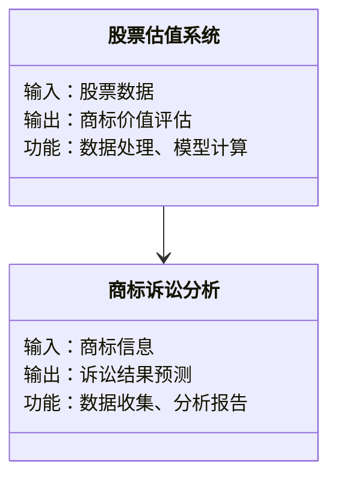
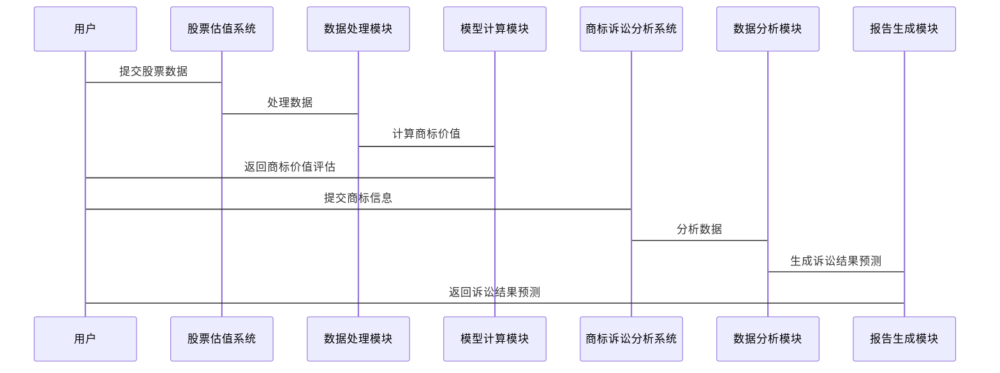

                 


# 股市估值在国际商标诉讼中的应用

> 关键词：股市估值，国际商标诉讼，商标价值，经济利益，法律分析

> 摘要：本文探讨了股市估值在国际商标诉讼中的应用，分析了股市波动对商标价值的影响，以及如何通过股市数据进行商标价值评估，为商标诉讼提供经济依据。文章详细介绍了股市估值的核心原理、商标价值的评估方法、相关算法模型，并结合实际案例进行了分析。

---

# 第一部分: 股市估值与国际商标诉讼的背景与基础

## 第1章: 股市估值的基本概念与方法

### 1.1 股市估值的定义与核心要素

#### 1.1.1 股市估值的定义
股市估值是指通过对公司基本面、市场环境和财务指标等多方面因素的分析，来评估公司股票的内在价值或市场价格的过程。股票的估值是投资者进行投资决策的重要依据。

#### 1.1.2 股市估值的核心要素
- **公司基本面**：包括收入、利润、资产负债情况等。
- **市场环境**：如宏观经济状况、行业发展趋势等。
- **财务指标**：如市盈率（P/E）、市净率（P/B）等。

#### 1.1.3 股市估值的主要方法
- **相对估值法**：通过比较同类公司的估值指标，推算目标公司的价值。
- **绝对估值法**：通过现金流折现模型（DCF）等方法，计算公司的真实价值。

### 1.2 国际商标诉讼的基本概念

#### 1.2.1 商标的基本定义
商标是用于识别和区分商品或服务来源的标识，包括文字、图形、字母、数字等。

#### 1.2.2 国际商标诉讼的定义与特点
国际商标诉讼是指在不同国家或地区之间，因商标注册、使用或侵权等问题引发的法律诉讼。其特点包括跨国性、法律复杂性和高经济利益。

#### 1.2.3 商标诉讼的主要类型
- **商标注册纠纷**：因商标申请或注册引发的争议。
- **商标侵权诉讼**：因未经授权使用他人商标引发的诉讼。
- **商标无效宣告**：因商标注册不符合法律规定而被宣告无效的诉讼。

---

## 第2章: 股市估值在国际商标诉讼中的应用背景

### 2.1 股市估值与商标价值的关系

#### 2.1.1 股市估值对商标价值的影响
商标作为企业的重要资产，其价值直接影响企业的整体市值。股市波动可能反映出市场对商标价值的认可程度。

#### 2.1.2 商标价值在股市中的体现
商标的市场价值通过企业的股价波动间接反映出来。例如，商标侵权可能导致股价下跌，而商标价值的提升可能推动股价上涨。

#### 2.1.3 股市波动与商标权益的关联
股市波动可能影响商标的市场价值，而商标的市场价值又可能影响企业的股价表现。

### 2.2 国际商标诉讼中的经济因素

#### 2.2.1 商标诉讼中的经济利益分析
商标诉讼往往涉及巨大的经济利益，尤其是跨国商标诉讼，可能涉及数亿美元的赔偿。

#### 2.2.2 股市估值在商标纠纷中的作用
股市估值可以为商标的价值提供参考依据，帮助法院或仲裁机构评估商标的经济价值。

#### 2.2.3 经济利益与商标保护的平衡
在商标诉讼中，需要平衡商标权人和公众利益，确保商标保护不损害市场竞争。

---

# 第二部分: 股市估值与国际商标诉讼的核心概念

## 第3章: 股市估值的核心原理

### 3.1 股市估值的基本原理

#### 3.1.1 股票价格的决定因素
股票价格受多种因素影响，包括公司业绩、行业趋势、宏观经济环境和市场情绪等。

#### 3.1.2 市场情绪与股票估值的关系
市场情绪会影响股票的短期估值，但长期来看，股票价格仍由公司基本面决定。

#### 3.1.3 股票估值的数学模型
常用股票估值模型包括：

- **市盈率模型**：$$P/E = \frac{\text{股价}}{\text{每股净利润}}$$
- **市净率模型**：$$P/B = \frac{\text{股价}}{\text{每股净资产}}$$
- **现金流折现模型**（DCF）：$$\text{企业价值} = \sum_{t=1}^{n} \frac{\text{自由现金流}}{(1+r)^t}$$

### 3.2 商标价值的评估方法

#### 3.2.1 商标价值的评估指标
- **品牌知名度**：商标的市场影响力。
- **品牌忠诚度**：消费者对品牌的依赖程度。
- **品牌贡献度**：商标对企业收入和利润的贡献。

#### 3.2.2 商标价值的评估模型
- **品牌价值公式**：$$\text{品牌价值} = \text{销售收入} \times \text{品牌贡献率}$$
- **品牌强度指标**：包括品牌认知度、市场地位等。

#### 3.2.3 商标价值与企业价值的关系
商标作为企业的重要资产，其价值直接影响企业的整体估值。

## 第4章: 股市估值与国际商标诉讼的关联性分析

### 4.1 股市波动对商标价值的影响

#### 4.1.1 股市波动对商标权益的影响
股市波动可能导致商标的市场价值发生变化，进而影响商标权人的利益。

#### 4.1.2 股票价格与商标价值的动态关系
股票价格的变化可能反映出市场对商标价值的重新评估。

#### 4.1.3 股市波动对商标诉讼的影响
股市波动可能加剧商标纠纷，尤其是在企业重组或上市过程中。

### 4.2 商标诉讼中的经济利益分析

#### 4.2.1 商标诉讼中的经济利益构成
- **赔偿金额**：侵权行为造成的经济损失。
- **品牌损失**：商标被侵权对企业声誉的影响。

#### 4.2.2 股市估值在商标诉讼中的应用
股市估值可以作为商标价值的参考依据，帮助法院确定赔偿金额。

#### 4.2.3 经济利益与商标保护的平衡
在商标诉讼中，需要平衡商标权人和公众利益，确保商标保护不损害市场竞争。

---

# 第三部分: 股市估值在国际商标诉讼中的算法与模型

## 第5章: 股市估值的数学模型与商标价值评估

### 5.1 股市估值的数学模型

#### 5.1.1 现金流折现模型（DCF）
$$\text{企业价值} = \sum_{t=1}^{n} \frac{\text{自由现金流}}{(1+r)^t}$$

#### 5.1.2 市盈率模型
$$P/E = \frac{\text{股价}}{\text{每股净利润}}$$

### 5.2 商标价值评估的数学模型

#### 5.2.1 品牌价值公式
$$\text{品牌价值} = \text{销售收入} \times \text{品牌贡献率}$$

#### 5.2.2 品牌强度指标
包括品牌认知度、市场地位等。

### 5.3 股市数据与商标诉讼的关联分析

#### 5.3.1 股票价格与商标价值的动态关系
通过时间序列分析，研究股票价格变化与商标价值的关系。

#### 5.3.2 商标诉讼中的经济利益分析
利用统计回归模型，分析商标诉讼对股价的影响。

---

## 第6章: 系统分析与架构设计方案

### 6.1 系统功能设计

#### 6.1.1 领域模型类图


#### 6.1.2 系统架构设计
```mermaid
client
    server
        database
        |
        |
    components: 数据处理、模型计算、报告生成
```

### 6.2 接口设计与交互流程图

#### 6.2.1 系统接口设计
- 输入接口：股票数据、商标信息。
- 输出接口：商标价值评估报告、诉讼结果预测。

#### 6.2.2 系统交互流程图


---

## 第7章: 项目实战与案例分析

### 7.1 环境安装

#### 7.1.1 必要工具安装
- Python 3.8+
- Jupyter Notebook
- Pandas、NumPy、Matplotlib

#### 7.1.2 数据集获取
从公开股票市场获取数据，如Yahoo Finance。

### 7.2 核心代码实现

#### 7.2.1 股票估值代码
```python
import pandas as pd
import numpy as np

def calculate_pe_ratio(stock_data):
    pe_ratio = stock_data['股价'] / stock_data['每股净利润']
    return pe_ratio

# 示例数据
data = {
    '股价': [100, 200, 300],
    '每股净利润': [10, 20, 30]
}
stock_data = pd.DataFrame(data)
print(calculate_pe_ratio(stock_data))
```

#### 7.2.2 商标价值评估代码
```python
def brand_value(sales, brand_contribution_rate):
    return sales * brand_contribution_rate

# 示例数据
sales = 100000000
brand_contribution_rate = 0.2
print(brand_value(sales, brand_contribution_rate))
```

### 7.3 案例分析与解读

#### 7.3.1 案例背景
某跨国公司因商标侵权面临诉讼，需评估商标价值以确定赔偿金额。

#### 7.3.2 数据分析
- 收集公司股票数据，计算市盈率和市净率。
- 分析商标的市场影响力和品牌贡献率。

#### 7.3.3 结论与建议
基于数据分析，建议商标价值为X亿美元，赔偿金额应与之匹配。

---

## 第8章: 最佳实践与小结

### 8.1 最佳实践 Tips

#### 8.1.1 数据收集
确保数据的准确性和完整性。

#### 8.1.2 模型选择
根据具体情况选择合适的估值模型。

#### 8.1.3 结果验证
通过历史数据验证模型的准确性。

### 8.2 小结

通过本文的分析，我们了解了股市估值在国际商标诉讼中的重要作用，并掌握了相关的数学模型和系统设计方法。未来，随着技术的进步，股市估值在商标诉讼中的应用将更加广泛和深入。

### 8.3 注意事项

- 在商标诉讼中，股市估值仅为参考，需结合实际情况。
- 数据分析需谨慎，避免误导性结论。

### 8.4 拓展阅读

- 《Financial Statement Analysis》
- 《Intellectual Property Valuation》

---

# 结语

股市估值在国际商标诉讼中的应用是一个复杂但极具价值的领域。通过科学的分析和合理的模型，我们可以为商标诉讼提供有力的经济依据。未来，随着技术的不断发展，这一领域的研究将更加深入，为商标保护和企业价值评估提供更强大的支持。

---

# 作者

作者：AI天才研究院/AI Genius Institute  
联系邮箱：contact@aicourse.com  
更多内容请访问：https://www.aicourse.com

