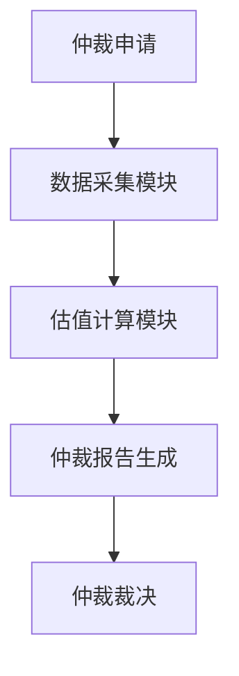

                 


# 股市估值在国际投资仲裁中的应用

> 关键词：股市估值、DCF模型、国际投资仲裁、赔偿依据、损失计算、仲裁程序

> 摘要：本文深入探讨了股市估值在国际投资仲裁中的应用，分析了股市估值的核心概念、常用方法及其在仲裁中的具体应用。通过实际案例，本文详细讲解了如何将股市估值技术应用于国际投资仲裁中的损失计算和赔偿依据确定，并提出了系统的解决方案和实现方案。文章还通过具体的项目实战，展示了如何将股市估值技术应用于实际的国际投资仲裁案例中，帮助读者更好地理解和掌握这一领域的核心技术。

---

## 第一章: 股市估值的基本概念与方法

### 1.1 股市估值的定义与核心要素

#### 1.1.1 股市估值的定义
股市估值是指通过对上市公司的财务数据、市场环境、行业状况等多方面因素的分析，估算其股票的内在价值的过程。股市估值的核心目标是确定股票的合理价格区间，为投资者提供决策依据。

#### 1.1.2 股市估值的核心要素
股市估值的核心要素包括：
- **公司基本面**：收入、利润、资产、负债等财务数据。
- **市场环境**：宏观经济状况、行业发展趋势、市场情绪等。
- **估值方法**：市盈率（P/E）、市净率（P/B）、现金流折现模型（DCF）等。

#### 1.1.3 股市估值的基本原则
股市估值的基本原则包括：
- **合理性**：估值结果应符合市场实际情况。
- **可比性**：估值应基于可比公司的数据进行调整。
- **动态性**：考虑公司未来发展的动态变化。

### 1.2 常用的股市估值方法

#### 1.2.1 市盈率（P/E）法
市盈率法是最常用的估值方法之一，公式为：
$$ P/E = \frac{Price}{Earnings} $$
市盈率反映了市场对公司盈利能力的估值，常用于判断股票是否被高估或低估。

#### 1.2.2 市净率（P/B）法
市净率法适用于资产密集型行业，公式为：
$$ P/B = \frac{Price}{Book\ Value} $$
市净率反映了市场对公司资产价值的估值。

#### 1.2.3 现金流折现模型（DCF）
DCF模型是较为复杂的估值方法，适用于成长型企业。其核心公式为：
$$ V = \sum_{t=1}^{n} \frac{CF_t}{(1+r)^t} + \frac{TV}{(1+r)^n} $$
其中，$CF_t$ 为第t年的自由现金流，$r$ 为折现率，$TV$ 为终值。

---

## 第二章: 国际投资仲裁的基本原理

### 2.1 国际投资仲裁的定义与特点

#### 2.1.1 国际投资仲裁的定义
国际投资仲裁是指通过仲裁机构解决跨国投资纠纷的法律程序。其特点包括：
- **跨国性**：涉及不同国家的投资者和东道国。
- **独立性**：仲裁庭独立于任何国家的司法体系。
- **保密性**：仲裁程序和结果通常不公开。

### 2.2 国际投资仲裁的主要机构

#### 2.2.1 国际Centre for Settlement of Investment Disputes (ICSID)
ICSID是国际投资争端解决中心，主要处理投资者与东道国之间的争端。

#### 2.2.2 国际Arbitration Institute (ICAI)
ICAI是另一个重要的国际仲裁机构，提供多种争议解决服务。

#### 2.2.3 其他相关机构
包括世界银行、国际商会（ICC）等。

### 2.3 国际投资仲裁的程序

#### 2.3.1 仲裁申请的提交
投资者需向仲裁机构提交仲裁申请，并支付相关费用。

#### 2.3.2 仲裁庭的组成
仲裁庭通常由3名仲裁员组成，包括首席仲裁员和两名常任仲裁员。

#### 2.3.3 仲裁裁决的执行
仲裁裁决具有法律效力，投资者需在东道国执行裁决。

---

## 第三章: 股市估值在国际投资仲裁中的应用原理

### 3.1 股市估值在国际投资仲裁中的作用

#### 3.1.1 股市估值作为赔偿依据
在国际投资仲裁中，股市估值可用于确定投资者的损失金额。

#### 3.1.2 股市估值作为损失计算工具
DCF模型常用于计算公司因东道国政策或行为导致的损失。

---

## 第四章: 股市估值在国际投资仲裁中的系统架构

### 4.1 系统功能设计
系统功能包括：
- **数据采集**：获取公司财务数据和市场数据。
- **估值计算**：应用DCF模型计算公司价值。
- **仲裁支持**：生成仲裁所需的估值报告。

### 4.2 系统架构设计


### 4.3 系统接口设计
系统接口包括：
- 数据接口：与财务系统对接。
- 报告接口：生成仲裁报告。

---

## 第五章: 股市估值在国际投资仲裁中的项目实战

### 5.1 项目背景
项目背景包括跨国并购纠纷案例。

### 5.2 核心实现代码
```python
def dcf_valuation(revenue, cost, discount_rate, period):
    cash_flows = []
    for t in range(period):
        cf = revenue * (1 + 0.1)**t - cost * (1 + 0.05)**t
        cash_flows.append(cf / (1 + discount_rate)**t)
    terminal_value = (cash_flows[-1] * 1.1) / (discount_rate - 0.05)
    total_value = sum(cash_flows) + terminal_value / (1 + discount_rate)**period
    return total_value
```

### 5.3 案例分析
以具体跨国并购案例为例，分析DCF模型的应用。

---

## 第六章: 总结与展望

### 6.1 总结
总结股市估值在国际投资仲裁中的重要性及其应用价值。

### 6.2 展望
展望未来，建议加强跨国合作，推动股市估值技术的进一步发展。

---

## 作者信息

作者：AI天才研究院/AI Genius Institute & 禅与计算机程序设计艺术 /Zen And The Art of Computer Programming

