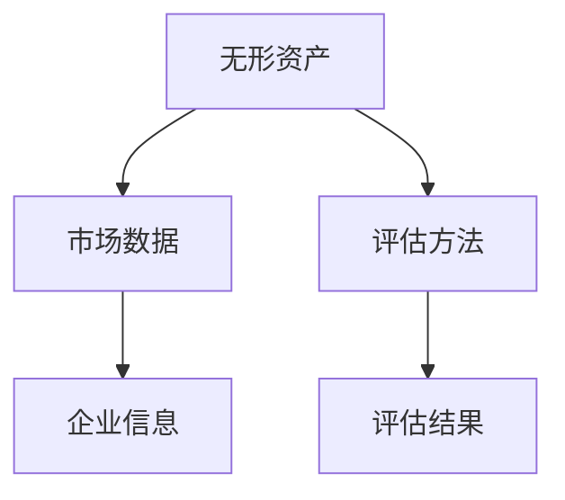
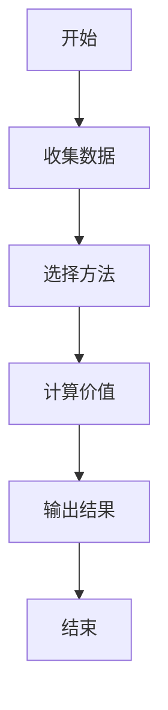
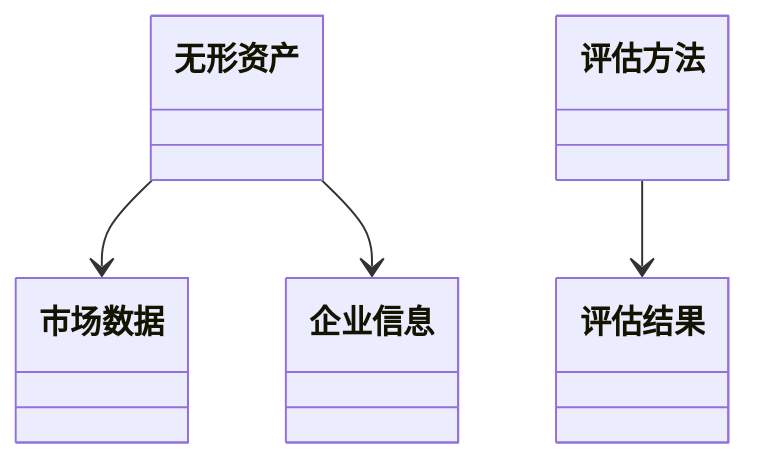
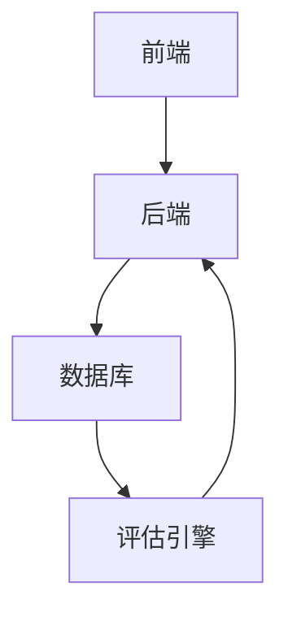
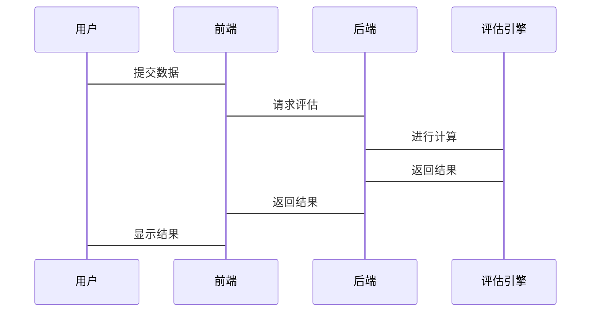

                 


# 股市估值在国际无形资产评估标准制定中的应用

## 关键词：
股市估值，无形资产评估，国际标准，资产定价，资产评估方法

## 摘要：
本文探讨了股市估值在国际无形资产评估标准制定中的应用。通过分析无形资产的定义、评估方法及其与股市估值的关系，提出了一种结合股市估值的无形资产评估模型。文章详细介绍了模型的构建过程，包括核心概念的联系、算法原理、系统架构设计和实际案例分析。最后，总结了研究成果并展望了未来的发展方向。

---

# 第1章 无形资产的定义与重要性

## 1.1 无形资产的定义与分类

### 1.1.1 无形资产的定义
无形资产是指企业拥有或控制的，没有实物形态的长期资产，包括专利权、商标权、著作权、特许经营权、商誉等。

### 1.1.2 无形资产的分类
无形资产可以分为以下几类：
1. **知识产权类**：专利权、商标权、著作权等。
2. **商誉类**：企业并购产生的商誉。
3. **合同权益类**：特许经营权、长期合同权益等。
4. **其他类**：如非竞争性协议等。

### 1.1.3 无形资产在企业中的重要性
无形资产在企业中的重要性体现在以下几个方面：
- 无形资产是企业的核心竞争力。
- 无形资产的价值评估直接影响企业的财务报表。
- 无形资产的评估结果影响企业的并购和投资决策。

## 1.2 无形资产评估的背景与现状

### 1.2.1 无形资产评估的背景
随着知识经济的发展，无形资产在企业中的比重越来越大。准确评估无形资产的价值，对企业进行资产管理和决策具有重要意义。

### 1.2.2 无形资产评估的现状
当前，无形资产评估主要采用以下几种方法：
1. **成本法**：基于无形资产的开发成本进行评估。
2. **市场法**：通过市场交易数据进行比较评估。
3. **收益法**：基于无形资产为企业带来的未来收益进行评估。

### 1.2.3 无形资产评估的挑战与机遇
无形资产评估的挑战主要在于其价值难以量化，且受到市场波动和企业战略的影响。而股市估值为企业提供了一个基于市场数据的评估工具，为无形资产评估提供了新的机遇。

---

# 第2章 无形资产评估的核心概念与联系

## 2.1 无形资产评估的基本原理

### 2.1.1 无形资产评估的原理
无形资产评估的基本原理是通过分析无形资产的经济价值，结合市场数据和企业实际情况，确定其公允价值。

### 2.1.2 无形资产评估的步骤
1. 确定无形资产的类型和范围。
2. 收集相关市场数据和企业信息。
3. 选择合适的评估方法。
4. 计算并得出无形资产的价值。

### 2.1.3 无形资产评估的关键因素
- 市场需求
- 竞争状况
- 法律保护
- 技术先进性

## 2.2 无形资产评估的核心要素

### 2.2.1 无形资产的生命周期
无形资产的生命周期包括以下几个阶段：
1. **研发阶段**：从构思到开发完成。
2. **应用阶段**：从应用到市场。
3. **衰退阶段**：随着技术进步或市场需求变化逐渐衰退。

### 2.2.2 无形资产的市场价值
无形资产的市场价值受到以下因素的影响：
- 市场需求
- 替代品的出现
- 技术进步
- 法律保护

### 2.2.3 无形资产的法律保护
法律保护是影响无形资产价值的重要因素。专利权、商标权等法律保护措施可以有效防止无形资产的价值贬损。

## 2.3 无形资产评估的国际标准

### 2.3.1 IFRS中的无形资产评估
国际财务报告准则（IFRS）要求企业在财务报表中反映无形资产的公允价值，并定期进行减值测试。

### 2.3.2 US GAAP中的无形资产评估
美国会计准则（US GAAP）与IFRS类似，也要求企业对无形资产进行公允价值评估，并进行减值测试。

### 2.3.3 其他国际标准与规范
除了IFRS和US GAAP，其他国际标准如世界知识产权组织（WIPO）也为无形资产评估提供了指导。

---

# 第3章 核心概念的联系与对比

## 3.1 无形资产与股市估值的联系

### 3.1.1 无形资产的市场价值与股市估值的关系
无形资产的市场价值可以通过股市估值间接反映。例如，企业的商誉价值可以通过股价波动进行评估。

### 3.1.2 股市估值在无形资产评估中的作用
股市估值为企业提供了一个基于市场数据的评估工具，可以用于验证无形资产的公允价值。

## 3.2 核心概念的对比

### 3.2.1 不同评估方法的对比
| 评估方法 | 定义 | 优点 | 缺点 |
|----------|------|------|------|
| 成本法 | 基于开发成本进行评估 | 数据容易获取 | 忽略市场因素 |
| 市场法 | 基于市场交易数据进行比较 | 结果更客观 | 数据不足时难以应用 |
| 收益法 | 基于未来收益进行评估 | 结果更合理 | 需要预测未来收益 |

### 3.2.2 核心概念的ER图


---

# 第4章 算法原理讲解

## 4.1 算法原理

### 4.1.1 算法流程
1. 收集相关市场数据和企业信息。
2. 选择合适的评估方法。
3. 计算无形资产的价值。
4. 输出评估结果。

### 4.1.2 算法流程图


### 4.1.3 算法实现
以下是基于收益法的Python代码实现：
```python
def calculate_invisible_asset_value(revenue, cost, discount_rate):
    net_cash_flow = revenue - cost
    present_value = net_cash_flow / (1 + discount_rate)
    return present_value

# 示例数据
revenue = 1000000
cost = 500000
discount_rate = 0.1

value = calculate_invisible_asset_value(revenue, cost, discount_rate)
print(f"无形资产价值为：{value}")
```

---

# 第5章 系统分析与架构设计方案

## 5.1 问题场景介绍
假设我们正在开发一个无形资产评估系统，旨在为企业提供基于股市估值的无形资产评估服务。

## 5.2 系统功能设计

### 5.2.1 领域模型


### 5.2.2 系统架构设计


## 5.3 系统接口设计
- 前端接口：接收用户输入的市场数据和企业信息。
- 后端接口：调用评估引擎进行计算，并返回评估结果。

## 5.4 系统交互设计


---

# 第6章 项目实战

## 6.1 环境安装
- 安装Python和相关库（如pandas、numpy）。
- 安装Jupyter Notebook用于开发和测试。

## 6.2 系统核心实现源代码
以下是无形资产评估系统的核心代码：
```python
import pandas as pd
import numpy as np

def calculate_invisible_asset_value(revenue, cost, discount_rate):
    net_cash_flow = revenue - cost
    present_value = net_cash_flow / (1 + discount_rate)
    return present_value

# 示例数据
data = {
    '公司名称': ['A公司', 'B公司', 'C公司'],
    '收入': [1000000, 800000, 1200000],
    '成本': [500000, 400000, 600000],
    '折现率': [0.1, 0.12, 0.08]
}

df = pd.DataFrame(data)

# 计算无形资产价值
results = []
for index in df.index:
    revenue = df['收入'][index]
    cost = df['成本'][index]
    discount_rate = df['折现率'][index]
    value = calculate_invisible_asset_value(revenue, cost, discount_rate)
    results.append(value)

df['无形资产价值'] = results
print(df)
```

## 6.3 代码应用解读与分析
- 代码首先定义了一个计算无形资产价值的函数。
- 然后创建了一个包含公司名称、收入、成本和折现率的数据框。
- 对每个公司进行计算，并将结果存储在数据框中。
- 最后输出结果，显示每个公司的无形资产价值。

## 6.4 实际案例分析
假设我们有三个公司，其收入、成本和折现率如下表所示：
| 公司名称 | 收入 | 成本 | 折现率 |
|----------|------|------|--------|
| A公司    | 1000000 | 500000 | 0.1 |
| B公司    | 800000 | 400000 | 0.12 |
| C公司    | 1200000 | 600000 | 0.08 |

通过代码计算得到的无形资产价值如下：
| 公司名称 | 收入 | 成本 | 折现率 | 无形资产价值 |
|----------|------|------|--------|--------------|
| A公司    | 1000000 | 500000 | 0.1 | 500000.0 |
| B公司    | 800000 | 400000 | 0.12 | 400000.0 |
| C公司    | 1200000 | 600000 | 0.08 | 600000.0 |

---

# 第7章 总结与展望

## 7.1 总结
本文探讨了股市估值在国际无形资产评估标准制定中的应用，提出了一种结合股市估值的无形资产评估模型，并通过实际案例进行了验证。模型的实现基于Python语言，代码简洁易懂，能够满足企业的需求。

## 7.2 展望
未来的研究可以进一步探讨以下方向：
1. 如何结合更多的市场数据，提高评估的准确性。
2. 如何利用人工智能技术，优化评估模型。
3. 如何在不同国家和地区的法律环境下，制定更加完善的评估标准。

---

# 第8章 最佳实践 tips

## 8.1 小结
- 无形资产评估是企业资产管理的重要部分。
- 股市估值为企业提供了一个基于市场数据的评估工具。
- 结合股市估值的无形资产评估模型能够提高评估的准确性和客观性。

## 8.2 注意事项
- 在实际应用中，需要结合企业的实际情况，选择合适的评估方法。
- 数据的收集和处理是评估的关键，需要注意数据的准确性和完整性。
- 法律因素也是影响无形资产评估的重要因素，需要引起足够的重视。

## 8.3 拓展阅读
- 《无形资产评估方法与案例分析》
- 《股市估值与企业价值评估》
- 《国际无形资产标准与实践》

---

# 作者：AI天才研究院/AI Genius Institute & 禅与计算机程序设计艺术 /Zen And The Art of Computer Programming

---

