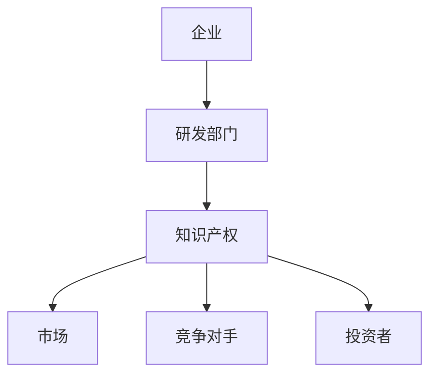
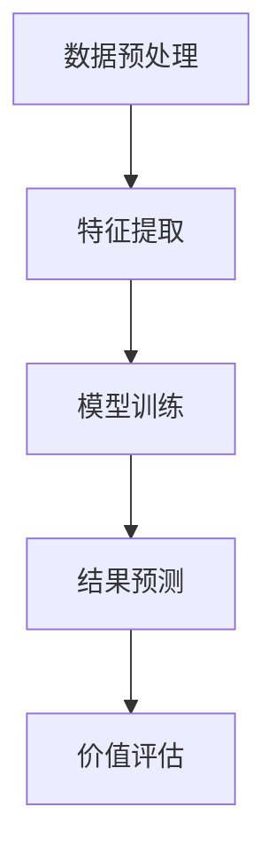
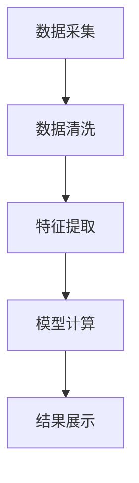

                 


# 股市估值在国际知识产权价值链中的应用

> **关键词**：股市估值、知识产权、价值链、国际评估、企业价值

> **摘要**：本文探讨了知识产权在国际股市估值中的重要性，分析了知识产权价值链对企业发展和股价波动的影响。通过建立数学模型和算法，揭示了知识产权在企业价值中的权重，以及其在全球化市场中的应用策略。文章结合实际案例，展示了如何通过技术手段实现知识产权的价值评估与股市分析的结合。

---

## 第一章：知识产权与股市估值的背景介绍

### 1.1 知识产权的基本概念与作用
- **1.1.1 知识产权的定义**：知识产权是指创造性的智力成果，包括专利、商标、版权、商业秘密等。
- **1.1.2 知识产权对企业价值的影响**：知识产权是企业的核心资产之一，影响企业的市场竞争力和盈利能力。
- **1.1.3 知识产权与股市估值的关联**：知识产权的价值直接影响企业的财务表现和股价。

### 1.2 知识产权价值链的全球发展趋势
- **1.2.1 知识产权的全球流动**：随着全球化的发展，知识产权在国际间的流动日益频繁。
- **1.2.2 知识产权价值链的形成**：从研发到商业化，知识产权的每个环节都构成了价值链的一部分。
- **1.2.3 知识产权对经济的推动作用**：知识产权是技术创新的核心，推动全球经济的增长。

---

## 第二章：知识产权在股市估值中的核心影响

### 2.1 知识产权对股价的影响机制
- **2.1.1 知识产权的市场价值**：知识产权的市场价值是其对股价影响的核心因素。
- **2.1.2 知识产权的法律保护**：法律保护的强度直接影响知识产权的市场价值。
- **2.1.3 知识产权的交易活动**：知识产权的交易活动反映了其在市场中的活跃程度。

### 2.2 知识产权价值链的实体关系图



---

## 第三章：知识产权价值评估的算法原理

### 3.1 知识产权价值评估的加权平均模型

#### 3.1.1 模型的数学表达
$$
\text{知识产权价值} = \sum_{i=1}^{n} w_i \times v_i
$$
其中，$w_i$ 是第 $i$ 个因素的权重，$v_i$ 是第 $i$ 个因素的具体价值。

#### 3.1.2 模型的实现步骤
1. **确定影响因素**：如专利数量、技术先进性、市场影响力等。
2. **赋予权重**：根据每个因素的重要程度赋予权重。
3. **计算价值**：将各因素的价值乘以权重后求和。

### 3.2 知识产权价值评估的机器学习算法

#### 3.2.1 算法流程图



#### 3.2.2 算法实现代码
```python
import pandas as pd
from sklearn.linear_model import LinearRegression

# 数据预处理
data = pd.read_csv('ip_value.csv')
X = data[['专利数量', '技术先进性', '市场影响力']]
y = data['知识产权价值']

# 模型训练
model = LinearRegression()
model.fit(X, y)

# 结果预测
predictions = model.predict(X)
```

---

## 第四章：系统分析与架构设计

### 4.1 系统功能设计
- **4.1.1 数据采集模块**：采集企业的知识产权数据。
- **4.1.2 数据分析模块**：对数据进行清洗和特征提取。
- **4.1.3 模型计算模块**：应用算法模型进行价值评估。
- **4.1.4 结果展示模块**：将评估结果以可视化形式展示。

### 4.2 系统架构设计



---

## 第五章：项目实战与案例分析

### 5.1 项目环境安装
```bash
pip install pandas scikit-learn
```

### 5.2 核心代码实现

```python
import pandas as pd
from sklearn.linear_model import LinearRegression

# 数据预处理
data = pd.read_csv('ip_value.csv')
X = data[['专利数量', '技术先进性', '市场影响力']]
y = data['知识产权价值']

# 模型训练
model = LinearRegression()
model.fit(X, y)

# 结果预测
predictions = model.predict(X)
```

### 5.3 案例分析
以某跨国科技公司为例，分析其知识产权对股价的具体影响。

---

## 第六章：总结与最佳实践

### 6.1 总结
- 知识产权是影响股市估值的重要因素。
- 建立科学的评估模型可以有效量化知识产权的价值。

### 6.2 最佳实践
- 数据准确性是模型评估的关键。
- 模型的可解释性需重点关注。
- 持续关注知识产权的国际法律环境。

---

## 作者：AI天才研究院 & 禅与计算机程序设计艺术

