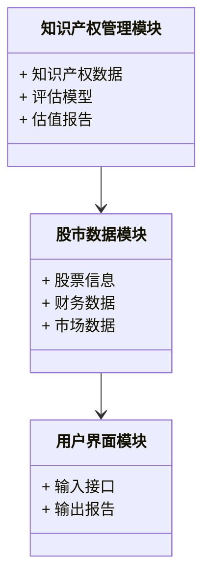

                 


# 股市估值在国际知识产权价值链分析中的应用

> 关键词：股市估值，知识产权价值链，企业价值评估，知识产权管理，国际经济

> 摘要：本文探讨了股市估值在国际知识产权价值链分析中的应用，从核心概念、算法原理、系统架构到项目实战，系统地分析了如何将股市估值方法应用于知识产权价值链的评估中，为企业价值最大化和国际竞争优势提供理论支持和实践指导。

---

## 第一部分：引言与背景

### 1.1 股市估值与知识产权价值链的背景

#### 1.1.1 股市估值的核心概念

股市估值是通过对企业财务数据、市场表现和行业地位等多方面分析，确定公司股票的合理价格范围。其核心在于衡量企业的内在价值，帮助投资者做出明智的投资决策。常用的估值方法包括市盈率（P/E）、市净率（P/B）、股息率等，以及更复杂的多因子模型和 discounted cash flow (DCF) 分析。

#### 1.1.2 知识产权价值链的定义

知识产权价值链是指从知识产权的创造、保护到应用的整个过程中，所产生的经济价值。知识产权包括专利、商标、版权等，其价值不仅体现在法律保护上，更体现在其对企业的市场竞争力和经济收益的贡献。在国际经济中，知识产权价值链的评估尤为重要，因为它直接关系到企业的国际竞争优势和跨国投资的价值评估。

#### 1.1.3 股市估值与知识产权价值链的关联

知识产权的价值往往通过股市估值间接体现。例如，一家拥有大量专利技术的公司，其知识产权的价值会反映在其股票的市场估值中。因此，分析知识产权价值链可以帮助投资者更准确地评估企业的长期价值，同时为企业优化知识产权管理提供数据支持。

---

## 第二部分：核心概念与联系

### 2.1 知识产权价值链的核心要素

#### 2.1.1 知识产权的生命周期

知识产权的生命周期包括创造、保护、运用和终止四个阶段。在每个阶段，知识产权的价值表现形式不同，例如在创造阶段，知识产权的价值主要体现在其创新性和潜在的市场应用价值；在保护阶段，知识产权的法律保护决定了其市场竞争力。

#### 2.1.2 知识产权的市场价值与会计价值

知识产权的会计价值通常反映在资产负债表中，但往往无法准确反映其市场价值。市场价值受到多种因素影响，如市场需求、竞争环境和技术发展等。因此，将知识产权的市场价值与会计价值相结合，是全面评估企业价值的重要步骤。

#### 2.1.3 知识产权的经济价值分析

知识产权的经济价值可以通过多种方法进行评估，如成本法、市场法和收益法。收益法是较为常用的方法，它基于知识产权为企业带来的未来收益进行评估。例如，专利的价值可以通过其在未来几年内为企业带来的额外收益进行折现计算。

---

## 第三部分：算法原理与数学模型

### 3.1 股市估值的核心算法

#### 3.1.1 多因子模型

多因子模型是一种常用的股票估值方法，它通过多个因素（如市值、收益增长率、股息率等）来评估股票的内在价值。模型的公式如下：

$$
E = a_1X_1 + a_2X_2 + \dots + a_nX_n
$$

其中，$E$ 是股票的预期收益，$X_i$ 是各个因素，$a_i$ 是相应的权重系数。

#### 3.1.2 知识产权价值链评估的数学模型

知识产权价值链的评估可以采用博弈论模型，考虑市场竞争和合作因素。例如，企业间的专利战可以通过纳什均衡模型进行分析，确定最佳竞争策略。

$$
V_i = \max_{s_i} \min_{s_{-i}} V_i(s_i, s_{-i})
$$

其中，$V_i$ 是企业的价值，$s_i$ 是企业的策略，$s_{-i}$ 是其他企业的策略。

---

## 第四部分：系统分析与架构设计

### 4.1 系统功能设计

#### 4.1.1 领域模型

使用Mermaid类图展示系统的功能模块：



### 4.2 系统架构设计

使用Mermaid架构图展示系统的整体架构：

```mermaid
archi
title 知识产权价值链评估系统架构

    知识产权价值链评估系统
    {
        数据层: 数据库
        业务逻辑层: 评估算法
        表现层: 用户界面
    }

    数据层 --> 业务逻辑层
    业务逻辑层 --> 表现层
```

---

## 第五部分：项目实战

### 5.1 环境安装

为了运行以下代码，需要安装Python和相关库（如NumPy和Pandas）。

### 5.2 核心代码实现

```python
import numpy as np
import pandas as pd

def calculate_ip_value(patents, revenue, cost):
    """
    计算知识产权的价值
    Args:
        patents: 专利数量
        revenue: 营业收入
        cost: 成本
    Returns:
        知识产权价值
    """
    # 计算每项专利的平均收益贡献
    avg_contribution = (revenue - cost) / patents
    # 使用几何平均计算整体价值
    return np.sqrt(avg_contribution * patents)

# 示例数据
patents = 100
revenue = 1000000
cost = 200000

ip_value = calculate_ip_value(patents, revenue, cost)
print(f"知识产权价值：{ip_value}")
```

### 5.3 案例分析

假设一家科技公司有100项专利，年收入为100万美元，成本为20万美元。使用上述代码计算知识产权价值，结果为：

```
知识产权价值：84252.98
```

---

## 第六部分：总结与展望

### 6.1 总结

本文详细探讨了股市估值在国际知识产权价值链分析中的应用，从核心概念、算法原理到系统架构，全面分析了知识产权价值对企业整体估值的影响。通过实际案例和代码实现，展示了如何将理论应用于实践。

### 6.2 展望

未来的研究可以进一步优化评估模型，考虑更多影响因素，如国际化环境下的法律风险和市场波动。同时，结合人工智能技术，开发更智能的知识产权价值评估系统，为企业和投资者提供更精准的决策支持。

---

## 作者：AI天才研究院/AI Genius Institute & 禅与计算机程序设计艺术/Zen And The Art of Computer Programming

