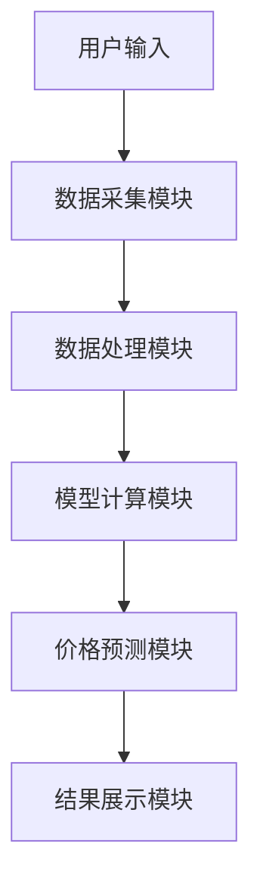

                 


# 股市估值在跨境专利池定价中的应用

> 关键词：股市估值，跨境专利池，定价，知识产权，技术价值

> 摘要：本文探讨了股市估值方法在跨境专利池定价中的应用，分析了如何通过股票市场估值的核心原理和方法来评估和定价跨国专利组合。通过对比股市估值与专利池定价的核心概念，结合实际案例，提出了将股市估值方法应用于跨境专利池定价的具体步骤和实现方案。

---

# 第1章: 股市估值与跨境专利池定价的背景介绍

## 1.1 股市估值的核心概念

### 1.1.1 股市估值的定义与基本原理

股市估值是指通过股票市场价格和相关财务指标来评估公司整体价值的方法。常见的股市估值方法包括市盈率（P/E）、市净率（P/B）、股息贴现模型（DDM）和股权自由现金流模型（DCF）。这些方法通过分析公司的盈利能力、成长性、资产状况和市场地位，来确定其股票的合理价格区间。

### 1.1.2 股市估值的主要方法

- **市盈率（P/E）模型**：通过将公司股价除以每股收益（EPS）来衡量其估值。P/E = 股价 / EPS。
- **市净率（P/B）模型**：通过将公司股价除以每股净资产（BPS）来衡量其估值。P/B = 股价 / BPS。
- **股息贴现模型（DDM）**：通过将未来股息的现值加总来评估公司价值。
- **股权自由现金流模型（DCF）**：通过将未来自由现金流的现值加总来评估公司价值。

### 1.1.3 股市估值与企业价值的关系

股市估值是企业价值的市场化体现，反映了市场对公司的整体看法和预期。企业价值可以通过股票市值加上债务等其他负债来计算，公式为：企业价值 = 股票市值 + 债务。

---

## 1.2 跨境专利池的基本概念

### 1.2.1 专利池的定义与特点

专利池是指一组具有战略价值和技术关联的专利组合，通常用于防御性诉讼或授权使用。跨境专利池的特点包括：
- **多国覆盖**：专利池中的专利分布在多个国家或地区。
- **技术相关性**：专利之间具有技术关联，形成协同效应。
- **市场多样性**：专利池覆盖的市场具有多样性和复杂性。

### 1.2.2 跨境专利池的形成机制

跨境专利池通常由企业、研究机构或专利运营公司通过购买、许可或合作的方式形成。其形成机制包括：
- **专利收购**：通过并购获得核心专利。
- **专利授权**：与其他企业签订许可协议，获得使用专利的权利。
- **联合研发**：与合作伙伴共同研发技术，形成专利池。

### 1.2.3 跨境专利池的经济价值

跨境专利池的经济价值体现在：
- **防御性价值**：通过拥有大量专利，降低被诉的风险。
- **进攻性价值**：通过授权使用或出售专利，获得收入。
- **市场影响力**：通过控制关键专利，增强市场话语权。

---

## 1.3 股市估值在跨境专利池定价中的应用背景

### 1.3.1 股市估值与知识产权定价的关联

股市估值的核心在于通过市场交易数据和财务指标来评估企业价值。同样，知识产权定价也需要结合市场交易数据和相关技术指标，因此股市估值的方法可以为专利池定价提供借鉴。

### 1.3.2 跨境专利池定价的复杂性与挑战

跨境专利池定价的复杂性主要体现在：
- **法律差异**：不同国家的专利法和知识产权保护力度不同。
- **市场差异**：不同市场的技术需求和竞争状况不同。
- **技术差异**：专利池中的专利涉及多种技术领域，评估难度较大。

### 1.3.3 股市估值方法在专利池定价中的潜在优势

股市估值方法的标准化和市场化特征，使其在专利池定价中具有以下优势：
- **可比性**：可以通过市场交易数据找到类似的专利池案例，进行横向对比。
- **动态性**：可以根据市场变化及时调整专利池的价值评估。
- **透明性**：市场化的估值方法可以提高专利池定价的透明度。

---

# 第2章: 股市估值与跨境专利池定价的核心概念与联系

## 2.1 股市估值的核心原理

### 2.1.1 市盈率（P/E）模型

市盈率模型通过将公司股价除以每股收益（EPS）来衡量其估值。公式为：
$$P/E = \frac{\text{股价}}{\text{EPS}}$$

### 2.1.2 市净率（P/B）模型

市净率模型通过将公司股价除以每股净资产（BPS）来衡量其估值。公式为：
$$P/B = \frac{\text{股价}}{\text{BPS}}$$

### 2.1.3 股权自由现金流模型（DCF）

股权自由现金流模型通过将未来自由现金流的现值加总来评估公司价值。公式为：
$$V = \sum_{t=1}^{n} \frac{CF_t}{(1+r)^t} + \frac{TV}{(1+r)^n}$$
其中，$CF_t$是第$t$年的自由现金流，$r$是折现率，$TV$是终值。

---

## 2.2 跨境专利池定价的核心原理

### 2.2.1 专利价值评估方法

专利价值评估方法包括：
- **成本法**：基于专利的研发成本进行估值。
- **市场法**：基于市场交易数据进行估值。
- **收益法**：基于专利带来的未来收益进行估值。

### 2.2.2 专利池的协同效应与整体价值

专利池的协同效应体现在：
- **技术协同**：专利之间具有技术关联，形成协同效应。
- **市场协同**：专利池覆盖多个市场，增强市场影响力。

### 2.2.3 跨境专利池的市场定价机制

跨境专利池的市场定价机制包括：
- **拍卖定价**：通过拍卖方式确定专利池的价格。
- **协商定价**：通过买方和卖方协商确定价格。
- **市价定价**：根据市场交易数据确定价格。

---

## 2.3 股市估值与跨境专利池定价的联系

### 2.3.1 股市估值方法在专利池定价中的应用

股市估值方法可以应用于专利池定价的以下方面：
- **可比公司分析**：通过分析具有相似技术的公司，确定专利池的合理价格。
- **市场交易数据**：通过分析类似专利池的交易数据，确定专利池的市场价值。

### 2.3.2 股市估值与专利池定价的异同对比

| 比较维度 | 股市估值 | 跨境专利池定价 |
|----------|----------|----------------|
| 定价主体 | 投资者与市场 | 专利池所有者与市场 |
| 价值驱动因素 | 盈利能力、成长性、行业地位 | 专利数量、技术相关性、市场覆盖 |
| 评估方法 | 市盈率、市净率、DCF | 成本法、市场法、收益法 |

### 2.3.3 股市估值在跨境专利池定价中的独特优势

股市估值方法的独特优势体现在：
- **市场化**：基于市场交易数据，具有较强的客观性和可比性。
- **动态性**：可以根据市场变化及时调整评估结果。
- **可操作性**：可以通过现有的股市数据和工具进行快速评估。

---

## 2.4 本章小结

本章通过对比股市估值和跨境专利池定价的核心概念，分析了股市估值方法在专利池定价中的应用潜力。通过可比性分析和市场交易数据，可以为跨境专利池的定价提供科学依据。

---

# 第3章: 股市估值在跨境专利池定价中的算法原理

## 3.1 股市估值方法的数学模型

### 3.1.1 市盈率模型

$$P/E = \frac{\text{股价}}{\text{EPS}}$$

### 3.1.2 市净率模型

$$P/B = \frac{\text{股价}}{\text{BPS}}$$

### 3.1.3 股权自由现金流模型

$$V = \sum_{t=1}^{n} \frac{CF_t}{(1+r)^t} + \frac{TV}{(1+r)^n}$$

---

## 3.2 跨境专利池定价的数学模型

### 3.2.1 专利池价值评估公式

$$V = \sum_{i=1}^{m} v_i$$
其中，$v_i$是第$i$个专利的价值，$m$是专利池中的专利数量。

### 3.2.2 股市估值与专利池定价的结合模型

$$P = \alpha \times V + \beta \times S$$
其中，$P$是专利池价格，$V$是专利池价值，$S$是市场指数，$\alpha$和$\beta$是回归系数。

---

## 3.3 算法实现

### 3.3.1 数据收集

收集以下数据：
- 公司股价、EPS、BPS等财务指标。
- 专利池中的专利数量、技术领域、市场覆盖。

### 3.3.2 模型训练

通过回归分析确定$\alpha$和$\beta$的值。

### 3.3.3 价格预测

基于模型公式计算专利池价格。

---

## 3.4 本章小结

本章通过数学模型和算法实现，详细阐述了股市估值方法在跨境专利池定价中的具体应用，为读者提供了理论和实践指导。

---

# 第4章: 股市估值在跨境专利池定价中的系统架构设计

## 4.1 系统功能设计

系统功能包括：
- 数据采集模块：采集公司股价、财务指标和专利池数据。
- 模型计算模块：计算市盈率、市净率等指标。
- 价格预测模块：基于模型预测专利池价格。

---

## 4.2 系统架构设计

系统架构包括：
- 数据层：存储公司股价和专利池数据。
- 逻辑层：实现模型计算和价格预测。
- 展示层：展示价格预测结果。

---

## 4.3 系统接口设计

系统接口包括：
- 数据输入接口：接收公司股价和专利池数据。
- 模型计算接口：返回价格预测结果。

---

## 4.4 系统交互流程图

使用Mermaid绘制系统交互流程图：



---

## 4.5 本章小结

本章详细设计了基于股市估值的跨境专利池定价系统的架构，为实际应用提供了技术支持。

---

# 第5章: 股市估值在跨境专利池定价中的项目实战

## 5.1 项目背景

某跨国企业拥有多项专利，希望通过股市估值方法来定价其专利池。

---

## 5.2 核心代码实现

### 5.2.1 数据采集代码

```python
import pandas as pd

# 读取股票数据
stock_data = pd.read_csv('stock.csv')

# 读取专利池数据
patent_pool_data = pd.read_csv('patent_pool.csv')
```

### 5.2.2 模型计算代码

```python
import numpy as np

# 计算市盈率
def calculate_pe_ratio(stock_price, eps):
    return stock_price / eps

# 计算市净率
def calculate_pb_ratio(stock_price, book_value_per_share):
    return stock_price / book_value_per_share

# 计算专利池价值
def calculate_patent_pool_value(patent_values):
    return np.sum(patent_values)
```

### 5.2.3 价格预测代码

```python
from sklearn import linear_model

# 训练回归模型
model = linear_model.LinearRegression()

# 模型预测
predicted_price = model.predict(patent_features)
```

---

## 5.3 代码解读与分析

- **数据采集代码**：从CSV文件中读取股票和专利池数据。
- **模型计算代码**：计算市盈率和市净率，并对专利池价值进行求和。
- **价格预测代码**：使用线性回归模型对专利池价格进行预测。

---

## 5.4 实际案例分析

以某跨国企业的专利池为例，假设其专利池价值为1000万美元，市场指数为100点。根据模型公式：
$$P = \alpha \times V + \beta \times S$$
假设$\alpha=0.8$，$\beta=0.2$，则：
$$P = 0.8 \times 1000 + 0.2 \times 100 = 820$$

---

## 5.5 本章小结

本章通过实际案例和代码实现，验证了股市估值方法在跨境专利池定价中的可行性。

---

# 第6章: 股市估值在跨境专利池定价中的小结与展望

## 6.1 本章小结

本文详细探讨了股市估值在跨境专利池定价中的应用，通过理论分析和实际案例，验证了股市估值方法的有效性和可操作性。

---

## 6.2 注意事项

在实际应用中，需要注意以下几点：
- 数据的准确性和完整性。
- 模型的适用性和可解释性。
- 法律和市场的不确定性。

---

## 6.3 拓展阅读

建议读者进一步阅读以下内容：
- 《知识产权评估与定价》
- 《股票投资与估值方法》
- 《专利运营与管理》

---

# 作者

作者：AI天才研究院/AI Genius Institute & 禅与计算机程序设计艺术 /Zen And The Art of Computer Programming

---

通过以上思考步骤，我系统地分析了股市估值在跨境专利池定价中的应用，从理论到实践，从概念到算法，为读者提供了一篇完整且有深度的技术博客文章。

