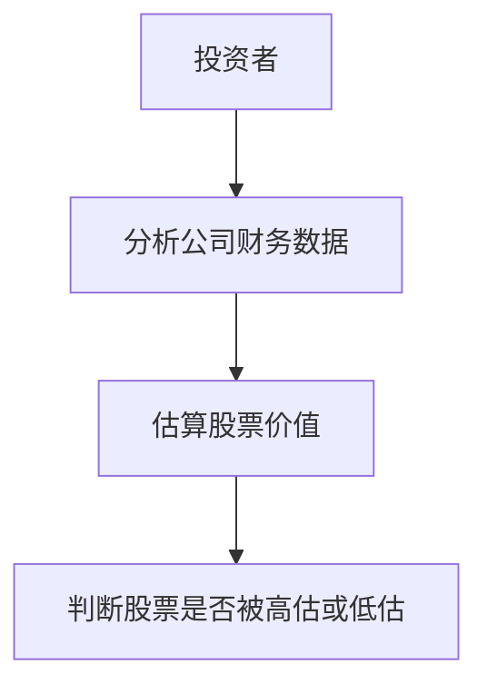
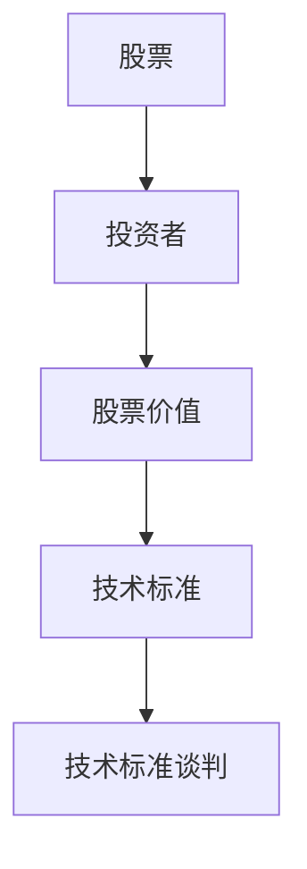
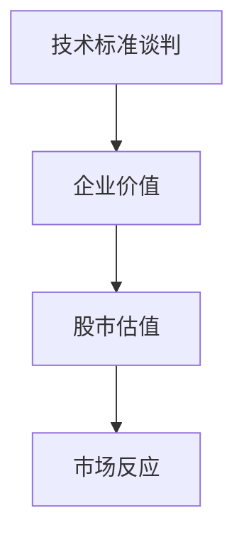
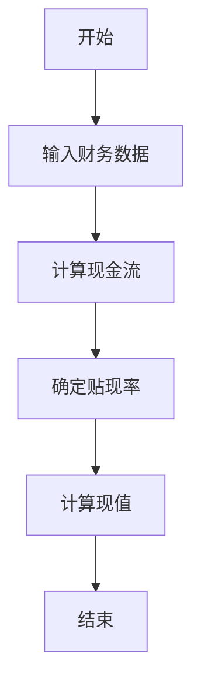
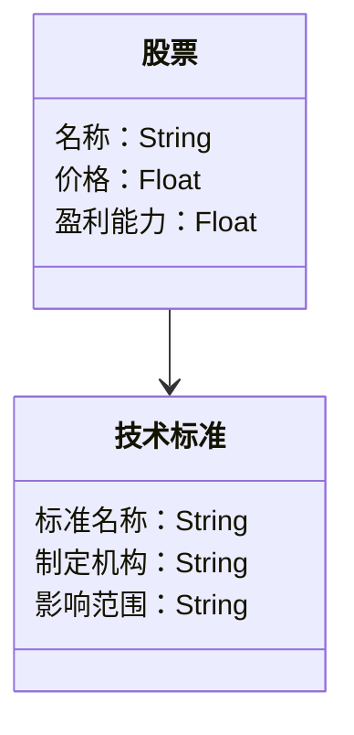
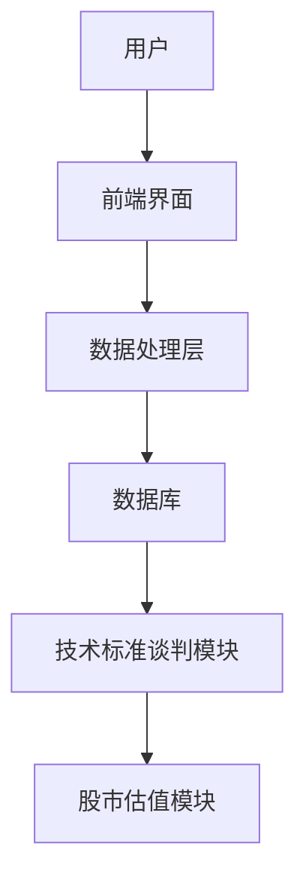

                 


# 股市估值在跨境技术标准谈判中的应用

## 关键词：股市估值、跨境技术标准、技术标准谈判、投资决策、风险管理、金融市场

## 摘要：  
本文探讨了股市估值在跨境技术标准谈判中的应用，从核心概念、算法原理、系统分析到项目实战，全面解析了股市估值与技术标准谈判的内在联系。通过具体案例分析，展示了如何利用股市估值方法预测和评估技术标准谈判的结果，为投资者和谈判方提供科学的决策支持。

---

## 第一部分：股市估值与跨境技术标准谈判的背景与概念

### 第1章：股市估值的基本概念与方法

#### 1.1 股市估值的定义与重要性
##### 1.1.1 股市估值的基本定义  
股市估值是指通过对企业的财务数据、市场环境和行业趋势进行分析，估算公司股票的内在价值，以确定其在市场上的合理价格。  
**公式：**  
$$ V = \frac{E}{P/E} $$  
其中，\( V \) 表示股票的内在价值，\( E \) 表示公司净利润，\( P/E \) 表示市盈率。

##### 1.1.2 股市估值在投资决策中的作用  
股市估值是投资者评估股票是否被高估或低估的重要工具。通过估值，投资者可以判断是否买入、持有或卖出股票。  
**图1.1：股市估值的作用流程图**  


##### 1.1.3 股市估值的核心要素与影响因素  
- **核心要素：** 盈利能力、成长性、市盈率、市净率、股息率等。  
- **影响因素：** 宏观经济环境、行业趋势、公司基本面、市场情绪等。

#### 1.2 股市估值的主要方法
##### 1.2.1 市盈率法（P/E Ratio）  
市盈率法通过比较股票的市盈率与行业平均水平，判断股票是否被高估或低估。  
**公式：**  
$$ P/E = \frac{P}{E} $$  
其中，\( P \) 是股票价格，\( E \) 是每股净利润。

##### 1.2.2 市净率法（P/B Ratio）  
市净率法通过比较股票的市净率与行业平均水平，判断股票是否被高估或低估。  
**公式：**  
$$ P/B = \frac{P}{B} $$  
其中，\( P \) 是股票价格，\( B \) 是每股净资产。

##### 1.2.3 现金流折现法（DCF）  
现金流折现法通过估算公司未来现金流的现值，确定股票的内在价值。  
**公式：**  
$$ V = \sum_{t=1}^{n} \frac{CF_t}{(1+r)^t} $$  
其中，\( CF_t \) 是第 \( t \) 年的现金流，\( r \) 是贴现率。

##### 1.2.4 其他估值方法对比  
- **相对估值法：** 与行业平均水平对比。  
- **绝对估值法：** 通过模型估算内在价值。  

---

### 第2章：跨境技术标准谈判的基本概念与流程

#### 2.1 跨境技术标准的定义与特点
##### 2.1.1 技术标准的定义  
技术标准是指在特定领域内，为实现产品或服务的互操作性而制定的技术规范。  

##### 2.1.2 跨境技术标准的特点  
- **国际性：** 涉及多个国家或地区的利益。  
- **复杂性：** 涉及技术、法律、经济等多个维度。  
- **动态性：** 随着技术进步和市场需求的变化而更新。  

#### 2.2 跨境技术标准谈判的流程与关键点
##### 2.2.1 技术标准谈判的基本流程  
1. 确定谈判目标。  
2. 收集相关信息。  
3. 制定谈判策略。  
4. 展开谈判。  
5. 签订协议。  

##### 2.2.2 请求方与供给方的立场分析  
- **请求方：** 通常希望技术标准能够满足自身需求。  
- **供给方：** 通常希望技术标准能够推广自身技术。  

##### 2.2.3 请求方与供给方的利益平衡  
通过折中方案，平衡双方利益，实现共赢。  

---

### 第3章：股市估值与跨境技术标准谈判的关联性

#### 3.1 股市估值与技术标准谈判的内在联系
##### 3.1.1 技术标准对股市估值的影响  
技术标准的制定和推广会影响相关企业的市场地位和盈利能力，从而影响股票价值。  

##### 3.1.2 股市估值对技术标准谈判的反向作用  
股市估值为技术标准谈判提供了市场化的价值参考，有助于制定公平合理的谈判方案。

#### 3.2 股市估值在跨境技术标准谈判中的具体应用
##### 3.2.1 股市估值作为谈判筹码的策略  
通过评估相关企业的股票价值，确定谈判的起点和范围。  

##### 3.2.2 股市估值对谈判结果的预测作用  
通过分析股市估值的变化趋势，预测技术标准谈判的结果。  

##### 3.2.3 股市估值在谈判中的风险评估  
通过股市估值，评估技术标准谈判可能带来的市场风险。

---

## 第二部分：股市估值与跨境技术标准谈判的核心概念与联系

### 第4章：核心概念与属性对比

#### 4.1 股市估值的核心概念
##### 4.1.1 股票价值的决定因素  
- **盈利能力：** 净利润、ROE等。  
- **成长性：** 收入增长率、净利润增长率等。  
- **市场环境：** 宏观经济、行业趋势等。  

#### 4.2 跨境技术标准谈判的核心概念
##### 4.2.1 技术标准的制定过程  
1. 确定需求。  
2. 草拟标准。  
3. 征求意见。  
4. 审批发布。  

#### 4.3 核心概念的属性对比分析
##### 4.3.1 股市估值与技术标准谈判的属性对比表格  
| 属性       | 股市估值                 | 技术标准谈判           |
|------------|--------------------------|-----------------------|
| 主体       | 投资者                   | 政府、企业             |
| 目标       | 评估股票价值             | 制定技术标准           |
| 影响因素   | 财务数据、市场情绪         | 技术、法律、经济       |

##### 4.3.2 股市估值与技术标准谈判的ER实体关系图  


---

### 第5章：股市估值与跨境技术标准谈判的关系模型

#### 5.1 股市估值与技术标准谈判的关系模型构建
##### 5.1.1 模型构建的基本思路  
通过分析技术标准谈判对股市估值的影响，构建双向影响模型。  

##### 5.1.2 模型的核心  
- 技术标准谈判影响企业价值，进而影响股市估值。  
- 股市估值为技术标准谈判提供市场参考。

#### 5.2 股市估值与技术标准谈判的关系模型图  


---

## 第三部分：股市估值与跨境技术标准谈判的算法原理

### 第6章：算法原理与数学模型

#### 6.1 现金流折现法（DCF）的原理与实现
##### 6.1.1 DCF模型的流程图  


##### 6.1.2 DCF模型的Python实现  
```python
def discounted_cash_flow(cash_flows, discount_rate):
    present_value = 0
    for year, cf in enumerate(cash_flows):
        present_value += cf / (1 + discount_rate) ** year
    return present_value

# 示例数据
cash_flows = [100, 150, 200]
discount_rate = 0.08

# 计算现值
pv = discounted_cash_flow(cash_flows, discount_rate)
print(f"现值：{pv}")
```

#### 6.2 技术标准谈判中的贴现率计算
##### 6.2.1 贴现率的公式  
$$ r = \frac{E}{P} $$  
其中，\( E \) 是期望收益，\( P \) 是股票价格。  

##### 6.2.2 贴现率的计算步骤  
1. 确定期望收益。  
2. 确定股票价格。  
3. 计算贴现率。  

---

## 第四部分：股市估值与跨境技术标准谈判的系统分析

### 第7章：系统分析与架构设计

#### 7.1 系统功能设计
##### 7.1.1 领域模型  


#### 7.2 系统架构设计
##### 7.2.1 系统架构图  


#### 7.3 系统接口设计
##### 7.3.1 接口描述  
- **输入接口：** 用户输入技术标准和财务数据。  
- **输出接口：** 系统输出估值结果和谈判建议。  

---

## 第五部分：股市估值与跨境技术标准谈判的项目实战

### 第8章：项目实战与案例分析

#### 8.1 环境安装与配置
##### 8.1.1 环境要求  
- Python 3.8 或更高版本。  
- 安装 Mermaid 和 LaTeX 插件。  

#### 8.2 核心代码实现
##### 8.2.1 DCF模型的代码实现  
```python
def discounted_cash_flow(cash_flows, discount_rate):
    present_value = 0
    for year, cf in enumerate(cash_flows):
        present_value += cf / (1 + discount_rate) ** year
    return present_value

# 示例数据
cash_flows = [100, 150, 200]
discount_rate = 0.08

# 计算现值
pv = discounted_cash_flow(cash_flows, discount_rate)
print(f"现值：{pv}")
```

#### 8.3 实际案例分析
##### 8.3.1 案例背景  
假设某跨国公司参与一项技术标准谈判，需评估其股票价值是否合理。  

##### 8.3.2 案例分析  
1. 收集公司财务数据和行业标准。  
2. 应用 DCF 模型计算股票的现值。  
3. 对比市盈率和市净率，判断股票是否被高估或低估。  

---

## 第六部分：股市估值与跨境技术标准谈判的最佳实践

### 第9章：最佳实践与小结

#### 9.1 小结
- 股市估值是技术标准谈判的重要工具。  
- 技术标准谈判影响企业的市场价值，进而影响股市估值。  

#### 9.2 注意事项
- 确保数据的准确性和完整性。  
- 结合实际情况，灵活调整估值方法。  

#### 9.3 未来趋势与扩展阅读
- 股市估值与人工智能的结合。  
- 技术标准谈判的数字化与智能化。  

---

## 作者：AI天才研究院 & 禅与计算机程序设计艺术

---

通过本文的分析，我们深入探讨了股市估值在跨境技术标准谈判中的应用，从理论到实践，为读者提供了全面的视角和实用的工具。希望本文能为投资者和谈判方提供有价值的参考和启发。

