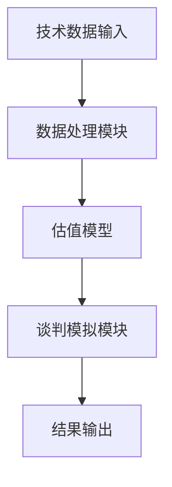

                 


---

# 股市估值在跨境技术许可谈判中的应用

## 关键词：
- 股市估值
- 技术许可
- 跨境谈判
- 估值模型
- 技术谈判

## 摘要：
本文探讨了股市估值方法在跨境技术许可谈判中的应用，分析了技术价值评估的核心要素，并构建了适用于技术许可谈判的定价模型。通过实际案例分析，展示了如何利用股市估值方法优化技术谈判策略，帮助企业在跨境技术交易中实现价值最大化。

---

# 第一部分：股市估值与跨境技术许可谈判的背景与基础

## 第1章：股市估值与跨境技术许可谈判概述

### 1.1 股市估值的核心概念与方法
股市估值是评估企业价值的重要手段，常用的估值方法包括市盈率（P/E）、市净率（P/B）、股息率和现金流折现法（DCF）。这些方法帮助企业确定股票的合理价格区间。

- **市盈率法**：通过比较企业的市盈率与行业平均水平，评估企业的相对价值。
- **市净率法**：基于资产净值与股价的比率，适用于资产密集型企业。
- **股息率法**：衡量股票的分红回报率，适用于稳定收益的企业。
- **现金流折现法**：通过未来现金流的现值评估企业价值，较为复杂但精确。

### 1.2 技术许可谈判的基本概念
技术许可是指企业将自身技术授权给另一方使用，通常涉及专利、专有技术或软件授权。跨境技术许可 negotiation 需要考虑法律、文化、税收等多方面因素，复杂性较高。

### 1.3 股市估值在技术许可谈判中的应用背景
技术作为无形资产，其价值评估具有挑战性。股市估值方法提供了量化技术价值的工具，尤其适用于评估技术的市场竞争力和经济寿命。

---

## 第2章：股市估值的核心方法与技术分析

### 2.1 技术价值评估的关键因素
技术价值受市场竞争力、可替代性、法律保护和经济寿命的影响。这些因素决定了技术的市场价值和谈判中的议价能力。

- **市场竞争力**：技术是否具有独特的竞争优势。
- **可替代性**：市场上是否存在替代技术。
- **法律保护**：专利的保护力度和有效期。
- **经济寿命**：技术的生命周期和盈利能力。

### 2.2 股市估值方法的适用性分析
不同估值方法适用于不同场景：

- **市盈率法**：适用于技术公司，尤其是高成长型企业。
- **现金流折现法**：适用于长期稳定的技术收益预测。

---

## 第3章：技术许可谈判中的估值模型构建

### 3.1 综合评估模型的设计
结合股市估值方法，构建技术许可谈判的综合模型：

$$
\text{技术价值} = \text{市盈率} \times \text{净利润} + \text{市净率} \times \text{净资产}
$$

### 3.2 定价策略
- **基于技术价值的定价**：根据评估结果确定许可费。
- **市场供需关系**：考虑市场供需调整价格。
- **风险分担机制**：引入分成模式，降低谈判风险。

---

## 第4章：技术许可谈判系统的需求分析

### 4.1 系统目标与范围
构建一个支持技术许可谈判的系统，包括数据收集、评估模型和谈判模拟功能。

### 4.2 系统架构设计
使用Mermaid图表展示系统架构：



---

## 第5章：项目实战与案例分析

### 5.1 案例背景
某科技公司欲授权一项专利技术，需评估其价值并制定谈判策略。

### 5.2 环境安装
安装Python和相关库，如Pandas、NumPy。

### 5.3 核心代码实现
```python
import pandas as pd
import numpy as np

def calculate_technology_value(financial_data, market_data):
    # 市盈率法
    pe_ratio = financial_data['市盈率']
    net_profit = financial_data['净利润']
    value_pe = pe_ratio * net_profit

    # 市净率法
    pb_ratio = market_data['市净率']
    book_value = financial_data['净资产']
    value_pb = pb_ratio * book_value

    # 综合价值
    total_value = (value_pe + value_pb) / 2
    return total_value

# 示例数据
financial_data = {'市盈率': 20, '净利润': 10000000}
market_data = {'市净率': 3, '净资产': 50000000}
result = calculate_technology_value(financial_data, market_data)
print(f"技术价值评估结果：${result}")
```

### 5.4 实际案例分析
通过代码计算技术价值，并结合市场供需调整最终价格。

---

## 第6章：总结与展望

### 6.1 总结
股市估值方法为技术许可谈判提供了有效的工具，帮助企业在跨境交易中实现价值最大化。

### 6.2 展望
未来可进一步研究动态估值模型，结合人工智能技术提升评估精度。

---

# 作者：AI天才研究院 & 禅与计算机程序设计艺术

---

通过以上结构，文章系统地分析了股市估值在跨境技术许可谈判中的应用，结合理论与实践，为读者提供了深入的指导和实用的案例。

