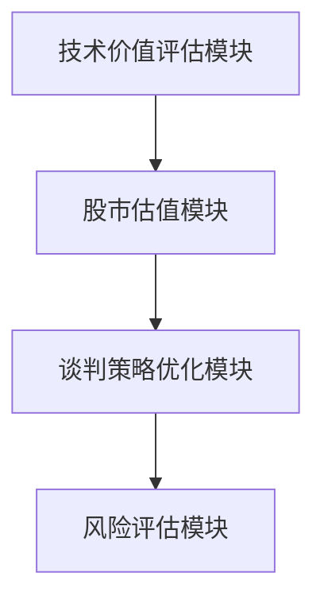

                 


# 股市估值在跨境技术许可谈判策略中的应用

---

## 关键词  
股市估值, 技术许可谈判, 跨境交易, 股票定价, 技术价值评估

---

## 摘要  
本文深入探讨股市估值在跨境技术许可谈判中的应用，结合股市估值的核心原理和方法，分析技术许可谈判的策略，提出一种基于股市估值的谈判支持系统，帮助读者理解如何将股市估值应用于技术许可谈判中，优化谈判策略，降低风险，提升企业价值。

---

## 第一部分: 股市估值与技术许可谈判的背景与核心概念

### 第1章: 股市估值与技术许可谈判的背景

#### 1.1 股市估值的基本概念  
股市估值是通过对上市公司的财务数据和市场表现进行分析，评估其股票的合理价格范围。常用方法包括市盈率（P/E）、市净率（P/B）和股东权益价值评估等。  

#### 1.2 技术许可谈判的基本概念  
技术许可是指企业通过授权使用他人的技术或专利，支付一定的许可费。跨境技术许可谈判涉及跨国法律、税务、汇率等复杂因素，具有较高的风险和不确定性。  

#### 1.3 股市估值在技术许可谈判中的作用  
股市估值可以为技术的价值评估提供参考，帮助企业在谈判中确定合理的许可费，优化谈判策略，并降低风险。

---

### 第2章: 股市估值与技术许可谈判的核心概念

#### 2.1 股市估值的核心原理  
市盈率（P/E） = 股价 / 每股净利润  
市净率（P/B） = 股价 / 每股净资产  
股东权益价值 = 股票数量 × 股价  

#### 2.2 技术许可谈判的核心要素  
- 技术的市场价值评估：通过技术的生命周期、可替代性、市场需求等因素评估技术的经济价值。  
- 许可费的计算方法：基于技术的价值、谈判双方的议价能力等确定许可费。  
- 谈判中的风险与不确定性：汇率波动、法律风险等对谈判结果的影响。  

#### 2.3 股市估值与技术许可谈判的联系  
股市估值为企业提供股票价格波动的参考，帮助企业在技术许可谈判中预测市场反应，优化谈判策略。

---

## 第二部分: 股市估值与技术许可谈判的算法原理

### 第3章: 股市估值的算法原理

#### 3.1 股市估值的核心算法  
- **市盈率模型**：通过目标公司的市盈率与行业平均水平的对比，评估其股票的合理价格。  
- **市净率模型**：通过目标公司的市净率与行业平均水平的对比，评估其股票的合理价格。  
- **股东权益价值模型**：通过目标公司的股东权益价值与市场资本化率的对比，评估其股票的合理价格。  

#### 3.2 技术许可谈判中的算法应用  
- **许可费计算的数学模型**：  
  $$ \text{许可费} = \text{技术价值} \times \text{议价能力调整系数} $$  
- **技术价值评估的回归分析**：通过回归分析技术的市场表现、生命周期等因素，评估其价值。  
- **风险评估的蒙特卡洛模拟**：通过模拟不同市场条件下的股票价格波动，评估技术许可谈判的风险。

---

### 第4章: 技术许可谈判中的算法原理

#### 4.1 技术价值评估的算法  
- **技术的市场价值评估模型**：  
  $$ \text{技术价值} = \text{市场需求} \times \text{技术生命周期} \times \text{技术独特性} $$  
- **技术的生命周期分析**：通过技术的生命周期阶段（导入期、成长期、成熟期、衰退期）评估其市场价值。  
- **技术的可替代性评估**：通过分析技术的可替代性，评估其市场竞争力。

#### 4.2 谈判策略的算法优化  
- **谈判中的博弈论模型**：通过博弈论模型分析谈判双方的策略选择，预测谈判结果。  
- **谈判中的动态定价策略**：根据市场环境的变化，动态调整技术许可的定价策略。  
- **谈判中的风险管理**：通过风险评估模型，制定风险应对策略，降低谈判风险。

---

## 第三部分: 系统分析与架构设计方案

### 第5章: 系统分析与架构设计方案

#### 5.1 问题场景介绍  
跨境技术许可谈判涉及复杂的法律、税务和市场因素，企业需要一个综合的估值系统来支持谈判决策。

#### 5.2 系统功能设计  
- **技术价值评估模块**：通过技术的市场价值、生命周期、可替代性等因素评估技术价值。  
- **股市估值模块**：通过市盈率、市净率等指标评估目标公司的股票价值。  
- **谈判策略优化模块**：通过博弈论模型和蒙特卡洛模拟优化谈判策略，降低风险。

#### 5.3 系统架构设计  
- **系统架构图**：  


#### 5.4 系统接口设计  
- **技术价值评估模块接口**：接收技术的市场数据和财务数据，返回技术价值评估结果。  
- **股市估值模块接口**：接收目标公司的财务数据和市场数据，返回股票价值评估结果。  
- **谈判策略优化模块接口**：接收技术价值评估结果和市场环境数据，返回优化的谈判策略。

---

## 第四部分: 项目实战

### 第6章: 项目实战

#### 6.1 环境安装  
- 安装Python和相关库（numpy、pandas、scikit-learn）。  

#### 6.2 系统核心实现源代码  
```python
import numpy as np
import pandas as pd
from sklearn.linear_model import LinearRegression

# 技术价值评估函数
def assess_technology_value(market_demand, technology_lifetime, uniqueness_factor):
    return market_demand * technology_lifetime * uniqueness_factor

# 股市估值函数
def stock_valuation(revenue, net_profit, market_cap, industry_avg_pe):
    pe_ratio = market_cap / net_profit
    if pe_ratio < industry_avg_pe:
        return "低估"
    elif pe_ratio > industry_avg_pe:
        return "高估"
    else:
        return "合理"

# 谈判策略优化函数
def optimize_negotiation_strategy(technology_value, market_fluctuation):
    model = LinearRegression()
    model.fit(np.array([[technology_value]]), np.array([[market_fluctuation]]))
    return model.predict(np.array([[technology_value]]))[0]
```

#### 6.3 代码应用解读与分析  
- **技术价值评估函数**：根据市场需求、技术生命周期和独特性评估技术价值。  
- **股市估值函数**：通过市盈率与行业平均水平对比，评估股票的合理价格。  
- **谈判策略优化函数**：使用线性回归模型优化谈判策略，预测市场波动对谈判结果的影响。

#### 6.4 实际案例分析  
假设某公司欲进行技术许可谈判，市场需求为100，技术生命周期为5年，独特性为0.8。通过技术价值评估函数，技术价值为$100 \times 5 \times 0.8 = 400$。结合股市估值函数和谈判策略优化函数，优化谈判策略，确定合理的许可费。

---

## 第五部分: 最佳实践与总结

### 第7章: 最佳实践与总结

#### 7.1 小结  
本文通过股市估值的核心原理和算法，结合技术许可谈判的策略，提出了一种基于股市估值的谈判支持系统，帮助企业优化谈判策略，降低风险。

#### 7.2 注意事项  
- 数据的准确性和完整性是系统运行的关键。  
- 股市波动和市场环境的变化会影响谈判结果，需实时监控和调整策略。  
- 法律和税务因素是跨境技术许可谈判的重要组成部分，需专业团队支持。

#### 7.3 拓展阅读  
- 《股票技术分析实战》  
- 《技术许可协议法律解读》  
- 《博弈论与谈判策略》  

---

## 作者：AI天才研究院 & 禅与计算机程序设计艺术

---

