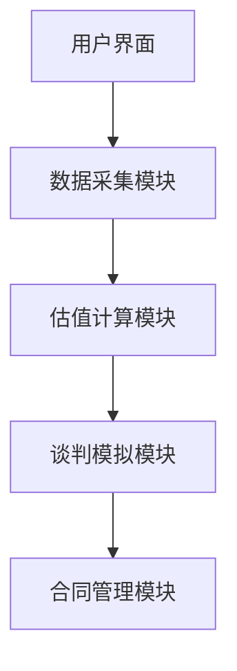
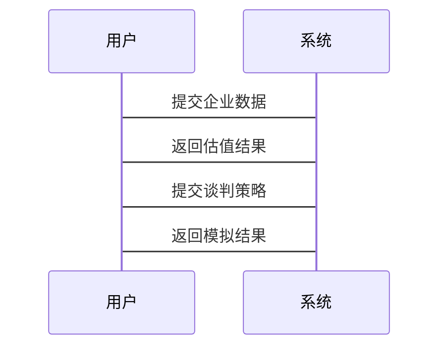

                 


# 股市估值在跨境技术许可谈判策略中的应用

## 关键词：股市估值，技术许可，跨境谈判，谈判策略，企业价值，市场分析

## 摘要：  
股市估值在跨境技术许可谈判中扮演着至关重要的角色。本文通过分析股市估值的核心概念、技术许可谈判的关键策略，结合实际案例，深入探讨如何将股市估值方法应用于技术许可谈判策略中，以实现企业价值最大化。本文还详细介绍了多种估值模型，如市盈率模型、市净率模型和现金流折现模型，并通过系统分析和实际案例，展示了这些模型在技术许可谈判中的具体应用。通过本文的分析，读者将能够更好地理解股市估值在技术许可谈判中的重要性，并掌握如何在实际谈判中灵活运用这些方法。

---

# 正文

## 第一部分：股市估值基础与技术许可谈判概述

### 第1章：股市估值的基本概念与方法

#### 1.1 股市估值的定义与重要性

股市估值是指通过对企业的财务数据、市场环境和行业趋势进行分析，估算企业或其股票的市场价值的过程。股市估值在投资决策中具有重要意义，它不仅帮助投资者评估企业的内在价值，还能为技术许可谈判提供重要的参考依据。

股市估值的核心在于通过分析企业的盈利能力、成长潜力和市场地位，确定其股票的合理价格区间。在技术许可谈判中，股市估值可以帮助双方评估技术的市场价值，从而制定合理的许可费用和谈判策略。

#### 1.2 技术许可的基本概念

技术许可是指企业将其技术、专利、商标等无形资产授权给其他企业使用，并收取许可费用的过程。技术许可是企业技术商业化的重要方式之一，尤其在跨境合作中，技术许可可以帮助企业快速进入新市场或获取技术资源。

技术许可的核心在于通过谈判确定技术的使用范围、许可费用、权利义务分配等问题。在跨境技术许可中，由于涉及不同国家的法律、税收政策和文化差异，谈判的复杂性显著增加。

#### 1.3 股市估值与技术许可的结合

技术许可的价值往往与企业的市场价值密切相关。通过股市估值，可以评估企业的整体价值，进而确定技术的合理许可费用。例如，如果一家企业的技术具有较高的市场价值，其技术许可费用也应相应提高。

股市估值在技术许可谈判中的应用主要体现在以下几个方面：
1. 评估技术的市场价值。
2. 确定合理的许可费用区间。
3. 分析谈判对手的财务状况和市场地位。
4. 优化谈判策略，提高谈判结果的公平性和可接受性。

### 第2章：技术许可谈判的基本策略

#### 2.1 技术许可谈判的背景

技术许可谈判的背景主要包括市场需求、企业战略和技术特点三个方面。市场需求决定了技术许可的必要性和潜在收益；企业战略决定了技术许可的目标和范围；技术特点则影响技术许可的具体条件和谈判策略。

#### 2.2 技术许可谈判的主要阶段

技术许可谈判通常包括以下几个阶段：
1. 准备阶段：收集市场信息、评估技术价值、制定谈判目标。
2. 谈判阶段：通过多轮谈判确定技术许可的具体条件。
3. 签署与执行阶段：签订合同并监督合同的执行。

#### 2.3 技术许可谈判中的关键因素

在技术许可谈判中，以下因素尤为重要：
1. 技术的市场价值：通过股市估值确定技术的合理价格。
2. 谈判双方的议价能力：包括企业的市场地位、技术独特性和财务状况。
3. 法律与税务因素：包括知识产权保护、税收政策和合同条款。

---

## 第二部分：股市估值模型在技术许可中的应用

### 第3章：主要股市估值模型介绍

#### 3.1 市盈率模型

市盈率模型是股市估值中最常用的模型之一，其计算公式为：

$$市盈率 = \frac{股票价格}{每股收益}$$

市盈率模型适用于那些具有稳定盈利的企业，特别是科技企业。在技术许可谈判中，市盈率模型可以帮助评估企业的整体价值，从而确定技术许可的合理费用。

#### 3.2 市净率模型

市净率模型的计算公式为：

$$市净率 = \frac{股票价格}{每股净资产}$$

市净率模型适用于那些资产-heavy的企业，如制造业和金融机构。在技术许可谈判中，市净率模型可以帮助评估企业的资产价值，从而确定技术许可的合理费用。

#### 3.3 现金流折现模型

现金流折现模型（DCF模型）是股市估值中最复杂的模型之一，其核心思想是将企业未来现金流折现为当前价值。现金流折现模型的计算公式为：

$$企业价值 = \sum_{t=1}^{n} \frac{现金流_t}{(1 + r)^t}$$

其中，r为折现率，n为预测期数。

现金流折现模型适用于那些具有稳定现金流的企业，特别是那些技术驱动型的企业。在技术许可谈判中，现金流折现模型可以帮助评估企业的未来收益，从而确定技术许可的合理费用。

### 第4章：技术许可谈判中的估值模型选择

#### 4.1 不同技术类型适用的估值模型

在技术许可谈判中，选择合适的估值模型需要考虑技术的类型和特点。例如，对于具有高成长性的技术，市盈率模型可能更为合适；而对于具有稳定收益的技术，现金流折现模型可能更为合适。

#### 4.2 股市估值模型在技术许可中的应用案例

以某科技企业为例，假设该企业的市盈率为20倍，每股收益为5元，则该企业的股票价格为：

$$股票价格 = 市盈率 \times 每股收益 = 20 \times 5 = 100元$$

通过市盈率模型，可以评估该企业的整体价值，从而确定技术许可的合理费用。

---

## 第三部分：技术许可谈判中的系统分析与架构设计

### 第5章：技术许可谈判的系统分析

#### 5.1 问题场景介绍

技术许可谈判涉及多个方面的因素，包括企业的财务状况、市场地位、技术特点、法律环境等。在跨境技术许可谈判中，还需要考虑不同的法律体系和税收政策。

#### 5.2 系统功能设计

在技术许可谈判中，系统功能设计包括以下几个方面：
1. 数据采集：收集企业的财务数据、市场信息和法律政策。
2. 估值计算：通过不同的估值模型计算企业的市场价值。
3. 谈判模拟：模拟谈判过程，评估不同的谈判策略。
4. 合同管理：管理技术许可合同的签订和执行。

#### 5.3 系统架构设计

以下是技术许可谈判系统的架构设计：



#### 5.4 系统接口设计

系统接口设计包括以下几个方面：
1. 数据输入接口：收集企业的财务数据和市场信息。
2. 估值计算接口：通过不同的估值模型计算企业的市场价值。
3. 谈判模拟接口：模拟谈判过程，评估不同的谈判策略。
4. 合同管理接口：管理技术许可合同的签订和执行。

#### 5.5 系统交互设计

以下是技术许可谈判系统的交互设计：



---

## 第四部分：技术许可谈判中的项目实战

### 第6章：技术许可谈判的实战分析

#### 6.1 项目介绍

以某科技企业的技术许可谈判为例，假设该企业的市盈率为20倍，每股收益为5元，则该企业的股票价格为：

$$股票价格 = 20 \times 5 = 100元$$

通过市盈率模型，可以评估该企业的整体价值，从而确定技术许可的合理费用。

#### 6.2 项目核心实现

以下是项目核心实现的代码示例：

```python
# 计算市盈率
def calculate_pe(stock_price, eps):
    return stock_price / eps

# 计算市净率
def calculate_pb(stock_price, book_value_per_share):
    return stock_price / book_value_per_share

# 计算现金流折现模型
def calculate_dcf(cash_flows, discount_rate):
    present_value = 0
    for t in range(len(cash_flows)):
        present_value += cash_flows[t] / (1 + discount_rate) ** t
    return present_value
```

#### 6.3 项目小结

通过上述分析，可以看出股市估值在技术许可谈判中的重要性。通过选择合适的估值模型，可以准确评估企业的市场价值，从而制定合理的谈判策略。

---

## 第五部分：总结与展望

### 第7章：总结与展望

#### 7.1 总结

本文通过分析股市估值的核心概念、技术许可谈判的关键策略，结合实际案例，深入探讨了股市估值在技术许可谈判中的应用。通过本文的分析，读者可以更好地理解股市估值在技术许可谈判中的重要性，并掌握如何在实际谈判中灵活运用这些方法。

#### 7.2 展望

未来的研究可以进一步探讨如何结合人工智能技术，优化股市估值模型，提高技术许可谈判的效率和准确性。同时，还可以研究如何在不同国家的法律和税收政策下，制定更为灵活的技术许可谈判策略。

---

## 作者：AI天才研究院/AI Genius Institute & 禅与计算机程序设计艺术 /Zen And The Art of Computer Programming

