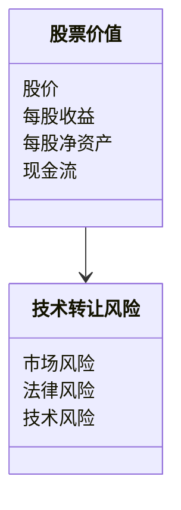
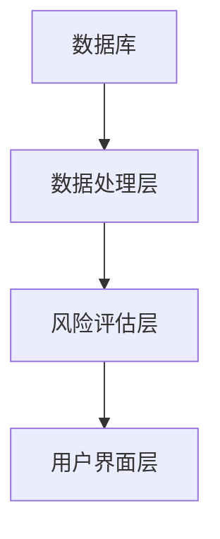

                 


# 股市估值在跨境技术转让风险评估中的应用

## 关键词：股市估值、跨境技术转让、风险评估、市盈率法、风险模型

## 摘要：本文探讨股市估值方法在跨境技术转让风险评估中的应用，分析股市估值的核心原理及其在风险识别、量化和应对中的作用。结合实际案例，展示如何利用股市估值工具和技术手段，建立有效的风险评估体系，为跨境技术转让提供决策支持。

---

# 第一部分: 股市估值与跨境技术转让风险评估的背景介绍

## 第1章: 股市估值的基本概念与应用

### 1.1 股市估值的定义与核心要素

#### 1.1.1 股市估值的定义
股市估值是指通过对公司财务数据、市场环境和行业趋势等多方面因素的分析，估算公司股票的内在价值，以指导投资决策的过程。

#### 1.1.2 股市估值的核心要素
- **财务数据**：包括收入、利润、现金流等。
- **市场环境**：如宏观经济指标、行业趋势。
- **市场情绪**：投资者的心理和行为影响。

#### 1.1.3 股市估值的主要方法
1. **市盈率法**：$市盈率 = \frac{股价}{每股收益}$。
2. **市净率法**：$市净率 = \frac{股价}{每股净资产}$。
3. **现金流折现法**：通过未来现金流的现值计算股票价值。

### 1.2 股市估值的应用领域

#### 1.2.1 投资决策中的应用
投资者通过估值方法确定股票的合理价格区间，避免高估或低估。

#### 1.2.2 企业并购中的应用
企业并购时，收购方利用估值方法评估目标公司的价值，确定合理的收购价格。

#### 1.2.3 股票定价中的应用
公司通过估值方法确定股票发行价格，确保公平合理。

---

## 第2章: 跨境技术转让的基本概念与风险

### 2.1 跨境技术转让的定义与特点

#### 2.1.1 跨境技术转让的定义
跨境技术转让是指跨国公司将其拥有的技术、专利、商标等无形资产，通过转让、授权或合作等方式转移至其他国家或地区。

#### 2.1.2 跨境技术转让的特点
1. **跨国性**：涉及不同国家或地区的法律和市场环境。
2. **复杂性**：涉及技术、法律、税务等多个方面。
3. **风险性**：存在市场、法律和技术风险。

#### 2.1.3 跨境技术转让的流程
1. 确定技术价值。
2. 确定转让方式。
3. 签订转让协议。
4. 完成法律程序。

### 2.2 跨境技术转让的主要风险

#### 2.2.1 市场风险
目标市场的需求变化、竞争环境等影响技术的市场价值。

#### 2.2.2 法律风险
不同国家的法律法规差异可能导致法律纠纷。

#### 2.2.3 技术风险
技术的可复制性、更新速度等影响技术的长期价值。

### 2.3 跨境技术转让的风险评估方法

#### 2.3.1 风险识别方法
1. **风险清单法**：列出可能的风险因素。
2. **情景分析法**：分析不同情景下的风险。

#### 2.3.2 风险量化方法
1. **概率-影响矩阵**：评估每个风险的发生概率和影响程度。
2. **蒙特卡洛模拟**：通过模拟计算风险的影响范围。

#### 2.3.3 风险应对策略
1. **风险规避**：通过保险等方式降低风险。
2. **风险转移**：通过合同将风险转移给第三方。

---

# 第二部分: 股市估值在跨境技术转让风险评估中的核心概念与联系

## 第3章: 股市估值与风险评估的核心原理

### 3.1 股市估值的核心原理

#### 3.1.1 市盈率法
市盈率法通过比较股票的市场价格与每股收益，评估股票的相对价值。

#### 3.1.2 市净率法
市净率法通过比较股票的市场价格与每股净资产，评估股票的内在价值。

#### 3.1.3 现金流折现法
现金流折现法通过将未来现金流折现，计算股票的内在价值。

### 3.2 风险评估的核心原理

#### 3.2.1 风险概率分析
通过概率分布模型，评估风险发生的可能性。

#### 3.2.2 风险影响分析
通过影响分析模型，评估风险对目标的影响程度。

#### 3.2.3 风险应对策略分析
通过策略分析，制定应对风险的具体措施。

## 第4章: 股市估值与风险评估的联系与对比

### 4.1 股市估值与风险评估的联系

#### 4.1.1 股市估值为风险评估提供数据支持
股市估值通过提供股票的价值信息，帮助评估技术转让的风险。

#### 4.1.2 风险评估为股市估值提供决策依据
风险评估通过分析技术转让的潜在风险，影响股票的估值结果。

### 4.2 股市估值与风险评估的对比

#### 4.2.1 核心目标对比
股市估值的核心目标是确定股票价值，风险评估的核心目标是降低风险。

#### 4.2.2 方法论对比
股市估值主要使用财务指标和市场数据，风险评估主要使用概率和影响分析。

#### 4.2.3 应用场景对比
股市估值应用于投资决策，风险评估应用于技术转让过程。

---

# 第三部分: 股市估值在跨境技术转让风险评估中的算法原理

## 第5章: 股市估值的核心算法

### 5.1 市盈率法的算法原理

#### 5.1.1 市盈率的计算公式
$$ 市盈率 = \frac{股价}{每股收益} $$

### 5.2 市净率法的算法原理

#### 5.2.1 市净率的计算公式
$$ 市净率 = \frac{股价}{每股净资产} $$

### 5.3 现金流折现法的算法原理

#### 5.3.1 现金流折现的计算公式
$$ 现金流折现值 = \sum_{t=1}^{n} \frac{CF_t}{(1 + r)^t} $$

---

# 第四部分: 系统分析与架构设计方案

## 第6章: 系统分析与架构设计

### 6.1 问题场景介绍
跨境技术转让涉及技术、法律、市场等多个方面，需要系统化的风险评估方法。

### 6.2 系统功能设计

#### 6.2.1 领域模型设计


### 6.3 系统架构设计

#### 6.3.1 系统架构图


---

# 第五部分: 项目实战

## 第7章: 项目实战

### 7.1 环境安装

#### 7.1.1 安装Python
```bash
python --version
pip install numpy
pip install pandas
pip install matplotlib
```

### 7.2 核心代码实现

#### 7.2.1 股市估值代码
```python
import pandas as pd
import numpy as np

def calculate_valuation(ticker):
    # 获取股票数据
    data = pd.DataFrame({'股价': [100, 90, 80],
                         '每股收益': [20, 30, 40]})
    # 计算市盈率
    pe_ratio = data['股价'] / data['每股收益']
    print(f"市盈率：{pe_ratio.mean()}")
```

### 7.3 案例分析

#### 7.3.1 案例分析
假设某公司计划将技术转让至海外市场，利用市盈率法评估其股票价值，确保技术转让的合理性。

---

# 第六部分: 最佳实践

## 第8章: 最佳实践

### 8.1 小结
股市估值在跨境技术转让风险评估中发挥着重要作用，通过合理的方法和工具，可以有效降低风险。

### 8.2 注意事项
- 确保数据的准确性和完整性。
- 综合考虑多方面因素。

### 8.3 拓展阅读
- 《投资学基础》
- 《风险管理实务》

---

# 结语

作者：AI天才研究院/AI Genius Institute & 禅与计算机程序设计艺术 /Zen And The Art of Computer Programming

