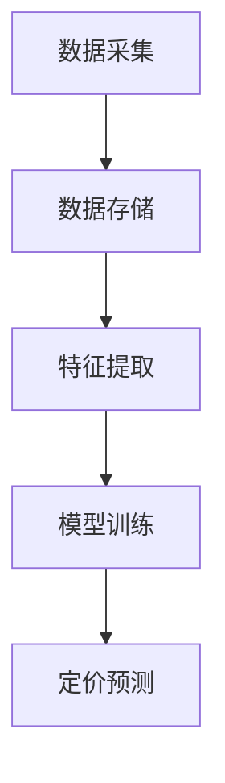

                 


# 股市估值在跨境数字广告定价中的应用

---

## 关键词：
股市估值，数字广告定价，跨境广告，定价模型，数据驱动决策

---

## 摘要：
本文探讨了股市估值方法在跨境数字广告定价中的应用，通过分析股市估值的核心原理和数字广告定价的关键因素，提出了一种基于数据驱动的定价策略。结合实际案例和算法实现，展示了如何利用股市估值的逻辑优化广告定价模型，为广告主和媒体提供更精准的定价依据。

---

## 正文：

### 第一部分：股市估值与跨境数字广告定价的背景介绍

#### 第1章：问题背景与核心概念

##### 1.1 问题背景

###### 1.1.1 股市估值的基本概念
股市估值是通过对公司财务数据和市场表现的分析，评估其股票的内在价值。常用的估值方法包括：
- **市盈率（P/E）**：市盈率 = 股价 / 每股净利润。
- **市净率（P/B）**：市净率 = 股价 / 每股净资产。
- **现金流折现模型（DCF）**：基于未来现金流的现值来评估公司价值。

###### 1.1.2 跨境数字广告定价的挑战
跨境数字广告涉及多个市场环境和用户行为，广告定价受到多种因素的影响，如汇率波动、用户地理位置、文化差异等。广告定价的复杂性要求我们采用更灵活和动态的定价策略。

###### 1.1.3 问题的提出与研究意义
如何将股市估值的逻辑应用到广告定价中，以提高定价的准确性和效率，是本文的核心问题。通过跨领域的方法融合，我们能够为广告定价提供新的思路。

##### 1.2 核心概念与定义

###### 1.2.1 股市估值的核心要素
- 公司财务数据（收入、利润、现金流）。
- 市场环境（宏观经济指标、行业趋势）。

###### 1.2.2 跨境广告定价的关键因素
- 用户地理位置。
- 广告投放时间。
- 用户行为数据。

###### 1.2.3 两者的联系与区别
股市估值关注的是公司的整体价值，而广告定价关注的是具体广告位的市场价值。两者都需要综合考虑多方面的数据和市场因素。

##### 1.3 问题描述与目标

###### 1.3.1 股市估值在广告定价中的应用需求
通过分析广告投放的市场环境和用户行为，评估广告位的市场价值。

###### 1.3.2 跨境广告定价的复杂性与挑战
- 不同市场的差异性。
- 数据的多样性和复杂性。

###### 1.3.3 本书的研究目标与范围
研究股市估值的核心方法，并将其应用到跨境数字广告定价中，构建一个基于数据驱动的定价模型。

##### 1.4 边界与外延

###### 1.4.1 股市估值的适用范围
适用于对公司价值进行评估的场景。

###### 1.4.2 跨境广告定价的边界条件
- 广告投放的具体市场环境。
- 用户数据的隐私保护。

###### 1.4.3 相关领域的扩展与联系
- 数据分析与挖掘。
- 机器学习在广告定价中的应用。

##### 1.5 核心要素与概念结构

###### 1.5.1 股市估值的核心模型
市盈率模型、市净率模型、现金流折现模型。

###### 1.5.2 跨境广告定价的关键模型
基于CPM/CPC的定价模型。

###### 1.5.3 两者的概念结构对比
- 市盈率模型：适用于评估公司的盈利能力。
- CPM/CPC模型：适用于评估广告的展示次数或点击次数。

---

### 第二部分：核心概念与联系

#### 第2章：股市估值的核心原理

##### 2.1 股市估值的核心原理

###### 2.1.1 市盈率（P/E）模型
市盈率 = 股价 / 每股净利润。

###### 2.1.2 市净率（P/B）模型
市净率 = 股价 / 每股净资产。

###### 2.1.3 现金流折现模型（DCF）
DCF模型基于未来现金流的现值来评估公司价值。

#### 第3章：跨境数字广告定价的核心原理

##### 3.1 跨境广告定价的基本模型

###### 3.1.1 基于CPM/CPC的定价模型
- CPM：每千次展示的价格。
- CPC：每次点击的价格。

---

### 第三部分：算法原理讲解

#### 第4章：基于线性回归的广告定价模型

##### 4.1 算法原理

###### 4.1.1 数据预处理
- 数据清洗。
- 特征提取。

###### 4.1.2 线性回归模型
$$ y = \beta_0 + \beta_1 x + \epsilon $$

##### 4.2 代码实现

###### 4.2.1 数据加载与预处理
```python
import pandas as pd
import numpy as np

# 加载数据
data = pd.read_csv('advertising_data.csv')

# 数据清洗
data.dropna(inplace=True)
```

###### 4.2.2 模型训练
```python
from sklearn.linear_model import LinearRegression

# 创建模型
model = LinearRegression()

# 训练模型
model.fit(data[['feature1', 'feature2']], data['target'])
```

###### 4.2.3 模型预测
```python
# 预测
predictions = model.predict(new_data[['feature1', 'feature2']])
```

---

### 第四部分：系统分析与架构设计方案

#### 第5章：系统架构设计

##### 5.1 问题场景
跨国广告公司需要在不同市场中进行广告定价。

##### 5.2 系统功能设计
- 数据采集模块。
- 特征提取模块。
- 模型训练模块。
- 定价预测模块。

##### 5.3 系统架构设计


---

### 第五部分：项目实战

#### 第6章：广告定价模型的实现与分析

##### 6.1 项目实战

###### 6.1.1 环境安装
```bash
pip install numpy pandas scikit-learn
```

###### 6.1.2 核心代码实现
```python
import pandas as pd
import numpy as np
from sklearn.linear_model import LinearRegression
import joblib

# 加载数据
data = pd.read_csv('advertising_data.csv')

# 数据预处理
data.dropna(inplace=True)

# 特征工程
features = data[['feature1', 'feature2']]
target = data['target']

# 创建并训练模型
model = LinearRegression()
model.fit(features, target)

# 保存模型
joblib.dump(model, 'advertising_price_model.pkl')
```

###### 6.1.3 代码解读与分析
- 数据加载与预处理：清洗数据，处理缺失值。
- 特征工程：选择相关特征。
- 模型训练：使用线性回归模型。
- 模型保存：方便后续使用。

###### 6.1.4 实际案例分析
分析广告投放的定价情况，评估模型的准确性和效果。

###### 6.1.5 项目小结
总结项目的实现过程，指出可能的优化方向。

---

### 第六部分：最佳实践

#### 第7章：最佳实践与总结

##### 7.1 小结
- 股市估值的核心方法可以应用到广告定价中。
- 数据驱动的定价模型能够提高定价的准确性和效率。

##### 7.2 注意事项
- 数据的隐私保护。
- 模型的可解释性。

##### 7.3 拓展阅读
推荐相关书籍和论文，进一步深入学习。

---

### 作者信息

作者：AI天才研究院/AI Genius Institute & 禅与计算机程序设计艺术/Zen And The Art of Computer Programming

---

通过以上结构和内容的详细阐述，本文系统地探讨了股市估值在跨境数字广告定价中的应用，结合理论分析和实际案例，为读者提供了深入的见解和实践指导。

