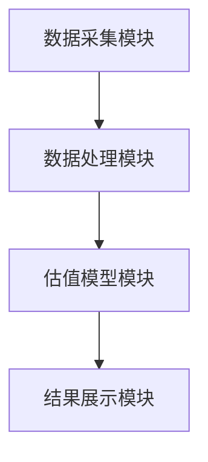

                 


---

# 股市估值在跨境数字服务价值评估中的应用

## 关键词：股市估值、跨境数字服务、价值评估、数字服务、股票估值

## 摘要：
本文探讨了股市估值在跨境数字服务价值评估中的应用，分析了数字服务的特点及其对股市估值的影响。文章结合股市估值的基本理论与方法，提出了适用于跨境数字服务的价值评估模型，并通过实际案例展示了模型的应用过程。

---

# 第一部分：股市估值与跨境数字服务价值评估的背景与基础

## 第1章：股市估值与跨境数字服务概述

### 1.1 股市估值的基本概念

#### 1.1.1 股票估值的定义与意义
股票估值是通过分析公司财务数据和市场环境，估算其股票内在价值的过程。其意义在于帮助投资者做出理性投资决策。

#### 1.1.2 股市估值的核心方法
常用方法包括DCF模型、市盈率法、市净率法等。DCF模型通过现金流折现计算企业价值，适用于成长型企业。

#### 1.1.3 股市估值与企业价值的关系
股票价格反映市场对企业价值的评估，但受市场情绪和宏观经济因素影响，可能存在溢价或折价。

### 1.2 跨境数字服务的定义与特点

#### 1.2.1 跨境数字服务的定义
跨境数字服务指跨国提供数字产品或服务，如在线教育、跨境支付、云服务等。

#### 1.2.2 跨境数字服务的主要形式
包括在线支付平台、SaaS服务、数字内容分发、跨境电商物流管理等。

#### 1.2.3 跨境数字服务与传统服务的对比
数字服务具有可扩展性、即时性和数据驱动性，而传统服务受地域限制，成本较高。

### 1.3 股市估值在跨境数字服务中的应用背景

#### 1.3.1 数字经济的发展趋势
数字经济成为全球经济增长的新引擎，数字服务在跨境贸易中占据重要地位。

#### 1.3.2 跨境数字服务的市场现状
市场规模快速增长，主要参与者包括科技巨头和新兴创业公司。

#### 1.3.3 股市估值在数字服务中的重要性
数字服务的无形资产特性使其估值更具挑战性，股市估值方法需适应其特点。

## 第2章：跨境数字服务价值评估的核心要素

### 2.1 跨境数字服务的价值构成

#### 2.1.1 数字服务的核心价值
通过数据驱动和技术创新创造价值，如提高效率、降低成本。

#### 2.1.2 跨境因素对价值的影响
国际市场拓展带来的增长潜力和文化差异带来的挑战。

#### 2.1.3 用户行为与价值评估的关系
用户活跃度、留存率和付费率是评估数字服务价值的关键指标。

### 2.2 股市估值的关键指标

#### 2.2.1 市盈率（P/E）的计算与应用
公式：P/E = 市场价/每股收益。
应用于评估公司股价是否被高估或低估。

#### 2.2.2 市净率（P/B）的计算与应用
公式：P/B = 市场价/每股净资产。
适用于评估资产密集型公司的估值。

#### 2.2.3 净资产收益率（ROE）的计算与应用
公式：ROE = 净利润/平均净资产。
衡量公司资产使用效率。

### 2.3 股市估值与数字服务的结合

#### 2.3.1 数字服务对股市估值的影响
增加无形资产比例，影响传统估值指标的适用性。

#### 2.3.2 股市估值在数字服务中的应用场景
如评估科技公司的未来增长潜力，分析数据资产价值。

#### 2.3.3 股市估值的挑战与机遇
挑战：数据隐私、监管不确定性；机遇：技术创新带来的增长潜力。

## 第3章：股市估值的基本理论与方法

### 3.1 股票估值的基本理论

#### 3.1.1 股票的内在价值理论
企业价值由其未来现金流的现值决定，DCF模型是典型应用。

#### 3.1.2 股票的市场价值理论
股票价格由市场供需决定，反映市场对公司的整体看法。

#### 3.1.3 股票估值的不确定性
市场波动、信息不全等因素导致估值结果的不确定性。

### 3.2 股票估值的主要方法

#### 3.2.1 市盈率法
优点：简单易用；缺点：受行业周期影响大。

#### 3.2.2 市净率法
优点：适用于资产密集型公司；缺点：不反映盈利能力。

#### 3.2.3 现金流贴现法（DCF）

公式：
$$
\text{企业价值} = \sum_{t=1}^{n} \frac{\text{自由现金流}}{(1 + r)^t} + \frac{\text{终值}}{(1 + r)^n}
$$

DCF模型步骤：
1. 预测未来现金流；
2. 选择合适的贴现率；
3. 计算现值并求和；
4. 加上终值现值；
5. 减去债务，得到股权价值。

### 3.3 股票估值的实践应用

#### 3.3.1 如何选择估值方法
考虑公司类型、发展阶段和行业特点。

#### 3.3.2 估值方法的优缺点分析
结合多种方法进行交叉验证，提高结果准确性。

#### 3.3.3 估值结果的验证与修正
通过市场数据和公司业绩进行验证，定期修正估值模型。

---

# 第二部分：跨境数字服务价值评估的核心模型与算法

## 第4章：跨境数字服务价值评估模型

### 4.1 数字服务价值评估模型的构建

#### 4.1.1 模型目标
准确评估数字服务的市场价值，考虑用户增长、收入潜力等因素。

#### 4.1.2 数据输入
包括用户数量、收入增长率、利润率、研发支出等。

#### 4.1.3 模型计算
使用DCF模型预测未来现金流，计算企业价值。

### 4.2 股市估值数学模型

#### 4.2.1 现金流贴现模型的改进
针对数字服务特点，调整增长率假设，考虑网络效应和用户留存率。

#### 4.2.2 相对估值模型的扩展
结合市盈率和市净率，分析可比公司，调整目标公司估值。

### 4.3 模型的应用与验证

#### 4.3.1 案例分析：某跨境支付平台
假设年增长率10%，贴现率8%，预测未来5年现金流，计算现值总和。

#### 4.3.2 结果分析
模型结果与市场价对比，评估公司是否被低估或高估。

---

# 第三部分：跨境数字服务价值评估系统架构设计

## 第5章：系统架构设计

### 5.1 系统功能设计

#### 5.1.1 数据采集模块
收集公司财务数据、市场数据和行业分析报告。

#### 5.1.2 模型计算模块
实现DCF模型和相对估值模型的自动化计算。

#### 5.1.3 结果展示模块
以可视化方式展示估值结果，支持多维度分析。

### 5.2 系统架构图


### 5.3 接口设计与交互流程

#### 5.3.1 用户输入数据
用户输入公司代码，系统自动获取相关数据。

#### 5.3.2 模型计算
系统调用估值算法，返回估值结果。

#### 5.3.3 结果展示
以图表形式展示估值结果和可比公司分析。

---

# 第四部分：项目实战与应用案例

## 第6章：项目实战

### 6.1 环境搭建

#### 6.1.1 工具安装
安装Python、Pandas、Matplotlib等库。

#### 6.1.2 数据源获取
使用Yahoo Finance API获取股价数据。

### 6.2 核心实现

#### 6.2.1 数据处理代码
```python
import pandas as pd
import numpy as np

# 示例数据
data = {
    '收入': [100, 120, 130, 140, 150],
    '增长率': [0.2, 0.15, 0.1, 0.05, 0.03]
}
df = pd.DataFrame(data)
```

#### 6.2.2 估值模型实现
```python
def dcf_valuation(revenue, growth, wacc):
    cash_flow = []
    for i in range(len(revenue)):
        cf = revenue[i] * (1 + growth[i])
        cash_flow.append(cf)
    present_value = sum([cf / (1 + wacc)**i for i, cf in enumerate(cash_flow)])
    return present_value

DCF_value = dcf_valuation(df['收入'], df['增长率'], 0.08)
```

### 6.3 案例分析

#### 6.3.1 某跨境支付平台的估值
假设收入增长率为10%，贴现率为8%，计算DCF模型的现值总和。

#### 6.3.2 结果分析与策略制定
根据估值结果，建议投资者是否增持、减持或持有。

---

# 第五部分：总结与展望

## 第7章：总结与展望

### 7.1 全文总结
本文系统探讨了股市估值在跨境数字服务中的应用，提出了适合的估值模型和系统架构设计。

### 7.2 未来展望
未来可研究动态调整模型参数，结合AI技术提高估值准确性，探索更多应用场景。

---

# 作者：AI天才研究院 & 禅与计算机程序设计艺术

---

这篇文章系统地介绍了股市估值在跨境数字服务中的应用，从理论到实践，结合实际案例，深入分析了数字服务的价值评估方法和系统架构设计，为投资者和科技公司提供了有价值的参考。

