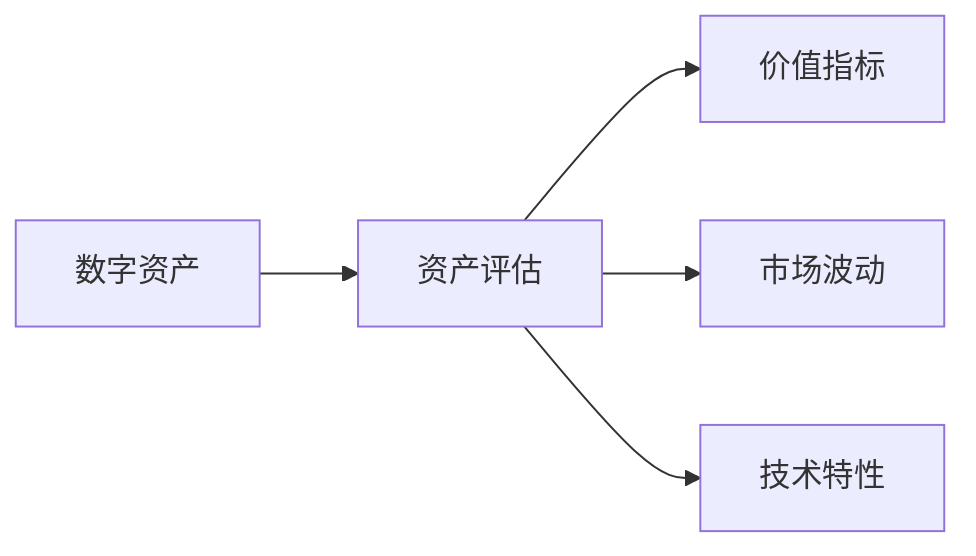
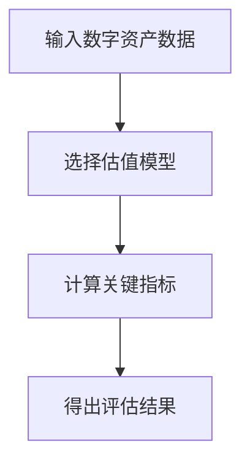
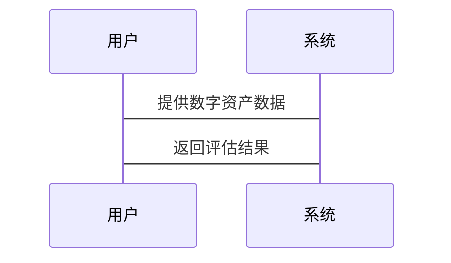

                 


---

# 股市估值在跨境数字资产评估中的应用

> 关键词：数字资产评估、股市估值、跨境资产、金融模型、风险管理

> 摘要：本文深入探讨了股市估值方法在跨境数字资产评估中的应用，结合数字资产的特点，分析了传统估值模型的适用性与局限性，并提出了一套适用于数字资产的估值体系。通过具体案例分析，展示了如何利用股市估值的核心原理，构建数字资产的评估模型，帮助投资者更好地理解和管理跨境数字资产的风险与收益。

---

# 第一部分：数字资产评估的背景与现状

## 第1章：数字资产评估的背景与现状

### 1.1 数字资产的定义与分类

#### 1.1.1 数字资产的基本定义
数字资产是指以数字形式存在的、具有价值和可交易性的资产，主要包括加密货币（如比特币、以太坊）、数字股权、代币（Token）、NFT（非同质化代币）等。数字资产具有去中心化、不可篡改、可分割性强等特点。

#### 1.1.2 数字资产的分类与特点
数字资产可以分为以下几类：
- **加密货币**：用于价值存储和交易的数字货币，如比特币（BTC）、以太坊（ETH）。
- **代币（Token）**：基于区块链技术发行的通证，用于表示特定资产或权益。
- **NFT**：非同质化代币，用于表示独特的数字艺术品、收藏品等。
- **智能合约**：基于区块链的自动化合约，用于实现特定的商业逻辑。

数字资产的特点包括：
- **去中心化**：依赖区块链技术，不依赖传统金融机构。
- **透明性**：交易记录公开可查，但匿名性强。
- **高波动性**：价格波动剧烈，风险较高。
- **技术驱动**：依赖区块链等底层技术，技术创新驱动价值。

#### 1.1.3 数字资产与传统金融资产的对比
数字资产与传统金融资产在多个方面存在显著差异：

| 对比维度 | 数字资产 | 传统金融资产 |
|----------|----------|--------------|
| 价值支撑 | 技术创新、网络效应 | 实体资产、信用、政策 |
| 流动性   | 高 | 中高 |
| 风险性   | 高 | 中高 |
| 监管环境 | 区块链技术驱动，监管不完善 | 监管严格，体系完善 |

### 1.2 数字资产评估的必要性

#### 1.2.1 数字资产的价值来源
数字资产的价值来源于其技术特性、网络效应、应用场景和市场接受度。例如，比特币的去中心化特性使其具有抗通胀属性，而以太坊的智能合约功能则增强了其商业价值。

#### 1.2.2 数字资产评估的重要性
数字资产评估是投资者进行决策的基础，包括资产定价、风险控制、投资组合优化等。由于数字资产价格波动剧烈，准确的评估可以帮助投资者规避风险、抓住投资机会。

#### 1.2.3 数字资产评估的边界与外延
数字资产评估的边界包括技术可行性、市场接受度、监管环境等。其外延涉及跨链资产、DeFi（去中心化金融）、NFT等新兴领域。

### 1.3 股市估值的核心概念

#### 1.3.1 股市估值的基本原理
股市估值是通过分析企业的财务数据、市场环境、行业竞争等因素，对其未来价值进行预测。常用的方法包括市盈率（PE）、市净率（PB）、现金流折现模型（DCF）等。

#### 1.3.2 股市估值的关键指标
- **市盈率（PE）**：股价与每股收益的比值，反映市场对公司盈利能力的预期。
- **市净率（PB）**：股价与每股净资产的比值，反映资产价值。
- **股息率**：股息与股价的比值，反映投资回报。

#### 1.3.3 股市估值与数字资产评估的联系
数字资产与传统股票的共同点在于其价值均依赖于市场供需、技术创新和应用场景。因此，股市估值的核心原理可以为数字资产评估提供借鉴。

---

## 1.4 本章小结
本章介绍了数字资产的定义、分类及其与传统金融资产的对比，强调了数字资产评估的必要性，并初步探讨了股市估值的核心概念。这些内容为后续章节奠定了基础。

---

# 第二部分：数字资产评估的核心概念与联系

## 第2章：数字资产评估的核心概念

### 2.1 数字资产评估的核心原理

#### 2.1.1 数字资产评估的理论基础
数字资产评估的理论基础包括区块链技术、博弈论、金融学等多学科知识。其中，区块链技术是数字资产存在的基础，而金融学提供了价值评估的方法论。

#### 2.1.2 数字资产评估的关键要素
数字资产评估的关键要素包括：
- **技术特性**：区块链的性能（如交易速度、安全性）、共识机制等。
- **市场需求**：市场参与者数量、交易活跃度等。
- **应用场景**：数字资产是否具有实际应用场景。

### 2.2 核心概念对比分析

#### 2.2.1 数字资产与传统资产的对比表格
以下是数字资产与传统资产的对比：

| 对比维度 | 数字资产 | 传统资产 |
|----------|----------|----------|
| 所有权   | 可分割、可转让 | 不可分割、可转让 |
| 交易效率 | 高 | 低 |
| 中介机构 | 无（去中心化） | 有（银行、交易所） |
| 政策监管 | 区块链技术驱动，监管不完善 | 监管严格，体系完善 |

#### 2.2.2 数字资产评估与传统资产评估的对比表格
以下是数字资产评估与传统资产评估的对比：

| 对比维度 | 数字资产评估 | 传统资产评估 |
|----------|--------------|--------------|
| 评估依据 | 技术特性、市场供需 | 财务数据、行业地位 |
| 评估方法 | 市盈率、市净率、现金流模型 | 资产负债表、利润表 |
| 风险因素 | 市场波动、技术风险 | 经济周期、行业风险 |

### 2.3 实体关系图（ER图）



### 2.4 本章小结
本章通过对比分析，明确了数字资产与传统资产的差异，以及数字资产评估的关键要素和核心原理。

---

# 第三部分：数字资产评估的算法原理

## 第3章：数字资产评估的算法原理

### 3.1 常用估值模型概述

#### 3.1.1 市盈率（PE）模型
市盈率模型通过比较股票的市盈率与行业平均水平，判断其估值是否合理。公式如下：
$$ PE = \frac{\text{股价}}{\text{每股收益}} $$

#### 3.1.2 市净率（PB）模型
市净率模型通过比较股票的市净率与行业平均水平，判断其估值是否合理。公式如下：
$$ PB = \frac{\text{股价}}{\text{每股净资产}} $$

#### 3.1.3 现金流折现模型（DCF）
现金流折现模型通过将未来现金流折现，计算资产的内在价值。公式如下：
$$ V = \sum_{t=1}^{n} \frac{CF_t}{(1 + r)^t} $$

### 3.2 算法流程图



### 3.3 Python实现示例

#### 3.3.1 PE模型实现

```python
def calculate_pe_ratio(price, earnings):
    return price / earnings

# 示例数据
price = 100
earnings = 10
print("PE Ratio:", calculate_pe_ratio(price, earnings))
```

#### 3.3.2 PB模型实现

```python
def calculate_pb_ratio(price, book_value):
    return price / book_value

# 示例数据
price = 200
book_value = 50
print("PB Ratio:", calculate_pb_ratio(price, book_value))
```

#### 3.3.3 DCF模型实现

```python
def calculate_dcf(cash_flows, discount_rate):
    return sum(cash_flow / (1 + discount_rate) ** t for t, cash_flow in enumerate(cash_flows))

# 示例数据
cash_flows = [100, 200, 300]
discount_rate = 0.1
print("DCF Value:", calculate_dcf(cash_flows, discount_rate))
```

### 3.4 本章小结
本章介绍了数字资产评估中常用的PE、PB、DCF模型，并通过Python代码展示了这些模型的实现方法。这些模型为数字资产评估提供了理论基础和实践指导。

---

# 第四部分：数字资产评估的系统架构设计

## 第4章：数字资产评估的系统架构设计

### 4.1 问题场景介绍
在跨境数字资产评估中，投资者需要考虑的因素包括市场波动、政策风险、技术可行性等。因此，构建一个智能化的数字资产评估系统至关重要。

### 4.2 系统功能设计

#### 4.2.1 领域模型设计


#### 4.2.2 系统架构设计


#### 4.2.3 系统接口设计
- 输入接口：数字资产价格、财务数据、市场数据。
- 输出接口：评估结果、风险提示、投资建议。

#### 4.2.4 系统交互设计


### 4.3 本章小结
本章通过系统架构设计，展示了数字资产评估系统的整体框架，包括功能模块、数据流和系统交互。

---

# 第五部分：数字资产评估的项目实战

## 第5章：数字资产评估的项目实战

### 5.1 环境安装与配置

#### 5.1.1 安装Python
```bash
python --version
pip install numpy pandas matplotlib
```

#### 5.1.2 安装数据获取工具
```bash
pip install requests pandas
```

### 5.2 核心代码实现

#### 5.2.1 数据获取与预处理
```python
import pandas as pd
import requests

# 获取比特币价格数据
url = "https://api.example.com/bitcoin"
data = requests.get(url).json()
df = pd.DataFrame(data)
```

#### 5.2.2 模型实现
```python
def assess_asset(price, earnings, book_value, cash_flows, discount_rate):
    pe = price / earnings
    pb = price / book_value
    dcf = sum(cash_flow / (1 + discount_rate) ** t for t, cash_flow in enumerate(cash_flows))
    return pe, pb, dcf

# 示例数据
price = 50000
earnings = 100
book_value = 200
cash_flows = [100, 200, 300]
discount_rate = 0.1

pe, pb, dcf = assess_asset(price, earnings, book_value, cash_flows, discount_rate)
print(f"PE Ratio: {pe}\nPB Ratio: {pb}\nDCF Value: {dcf}")
```

#### 5.2.3 结果分析
通过上述代码，我们可以得出比特币的PE、PB和DCF估值结果，从而判断其是否被高估或低估。

### 5.3 案例分析与解读

#### 5.3.1 案例背景
以比特币为例，假设其当前价格为50000美元，每股收益为100美元，每股净资产为200美元，未来三年现金流分别为100、200、300万美元，贴现率为10%。

#### 5.3.2 案例分析
```python
pe = 50000 / 100 = 500
pb = 50000 / 200 = 250
dcf = 100/(1.1)^1 + 200/(1.1)^2 + 300/(1.1)^3 ≈ 181.59
```

#### 5.3.3 结果解读
- PE Ratio = 500，远高于行业平均水平，表明比特币可能被高估。
- PB Ratio = 250，同样远高于行业平均水平，进一步支持高估的结论。
- DCF Value ≈ 181.59，远低于当前价格，表明比特币可能被高估。

### 5.4 本章小结
本章通过实际案例分析，展示了数字资产评估系统的应用过程，包括数据获取、模型实现和结果解读。

---

## 第6章：总结与展望

### 6.1 本章总结
本文深入探讨了股市估值在数字资产评估中的应用，结合数字资产的特点，分析了传统估值模型的适用性与局限性，并提出了一套适用于数字资产的估值体系。通过具体案例分析，展示了如何利用股市估值的核心原理，构建数字资产的评估模型。

### 6.2 未来展望
未来，数字资产评估将更加依赖人工智能和大数据技术。投资者需要关注技术创新、市场需求和政策变化，以更好地应对数字资产市场的波动性和不确定性。

---

## 作者简介
作者：AI天才研究院/AI Genius Institute  
合著者：禅与计算机程序设计艺术/Zen And The Art of Computer Programming

