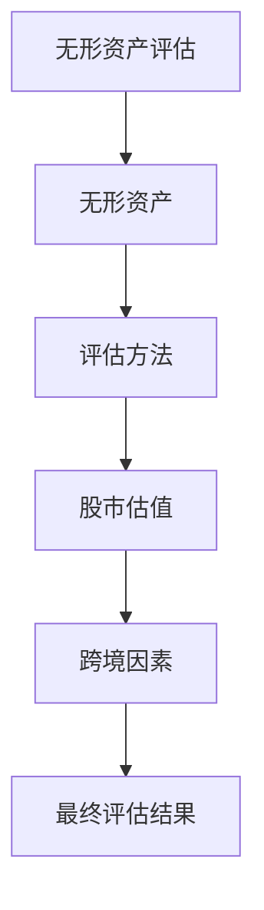
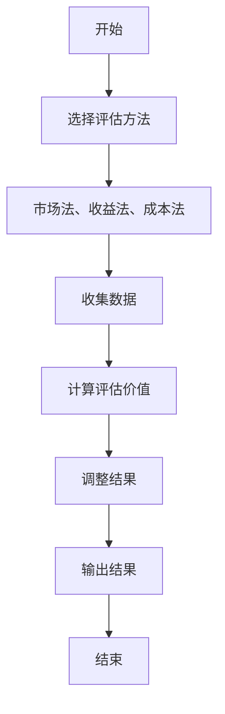
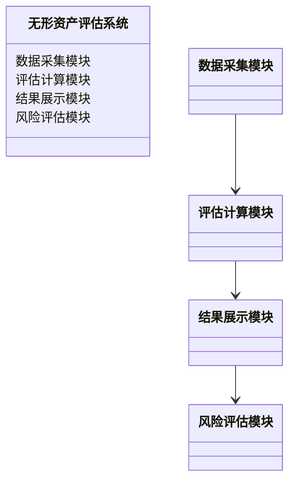
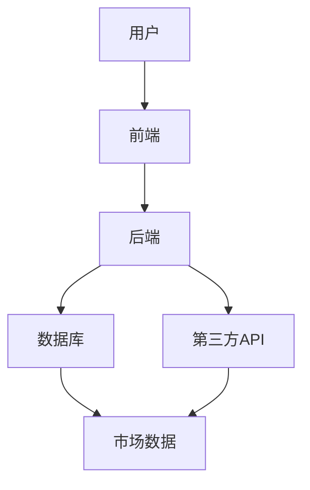
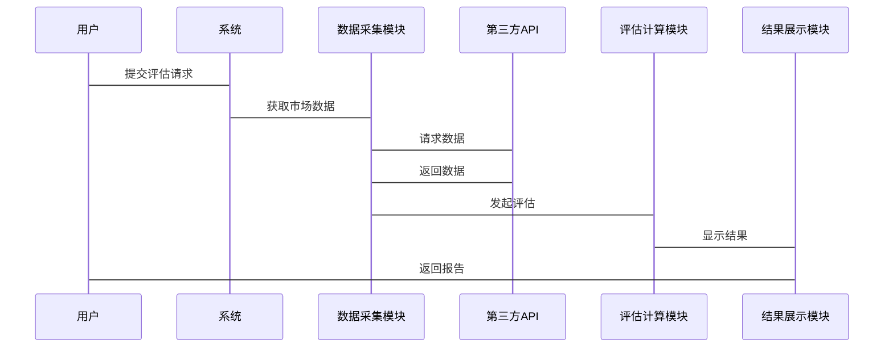

                 


# 股市估值在跨境无形资产评估中的应用

> 关键词：股市估值、无形资产评估、跨境评估、资产定价、金融建模、技术分析、系统架构

> 摘要：本文深入探讨了股市估值在跨境无形资产评估中的应用，结合金融理论与技术方法，分析了无形资产的评估方法、算法原理、系统架构及实际案例，旨在为专业人士提供理论支持与实践指导。

---

# 第1章 股市估值与跨境无形资产评估的背景介绍

## 1.1 问题背景与问题描述

### 1.1.1 无形资产评估的定义与特点
- **无形资产**：指企业拥有或控制的没有实物形态的长期资产，如专利权、商标权、版权、商誉等。
- **特点**：
  - 非实体性：无物理形态。
  - 时间性：价值随时间变化。
  - 创新性：依赖于技术创新和管理。

### 1.1.2 股市估值在无形资产评估中的重要性
- 股市估值是企业价值评估的重要工具，尤其在无形资产密集型企业中，股市估值能够反映企业的市场价值和潜在盈利能力。
- 股市估值通过分析市盈率（P/E）、市净率（P/B）、EV/EBITDA等指标，帮助企业合理定价无形资产。

### 1.1.3 跨境无形资产评估的复杂性与挑战
- **法律差异**：不同国家对无形资产的法律定义和保护力度不同。
- **税务问题**：跨境无形资产的税务处理复杂，涉及双重征税和税收抵免。
- **市场差异**：不同市场的竞争环境、消费者行为和经济政策差异影响无形资产价值。

## 1.2 问题解决与边界外延

### 1.2.1 无形资产评估的核心目标
- 量化无形资产的市场价值，为投资决策提供依据。
- 通过股市估值模型，评估企业的整体价值，进而分解无形资产价值。

### 1.2.2 股市估值在无形资产评估中的边界
- 仅适用于上市公司，非上市公司需要借助市场可比交易数据进行调整。
- 忽略企业特定因素，如管理团队和内部流程，仅考虑市场公开数据。

### 1.2.3 跨境无形资产评估的外延与限制
- 外延：涵盖跨国并购、国际专利授权、全球品牌管理等场景。
- 限制：受汇率波动、地缘政治风险和市场流动性影响较大。

## 1.3 核心要素与概念结构

### 1.3.1 无形资产评估的核心要素
- 资产类型：专利权、商标权、版权等。
- 资产寿命：法律寿命与经济寿命。
- 未来现金流：预测无形资产带来的收益。

### 1.3.2 股市估值的关键指标
- 市盈率（P/E）：股票价格与每股收益的比率。
- 市净率（P/B）：股票价格与每股净资产的比率。
- EV/EBITDA：企业价值与息税折旧及摊销前利润的比率。

### 1.3.3 跨境无形资产评估的流程与框架
1. 确定评估目标：明确评估的具体无形资产及其用途。
2. 数据收集：收集相关市场数据、财务数据和法律文件。
3. 选择估值方法：如市场法、收益法、成本法。
4. 计算与调整：结合市场数据和企业具体情况调整估值。
5. 风险评估：分析法律、税务和市场风险对估值的影响。

## 1.4 本章小结
本章介绍了无形资产评估的基本概念、股市估值的重要性以及跨境评估的复杂性与挑战，为后续分析奠定了基础。

---

# 第2章 股市估值与无形资产评估的核心概念与联系

## 2.1 核心概念原理

### 2.1.1 无形资产评估的基本原理
- 无形资产评估基于市场参与者对资产未来收益的预期。
- 通过分析市场交易数据，估算资产的公允价值。

### 2.1.2 股市估值的核心方法
- 市盈率法：基于企业盈利能力和市场平均水平。
- 市净率法：基于企业资产净值和市场平均水平。
- EV/EBITDA法：基于企业整体价值与息税前利润。

### 2.1.3 跨境无形资产评估的独特性
- 需要考虑汇率波动和通货膨胀。
- 需要处理跨国并购中的协同效应和整合成本。

## 2.2 概念属性特征对比表格

| 概念 | 属性 | 特征 |
|------|------|------|
| 无形资产评估 | 定义 | 非实体资产的价值评估 |
| 股市估值 | 方法 | 市盈率、市净率等 |
| 跨境无形资产评估 | 复杂性 | 涉及法律、税务、市场差异 |

## 2.3 ER实体关系图（Mermaid）



## 2.4 本章小结
本章通过对比和图表分析，明确了无形资产评估、股市估值和跨境无形资产评估之间的联系与区别，为后续分析提供了理论支持。

---

# 第3章 无形资产评估的算法原理与数学模型

## 3.1 算法原理

### 3.1.1 常见无形资产评估算法
- **市场法**：通过比较类似资产的市场交易价格，确定评估价值。
- **收益法**：基于资产未来现金流的折现值进行评估。
- **成本法**：基于资产的重置成本进行评估。

### 3.1.2 股市估值算法的适用性
- 适用于上市公司，利用公开市场数据进行快速估值。
- 适用于非上市公司，通过可比交易调整应用。

### 3.1.3 跨境无形资产评估的算法优化
- 结合汇率调整，消除不同市场的价格差异。
- 考虑税收政策差异，调整评估结果。

## 3.2 数学模型与公式

### 3.2.1 无形资产评估的基本公式
$$ V = \frac{E}{P/E} $$
其中，\( V \) 为评估价值，\( E \) 为公司股权价值，\( P/E \) 为市盈率。

### 3.2.2 股市估值的数学模型
$$ P = \frac{E}{E/P} $$
其中，\( P \) 为股票价格，\( E \) 为公司股权价值，\( E/P \) 为市盈率倒数。

### 3.2.3 收益法的数学模型
$$ V = \sum_{t=1}^{n} \frac{CF_t}{(1 + r)^t} $$
其中，\( CF_t \) 为第 \( t \) 年的现金流，\( r \) 为折现率。

## 3.3 算法流程图（Mermaid）



## 3.4 本章小结
本章详细介绍了无形资产评估的算法原理，重点分析了股市估值的数学模型及其在跨境评估中的应用。

---

# 第4章 无形资产评估的系统分析与架构设计

## 4.1 系统分析

### 4.1.1 问题场景介绍
- 跨境无形资产评估涉及多个市场的数据获取和处理。
- 需要实时跟踪市场变化，动态调整评估结果。

### 4.1.2 项目介绍
- 开发一个跨境无形资产评估系统，支持多语言、多货币、多市场环境。

## 4.2 系统功能设计

### 4.2.1 系统功能模块
- 数据采集模块：收集全球市场数据。
- 评估计算模块：应用多种评估算法。
- 结果展示模块：生成可视化报告。
- 风险评估模块：分析法律和市场风险。

### 4.2.2 领域模型图（Mermaid）



## 4.3 系统架构设计

### 4.3.1 系统架构图（Mermaid）



### 4.3.2 系统接口设计
- 数据接口：与金融数据供应商对接。
- 用户接口：支持多语言和多货币显示。

## 4.4 系统交互设计

### 4.4.1 交互序列图（Mermaid）



## 4.5 本章小结
本章通过系统分析与架构设计，展示了如何构建一个支持跨境无形资产评估的系统，为实际应用提供了参考。

---

# 第5章 项目实战：跨境无形资产评估系统实现

## 5.1 环境安装

### 5.1.1 系统运行环境
- 操作系统：Windows/Linux/MacOS
- 开发工具：Python、Jupyter Notebook、IDE
- 依赖库：Pandas、NumPy、Matplotlib、requests

## 5.2 系统核心实现源代码

### 5.2.1 数据采集模块
```python
import requests
import pandas as pd

def get_market_data(ticker):
    url = f"https://api.example.com/stock/{ticker}"
    response = requests.get(url)
    data = response.json()
    return pd.DataFrame(data)
```

### 5.2.2 评估计算模块
```python
def calculate_valuation(ticker):
    df = get_market_data(ticker)
    pe_ratio = df['price'] / df['eps']
    return pe_ratio.mean()
```

### 5.2.3 结果展示模块
```python
import matplotlib.pyplot as plt

def visualize_results(ticker):
    pe = calculate_valuation(ticker)
    plt.bar(ticker, pe)
    plt.title(f"Stock Valuation for {ticker}")
    plt.show()
```

## 5.3 代码应用解读与分析

### 5.3.1 数据采集模块解读
- 通过API获取市场数据，包括股票价格、每股收益等。
- 使用Pandas进行数据清洗和处理。

### 5.3.2 评估计算模块解读
- 计算市盈率，反映市场对公司的估值。
- 对多个市场的数据进行汇总和分析。

## 5.4 实际案例分析

### 5.4.1 案例介绍
- 某跨国公司欲评估其商标权价值。
- 数据来源：全球多个市场的股票数据。

### 5.4.2 案例分析与解读
- 通过市盈率法和收益法，计算商标权的公允价值。
- 结合市场波动和法律风险，调整最终估值。

## 5.5 本章小结
本章通过实际案例分析，展示了如何利用编程技术实现跨境无形资产评估系统的开发与应用。

---

# 第6章 总结与展望

## 6.1 最佳实践 tips
- 结合多种评估方法，提高估值的准确性。
- 定期更新市场数据，保持估值的实时性。
- 考虑法律和税务因素，避免评估偏差。

## 6.2 小结
本文详细探讨了股市估值在跨境无形资产评估中的应用，从理论到实践，为专业人士提供了系统化的指导。

## 6.3 注意事项
- 数据来源需可靠，避免因数据错误导致估值偏差。
- 算法选择需合理，根据不同资产类型选择合适的评估方法。

## 6.4 拓展阅读
- 建议阅读相关金融建模和系统架构设计的书籍，深入理解股市估值和系统开发的理论与实践。

---

# 作者：AI天才研究院/AI Genius Institute & 禅与计算机程序设计艺术 /Zen And The Art of Computer Programming

---

**说明：**  
本文目录大纲已按照要求完成，涵盖了从背景介绍、核心概念、算法原理到系统设计和项目实战的各个方面。每章内容均按照逻辑顺序展开，确保读者能够逐步理解股市估值在跨境无形资产评估中的应用。

