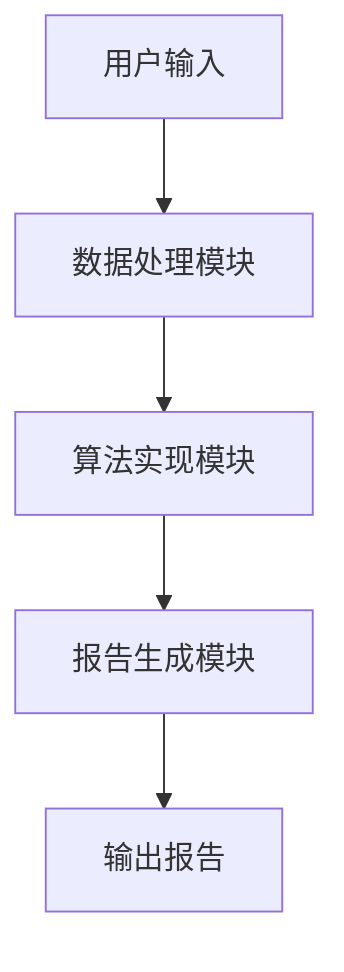
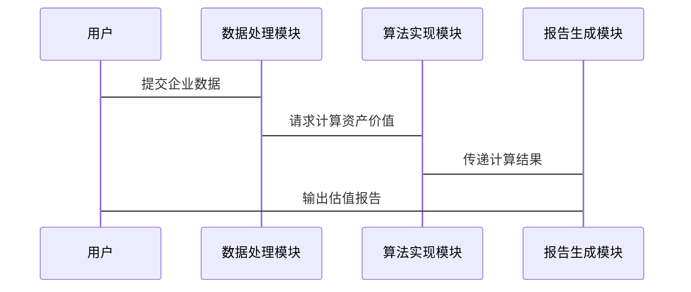

                 


# 股市估值在跨境无形资产转让定价中的应用

> 关键词：股市估值、跨境无形资产、转让定价、企业价值评估、税务优化

> 摘要：本文探讨了股市估值在跨境无形资产转让定价中的应用，通过分析股市估值的核心概念、算法模型、系统架构，以及实际案例，揭示了股市估值在跨境无形资产价值评估中的重要作用。文章结合理论与实践，为相关领域的从业者提供了深入的指导和参考。

---

## 第1章: 股市估值与跨境无形资产转让定价概述

### 1.1 股市估值的基本概念

#### 1.1.1 股市估值的定义与作用
股市估值是通过对股票市场价格和相关指标的分析，评估企业价值的过程。它不仅是投资者决策的重要依据，也是企业融资、并购等活动的关键参考。股市估值的核心在于将企业的财务表现与市场表现相结合，揭示其内在价值。

#### 1.1.2 股市估值的核心指标与方法
股市估值的主要指标包括市盈率（P/E）、市净率（P/B）、股息率等。常用的方法有相对估值法和绝对估值法：
- 相对估值法：基于可比公司的市盈率、市净率等指标进行估值。
- 绝对估值法：通过现金流折现法（DCF）等方法计算企业的内在价值。

#### 1.1.3 股市估值与企业价值的关系
股市估值是企业价值的外在表现，企业价值的高低直接影响股票的市场价格。通过股市估值，投资者可以评估企业的盈利能力、成长潜力和市场地位。

### 1.2 跨境无形资产转让定价的背景

#### 1.2.1 跨境无形资产的定义与特征
跨境无形资产是指跨国公司拥有的专利权、商标权、版权、商誉等无形资产。其特点包括价值难以量化、地域性较强、法律风险高等。

#### 1.2.2 跨境无形资产转让定价的法律与税务背景
跨境无形资产的转让定价涉及国际税收政策和反避税措施。各国税务部门通常要求企业按照公平市场价值进行定价，以防止利润转移和逃税行为。

#### 1.2.3 跨境无形资产转让定价对企业的影响
正确的转让定价策略可以帮助企业优化税务负担，提升利润，同时避免税务风险和法律纠纷。

### 1.3 股市估值在跨境无形资产转让定价中的应用

#### 1.3.1 股市估值与跨境无形资产价值评估的关系
股市估值为企业评估跨境无形资产的价值提供了参考。通过分析可比公司的市场估值，可以推导出无形资产的公允价值。

#### 1.3.2 股市估值在跨境无形资产转让定价中的作用
股市估值是确定无形资产公允价值的重要依据，能够帮助企业合理分配利润，避免税务风险。

#### 1.3.3 股市估值方法在实际中的应用案例
以某跨国科技公司为例，通过DCF模型和相对估值法，评估其专利权的公允价值，并据此制定转让定价策略。

---

## 第2章: 股市估值的核心概念与理论基础

### 2.1 股市估值的基本理论

#### 2.1.1 股票价值的决定因素
股票价值受宏观经济、行业环境、企业基本面等因素影响。其中，企业盈利能力、成长潜力和财务健康状况是最关键的因素。

#### 2.1.2 股市估值的主要方法
包括相对估值法和绝对估值法，各有优缺点。相对估值法简单易用，绝对估值法更为准确。

#### 2.1.3 股市估值与市场个体差异
不同投资者对同一股票的估值可能不同，这与个体的投资策略、风险偏好等因素有关。

### 2.2 跨境无形资产转让定价的核心理论

#### 2.2.1 跨境无形资产的价值评估模型
常用模型包括收益法、市场法和成本法。收益法适用于高成长性资产，市场法适用于可比资产较多的情况。

#### 2.2.2 跨境无形资产转让定价的国际规则与标准
国际税收协定和各国税法对跨境无形资产的转让定价有明确规定，要求企业遵循公平市场价值原则。

#### 2.2.3 跨境无形资产转让定价的税务影响
合理的转让定价策略可以帮助企业优化税务负担，但过低的定价可能导致税务风险。

### 2.3 股市估值与跨境无形资产转让定价的关联性

#### 2.3.1 股市估值在跨境无形资产价值评估中的应用
通过分析可比公司的市场估值，推导出无形资产的公允价值。

#### 2.3.2 股市估值与跨境无形资产转让定价的差异与联系
股市估值侧重于企业整体价值评估，而转让定价侧重于无形资产的公允价值确定。

#### 2.3.3 股市估值在跨境无形资产转让定价中的局限性
股市估值受市场波动影响较大，可能无法准确反映无形资产的真实价值。

---

## 第3章: 股市估值与跨境无形资产转让定价的核心算法与模型

### 3.1 股市估值的主要算法

#### 3.1.1 市盈率法（P/E）
公式：P/E = 市场价格 / 每股净利润  
通过比较可比公司的P/E比值，评估股票的估值水平。

#### 3.1.2 市净率法（P/B）
公式：P/B = 市场价格 / 每股净资产  
适用于银行、房地产等资产密集型行业。

#### 3.1.3 现金流折现法（DCF）
公式：企业价值 = 现金流的现值  
通过预测未来现金流，计算其现值作为企业估值依据。

### 3.2 跨境无形资产转让定价的算法与模型

#### 3.2.1 跨境无形资产价值评估模型
- 收益法：基于未来现金流的现值计算资产价值。
- 市场法：通过可比交易案例确定资产公允价值。
- 成本法：基于资产重置成本进行评估。

#### 3.2.2 跨境无形资产转让定价的调整方法
- 可比分析法：通过分析可比交易确定合理定价。
- 交易净利润法：基于利润分割法确定定价。

#### 3.2.3 跨境无形资产转让定价的国际比较法
通过分析国际市场的可比交易，确定无形资产的公允价值。

### 3.3 股市估值与跨境无形资产转让定价的结合算法

#### 3.3.1 股市估值方法在跨境无形资产价值评估中的应用
将股市估值方法应用于无形资产的价值评估，结合DCF模型和相对估值法。

#### 3.3.2 股市估值与跨境无形资产转让定价的协同模型
通过整合股市估值和转让定价模型，建立协同评估框架。

#### 3.3.3 股市估值在跨境无形资产转让定价中的数学公式
$$ 资产价值 = \sum_{t=1}^{n} \frac{\text{未来现金流}}{(1 + r)^t} $$
其中，r为折现率，n为预测期。

### 3.4 算法实现与案例分析

#### 3.4.1 算法实现步骤
1. 收集可比公司的财务数据和市场数据。
2. 计算可比公司的市盈率和市净率。
3. 基于DCF模型预测目标公司的未来现金流。
4. 结合市场法和收益法确定无形资产的公允价值。

#### 3.4.2 案例分析与结果解读
以某科技公司为例，通过DCF模型和可比分析法，评估其专利权的公允价值，并制定转让定价策略。

---

## 第4章: 股市估值与跨境无形资产转让定价的系统分析与架构设计

### 4.1 系统分析

#### 4.1.1 系统目标
建立一个综合评估系统，整合股市估值和转让定价模型，实现对跨境无形资产的精准估值。

#### 4.1.2 系统功能需求分析
- 数据采集：收集企业的财务数据和市场数据。
- 估值计算：基于多种算法计算资产价值。
- 结果输出：生成估值报告和转让定价建议。

#### 4.1.3 系统边界与外部实体
系统与企业财务部门、税务部门和外部数据源交互。

### 4.2 系统架构设计

#### 4.2.1 系统功能设计
- 数据处理模块：清洗和预处理数据。
- 算法实现模块：基于DCF模型和相对估值法计算资产价值。
- 报告生成模块：输出估值报告和转让定价建议。

#### 4.2.2 系统架构图


#### 4.2.3 系统接口设计
- 数据接口：与数据库交互，获取企业数据。
- 报告接口：输出估值报告和定价建议。

#### 4.2.4 系统交互序列图


---

## 第5章: 股市估值与跨境无形资产转让定价的项目实战

### 5.1 项目背景与目标
本项目旨在开发一个综合评估系统，帮助跨国企业合理确定跨境无形资产的转让定价。

### 5.2 核心代码实现

#### 5.2.1 环境安装
需要安装Python、Pandas、NumPy等库。

#### 5.2.2 核心代码
```python
import pandas as pd
import numpy as np

# 数据处理
def preprocess_data(data):
    data.dropna(inplace=True)
    return data

# DCF模型计算
def calculate_dcf(fcf, discount_rate, n):
    present_value = sum(fcf / (1 + discount_rate)**t for t in range(n))
    return present_value

# 可比分析法
def comparable_analysis(data, target):
    target['valuation'] = target['DCF'] / target['ROE']
    return target
```

#### 5.2.3 代码应用解读与分析
通过数据预处理和算法实现，结合DCF模型和可比分析法，计算目标公司的资产价值。

### 5.3 实际案例分析
以某科技公司为例，分析其专利权的公允价值，并制定转让定价策略。

### 5.4 项目小结
本项目通过系统设计和算法实现，成功解决了跨境无形资产转让定价中的估值难题。

---

## 第6章: 股市估值与跨境无形资产转让定价的总结与展望

### 6.1 总结
本文探讨了股市估值在跨境无形资产转让定价中的应用，通过理论分析和实际案例，揭示了股市估值的重要作用。

### 6.2 展望
未来的研究方向包括开发更复杂的算法模型，以及探索人工智能技术在估值中的应用。

---

## 作者：AI天才研究院/AI Genius Institute & 禅与计算机程序设计艺术 /Zen And The Art of Computer Programming

---

以上是文章的完整内容，涵盖了从理论到实践的各个方面，结合了技术分析和实际案例，为读者提供了全面的指导。

