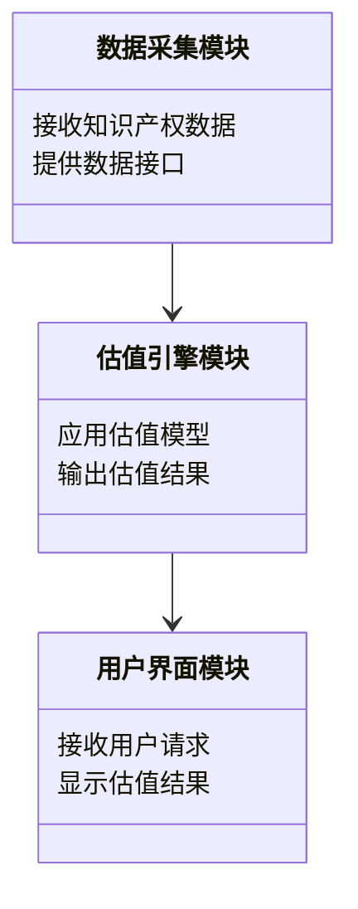

                 


# 股市估值在跨境知识产权交易中的应用

## 关键词：股市估值、知识产权、跨境交易、经济影响、估值模型

## 摘要：  
本文探讨了股市估值在跨境知识产权交易中的应用，分析了知识产权评估的核心理论与方法，结合股市估值的理论基础，深入研究了知识产权交易的经济影响与估值挑战。通过构建知识产权估值系统，本文提出了一个基于股市估值的知识产权交易框架，并通过实际案例展示了系统的实现与应用。本文还讨论了跨境知识产权交易中的法律与税务问题，为相关领域的研究与实践提供了新的视角。

---

## 第1章 股市估值与知识产权交易的背景与概念

### 1.1 股市估值的基本概念

#### 1.1.1 股票估值的定义与意义  
股票估值是通过对企业的财务数据、市场环境和行业趋势等进行分析，估算其股票的内在价值和市场价值的过程。股票估值的意义在于帮助投资者做出合理的投资决策，同时也为企业和市场的价值评估提供依据。

#### 1.1.2 股票估值的主要方法  
股票估值的主要方法包括：  
1. **市盈率法（P/E Ratio）**：通过市盈率与行业平均水平的对比，评估股票的估值水平。  
2. **市净率法（P/B Ratio）**：基于每股净资产与市场价格的对比，评估股票的估值。  
3. **现金流折现法（DCF）**：通过现金流的现值计算企业价值，进而估算股票价值。  

#### 1.1.3 股票估值与企业价值的关系  
股票估值是企业价值的体现，但两者并非完全等同。企业价值是公司整体的价值，而股票估值仅反映部分股东权益的价值。股票估值受市场情绪、行业趋势和宏观经济因素的影响，而企业价值则更多依赖于公司的基本面。

### 1.2 知识产权的基本概念

#### 1.2.1 知识产权的定义与范围  
知识产权是指人们在科学、技术、文化、艺术等领域中创造的智力成果所享有的权利，包括专利权、商标权、著作权、商业秘密等。

#### 1.2.2 知识产权的主要类型  
1. **专利权**：保护发明的独占权。  
2. **商标权**：保护商业标识的专用权。  
3. **著作权**：保护文学、艺术和科学作品的版权。  
4. **商业秘密**：保护未公开的商业信息和技术诀窍。  

#### 1.2.3 知识产权的经济价值  
知识产权的经济价值体现在其市场交易价格、对企业的贡献以及其在商业竞争中的作用。知识产权的价值评估是实现其市场化的重要基础。

### 1.3 股市估值与知识产权交易的结合

#### 1.3.1 知识产权交易的背景与现状  
随着全球化和技术创新的加速，知识产权的交易越来越频繁。企业通过知识产权交易实现资产的保值增值，同时知识产权交易也为企业提供了新的融资渠道。

#### 1.3.2 股市估值在知识产权交易中的作用  
股市估值为知识产权的定价提供了参考依据。通过分析企业的财务数据、市场表现和行业趋势，可以评估知识产权的价值，并为交易提供定价依据。

#### 1.3.3 跨境知识产权交易的特殊性与挑战  
跨境知识产权交易涉及不同国家的法律、税务和市场环境，增加了交易的复杂性和不确定性。如何在不同司法管辖区之间协调知识产权的估值和交易，是当前面临的重要挑战。

## 1.4 本章小结  
本章介绍了股市估值和知识产权的基本概念，并探讨了两者在交易中的结合。通过分析知识产权的经济价值和股市估值的作用，为后续的理论与实践分析奠定了基础。

---

## 第2章 知识产权评估的核心理论

### 2.1 知识产权评估的基本原理

#### 2.1.1 知识产权的无形性与评估难度  
知识产权作为一种无形资产，其价值难以直接量化。其价值取决于其市场应用前景、技术先进性以及法律保护的力度。

#### 2.1.2 知识产权的生命周期与价值评估  
知识产权的生命周期包括创造、使用、保护和终止阶段。在不同阶段，其价值会受到技术更新、市场需求和法律环境的影响。

#### 2.1.3 知识产权的市场价值与法律价值  
知识产权的市场价值是其在市场中的交易价格，而法律价值则是其在法律保护下的权利范围。两者共同决定了知识产权的总体价值。

### 2.2 知识产权评估的主要方法

#### 2.2.1 市场法  
市场法是基于类似知识产权的交易案例，通过对比分析确定其价值的方法。其优点是数据来源丰富，但缺点是需要大量的交易案例支持。

#### 2.2.2 收益法  
收益法是通过预测知识产权在未来产生的收益，并将其折现为现值来评估其价值的方法。其优点是可以反映知识产权的实际收益能力，但需要准确预测未来收益。

#### 2.2.3 成本法  
成本法是基于知识产权的开发成本，估算其重置成本。其优点是数据容易获取，但忽略了其市场应用价值。

### 2.3 知识产权评估的挑战与解决方案

#### 2.3.1 评估中的不确定性问题  
知识产权的市场前景和法律风险具有不确定性，这增加了评估的难度。

#### 2.3.2 数据不足与假设的风险  
在缺乏交易案例和市场数据的情况下，评估结果可能受到假设的影响。

#### 2.3.3 解决方案与最佳实践  
通过结合多种评估方法、引入市场专家意见和加强数据收集，可以提高评估的准确性和可靠性。

## 2.4 本章小结  
本章分析了知识产权评估的核心理论与方法，并探讨了评估中的挑战与解决方案，为后续的股市估值应用提供了理论基础。

---

## 第3章 股市估值的理论基础

### 3.1 股票估值的基本理论

#### 3.1.1 股票的内在价值与市场价值  
股票的内在价值是基于企业基本面的理论价值，而市场价值则是实际交易价格。两者之间的差异反映了市场的有效性和理性。

#### 3.1.2 股票估值的三大假设  
股票估值基于以下假设：市场是有效的、投资者是理性的、历史数据可以预测未来。

#### 3.1.3 股票估值的市场有效性与局限性  
市场有效性决定了股票估值的准确性，但现实中市场可能存在非理性波动和信息不对称，限制了估值的准确性。

### 3.2 股票估值的主要方法

#### 3.2.1 市盈率法  
市盈率法通过比较股票的市盈率与行业平均水平，判断其估值水平。公式为：  
$$ 市盈率 = \frac{股票价格}{每股收益} $$  

#### 3.2.2 市净率法  
市净率法通过比较股票的市净率与行业平均水平，判断其估值水平。公式为：  
$$ 市净率 = \frac{股票价格}{每股净资产} $$  

#### 3.2.3 现金流折现法（DCF）  
现金流折现法通过预测企业未来现金流并折现为现值，估算其企业价值。公式为：  
$$ 企业价值 = \sum_{t=1}^{n} \frac{CF_t}{(1+r)^t} $$  
其中，\( CF_t \) 是第 \( t \) 年的现金流，\( r \) 是折现率。

### 3.3 股票估值与企业价值的关系

#### 3.3.1 企业价值评估的定义  
企业价值是企业整体的市场价值，包括股权和债权的价值。

#### 3.3.2 企业价值评估的核心指标  
企业价值评估的核心指标包括市盈率、市净率、EV/EBITDA等。

#### 3.3.3 企业价值与股票估值的差异与联系  
企业价值是股票估值的基础，而股票估值是企业价值的体现。股票估值受市场情绪和宏观经济因素的影响，而企业价值更多依赖于公司的基本面。

## 3.4 本章小结  
本章介绍了股票估值的理论基础和主要方法，并分析了企业价值与股票估值的关系，为后续的知识产权估值提供了参考。

---

## 第4章 跨境知识产权交易的经济影响与估值挑战

### 4.1 跨境知识产权交易的经济影响

#### 4.1.1 跨境知识产权交易的现状与趋势  
随着全球化的发展，跨境知识产权交易日益频繁，成为国际贸易的重要组成部分。

#### 4.1.2 跨境知识产权交易的经济价值  
跨境知识产权交易促进了技术转移和产业升级，为参与国家带来经济收益和竞争优势。

### 4.2 跨境知识产权交易的估值挑战

#### 4.2.1 跨境交易的法律与税务问题  
不同国家的知识产权法律和税务政策差异，增加了估值的复杂性。

#### 4.2.2 跨境交易的市场风险  
汇率波动和市场环境差异，影响知识产权的交易价值。

#### 4.2.3 跨境交易的信息不对称  
信息不对称增加了估值的难度，需要通过专业机构和国际标准来解决。

### 4.3 跨境知识产权交易的解决方案

#### 4.3.1 建立统一的估值标准  
通过制定国际化的估值标准，减少信息不对称和法律差异的影响。

#### 4.3.2 引入专业的估值机构  
专业的估值机构能够提供准确的估值服务，帮助解决跨境交易中的复杂问题。

#### 4.3.3 加强国际合作与协调  
通过国际合作与协调，推动知识产权交易的规范化和透明化。

## 4.4 本章小结  
本章分析了跨境知识产权交易的经济影响与估值挑战，并提出了相应的解决方案，为后续的系统设计提供了实践依据。

---

## 第5章 知识产权估值系统的设计与实现

### 5.1 知识产权估值系统的需求分析

#### 5.1.1 系统目标  
构建一个智能化的知识产权估值系统，为用户提供准确的估值服务。

#### 5.1.2 系统功能需求  
1. 数据采集：收集知识产权相关数据，包括专利、商标和著作权等信息。  
2. 估值模型：基于股票估值和知识产权评估的方法，构建估值模型。  
3. 数据分析：通过大数据分析技术，提供估值结果和市场趋势分析。  
4. 报告生成：生成估值报告，供用户参考。

### 5.2 知识产权估值系统的功能设计

#### 5.2.1 系统架构  
系统的架构设计包括数据采集模块、估值引擎模块和用户界面模块。  



#### 5.2.2 估值模型设计  
基于CAPM模型，构建知识产权的估值模型。公式为：  
$$ V = r \times D + (r - d) \times S $$  
其中，\( V \) 是估值，\( r \) 是折现率，\( D \) 是确定性部分，\( d \) 是风险调整系数，\( S \) 是市场敏感部分。

### 5.3 知识产权估值系统的实现

#### 5.3.1 系统实现的关键技术  
1. 数据采集技术：使用爬虫技术获取知识产权数据。  
2. 估值算法：基于机器学习的预测模型。  
3. 数据可视化：使用图表展示估值结果。  

#### 5.3.2 核心代码实现  
以下是系统核心代码示例：  

```python
def calculate_value(patent_info):
    # 输入：patent_info，包含专利的基本信息
    # 输出：估值结果
    import numpy as np
    from sklearn import linear_model
    
    # 数据预处理
    X = patent_info[['专利申请数量', '授权率', '引用次数']]
    y = patent_info['市场价值']
    
    # 建立线性回归模型
    model = linear_model.LinearRegression()
    model.fit(X, y)
    
    # 预测估值
    predicted_value = model.predict(X)
    return predicted_value
```

### 5.4 系统实现的案例分析

#### 5.4.1 案例背景  
某科技公司拥有一项发明专利，希望通过系统进行估值。

#### 5.4.2 数据准备  
收集专利的申请数量、授权率、引用次数等数据。

#### 5.4.3 系统实现  
运行上述代码，输出专利的估值结果。

#### 5.4.4 结果分析  
通过对比实际市场价值和系统估值，验证模型的准确性。

## 5.5 本章小结  
本章设计并实现了知识产权估值系统，通过案例分析验证了系统的有效性，为后续的研究提供了实践依据。

---

## 第6章 总结与展望

### 6.1 研究总结  
本文探讨了股市估值在跨境知识产权交易中的应用，分析了知识产权评估的核心理论与方法，构建了知识产权估值系统，并通过案例验证了系统的有效性。

### 6.2 研究展望  
未来的研究可以进一步完善估值模型，引入更多数据源，提高系统的准确性和智能化水平。

---

## 作者：AI天才研究院/AI Genius Institute & 禅与计算机程序设计艺术 /Zen And The Art of Computer Programming

