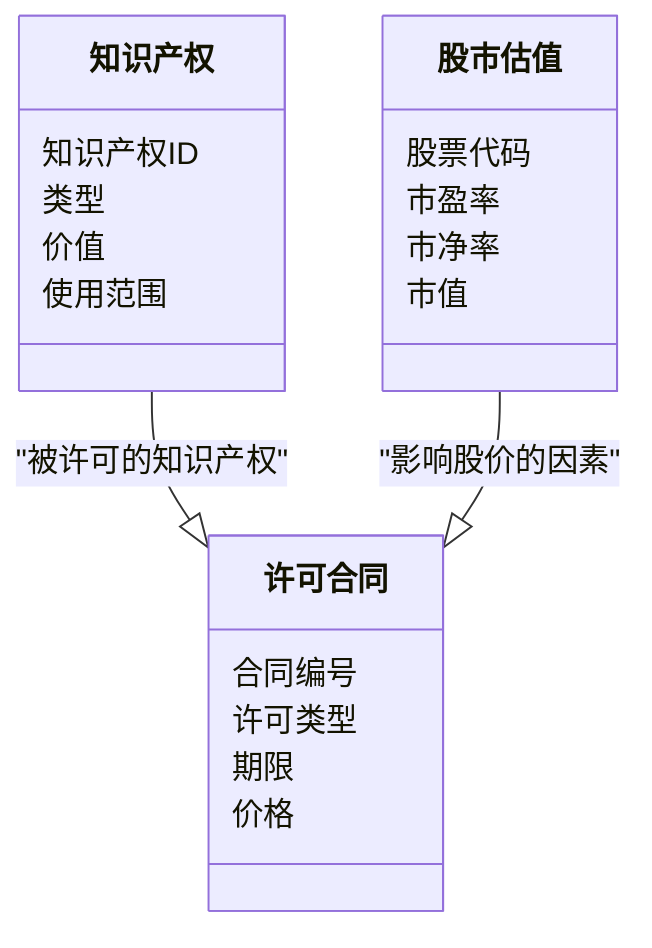
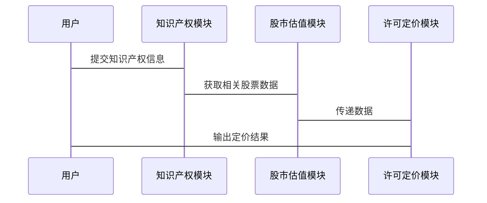

                 


```markdown
# 股市估值在跨境知识产权许可定价中的应用

> 关键词：股市估值, 知识产权许可定价, 跨境交易, 股市分析, 知识产权价值, 股市模型, 许可定价

> 摘要：本文探讨了股市估值在跨境知识产权许可定价中的应用，结合知识产权许可定价的核心概念与股市估值的基本原理，分析了两者的关联性，提出了基于股市估值的知识产权许可定价模型，并通过实际案例展示了该模型的应用过程。文章还详细阐述了算法原理、系统架构设计以及项目实战，最后总结了最佳实践和注意事项。

---

## 第一部分：背景介绍

### 第1章：知识产权许可定价的背景

#### 1.1 知识产权的基本概念
- 1.1.1 知识产权的定义
- 1.1.2 知识产权的类型
- 1.1.3 知识产权的保护与利用

#### 1.2 知识产权许可的基本模式
- 1.2.1 许可使用费的计算
- 1.2.2 许可合同的签订与执行
- 1.2.3 许可定价的影响因素

#### 1.3 知识产权许可定价的重要性
- 1.3.1 定价对企业的财务影响
- 1.3.2 定价对市场竞争的影响
- 1.3.3 定价对创新激励的作用

### 第2章：股市估值的基本原理

#### 2.1 股市估值的核心概念
- 2.1.1 股市估值的定义
- 2.1.2 股市估值的主要方法
- 2.1.3 股市估值与企业价值的关系

#### 2.2 股市估值的主要方法
- 2.2.1 市盈率法
- 2.2.2 市净率法
- 2.2.3 现金流折现法

#### 2.3 股市估值与知识产权许可的联系
- 2.3.1 知识产权价值的市场化评估
- 2.3.2 股市中的知识产权定价案例
- 2.3.3 股市估值对许可定价的启示

### 第3章：跨境知识产权许可定价的特殊性

#### 3.1 跨境交易的复杂性
- 3.1.1 不同国家的法律差异
- 3.1.2 文化与市场环境的影响
- 3.1.3 跨境许可定价中的汇率风险

#### 3.2 知识产权许可定价的边界与外延
- 3.2.1 定价的边界条件
- 3.2.2 定价的外延影响
- 3.2.3 定价与创新的关系

#### 3.3 知识产权许可定价的核心要素
- 3.3.1 价值评估
- 3.3.2 市场需求
- 3.3.3 合同条款

---

## 第二部分：核心概念与联系

### 第4章：知识产权许可定价的核心概念

#### 4.1 知识产权许可定价的原理
- 4.1.1 价值构成
- 4.1.2 影响因素
- 4.1.3 定价模型

#### 4.2 核心概念的ER实体关系图
```mermaid
er
    entity 知识产权 {
        key 知识产权ID
        attribute 类型, 价值, 使用范围
    }
    entity 股市估值 {
        key 股票代码
        attribute 市盈率, 市净率, 市值
    }
    entity 许可合同 {
        key 合同编号
        attribute 许可类型, 期限, 价格
    }
    知识产权 -- 许可合同: "被许可的知识产权"
    股市估值 -- 许可合同: "影响股价的因素"
```

### 第5章：知识产权与股市估值的关联

#### 5.1 知识产权价值的市场化评估
- 5.1.1 市场需求分析
- 5.1.2 竞争分析
- 5.1.3 技术评估

#### 5.2 股市中的知识产权定价案例
- 5.2.1 知识产权对公司市值的影响
- 5.2.2 股价波动与知识产权新闻的关系
- 5.2.3 股市估值对知识产权价值的反馈作用

#### 5.3 股市估值对许可定价的启示
- 5.3.1 定价策略的调整
- 5.3.2 风险评估与管理
- 5.3.3 定价模型的优化

---

## 第三部分：算法原理

### 第6章：定价模型的构建

#### 6.1 数据收集与预处理
- 6.1.1 数据来源
- 6.1.2 数据清洗
- 6.1.3 数据特征提取

#### 6.2 模型选择与训练
- 6.2.1 机器学习模型的选择
- 6.2.2 回归分析的应用
- 6.2.3 神经网络模型的构建

#### 6.3 模型验证与优化
- 6.3.1 交叉验证
- 6.3.2 模型调参
- 6.3.3 性能评估

### 第7章：定价模型的数学公式

#### 7.1 线性回归模型
$$ y = \beta_0 + \beta_1x_1 + \beta_2x_2 + \ldots + \beta_nx_n $$

#### 7.2 机器学习模型
$$ y = f(x) $$

#### 7.3 模型解释
- 7.3.1 系数解释
- 7.3.2 模型适用性
- 7.3.3 模型局限性

---

## 第四部分：系统分析与架构设计

### 第8章：系统功能设计

#### 8.1 领域模型设计


#### 8.2 系统架构设计


#### 8.3 系统接口设计
- 8.3.1 数据接口
- 8.3.2 模型接口
- 8.3.3 用户接口

#### 8.4 系统交互设计


---

## 第五部分：项目实战

### 第9章：环境安装与配置

#### 9.1 开发环境
- 9.1.1 Python版本要求
- 9.1.2 依赖库安装
- 9.1.3 数据源配置

### 第10章：核心实现与代码解读

#### 10.1 数据预处理代码
```python
import pandas as pd
data = pd.read_csv('input.csv')
```

#### 10.2 模型训练代码
```python
from sklearn.linear_model import LinearRegression
model = LinearRegression()
model.fit(X, y)
```

#### 10.3 模型应用代码
```python
predictions = model.predict(new_X)
```

### 第11章：案例分析与结果解读

#### 11.1 案例背景
- 11.1.1 案例公司简介
- 11.1.2 案例目标
- 11.1.3 案例数据

#### 11.2 案例分析
- 11.2.1 数据分析
- 11.2.2 模型应用
- 11.2.3 结果解读

### 第12章：项目小结

#### 12.1 成功经验总结
- 12.1.1 模型选择的正确性
- 12.1.2 数据处理的有效性
- 12.1.3 结果解释的清晰性

#### 12.2 改进建议
- 12.2.1 模型优化方向
- 12.2.2 数据来源的扩展
- 12.2.3 系统功能的完善

---

## 第六部分：最佳实践与总结

### 第13章：最佳实践

#### 13.1 小结
- 13.1.1 核心观点总结
- 13.1.2 实践经验分享
- 13.1.3 未来研究方向

#### 13.2 注意事项
- 13.2.1 模型选择的合理性
- 13.2.2 数据质量的重要性
- 13.2.3 系统安全的保障

#### 13.3 拓展阅读
- 13.3.1 相关书籍推荐
- 13.3.2 学术论文推荐
- 13.3.3 行业报告推荐

---

## 作者信息

作者：AI天才研究院/AI Genius Institute & 禅与计算机程序设计艺术/Zen And The Art of Computer Programming

---

# THE END
```

