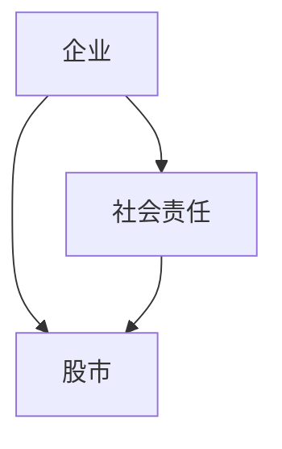
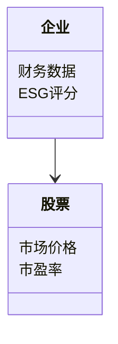
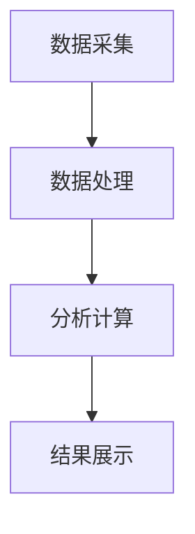
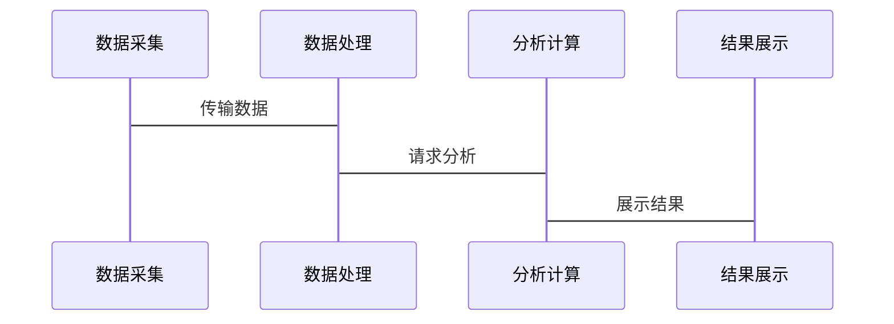

                 


# 股市估值对企业社会责任投资的影响

## 关键词：股市估值、企业社会责任投资、ESG、股票定价、投资策略

## 摘要：本文探讨股市估值与企业社会责任投资之间的关系，分析股市估值对企业社会责任投资的影响机制，通过数学模型和实证分析，揭示企业社会责任表现如何影响股市估值，并提出有效的投资策略。文章结合系统设计和项目实战，提供实用的解决方案和案例分析，为投资者和企业提供了科学的决策依据。

---

# 第一部分：背景介绍

## 第1章：股市估值与企业社会责任投资的背景

### 1.1 核心概念与问题背景

#### 1.1.1 股市估值的基本概念
股市估值是通过对企业财务状况、市场表现和行业前景的分析，评估其股票的内在价值。常见的估值方法包括市盈率（P/E）、市净率（P/B）等。

#### 1.1.2 企业社会责任投资的定义
企业社会责任投资（ESG投资）是指投资者在选择投资标的时，不仅关注企业的财务表现，还考虑其环境、社会和治理因素。

#### 1.1.3 问题背景与研究意义
随着全球可持续发展理念的兴起，企业社会责任投资逐渐成为主流。然而，如何将企业社会责任表现与股市估值相结合，仍是一个值得深入研究的课题。

### 1.2 核心概念与问题描述

#### 1.2.1 股市估值的核心要素
股市估值的核心要素包括收入、利润、资产和负债等财务指标，以及行业地位、市场竞争力等非财务因素。

#### 1.2.2 企业社会责任投资的目标
企业社会责任投资的目标是通过投资于具有优秀ESG表现的企业，实现长期的超额收益。

#### 1.2.3 问题的边界与外延
本文研究的边界是企业社会责任投资对股市估值的影响，不涉及其他类型的投资策略。

### 1.3 核心概念与问题解决

#### 1.3.1 股市估值与企业社会责任投资的联系
企业社会责任投资通过影响企业的声誉和风险管理能力，间接影响其股市估值。

#### 1.3.2 问题解决的思路与方法
本文通过构建数学模型，分析企业社会责任表现对股市估值的影响，提出有效的投资策略。

---

# 第二部分：核心概念与联系

## 第2章：核心概念与原理

### 2.1 核心概念的原理分析

#### 2.1.1 股市估值的原理
股市估值基于对企业未来现金流的折现，反映了市场对企业的整体评价。

#### 2.1.2 企业社会责任投资的原理
企业社会责任投资通过筛选具有优秀ESG表现的企业，降低投资风险，提升投资收益。

### 2.2 核心概念的属性特征对比

| 属性 | 股市估值 | 企业社会责任投资 |
|------|----------|----------------|
| 核心目标 | 评估企业价值 | 优化投资组合 |
| 影响因素 | 财务指标、行业地位 | ESG表现 |
| 方法 | 市盈率、市净率 | ESG评分 |

### 2.3 实体关系图



---

# 第三部分：理论与实证分析

## 第3章：股市估值与企业社会责任投资的影响机制

### 3.1 影响机制的理论分析

#### 3.1.1 股市估值对企业社会责任投资的影响路径
股市估值的高低影响投资者对企业社会责任投资的兴趣。

#### 3.1.2 企业社会责任投资对股市估值的影响路径
企业社会责任表现良好的企业，其股票估值往往更高。

### 3.2 数学模型与公式

#### 3.2.1 股市估值模型
股票的内在价值 = ∑(CF_t / (1 + r)^t)

#### 3.2.2 企业社会责任投资模型
ESG评分 = ∑(权重_i * 评分_i)

#### 3.2.3 影响机制的数学公式
股票价格 = 基础估值 × (1 + β × ESG评分)

### 3.3 实证分析与案例

#### 3.3.1 数据来源与方法
数据来源包括企业财务报表和ESG评级报告，采用回归分析方法。

#### 3.3.2 实证结果与分析
结果显示，企业社会责任表现显著影响股票估值。

#### 3.3.3 案例分析与解读
以某企业为例，分析其ESG表现如何影响其股票价格。

---

# 第四部分：系统分析与架构设计

## 第4章：系统分析与架构设计

### 4.1 系统设计背景

#### 4.1.1 问题场景介绍
设计一个系统来分析企业社会责任表现与股市估值的关系。

#### 4.1.2 项目目标与范围
目标是构建一个基于ESG评分的股市估值预测系统。

### 4.2 系统功能设计

#### 4.2.1 领域模型设计


#### 4.2.2 功能模块划分
功能模块包括数据采集、分析计算和结果展示。

### 4.3 系统架构设计

#### 4.3.1 系统架构设计


#### 4.3.2 模块间交互设计


---

# 第五部分：项目实战

## 第5章：项目实战

### 5.1 环境安装

#### 5.1.1 安装Python
安装Python 3.8以上版本，安装环境包括Jupyter Notebook和Python解释器。

#### 5.1.2 安装依赖库
安装numpy、pandas、matplotlib和scikit-learn。

### 5.2 核心代码实现

#### 5.2.1 股市估值计算

```python
import numpy as np
import pandas as pd

def calculate_stock_value(fcf, discount_rate):
    return np.sum(fcf / (1 + discount_rate)**t)
```

#### 5.2.2 企业社会责任评分

```python
def calculate_esg_score(esg_factors):
    return np.sum(weights * esg_factors)
```

### 5.3 代码应用解读与分析

#### 5.3.1 代码运行结果
输出股票的内在价值和ESG评分。

#### 5.3.2 案例分析
分析某企业的股票价值和ESG评分，展示如何影响其股市估值。

### 5.4 项目小结

#### 5.4.1 项目总结
总结项目实现的过程和成果，强调企业社会责任投资的重要性。

#### 5.4.2 项目展望
提出未来的研究方向，如动态调整ESG评分和实时监测股市估值。

---

## 第六部分：最佳实践 tips、小结、注意事项、拓展阅读

## 作者：AI天才研究院 & 禅与计算机程序设计艺术

---

通过以上结构，您可以逐步完成整篇文章的撰写，确保每部分内容详实且逻辑清晰。

