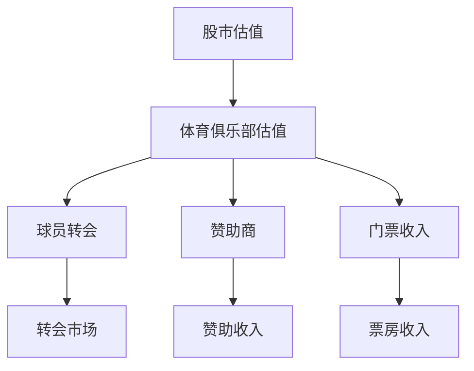
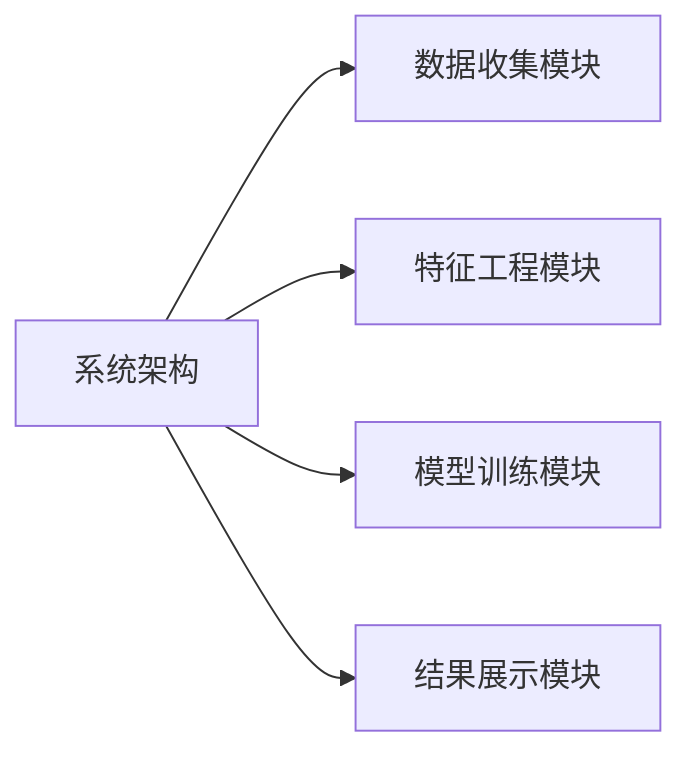

                 


```markdown
# 股市估值对国际体育俱乐部估值的影响

## 关键词：股市估值、国际体育俱乐部、俱乐部估值、金融模型、体育经济、时间序列分析

## 摘要：本文探讨股市估值对国际体育俱乐部估值的影响，分析两者之间的关联性，建立数学模型，提供案例分析和系统设计。

---

# 第一部分: 股市估值与国际体育俱乐部估值的背景介绍

## 第1章: 核心概念与问题背景

### 1.1 股市估值的基本概念
- 股市估值是通过分析公司财务数据和市场因素，对股票价值进行评估。
- 核心指标包括市盈率（P/E）、市净率（P/B）和股息率等。
- 受宏观经济、行业趋势和公司业绩等因素影响。

### 1.2 国际体育俱乐部估值的基本概念
- 体育俱乐部估值考虑转会价值、赞助收入和球员市场价值。
- 核心指标包括转会收入、门票收入和品牌价值等。
- 受明星球员转会、赛事成绩和市场热度影响。

### 1.3 股市估值与体育俱乐部估值的关联性
- 股市波动影响俱乐部的融资能力，进而影响其估值。
- 俱乐部的市场表现可能影响相关股票的表现。
- 建立两者之间的数学模型，分析其相互作用。

---

## 第2章: 核心概念与联系

### 2.1 股市估值与体育俱乐部估值的核心原理
- 股市估值基于未来现金流的折现，反映市场对公司未来表现的预期。
- 体育俱乐部估值基于球员价值和商业潜力，反映市场对俱乐部未来收入的预期。

### 2.2 核心概念属性特征对比
表2.1 股市估值与体育俱乐部估值核心概念对比：

| **指标**       | **股市估值**          | **体育俱乐部估值**         |
|-----------------|----------------------|---------------------------|
| 核心依据       | 公司财务与市场因素   | 球员价值与商业收入       |
| 主要影响因素   | 宏观经济、行业趋势   | 球员转会、赛事成绩       |
| 估值方法       | 市盈率、市净率       | 转会收入、赞助收入       |
| 计算公式       | P/E = 市价/每股收益  | 俱乐部估值 = 转会收入 + 赞助收入 |

### 2.3 ER实体关系图架构


---

## 第3章: 算法原理与数学模型

### 3.1 算法原理
- 使用时间序列分析预测股市波动对俱乐部估值的影响。
- 采用ARIMA模型进行预测，考虑滞后效应和市场情绪。

### 3.2 算法实现步骤
1. 数据收集：获取俱乐部的财务数据和相关股票的市场数据。
2. 数据预处理：清洗数据，处理缺失值。
3. 特征提取：提取关键指标，如P/E和转会收入。
4. 模型训练：训练ARIMA模型，调整参数。
5. 预测与验证：预测俱乐部估值，并验证模型准确性。

### 3.3 数学模型
建立回归模型：
$$ y = a \cdot x + b $$
其中，$y$为俱乐部估值，$x$为股市指数，$a$和$b$为回归系数。

---

## 第4章: 系统分析与架构设计

### 4.1 系统功能设计
- 数据收集模块：收集俱乐部和股市数据。
- 特征工程模块：提取关键特征。
- 模型训练模块：训练预测模型。
- 结果展示模块：可视化分析结果。

### 4.2 系统架构设计


### 4.3 系统接口设计
- 数据接口：REST API接口，用于数据输入。
- 模型接口：函数接口，用于模型调用。

---

## 第5章: 项目实战

### 5.1 实战案例
分析英超俱乐部的估值，结合股市波动，预测其估值变化。

### 5.2 核心代码
```python
# 数据收集与预处理
import pandas as pd
data = pd.read_csv('club_data.csv')
data['date'] = pd.to_datetime(data['date'])

# 特征提取
features = data[['PE', 'transfer_income']]
target = data['club_valuation']

# 模型训练
from sklearn.linear_model import LinearRegression
model = LinearRegression()
model.fit(features, target)

# 预测与验证
import numpy as np
from sklearn.metrics import r2_score
predicted = model.predict(features)
r2 = r2_score(target, predicted)
print(f"R² Score: {r2}")
```

---

## 第6章: 最佳实践与总结

### 6.1 最佳实践
- 数据质量：确保数据准确性和完整性。
- 模型优化：尝试不同模型，调整参数。
- 实时监控：定期更新模型，跟踪市场变化。

### 6.2 总结
本文分析了股市估值对国际体育俱乐部估值的影响，建立了数学模型，并提供了系统设计和实战案例。通过深入分析，揭示了两者之间的复杂关系，并为未来的研究提供了方向。

---

## 作者：AI天才研究院/AI Genius Institute & 禅与计算机程序设计艺术 /Zen And The Art of Computer Programming
```

