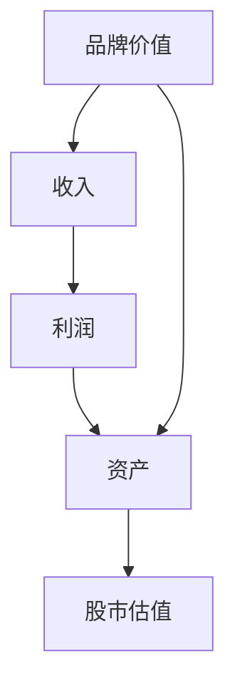
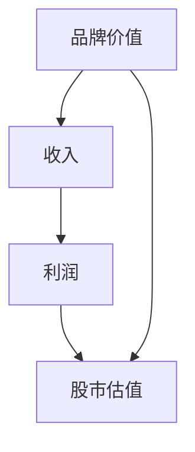
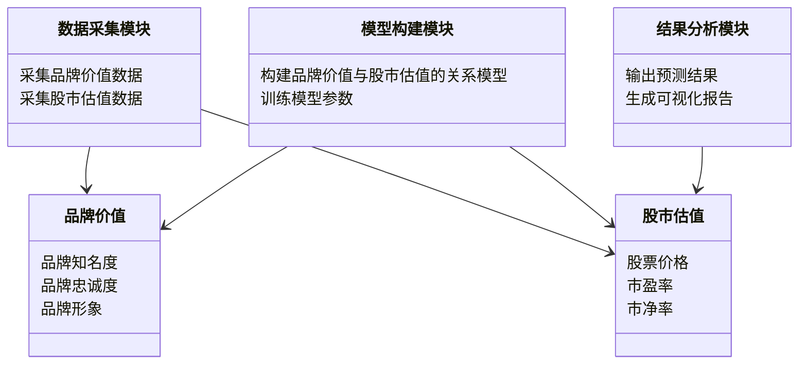
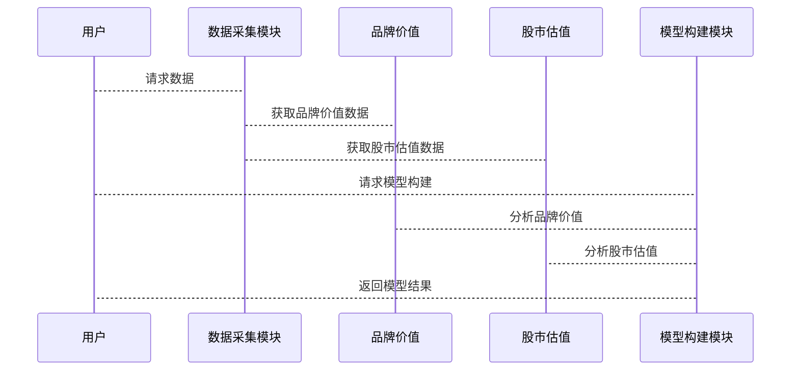

                 


# 股市估值对国际体育俱乐部品牌价值的影响

## 关键词：股市估值，品牌价值，国际体育俱乐部，体育产业，品牌与金融

## 摘要：  
本文探讨了股市估值与国际体育俱乐部品牌价值之间的关系。通过分析品牌价值的核心要素、股市估值的计算方法，以及两者之间的相互影响，本文揭示了品牌价值对股市估值的具体影响路径。结合实际案例分析和数学模型，本文提出了一个将品牌价值转化为股市估值的系统方法，为体育俱乐部的投资者和管理者提供了实用的决策支持工具。

---

## 第一部分：背景介绍

### 第1章：问题背景与核心概念

#### 1.1 问题背景

体育产业作为现代经济的重要组成部分，其商业价值正在快速崛起。国际体育俱乐部不仅是体育竞技的参与者，更是商业运作的核心载体。随着全球化和数字化的推进，体育俱乐部的品牌价值日益成为投资者关注的焦点。然而，品牌价值与股市估值之间的关系尚未被系统性地研究和量化。本文旨在探讨这一问题，揭示品牌价值对股市估值的具体影响机制。

#### 1.2 核心概念

- **品牌价值**：品牌价值是企业在市场上的无形资产，主要体现在品牌知名度、品牌忠诚度和品牌形象等方面。对于体育俱乐部而言，品牌价值不仅反映了其市场影响力，还与其商业收入密切相关。
- **股市估值**：股市估值是市场对公司的整体价值评估，通常通过股票价格、市盈率（P/E）和市净率（P/B）等指标来衡量。股市估值反映了市场对公司未来盈利能力的预期。
- **国际体育俱乐部**：本文研究的国际体育俱乐部主要指那些在全球范围内具有较高知名度和影响力的俱乐部，例如曼联、皇马、巴萨等。

#### 1.3 问题描述

本文关注以下问题：  
1. 体育俱乐部的品牌价值如何影响股市估值？  
2. 品牌价值与股市估值之间的关系在不同市场环境和俱乐部类型中是否存在差异？  
3. 如何量化品牌价值对股市估值的具体影响？

---

## 第二部分：核心概念与联系

### 第2章：品牌价值与股市估值的核心要素

#### 2.1 品牌价值的核心要素

品牌价值的构成包括以下三个方面：

1. **品牌知名度**：俱乐部在全球范围内的知名度直接影响其市场影响力和商业价值。例如，曼联的全球粉丝基础使其品牌知名度极高。
2. **品牌忠诚度**：球迷对俱乐部的忠诚度决定了其长期的商业潜力。例如，皇马的球迷基础稳定，为其品牌忠诚度提供了有力支撑。
3. **品牌形象**：俱乐部的历史、文化和社会形象也是品牌价值的重要组成部分。例如，巴萨的“美丽足球”理念提升了其品牌形象。

#### 2.2 股市估值的核心要素

股市估值的核心要素包括以下三个方面：

1. **股票价格**：股票价格是股市估值的直接体现，反映了市场对俱乐部价值的即时判断。
2. **市盈率（P/E）**：市盈率是股票价格与每股收益的比率，反映了市场对公司盈利能力的预期。
3. **市净率（P/B）**：市净率是股票价格与每股净资产的比率，反映了市场对公司资产质量的评估。

#### 2.3 品牌价值与股市估值的联系

品牌价值与股市估值之间存在双向影响：

1. 品牌价值通过提高俱乐部的收入和利润，间接影响股市估值。例如，高品牌价值的俱乐部通常能够吸引更多的赞助商和票务收入。
2. 股市估值的波动也会对俱乐部的品牌价值产生反向影响。例如，股市估值的下降可能会削弱市场对俱乐部的信心，进而影响其品牌价值。

#### 2.4 品牌价值与股市估值的对比分析

以下是品牌价值与股市估值的核心要素对比：

| **核心要素** | **品牌价值** | **股市估值** |
|--------------|--------------|--------------|
| 要素类型     | 无形资产     | 有形资产     |
| 计量方式     | 主观评估     | 市场交易     |
| 时间维度     | 长期影响     | 短期波动     |

以下是一个品牌价值与股市估值的实体关系图（使用Mermaid图）：



---

## 第三部分：影响机制与模型构建

### 第3章：品牌价值对股市估值的影响机制

#### 3.1 影响路径

1. **品牌价值通过收入增长影响股市估值**  
   高品牌价值的俱乐部通常能够吸引更多的赞助商和票务收入，从而提高公司收入。例如，曼联的高品牌价值使其能够获得更多的赞助合同，从而提高其收入水平。

2. **品牌价值通过利润增长影响股市估值**  
   品牌价值的提升能够降低俱乐部的运营成本，从而提高利润率。例如，皇马的高品牌价值使其在转会市场中更具竞争力，从而优化了其利润结构。

3. **品牌价值通过资产重估影响股市估值**  
   品牌价值的提升能够提高俱乐部的资产价值，从而影响其市净率（P/B）。例如，巴萨的高品牌价值使其在资产评估中获得更高的估值。

#### 3.2 影响强度分析

- 不同类型的俱乐部品牌价值对股市估值的影响差异：  
  例如，足球俱乐部的品牌价值对股市估值的影响通常高于篮球俱乐部，因为足球的全球受众更广泛。

- 不同市场环境下的影响差异：  
  在牛市中，品牌价值对股市估值的正向影响更为显著；在熊市中，品牌价值的负面影响可能被放大。

#### 3.3 模型构建

基于上述分析，本文构建了一个品牌价值对股市估值的影响模型。模型假设如下：

$$ V = \beta \cdot B + \epsilon $$

其中，  
- \( V \) 表示股市估值  
- \( B \) 表示品牌价值  
- \( \beta \) 表示影响系数  
- \( \epsilon \) 表示误差项  

以下是一个简化的影响路径图（使用Mermaid图）：



---

## 第四部分：系统分析与架构设计

### 第4章：系统分析与架构设计方案

#### 4.1 问题场景介绍

本文的研究场景是将品牌价值转化为股市估值的量化模型。为了实现这一目标，我们需要构建一个能够处理品牌价值和股市估值数据的系统。

#### 4.2 项目介绍

本项目旨在开发一个基于品牌价值的股市估值预测系统，帮助投资者和俱乐部管理者更好地理解品牌价值对股市估值的影响。

#### 4.3 系统功能设计

以下是系统的领域模型（使用Mermaid类图）：



#### 4.4 系统架构设计

以下是系统的架构设计（使用Mermaid架构图）：

```mermaid
archi
    1. 数据采集模块
    2. 模型构建模块
    3. 结果分析模块
    4. 用户界面
```

#### 4.5 系统接口设计

系统的接口设计包括以下内容：

1. 数据接口：与数据源（如股票交易所和品牌价值评估机构）对接。
2. 用户接口：提供用户友好的界面，方便投资者和俱乐部管理者使用。

#### 4.6 系统交互设计

以下是系统的交互设计（使用Mermaid序列图）：



---

## 第五部分：项目实战

### 第5章：项目实战与结果分析

#### 5.1 环境配置

以下是项目环境配置示例：

```bash
# 安装必要的Python库
pip install pandas numpy matplotlib seaborn
```

#### 5.2 数据采集与处理

以下是数据采集与处理的Python代码示例：

```python
import pandas as pd
import numpy as np

# 数据采集
brand_value = pd.read_csv('brand_value.csv')
stock_valuation = pd.read_csv('stock_valuation.csv')

# 数据清洗
brand_value = brand_value.dropna()
stock_valuation = stock_valuation.dropna()

# 数据合并
merged_data = pd.merge(brand_value, stock_valuation, on='club_id')
```

#### 5.3 模型实现

以下是模型实现的Python代码示例：

```python
import statsmodels.api as sm

# 数据准备
X = merged_data[['brand_value']]
y = merged_data['stock_valuation']

# 模型构建
model = sm.OLS(y, sm.add_constant(X))
result = model.fit()

# 输出结果
print(result.summary())
```

#### 5.4 结果分析

以下是模型结果的分析示例：

```python
# 模型系数
print(result.params)

# 模型拟合度
print(result.rsquared)
```

---

## 第六部分：总结与展望

### 第6章：总结与展望

#### 6.1 总结

本文通过系统分析和案例研究，揭示了品牌价值对股市估值的具体影响机制。通过构建数学模型和系统架构，本文为体育俱乐部的投资者和管理者提供了一种量化品牌价值的实用工具。

#### 6.2 展望

未来的研究可以进一步探讨以下问题：  
1. 不同类型俱乐部的品牌价值对股市估值的影响差异。  
2. 品牌价值对股市估值的长期影响与短期影响的差异。  
3. 如何利用人工智能技术进一步提高品牌价值与股市估值的预测精度。

---

## 作者：AI天才研究院/AI Genius Institute & 禅与计算机程序设计艺术/Zen And The Art of Computer Programming

