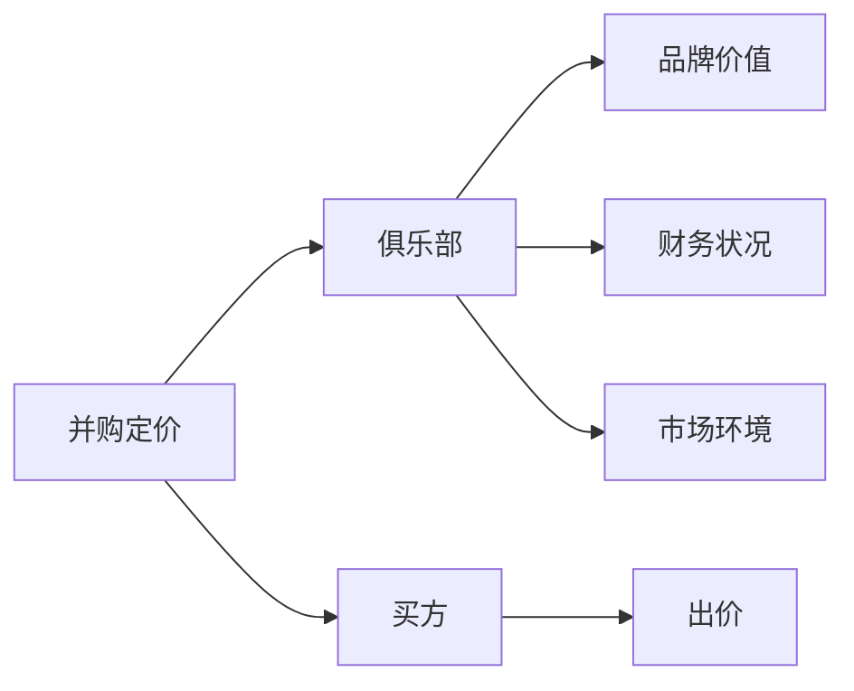
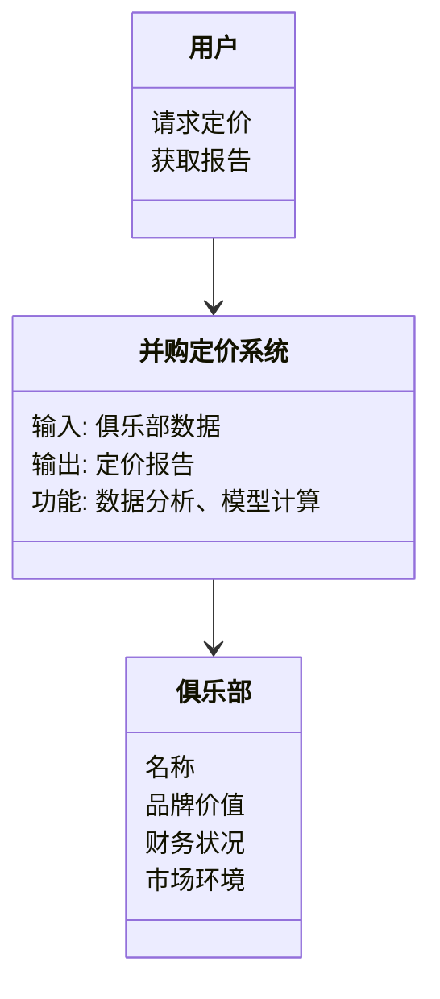
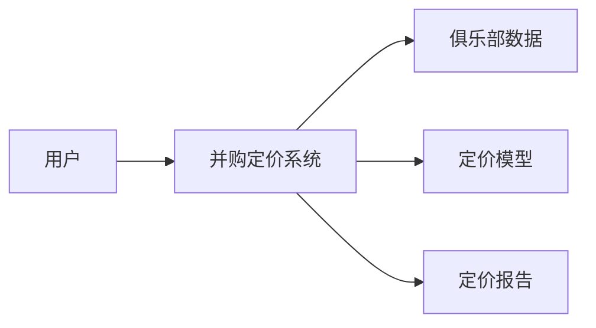
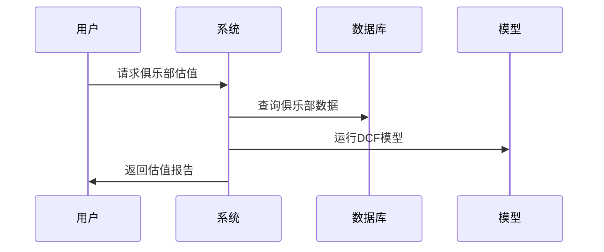

                 


# 股市估值对国际体育俱乐部并购定价的影响

> 关键词：股市估值，国际体育俱乐部，并购定价，贴现现金流模型，交易倍数法，品牌价值评估

> 摘要：本文探讨了股市估值在国际体育俱乐部并购定价中的应用，分析了核心概念、算法原理、数学模型，并通过实际案例展示了如何利用这些方法进行估值。文章还总结了最佳实践，为读者提供了全面的视角。

---

# 第1章: 股市估值与国际体育俱乐部并购定价概述

## 1.1 股市估值的基本概念

### 1.1.1 股市估值的定义与作用
股市估值是通过对公司财务数据和市场状况的分析，估算其股票的内在价值。它帮助投资者和收购方确定股票的合理价格，从而做出更明智的投资决策。在国际体育俱乐部并购中，股市估值是定价的重要参考，尤其是在上市公司收购中。

### 1.1.2 国际体育俱乐部并购的定义与特点
国际体育俱乐部并购是指跨国公司或投资者收购国际知名体育俱乐部的股权。这类并购通常涉及高价值资产，如球队品牌、赛事转播权和球员转会收益，具有高风险和高回报的特点。

### 1.1.3 股市估值在并购定价中的重要性
股市估值提供了市场对俱乐部价值的预期，帮助并购方确定合理的价格区间，避免支付过高的溢价或低估潜在价值。

## 1.2 股市估值与并购定价的核心联系

### 1.2.1 股市估值对并购定价的影响机制
股市估值通过市场参与者对俱乐部的预期，反映在股价中，收购方参考这些数据进行定价。

### 1.2.2 并购定价的基本方法与挑战
常用方法包括企业价值法（EV）和市盈率法（P/E）。挑战在于如何准确预测俱乐部的未来收益，尤其是在体育行业的不确定性和波动性。

### 1.2.3 国际体育俱乐部并购的特殊性
体育俱乐部的无形资产（品牌价值）和高波动性（赛事成绩影响）使得其估值更具挑战性。

## 1.3 本章小结

### 1.3.1 核心概念回顾
股市估值和并购定价是理解国际体育俱乐部并购的关键。

### 1.3.2 后续章节的逻辑框架
后续章节将深入分析估值方法、数学模型和实际案例。

---

# 第2章: 股市估值的核心原理与方法

## 2.1 股市估值的基本原理

### 2.1.1 股票的内在价值与市场价值
股票的内在价值基于未来现金流的现值，而市场价值受供需关系和市场情绪影响。

### 2.1.2 股票定价的市场机制
市场机制通过买卖双方的均衡确定股票价格，但受信息不对称和市场波动影响。

### 2.1.3 股票市场的波动性与风险
波动性是股市的常态，风险因素如宏观经济和行业变化会影响股票估值。

## 2.2 并购定价的主要方法

### 2.2.1 企业价值法（EV）
$$ EV = EBITDA - 现金 - 短期负债 $$
企业价值法考虑了俱乐部的息税折旧及摊销前利润，适用于整体估值。

### 2.2.2 市盈率法（P/E）
$$ P/E = 市场价/每股收益 $$
市盈率法适用于盈利稳定的俱乐部，但体育俱乐部的收益波动较大，影响其准确性。

### 2.2.3 市净率法（P/B）
$$ P/B = 市场价/每股净资产 $$
市净率法适用于资产密集型俱乐部，如拥有大量固定资产的体育场馆。

## 2.3 国际体育俱乐部并购的特殊估值方法

### 2.3.1 俱乐部品牌价值的评估
品牌价值通过未来收入的折现值计算，公式为：
$$ 品牌价值 = \sum_{t=1}^{n} \frac{CF_t}{(1 + r)^t} $$
其中，CF_t为未来现金流，r为折现率。

### 2.3.2 俱乐部资产的特殊性与流动性
体育俱乐部的无形资产如品牌和版权难以量化，流动性差，影响其估值。

### 2.3.3 俱乐部未来收益的预测模型
预测模型基于历史数据和市场趋势，考虑球队表现、转播权价值和赞助收入。

## 2.4 本章小结

### 2.4.1 股市估值方法的总结
不同方法适用于不同情况，需结合俱乐部特点选择。

### 2.4.2 并购定价的关键影响因素
收益能力、品牌价值和市场环境是关键。

---

# 第3章: 国际体育俱乐部并购定价的核心概念与联系

## 3.1 核心概念的定义与属性对比

### 3.1.1 股市估值与并购定价的对比分析
股市估值是市场对俱乐部的总体评价，而并购定价是具体的收购价格，受谈判和市场状况影响。

### 3.1.2 国际体育俱乐部并购的独特性
涉及跨国文化和法律差异，增加了复杂性。

### 3.1.3 并购定价中的关键因素
俱乐部历史表现、管理层能力、财务状况和市场地位。

## 3.2 概念属性特征对比表格

### 表3-1: 股市估值与并购定价的属性对比

| 属性           | 股市估值               | 并购定价               |
|----------------|-----------------------|-----------------------|
| 定价主体       | 投资者和市场           | 收购方和卖方           |
| 受影响因素     | 市场情绪、宏观经济       | 资产状况、谈判能力     |
| 应用场景       | 二级市场交易           | 并购交易               |
| 计量方法       | 市盈率、市净率           | EV、DCF模型             |

## 3.3 ER实体关系图

### 图3-1: 并购定价的实体关系图（Mermaid流程图）



---

# 第4章: 并购定价的算法原理与数学模型

## 4.1 并购定价的主要算法

### 4.1.1 贴现现金流模型（DCF）


### 4.1.2 交易倍数法（Transaction Multiple Approach）

公式：
$$ 交易倍数 = EV / EBITDA $$
$$ 并购价格 = 交易倍数 \times EBITDA $$

### 4.1.3 代码实现DCF模型

```python
def discounted_cash_flow(cash_flows, discount_rate):
    present_value = sum(flow / (1 + discount_rate) ** t for t, flow in enumerate(cash_flows))
    return present_value

# 示例
cash_flows = [100, 200, 300]
discount_rate = 0.05
value = discounted_cash_flow(cash_flows, discount_rate)
print(f"企业价值为: {value}")
```

## 4.2 数学模型与公式

### 4.2.1 贴现现金流模型
$$ PV = \sum_{t=1}^{n} \frac{CF_t}{(1 + r)^t} $$

### 4.2.2 交易倍数法
$$ EV = 倍数 \times EBITDA $$

---

# 第5章: 系统分析与架构设计方案

## 5.1 系统功能设计（领域模型）



## 5.2 系统架构设计



## 5.3 系统交互设计



---

# 第6章: 项目实战

## 6.1 环境安装与数据准备

```bash
pip install numpy pandas matplotlib
```

## 6.2 核心实现代码

```python
import numpy as np

def calculate_ev(ebitda, multiple):
    return ebitda * multiple

ebitda = 1000000
multiple = 15
ev = calculate_ev(ebitda, multiple)
print(f"企业价值为: {ev}")
```

## 6.3 案例分析

以英超俱乐部为例，假设EBITDA为100万英镑，交易倍数为15，则企业价值为1500万英镑。

## 6.4 项目小结

代码实现简单明了，但在实际应用中需考虑更多变量。

---

# 第7章: 最佳实践与总结

## 7.1 最佳实践 tips

### 7.1.1 模型选择
根据俱乐部特点选择合适的估值方法。

### 7.1.2 数据质量
使用准确的财务数据和市场信息。

### 7.1.3 行业动态
关注体育行业的趋势和政策变化。

## 7.2 小结

股市估值是国际体育俱乐部并购定价的重要工具，需结合多种方法和实际案例。

## 7.3 注意事项

并购定价需考虑法律、税务和文化差异。

## 7.4 拓展阅读

推荐书籍：《企业价值评估》和《并购定价的艺术》。

---

作者：AI天才研究院/AI Genius Institute & 禅与计算机程序设计艺术 /Zen And The Art of Computer Programming

