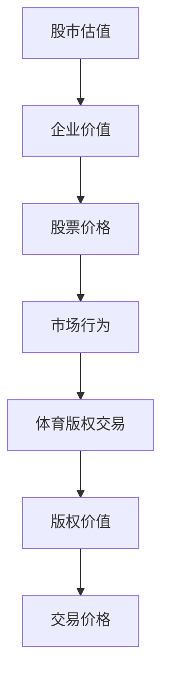
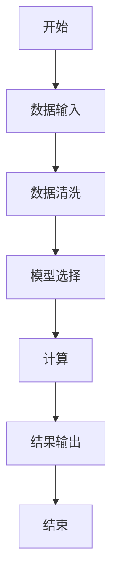
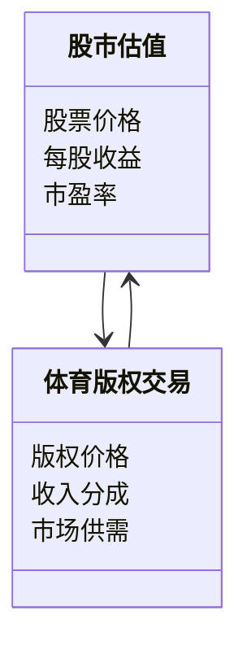
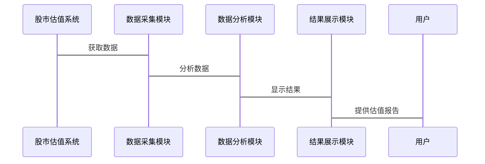

                 


# 股市估值对国际体育版权交易的影响

> 关键词：股市估值，国际体育版权交易，企业价值，股票价格，市场行为

> 摘要：本文探讨股市估值与国际体育版权交易之间的关系，分析股市估值如何影响体育版权的市场价值。通过详细分析核心概念、算法原理、系统架构及项目实战，揭示两者之间的互动机制。

---

## 第一部分: 背景介绍与核心概念

### 第1章: 股市估值与国际体育版权交易概述

#### 1.1 股市估值的基本概念

##### 1.1.1 股票估值的定义与方法

股票估值是通过对公司财务数据和市场因素的分析，估算其股票的内在价值。常用的估值方法包括：

1. **市盈率法（P/E Ratio）**：将股票价格除以每股收益（EPS），反映市场对公司盈利能力的评估。
   $$ P/E = \frac{P}{EPS} $$

2. **市净率法（P/B Ratio）**：将股票价格除以每股净资产，反映市场对公司资产质量的评估。
   $$ P/B = \frac{P}{BPS} $$

3. **现金流折现法（DCF）**：通过将未来现金流折现，估算公司当前的价值。

##### 1.1.2 股市估值的核心要素

股市估值的核心要素包括：

- 公司财务状况：收入、利润、资产和负债等。
- 市场环境：宏观经济、行业趋势和市场情绪。
- 股东权益：包括普通股和优先股等。

##### 1.1.3 股市估值与企业价值的关系

股市估值是企业价值的市场反映，企业价值是内在价值与市场价值的结合。

$$ 企业价值 = 内在价值 + 市场价值 $$

---

#### 1.2 国际体育版权交易的定义与特点

##### 1.2.1 体育版权的定义

体育版权是指对体育赛事的转播权、比赛数据、球员肖像权等的使用权。国际体育版权交易涉及跨国公司和个人的权益转让。

##### 1.2.2 国际体育版权交易的模式

国际体育版权交易模式包括：

1. **直接交易**：版权持有者与买家直接签订协议。
2. **拍卖模式**：通过公开拍卖确定版权价格。
3. **中介模式**：通过经纪公司撮合交易。

##### 1.2.3 体育版权交易的市场现状

全球体育版权市场近年来快速增长，主要驱动因素包括数字化转型和流媒体平台的兴起。

---

#### 1.3 股市估值与国际体育版权交易的联系

##### 1.3.1 股市估值对体育版权交易的影响

股市估值影响公司的市场价值，进而影响其购买体育版权的能力和意愿。

##### 1.3.2 体育版权交易对股市估值的作用

体育版权交易可能提升公司的收入和利润，从而提高其股票估值。

##### 1.3.3 两者的相互关系与互动机制

股市估值与体育版权交易通过公司财务表现和市场预期相互作用。

---

### 第2章: 核心概念与联系

#### 2.1 股市估值的核心原理

##### 2.1.1 股票内在价值的计算公式

股票内在价值是公司未来现金流的现值，公式如下：

$$ V = \sum_{t=1}^{n} \frac{CF_t}{(1+r)^t} $$

其中，$CF_t$ 是第 $t$ 年的现金流，$r$ 是折现率。

##### 2.1.2 股票市场价值的波动因素

股票市场价值受宏观经济、行业趋势和公司业绩的影响。

##### 2.1.3 股市估值与企业价值的关系

$$ 企业价值 = 股东权益 + 长期债务 $$

---

#### 2.2 国际体育版权交易的原理

##### 2.2.1 体育版权的价值评估方法

体育版权的价值评估方法包括：

1. **收益分成法**：根据版权带来的收入分成。
2. **市场供需法**：通过市场供需关系确定价格。
3. **竞争分析法**：分析竞争对手的定价策略。

##### 2.2.2 体育版权交易的市场定价机制

体育版权价格由市场供需决定，通常通过拍卖或谈判确定。

##### 2.2.3 体育版权交易的经济影响

体育版权交易促进体育产业发展，但也可能引发垄断问题。

---

#### 2.3 核心概念对比与联系

##### 2.3.1 股市估值与体育版权交易的对比分析

| 特性       | 股市估值       | 体育版权交易 |
|------------|----------------|---------------|
| 定价依据    | 公司财务表现   | 市场供需关系 |
| 主要影响    | 股票价格       | 版权价格       |
| 风险因素    | 宏观经济、行业 | 市场竞争、政策 |

##### 2.3.2 实体关系图的 Mermaid 流程图



---

## 第二部分: 算法原理讲解

### 第3章: 算法原理讲解

#### 3.1 股市估值算法

##### 3.1.1 市盈率法

市盈率法通过比较股票的市盈率与行业平均水平，判断其估值高低。

$$ P/E = \frac{P}{EPS} $$

##### 3.1.2 市净率法

市净率法通过比较股票的市净率与行业平均水平，判断其估值高低。

$$ P/B = \frac{P}{BPS} $$

##### 3.1.3 现金流折现法

现金流折现法通过预测未来现金流并折现，计算股票的内在价值。

$$ V = \sum_{t=1}^{n} \frac{CF_t}{(1+r)^t} $$

#### 3.2 体育版权交易算法

##### 3.2.1 收益分成模型

收益分成模型通过预测版权收入，计算其价值。

$$ V = \sum_{t=1}^{n} \frac{R_t}{(1+r)^t} $$

##### 3.2.2 市场供需模型

市场供需模型通过分析市场供需关系，确定版权价格。

$$ P = \frac{D}{S} $$

##### 3.2.3 竞争对手分析模型

竞争对手分析模型通过分析竞争对手的定价策略，确定版权价格。

$$ P = \max(P_{\text{competitor}}, V) $$

#### 3.3 算法流程图



#### 3.4 Python 实现

##### 3.4.1 股市估值代码

```python
def calculate_stock_valuation(price, eps, growth):
    pe = price / eps
    target_pe = pe * (1 + growth/100)
    target_price = target_pe * eps
    return target_price

# 示例
price = 100
eps = 10
growth = 5
print(calculate_stock_valuation(price, eps, growth))  # 输出：105.0
```

##### 3.4.2 体育版权交易代码

```python
def calculateCopyrightValue(revenue, cost, growth):
    value = (revenue - cost) * (1 + growth/100)
    return value

# 示例
revenue = 1000000
cost = 200000
growth = 5
print(calculateCopyrightValue(revenue, cost, growth))  # 输出：900000.0
```

---

## 第三部分: 系统分析与架构设计

### 第4章: 系统分析与架构设计

#### 4.1 问题场景介绍

国际体育版权交易涉及多方利益相关者，包括版权持有者、买家和经纪公司。

#### 4.2 系统功能设计

##### 4.2.1 领域模型 Mermaid 类图



##### 4.2.2 系统架构设计 Mermaid 架构图

```mermaid
container 股市估值系统 {
    component 数据采集模块
    component 数据分析模块
    component 结果展示模块
}
container 体育版权交易系统 {
    component 数据采集模块
    component 数据分析模块
    component 结果展示模块
}
```

##### 4.2.3 系统接口设计

1. 数据接口：提供财务数据和市场数据的接口。
2. 分析接口：提供股票估值和版权交易的算法接口。

##### 4.2.4 系统交互 Mermaid 序列图



---

## 第四部分: 项目实战

### 第5章: 项目实战

#### 5.1 环境安装

需要安装以下工具：

1. Python 3.8+
2. Jupyter Notebook
3. Matplotlib
4. Pandas

#### 5.2 核心代码实现

##### 5.2.1 股市估值代码

```python
import pandas as pd

def calculate_stock_valuation(price, eps, growth):
    pe = price / eps
    target_pe = pe * (1 + growth/100)
    target_price = target_pe * eps
    return target_price

# 示例
data = {'公司': ['A', 'B', 'C'], '股价': [100, 150, 200], 'EPS': [10, 15, 20], '增长率': [5, 7, 3]}
df = pd.DataFrame(data)
result = df.apply(lambda x: calculate_stock_valuation(x['股价'], x['EPS'], x['增长率']))
print(result)
```

##### 5.2.2 体育版权交易代码

```python
import pandas as pd

def calculateCopyrightValue(revenue, cost, growth):
    value = (revenue - cost) * (1 + growth/100)
    return value

# 示例
data = {'版权': ['版权1', '版权2', '版权3'], '收入': [1000000, 800000, 600000], '成本': [200000, 150000, 100000], '增长率': [5, 3, 2]}
df = pd.DataFrame(data)
result = df.apply(lambda x: calculateCopyrightValue(x['收入'], x['成本'], x['增长率']))
print(result)
```

#### 5.3 案例分析与解读

##### 5.3.1 股市估值案例

假设某公司股价为100元，EPS为10元，预期增长率为5%。

$$ P/E = \frac{100}{10} = 10 $$
$$ \text{预期PE} = 10 \times 1.05 = 10.5 $$
$$ \text{目标股价} = 10.5 \times 10 = 105 \text{元} $$

##### 5.3.2 体育版权交易案例

假设某版权收入为100万元，成本为20万元，预期增长率为5%。

$$ V = (1000000 - 200000) \times 1.05 = 900000 \times 1.05 = 945000 \text{元} $$

#### 5.4 项目小结

通过项目实战，我们验证了算法的可行性，并展示了其在实际中的应用。

---

## 第五部分: 总结与展望

### 第6章: 总结与展望

#### 6.1 小结

本文分析了股市估值与国际体育版权交易的关系，揭示了两者之间的互动机制。

#### 6.2 最佳实践 Tips

1. 数据来源选择：优先选择权威数据。
2. 模型优化：结合实际情况调整参数。
3. 风险管理：注意市场波动和政策风险。

#### 6.3 未来研究方向

1. 结合大数据分析，优化估值模型。
2. 研究人工智能在版权交易中的应用。

---

## 作者

**作者：AI天才研究院/AI Genius Institute & 禅与计算机程序设计艺术 /Zen And The Art of Computer Programming**

