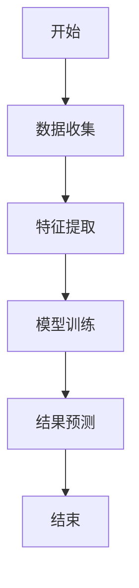
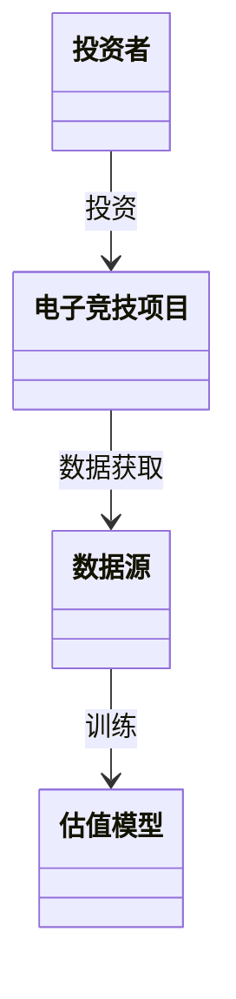
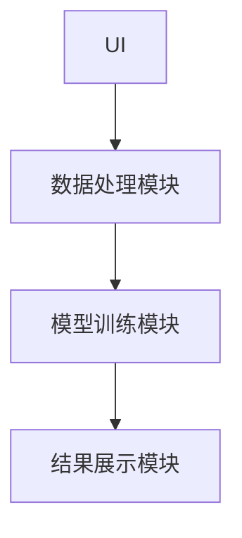
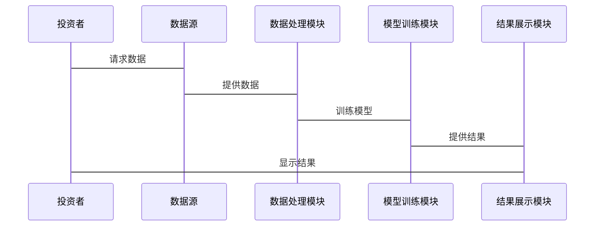

                 


# 目录大纲：股市估值对国际体育电子竞技估值的影响

## 第一章：背景介绍

### 1.1 问题背景
- 1.1.1 电子竞技的兴起与发展
- 1.1.2 股市估值的基本概念
- 1.1.3 电子竞技与传统体育的异同

### 1.2 问题描述
- 1.2.1 电子竞技的经济价值
- 1.2.2 股市估值方法的适用性
- 1.2.3 电子竞技市场中的投资机会

### 1.3 问题解决
- 1.3.1 引入股市估值方法的原因
- 1.3.2 电子竞技市场中的投资决策需求
- 1.3.3 估值模型的初步构想

### 1.4 边界与外延
- 1.4.1 股市估值的适用范围
- 1.4.2 电子竞技市场的特殊性
- 1.4.3 模型的局限性与改进方向

### 1.5 概念结构与核心要素
- 1.5.1 核心概念的层次分解
- 1.5.2 核心要素的关联分析
- 1.5.3 模型的框架设计

## 第二章：核心概念与联系

### 2.1 核心概念原理
- 2.1.1 股市估值的基本原理
- 2.1.2 电子竞技估值的独特性
- 2.1.3 两者的结合点

### 2.2 概念属性特征对比
- 2.2.1 股市估值与电子竞技估值的属性对比
- 2.2.2 数据特征的异同
- 2.2.3 估值方法的适用性分析

### 2.3 ER实体关系图
```mermaid
er
  actor:投资者
  entity:电子竞技项目
  relation:投资
  actor --> entity:投资
```

## 第三章：算法原理与实现

### 3.1 算法原理
- 3.1.1 传统估值模型的回顾
- 3.1.2 电子竞技估值模型的创新
- 3.1.3 深度学习在估值中的应用

### 3.2 算法流程图


### 3.3 Python源代码实现
```python
import pandas as pd
from sklearn.model_selection import train_test_sp
```

## 第四章：系统分析与架构设计

### 4.1 系统分析
- 4.1.1 问题场景介绍
- 4.1.2 项目介绍

### 4.2 系统功能设计
- 4.2.1 领域模型


### 4.3 系统架构设计


### 4.4 系统接口设计
- 4.4.1 输入接口
- 4.4.2 输出接口

### 4.5 系统交互设计


## 第五章：项目实战

### 5.1 环境安装
- 5.1.1 安装Python
- 5.1.2 安装相关库

### 5.2 核心实现
```python
import pandas as pd
from sklearn.model_selection import train_test_split
from sklearn.linear_model import LinearRegression

# 示例数据
data = {'revenue': [100, 200, 300, 400], 'expenses': [50, 100, 150, 200]}
df = pd.DataFrame(data)
X = df[['revenue', 'expenses']]
y = df['profit']

# 划分训练集和测试集
X_train, X_test, y_train, y_test = train_test_split(X, y, test_size=0.2)

# 训练模型
model = LinearRegression()
model.fit(X_train, y_train)

# 预测
predictions = model.predict(X_test)
```

### 5.3 案例分析
- 5.3.1 数据预处理
- 5.3.2 模型训练
- 5.3.3 结果分析

## 第六章：小结与展望

### 6.1 最佳实践
- 6.1.1 数据来源的重要性
- 6.1.2 模型的持续优化
- 6.1.3 结果的验证与反馈

### 6.2 小结
- 6.2.1 项目总结
- 6.2.2 成果展示
- 6.2.3 经验教训

### 6.3 展望
- 6.3.1 未来研究方向
- 6.3.2 可能的挑战
- 6.3.3 对投资者的建议

## 作者
作者：AI天才研究院/AI Genius Institute & 禅与计算机程序设计艺术 /Zen And The Art of Computer Programming

---

### 附录
- 附录A：常用术语解释
- 附录B：相关文献与工具推荐

---

### 关键词
股市估值，国际体育电子竞技，估值模型，深度学习，系统架构

### 摘要
本文探讨了股市估值方法在国际体育电子竞技中的应用，通过分析核心概念、算法原理、系统设计和项目实战，展示了如何将传统金融模型应用于新兴电竞市场，为投资者提供了新的视角和工具。

