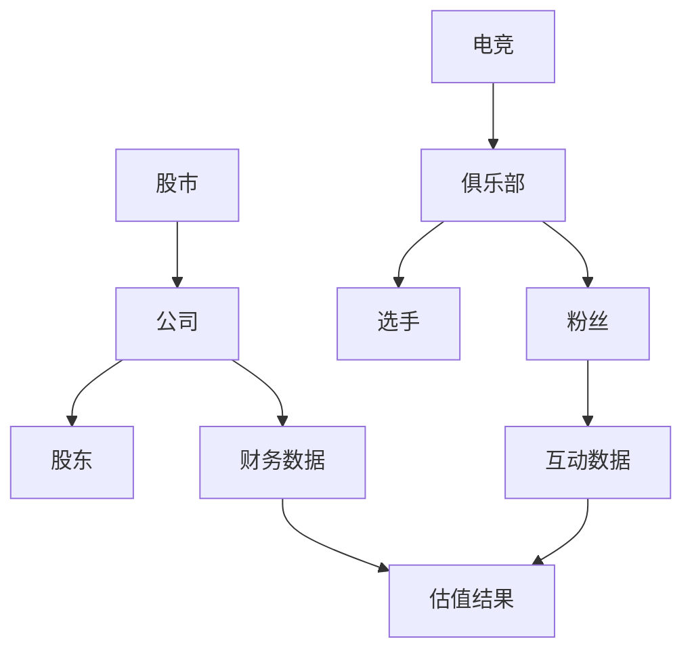
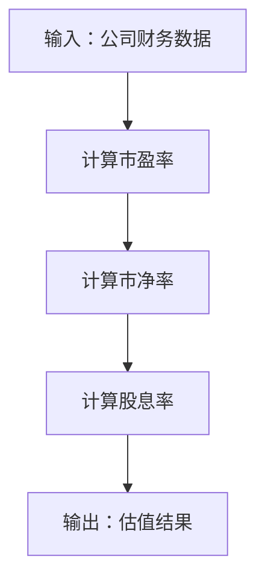
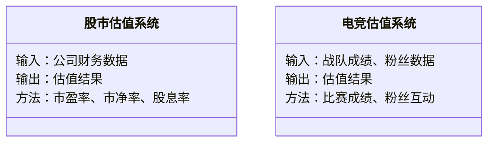
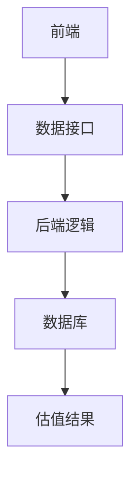

                 


# 股市估值对国际体育电子竞技估值的影响

## 关键词：股市估值、国际体育、电子竞技、估值影响、经济分析

## 摘要：  
本文探讨了股市估值方法对国际体育电子竞技估值的影响，分析了电竞产业的市场规模、核心要素和估值模型，结合实际案例，揭示了电竞估值的独特性及其与传统股市估值的异同点，为投资者和从业者提供了新的视角和方法。

---

# 正文

## 第一部分: 背景介绍

### 第1章: 股市估值与国际体育电子竞技估值的背景

#### 1.1 问题背景

##### 1.1.1 股市估值的基本概念  
股市估值是指通过对公司财务数据和市场表现的分析，评估其股票的内在价值。常用方法包括市盈率（P/E）、市净率（P/B）和股息率等。这些方法帮助投资者判断股票是否被高估或低估。

##### 1.1.2 国际体育电子竞技的兴起  
电子竞技（Esports）近年来迅速崛起，成为全球关注的新兴产业。电竞涵盖游戏比赛、俱乐部运营、赛事直播等多个领域，市场规模持续扩大，吸引大量投资。

##### 1.1.3 问题解决：电竞产业的估值需求  
随着电竞行业的商业化，电竞俱乐部、选手和赛事的估值需求日益迫切。如何借鉴股市估值方法，为电竞产业提供科学的估值模型成为关键问题。

#### 1.2 问题描述

##### 1.2.1 股市估值的核心要素  
股市估值的核心要素包括收入、利润、资产和负债等财务指标，以及市场利率、行业竞争等外部因素。

##### 1.2.2 电竞产业的市场规模与结构  
电竞产业包括俱乐部、赛事、直播平台和周边产品等多个子市场。市场规模的快速增长使其成为估值的重要对象。

##### 1.2.3 问题外延：电竞与传统体育的估值差异  
电竞与传统体育在参与者、观众群体和商业模式上存在显著差异，导致其估值方法有所不同。

#### 1.3 问题解决

##### 1.3.1 股市估值方法的适用性分析  
股市估值方法在电竞产业的应用需要考虑其独特性，如收益来源的多样性、资产流动性等。

##### 1.3.2 电竞估值的独特性与挑战  
电竞俱乐部的估值需考虑战队成绩、选手影响力、粉丝基础等因素，这些因素与传统企业估值不同。

##### 1.3.3 跨界融合的可行性探讨  
电竞估值可以借鉴股市方法，但需结合行业特点，建立适合的模型和指标。

#### 1.4 边界与外延

##### 1.4.1 股市估值的边界条件  
股市估值受市场波动、政策环境和公司治理等因素影响。

##### 1.4.2 电竞估值的边界条件  
电竞估值需考虑比赛成绩、粉丝数量和商业模式等动态因素。

##### 1.4.3 两者的外延与关联  
电竞估值需关注跨界合作、版权价值和技术创新等，这些与股市估值的创新应用密切相关。

#### 1.5 概念结构与核心要素

##### 1.5.1 股市估值的核心要素  
包括收入、利润、资产、负债、市场环境等。

##### 1.5.2 电竞估值的核心要素  
包括战队成绩、选手影响力、粉丝数量、赛事收入、赞助商支持等。

##### 1.5.3 两者的关联与对比  
电竞估值需要综合考虑财务数据和非财务因素，结合线上和线下多渠道数据。

---

### 第2章: 核心概念与联系

#### 2.1 核心概念原理

##### 2.1.1 股市估值的原理  
通过分析公司财务数据和市场表现，评估其股票的内在价值。

##### 2.1.2 电竞估值的原理  
通过分析战队成绩、选手影响力、赛事收入和粉丝基础等，评估电竞俱乐部或赛事的经济价值。

##### 2.1.3 两者的异同点  
电竞估值需要综合考虑财务和非财务因素，而股市估值更依赖于财务数据和市场表现。

#### 2.2 概念属性特征对比

| 属性       | 股市估值              | 电竞估值              |
|------------|-----------------------|-----------------------|
| 估值主体     | 投资者、机构          | 赞助商、俱乐部、粉丝    |
| 估值依据     | 财务数据、市场环境    | 比赛成绩、粉丝数量      |
| 估值周期     | 季度、年度            | 赛季、赛事节点          |
| 变化因素     | 经济环境、政策        | 比赛结果、选手变动      |

#### 2.3 ER实体关系图



---

## 第二部分: 核心概念与联系

### 第3章: 股市估值的核心原理

#### 3.1 股市估值的数学模型

##### 3.1.1 市盈率模型  
$$ P/E = \frac{P}{E} $$  
其中，P为股价，E为每股收益。

##### 3.1.2 市净率模型  
$$ P/B = \frac{P}{B} $$  
其中，P为股价，B为每股净资产。

##### 3.1.3 股息率模型  
$$ Dividend Yield = \frac{D}{P} $$  
其中，D为每股股息，P为股价。

#### 3.2 算法原理



##### 3.2.1 代码实现  
```python
def calculate_valuation(finance_data):
    pe_ratio = finance_data['price'] / finance_data['eps']
    pb_ratio = finance_data['price'] / finance_data['book_value']
    dividend_yield = finance_data['dividend'] / finance_data['price']
    return pe_ratio, pb_ratio, dividend_yield

# 示例数据
finance_data = {
    'price': 50,
    'eps': 5,
    'book_value': 10,
    'dividend': 2.5
}

pe, pb, dy = calculate_valuation(finance_data)
print(f"市盈率：{pe}, 市净率：{pb}, 股息率：{dy}")
```

---

## 第三部分: 算法原理讲解

### 第4章: 算法原理讲解

#### 4.1 算法原理

##### 4.1.1 电竞俱乐部估值模型  
$$ V = \alpha \times W + \beta \times F + \gamma \times S $$  
其中，V为估值，W为比赛成绩，F为粉丝数量，S为赞助商支持。

##### 4.1.2 与股市估值模型的对比  
电竞估值模型引入了非财务指标，如粉丝互动数据和社交媒体影响力。

---

## 第四部分: 系统分析与架构设计方案

### 第5章: 系统分析与架构设计方案

#### 5.1 系统功能设计

##### 5.1.1 领域模型



#### 5.2 系统架构设计



---

## 第五部分: 项目实战

### 第6章: 项目实战

#### 6.1 项目介绍

##### 6.1.1 环境安装  
需要安装Python和相关库，如Pandas和Matplotlib。

##### 6.1.2 代码实现  
```python
import pandas as pd

# 示例数据
data = {
    '俱乐部': ['Team A', 'Team B'],
    '成绩': [0.8, 0.6],
    '粉丝数': [10000, 15000]
}

df = pd.DataFrame(data)
print(df)
```

---

## 第六部分: 结论与展望

### 第7章: 结论与展望

#### 7.1 结论  
股市估值方法为电竞估值提供了基础，但需要结合电竞行业的独特性进行调整。

#### 7.2 展望  
未来电竞估值将更加精准，结合人工智能和大数据技术，提供实时动态估值。

---

## 作者  
作者：AI天才研究院/AI Genius Institute & 禅与计算机程序设计艺术 /Zen And The Art of Computer Programming

