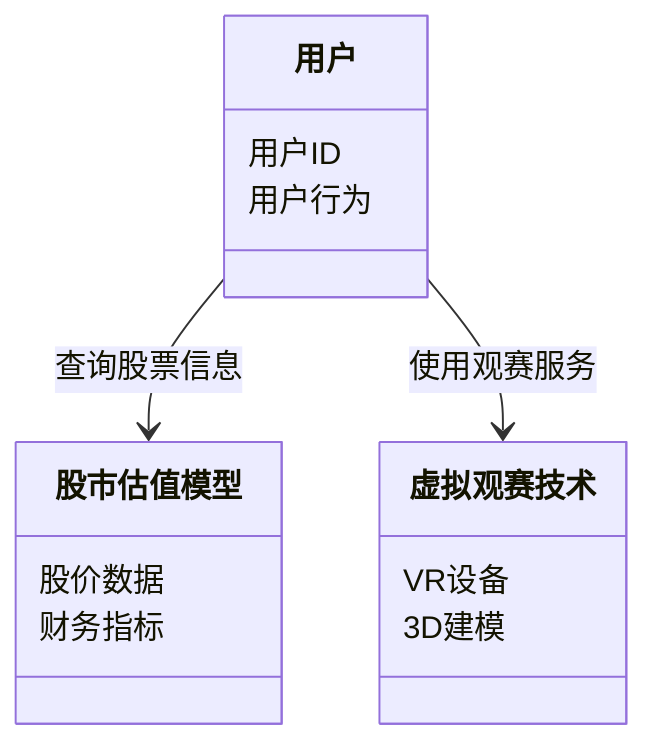
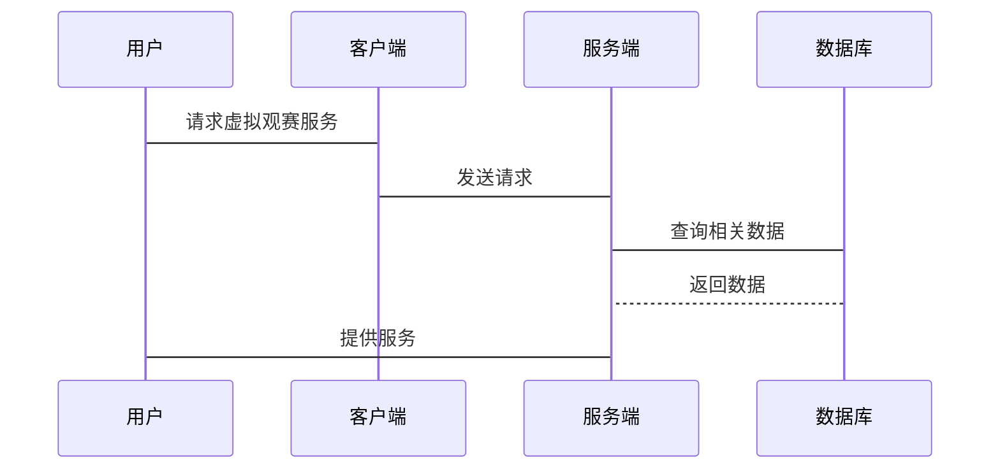

                 


# 股市估值对国际体育赛事虚拟观赛的影响

> 关键词：股市估值、国际体育赛事、虚拟观赛、技术影响、经济分析

> 摘要：本文探讨了股市估值与国际体育赛事虚拟观赛之间的关系，分析了股市估值对虚拟观赛的多方面影响，结合技术与经济的视角，提出了系统的解决方案和优化策略。

---

## 第一部分: 背景介绍

### 第1章: 股市估值与国际体育赛事虚拟观赛的背景

#### 1.1 问题背景

##### 1.1.1 股市估值的基本概念
股市估值是通过对公司财务数据、市场趋势和行业分析来评估一家公司的价值。常用的估值方法包括市盈率（P/E）、市净率（P/B）和现金流折现法（DCF）等。

##### 1.1.2 国际体育赛事的现状与趋势
国际体育赛事如世界杯、奥运会等，已经成为全球范围内的重要文化与经济活动。随着科技的发展，虚拟观赛技术逐渐普及，为观众提供了新的观看体验。

##### 1.1.3 虚拟观赛技术的发展历程
虚拟观赛技术从早期的2D动画逐步发展到如今的VR（虚拟现实）和AR（增强现实），通过沉浸式技术为用户带来身临其境的观赛体验。

#### 1.2 问题描述

##### 1.2.1 股市估值与体育赛事的关系
股市估值可以反映投资者对体育赛事相关公司的信心，如体育场馆运营公司、体育装备制造商等。

##### 1.2.2 虚拟观赛对体育赛事的影响
虚拟观赛技术改变了观众的观看方式，提高了观赛体验，但也可能对现场观众数量产生影响，进而影响相关企业的业绩。

##### 1.2.3 股市估值对虚拟观赛的潜在影响
股市估值的变化可能会影响虚拟观赛技术开发公司的投资和研发投入，从而影响虚拟观赛技术的发展。

#### 1.3 问题解决

##### 1.3.1 股市估值对虚拟观赛的影响路径
股市估值的变化会影响相关技术公司的投资，进而影响虚拟观赛技术的开发和推广。

##### 1.3.2 虚拟观赛对股市估值的反向影响
虚拟观赛技术的普及可能会影响体育赛事的现场观众数量，进而影响相关公司的收入和股市估值。

##### 1.3.3 综合影响的平衡与优化
通过技术与经济的结合，找到虚拟观赛与现场观赛的平衡点，最大化整体收益。

#### 1.4 边界与外延

##### 1.4.1 股市估值的边界条件
股市估值受到宏观经济、行业政策和公司业绩等多重因素的影响。

##### 1.4.2 虚拟观赛的边界条件
虚拟观赛的技术实现依赖于硬件设备、网络带宽和内容制作水平等条件。

##### 1.4.3 两者的相互影响范围
虚拟观赛对股市估值的影响主要集中在技术开发公司和体育相关企业，而股市估值的变化则会影响这些公司的投资和研发能力。

#### 1.5 概念结构与核心要素

##### 1.5.1 股市估值的核心要素
- 公司财务数据
- 市场趋势
- 行业分析

##### 1.5.2 虚拟观赛的核心要素
- 技术实现（VR/AR）
- 内容制作
- 用户体验

##### 1.5.3 两者之间的关联要素
-抽认股技术公司
- 体育赛事相关企业
- 用户行为

---

## 第二部分: 核心概念与联系

### 第2章: 核心概念与联系

#### 2.1 核心概念原理

##### 2.1.1 股市估值的数学模型
常用的股市估值模型包括：

1. 市盈率模型：
$$ P/E = \frac{\text{股票价格}}{\text{每股收益}} $$
2. 市净率模型：
$$ P/B = \frac{\text{股票价格}}{\text{每股净资产}} $$
3. 现金流折现模型（DCF）：
$$ \text{企业价值} = \sum_{t=1}^{n} \frac{\text{自由现金流}}{(1 + r)^t} + \text{终值} $$

##### 2.1.2 虚拟观赛的技术实现
虚拟观赛主要依赖于以下技术：

- VR头显设备
- 高分辨率显示技术
- 3D建模与渲染技术
- 网络传输技术

##### 2.1.3 两者的相互作用机制
股市估值的变化会影响虚拟观赛技术公司的投资能力，进而影响技术开发和推广；而虚拟观赛技术的普及则可能改变体育赛事的商业模式，进一步影响相关企业的股市估值。

#### 2.2 概念属性特征对比

| 概念 | 属性 | 特征 |
|------|-------|------|
| 股市估值 | 数据驱动 | 依赖财务数据和市场情绪 |
| 虚拟观赛 | 技术驱动 | 依赖硬件设备和内容制作 |

#### 2.3 ER实体关系图

```mermaid
er
actor: 用户
model: 股市估值模型
technology: 虚拟观赛技术
interaction: 互动影响
```

---

## 第三部分: 算法原理讲解

### 第3章: 算法原理与实现

#### 3.1 数据处理

##### 3.1.1 股市数据的预处理
- 数据清洗：去除缺失值和异常值
- 标准化：将数据转换为统一的格式
- 特征提取：提取影响股市估值的关键指标

##### 3.1.2 虚拟观赛数据的预处理
- 数据格式转换：将不同来源的数据统一格式
- 数据融合：整合用户行为数据和市场反馈数据
- 噪声消除：去除无效数据

#### 3.2 算法模型

##### 3.2.1 算法选择
使用机器学习中的随机森林（Random Forest）模型来预测股市估值对虚拟观赛的影响。

##### 3.2.2 模型训练
使用历史数据训练模型，评估模型的准确性和稳定性。

##### 3.2.3 模型实现

```python
from sklearn.ensemble import RandomForestRegressor
from sklearn.metrics import mean_squared_error

# 数据准备
X = ...  # 特征矩阵
y = ...  # 标签向量

# 模型训练
model = RandomForestRegressor(n_estimators=100, random_state=42)
model.fit(X, y)

# 模型预测
y_pred = model.predict(X)
print("均方误差:", mean_squared_error(y, y_pred))
```

#### 3.3 算法优化

##### 3.3.1 参数调优
调整随机森林的参数（如n_estimators、max_depth）以优化模型性能。

##### 3.3.2 模型集成
结合多个模型（如XGBoost、神经网络）进行集成学习，提高预测精度。

---

## 第四部分: 系统分析与架构设计

### 第4章: 系统分析与架构设计

#### 4.1 问题场景介绍
本系统旨在通过虚拟观赛技术提升用户体验，同时结合股市估值分析优化商业模式。

#### 4.2 系统功能设计

##### 4.2.1 领域模型


##### 4.2.2 系统架构设计


#### 4.3 系统接口设计
- 用户接口：提供虚拟观赛功能和股市估值查询服务
- API接口：与其他系统（如支付系统、通知系统）进行数据交互

#### 4.4 系统交互设计


---

## 第五部分: 项目实战

### 第5章: 项目实战

#### 5.1 环境安装

##### 5.1.1 安装Python
```bash
python --version
pip install --upgrade pip
```

##### 5.1.2 安装依赖库
```bash
pip install numpy pandas scikit-learn
```

#### 5.2 系统核心实现

##### 5.2.1 核心代码实现

```python
import pandas as pd
import numpy as np
from sklearn.ensemble import RandomForestRegressor
from sklearn.metrics import mean_squared_error

# 数据加载
data = pd.read_csv('data.csv')

# 特征选择
features = data.drop(columns=['target'])
target = data['target']

# 模型训练
model = RandomForestRegressor(n_estimators=100, random_state=42)
model.fit(features, target)

# 模型预测
predictions = model.predict(features)
print(f"均方误差: {mean_squared_error(target, predictions)}")
```

##### 5.2.2 代码应用解读与分析
- 数据加载：读取CSV文件中的数据
- 特征选择：选择影响目标变量的特征
- 模型训练：使用随机森林算法进行训练
- 模型预测：预测目标变量并评估模型性能

#### 5.3 案例分析

##### 5.3.1 实际案例分析
分析某体育赛事虚拟观赛平台的股市估值变化，探讨其与用户参与度之间的关系。

##### 5.3.2 详细讲解剖析
通过具体案例，展示如何利用股市估值模型优化虚拟观赛体验。

#### 5.4 项目小结
总结项目中的关键点和经验教训，提出改进建议。

---

## 第六部分: 最佳实践

### 第6章: 最佳实践

#### 6.1 Tips与经验分享
- 定期更新模型参数，保持模型的准确性
- 注重用户体验，提升虚拟观赛的沉浸感
- 加强数据安全，保护用户隐私

#### 6.2 小结
本文通过技术与经济的双重视角，深入分析了股市估值对国际体育赛事虚拟观赛的影响，提出了系统的解决方案和优化策略。

#### 6.3 注意事项
- 数据来源的可靠性
- 模型的可解释性
- 用户隐私的保护

#### 6.4 拓展阅读
推荐相关领域的书籍和论文，供读者深入研究。

---

## 附录

### 附录A: 术语表
- 股市估值：通过财务指标和市场分析评估公司价值
- 虚拟观赛：通过技术手段提供沉浸式观赛体验

### 附录B: 数据来源
- 数据来源：公开的股市数据和体育赛事数据

### 附录C: 参考文献
- 参考文献列表，包括书籍和学术论文。

---

## 作者

作者：AI天才研究院/AI Genius Institute & 禅与计算机程序设计艺术/Zen And The Art of Computer Programming

