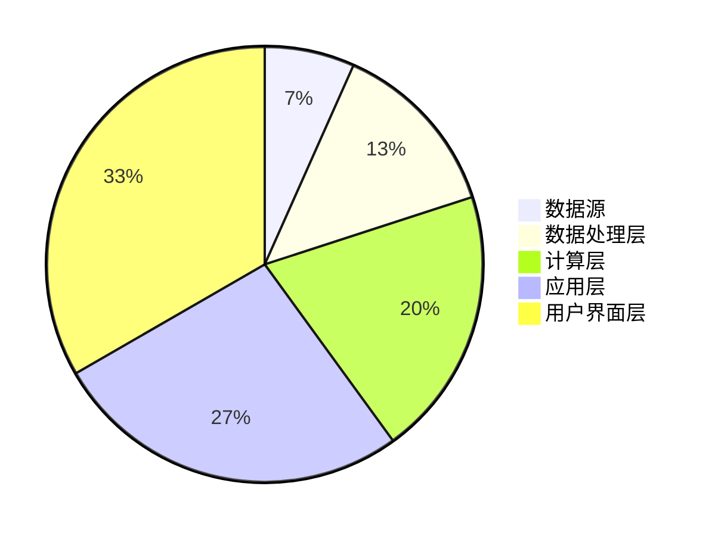
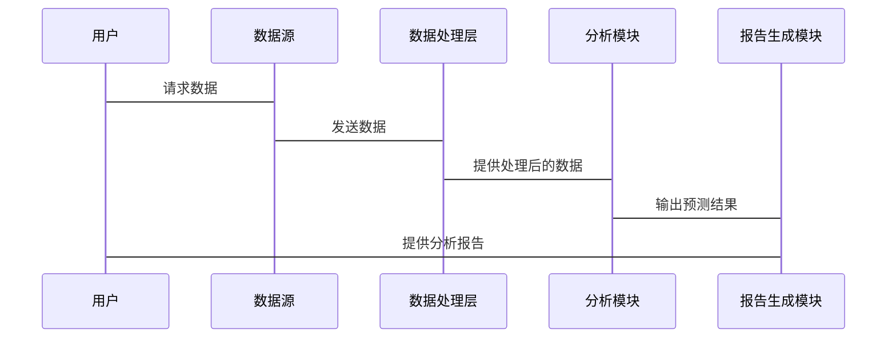

                 


# 股市估值对国际体育赛事虚拟观赛的影响

## 关键词：股市估值、国际体育赛事、虚拟观赛、算法模型、数据分析

## 摘要：随着科技的发展，虚拟观赛逐渐成为国际体育赛事的重要组成部分，而股市估值则反映了市场对相关产业的预期。本文分析了虚拟观赛对股市估值的影响，探讨了两者之间的关联性，构建了数学模型，并通过案例分析展示了实际应用。文章还详细介绍了系统架构设计和算法实现，为投资者和科技从业者提供了参考。

---

## 第一部分：背景介绍与核心概念

### 第1章：股市估值与虚拟观赛的背景

#### 1.1 股市估值的基本概念
股市估值是通过对公司财务数据和市场因素的分析，估算公司股票的合理价格。主要方法包括市盈率、市净率和现金流折现法等。股市估值受经济周期、行业趋势和公司业绩的影响。

#### 1.2 国际体育赛事虚拟观赛的兴起
虚拟观赛是通过虚拟现实（VR）、增强现实（AR）和流媒体技术，让用户在线观看体育赛事。它解决了传统观赛的时空限制，提升了互动性和参与感，推动了体育产业的数字化转型。

#### 1.3 股市估值与虚拟观赛的关联
虚拟观赛改变了观众的行为和消费习惯，影响了体育产业的收入结构，进而影响相关公司的股票估值。例如，虚拟观赛可能减少现场观众数量，但增加线上收入，这种变化需要通过股市估值模型进行预测和分析。

---

## 第二部分：核心概念与联系

### 第2章：核心概念的原理与属性

#### 2.1 股市估值的核心原理
股市估值通过分析公司的盈利能力、成长性和财务健康状况，预测股票价格的变化。关键因素包括净利润、营业收入增长率和行业竞争状况。

#### 2.2 虚拟观赛的核心原理
虚拟观赛依赖于先进的流媒体技术和互动功能，提供沉浸式的观赛体验。其商业模式包括订阅制、广告收入和虚拟商品销售。

#### 2.3 核心概念的对比分析
通过对比股市估值和虚拟观赛的属性，发现虚拟观赛对观众数量和消费模式的影响，可以作为股市估值的重要变量。例如，观众数量的减少可能影响赛事收入，进而影响相关公司的股价。

```mermaid
er
    entity 股市估值 {
        id
        股票代码
        股票价格
        估值时间
    }
    entity 虚拟观赛 {
        id
        用户ID
        观赛时间
        观赛类型
    }
    entity 体育赛事 {
        id
        赛事名称
        赛事时间
        赛事地点
    }
    relation 股市估值与虚拟观赛的关系 {
        股市估值 --- 用户行为
        用户行为 --- 虚拟观赛
        虚拟观赛 --- 体育赛事
    }
```

---

## 第三部分：算法原理与模型构建

### 第3章：算法原理与数学模型

#### 3.1 股市估值预测模型
基于虚拟观赛数据的股市估值预测模型：
$$
\text{股票价格} = \beta_0 + \beta_1 \times \text{虚拟观赛用户数} + \epsilon
$$
其中，$\beta_0$是截距，$\beta_1$是虚拟观赛用户数的回归系数，$\epsilon$是误差项。

#### 3.2 虚拟观赛用户行为分析
使用机器学习算法预测用户行为，构建用户画像。算法步骤如下：
1. 数据清洗与特征提取。
2. 建立随机森林模型。
3. 模型训练与评估。
4. 预测虚拟观赛用户数量。

#### 3.3 算法实现代码
```python
import pandas as pd
from sklearn.ensemble import RandomForestRegressor
from sklearn.metrics import mean_squared_error

# 加载数据
data = pd.read_csv('virtual_viewing.csv')

# 特征工程
features = ['viewers', 'engagement']
target = 'stock_price'

# 训练模型
model = RandomForestRegressor(n_estimators=100)
model.fit(data[features], data[target])

# 预测结果
predictions = model.predict(data[features])
print(f"均方误差：{mean_squared_error(data[target], predictions)}")
```

---

## 第四部分：系统分析与架构设计

### 第4章：系统分析与架构设计

#### 4.1 问题场景介绍
设计一个实时分析虚拟观赛数据的系统，用于预测股市估值的变化。

#### 4.2 系统功能设计
- 数据采集模块：收集虚拟观赛用户的实时数据。
- 数据处理模块：清洗和转换数据。
- 分析模块：应用机器学习算法进行预测。
- 报告生成模块：输出分析结果。

#### 4.3 系统架构设计


#### 4.4 系统交互流程


---

## 第五部分：项目实战与案例分析

### 第5章：项目实战与案例分析

#### 5.1 环境安装
安装Python、Pandas、Scikit-learn等库。

#### 5.2 核心代码实现
```python
import pandas as pd
from sklearn.model_selection import train_test_split
from sklearn.metrics import r2_score

# 加载数据
data = pd.read_csv('example.csv')

# 划分数据集
X = data[['viewers', 'engagement']]
y = data['stock_price']
X_train, X_test, y_train, y_test = train_test_split(X, y, test_size=0.2)

# 训练模型
model = RandomForestRegressor(n_estimators=100)
model.fit(X_train, y_train)

# 模型评估
y_pred = model.predict(X_test)
print(f"R²: {r2_score(y_test, y_pred)}")
```

#### 5.3 案例分析
以FIFA世界杯为例，分析虚拟观赛对相关股票的影响。通过数据收集和模型预测，展示虚拟观赛用户数对股市估值的具体影响。

#### 5.4 实际案例解读
结合实际数据，分析虚拟观赛如何改变观众行为，进而影响股市估值。例如，虚拟观赛用户数增加可能导致相关股票价格上涨。

---

## 第六部分：总结与展望

### 第6章：总结与展望

#### 6.1 核心观点总结
股市估值与虚拟观赛密切相关，虚拟观赛数据可以作为股市预测的重要依据。

#### 6.2 最佳实践
- 数据收集要全面，模型要不断优化。
- 关注技术发展，如人工智能和大数据分析。

#### 6.3 注意事项
- 数据隐私问题需重视。
- 模型需定期更新，以适应市场变化。

#### 6.4 拓展阅读
建议阅读相关领域的学术论文和行业报告，深入了解股市估值和虚拟观赛的最新研究。

---

## 作者：AI天才研究院/AI Genius Institute & 禅与计算机程序设计艺术/Zen And The Art of Computer Programming

