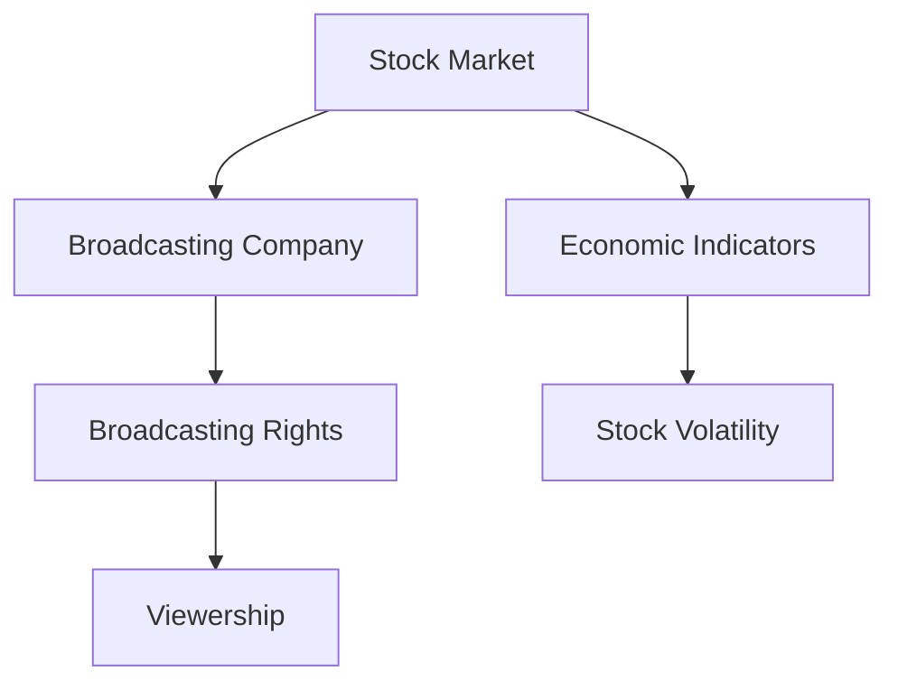
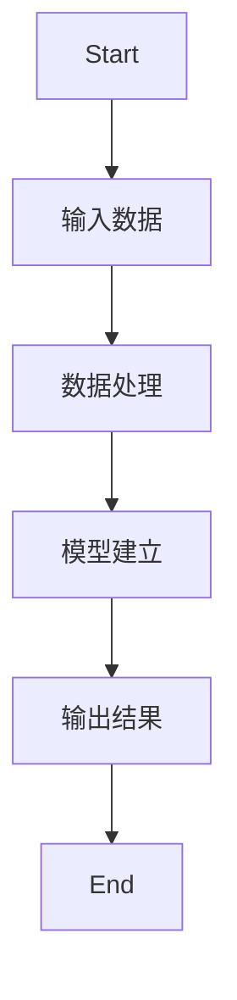
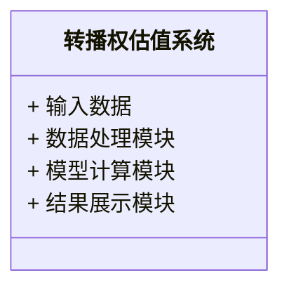
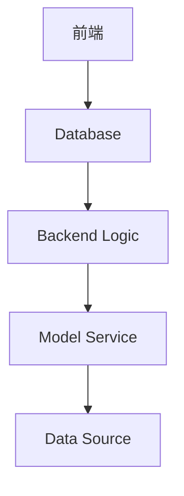

                 


# 股市估值对国际体育赛事转播权估值的影响

## 关键词：股市估值，转播权估值，国际体育赛事，经济影响，数学模型

## 摘要：本文探讨股市估值对国际体育赛事转播权估值的影响，分析两者之间的关联性，提出数学模型和算法，以帮助企业更好地评估转播权价值，做出明智的商业决策。

---

## 第一部分：背景介绍

### 第1章：股市估值与国际体育赛事转播权估值的背景

#### 1.1 问题背景

1.1.1 股市估值的基本概念  
股市估值是通过分析公司的财务数据、市场地位和行业趋势，对其整体价值进行评估的过程。常用的估值方法包括市盈率（P/E）、市净率（P/B）等。

1.1.2 国际体育赛事转播权的基本概念  
转播权是指电视台或网络平台获得独家播放体育赛事的权利，其价值取决于观众数量、广告收入和赛事影响力。

1.1.3 股市估值与转播权估值的关联性  
转播权的价值受股市波动影响，尤其是转播商的股价波动直接影响其市场估值，进而影响转播权的谈判和定价。

#### 1.2 问题描述

1.2.1 股市估值对转播权估值的影响机制  
股市波动影响转播商的市场价值，进而影响其转播权的谈判能力。例如，股市上涨可能提升转播商的议价能力，反之则可能削弱其竞争力。

1.2.2 转播权估值的复杂性与挑战  
转播权价值受多种因素影响，如观众数量、广告收入、赛事热度等，这些因素与股市波动密切相关。

1.2.3 问题解决的必要性与目标  
准确评估转播权价值，帮助企业做出明智的商业决策，避免因股市波动导致的估值偏差。

#### 1.3 问题解决

1.3.1 股市估值方法在转播权估值中的应用  
将股市估值方法（如现金流折现法）应用于转播权评估，考虑转播商的财务状况和市场表现。

1.3.2 转播权估值的关键因素分析  
分析观众数量、广告收入、转播商的财务状况等关键因素，评估其对转播权价值的影响。

1.3.3 股市波动对转播权估值的影响路径  
股市波动通过影响转播商的市场价值，进而影响转播权的谈判和定价。

#### 1.4 边界与外延

1.4.1 股市估值的适用范围  
适用于评估转播商的整体价值，但需考虑其在转播权估值中的具体影响。

1.4.2 转播权估值的边界条件  
转播权估值需考虑特定赛事的影响力和观众群体，而非所有转播权都受股市波动影响。

1.4.3 两者关系的外延与限制  
转播权估值受股市波动影响，但股市波动并非唯一因素，需结合其他经济指标进行综合评估。

#### 1.5 概念结构与核心要素

1.5.1 股市估值的核心要素  
市盈率、市净率、现金流折现法等。

1.5.2 转播权估值的核心要素  
观众数量、广告收入、赛事影响力等。

1.5.3 两者关系的结构化分析  
构建结构化模型，分析股市波动对转播权估值的影响路径。

---

### 第2章：核心概念与联系

#### 2.1 核心概念原理

2.1.1 股市估值的基本原理  
通过分析公司财务数据和市场表现，评估其整体价值。

2.1.2 转播权估值的基本原理  
基于赛事影响力和观众数量，评估转播权的市场价值。

2.1.3 两者关系的理论基础  
转播权价值与转播商的市场价值密切相关，股市波动直接影响转播商的估值，进而影响转播权的价值。

#### 2.2 概念属性特征对比

| 股市估值 | 转播权估值 |
|----------|------------|
| 股票价格、市盈率 | 转播权价格、观众数量 |
| 长期投资价值 | 短期市场价值 |
| 受宏观经济影响 | 受行业趋势影响 |

#### 2.3 ER实体关系图



---

## 第三部分：转播权估值的数学模型与算法

### 第3章：转播权估值的数学模型与算法

#### 3.1 转播权估值的数学模型

转播权估值模型：

$$ V = \beta \times P + \epsilon $$

其中，\( V \) 是转播权价值，\( \beta \) 是回归系数，\( P \) 是股市价格指数，\( \epsilon \) 是误差项。

#### 3.2 转播权估值的算法原理



代码实现：

```python
import pandas as pd
import numpy as np
from sklearn.linear_model import LinearRegression

# 数据加载
data = pd.read_csv('broadcasting_rights.csv')

# 数据处理
X = data[['stock_index']]  # 股市指数
y = data['value']          # 转播权价值

# 模型建立
model = LinearRegression()
model.fit(X, y)

# 模型预测
predictions = model.predict(X)
```

---

## 第四部分：系统分析与架构设计

### 第4章：系统分析与架构设计方案

#### 4.1 问题场景介绍

以评估英超联赛转播权为例，分析其市场价值。

#### 4.2 系统功能设计



#### 4.3 系统架构设计



#### 4.4 系统接口设计

接口1：数据输入接口  
接口2：模型调用接口  
接口3：结果输出接口  

---

## 第五部分：项目实战

### 第5章：项目实战

#### 5.1 环境安装

安装Python、Pandas、Scikit-learn等库。

#### 5.2 系统核心实现

```python
import pandas as pd
import numpy as np
from sklearn.linear_model import LinearRegression
from sklearn.metrics import mean_squared_error

# 数据加载
data = pd.read_csv('broadcasting_rights.csv')

# 数据预处理
X = data[['stock_index', 'viewership']]
y = data['value']

# 模型训练
model = LinearRegression()
model.fit(X, y)

# 模型预测
predictions = model.predict(X)

# 模型评估
mse = mean_squared_error(y, predictions)
print(f"均方误差：{mse}")
```

#### 5.3 代码应用解读

代码实现转播权估值模型，包括数据加载、预处理、模型训练和预测。

#### 5.4 实际案例分析

以英超联赛转播权为例，分析其价值评估过程，展示模型的应用和结果。

---

## 第六部分：总结与最佳实践

### 第6章：总结与最佳实践

#### 6.1 总结

股市波动显著影响转播权估值，需结合多种因素进行综合评估，以提高估值的准确性和可靠性。

#### 6.2 最佳实践

- 数据质量：确保数据的完整性和准确性。
- 模型选择：根据具体情况选择合适的估值模型。
- 结果验证：通过实际案例验证模型的有效性。

#### 6.3 小结

本文通过分析股市波动对转播权估值的影响，提出数学模型和系统设计，为企业提供有效的估值工具和决策支持。

#### 6.4 注意事项

- 数据过时可能导致模型失效，需定期更新数据。
- 模型假设可能与实际情况不符，需根据具体情况调整。

#### 6.5 拓展阅读

- 《金融市场与估值》
- 《体育产业经济学》

---

作者：AI天才研究院/AI Genius Institute & 禅与计算机程序设计艺术 /Zen And The Art of Computer Programming

