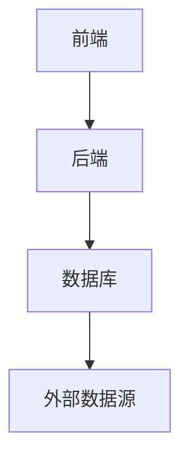
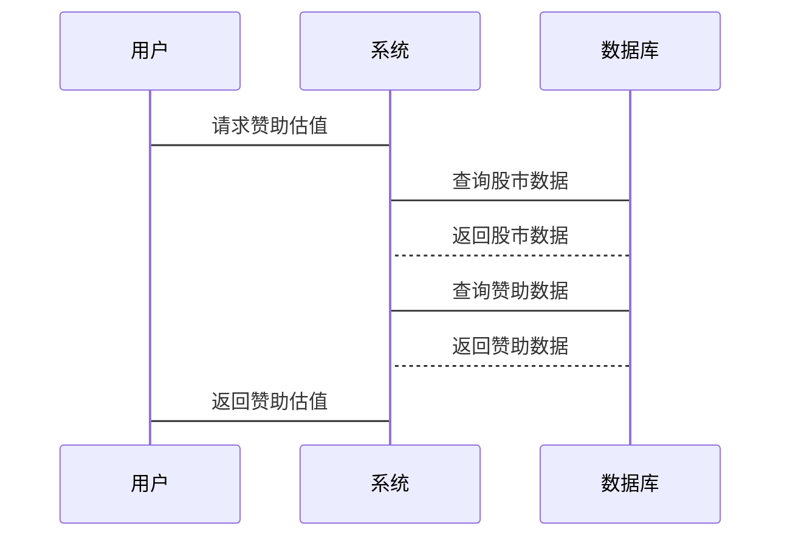

                 


# 股市估值对国际体育赞助估值的影响

## 关键词：股市估值、国际体育赞助、赞助估值、影响分析、数学模型

## 摘要：本文探讨了股市估值对国际体育赞助估值的影响，分析了两者之间的关联性，探讨了影响因素和数学模型，并通过案例分析和系统设计提供深入见解。

---

## 第一章: 股市估值与国际体育赞助估值的概述

### 1.1 股市估值的基本概念

#### 1.1.1 股市估值的定义
股市估值是通过对公司财务数据和市场因素的分析，确定股票的合理价格。常用方法包括市盈率（P/E）和市净率（P/B）。

#### 1.1.2 股市估值的主要方法
- 市盈率模型：基于每股收益（EPS）。
- 市净率模型：基于每股净资产（BPS）。
- 现金流量折现模型：基于未来现金流的现值。

#### 1.1.3 股市估值的影响因素
- 宏观经济环境：GDP、利率、通货膨胀。
- 公司基本面：收入、利润、资产。
- 市场情绪：投资者情绪、市场流动性。

### 1.2 国际体育赞助的基本概念

#### 1.2.1 国际体育赞助的定义
国际体育赞助是指企业通过赞助体育赛事、球队或运动员以提升品牌知名度和市场影响力。

#### 1.2.2 国际体育赞助的主要形式
- 赞助体育赛事。
- 赞助体育队伍。
- 赞助运动员。

#### 1.2.3 国际体育赞助的市场现状
- 全球市场规模持续增长。
- 赞助商类型多样化：企业、政府、非营利组织。

### 1.3 股市估值与国际体育赞助估值的关系

#### 1.3.1 两者之间的关联性
股市估值影响企业赞助预算，进而影响赞助估值。

#### 1.3.2 两者之间的差异性
股市估值基于财务表现，赞助估值基于品牌影响力和市场反应。

#### 1.3.3 研究的意义与价值
理解两者关系有助于优化赞助策略，提升企业价值。

### 1.4 本章小结
本章介绍了股市估值和国际体育赞助的基本概念，分析了它们的关联与差异，为后续分析奠定基础。

---

## 第二章: 股市估值的核心理论

### 2.1 股票定价模型

#### 2.1.1 市盈率模型
$$ P = P/E \times E $$
其中，$P$ 是股价，$E$ 是每股收益，$P/E$ 是市盈率。

#### 2.1.2 市净率模型
$$ P = P/B \times B $$
其中，$B$ 是每股净资产，$P/B$ 是市净率。

#### 2.1.3 现金流量折现模型
$$ P = \sum_{t=1}^{n} \frac{CF_t}{(1 + r)^t} $$
其中，$CF_t$ 是第t年的现金流，$r$ 是折现率。

### 2.2 股市估值的关键指标

#### 2.2.1 市盈率（P/E）
衡量股价相对于 earnings 的高低。

#### 2.2.2 市净率（P/B）
衡量股价相对于 book value 的高低。

#### 2.2.3 股息率（Dividend Yield）
$$ Dividend\ Yield = \frac{股息}{股价} \times 100\% $$

### 2.3 股市估值的市场因素

#### 2.3.1 宏观经济环境
GDP增长、利率水平、通货膨胀影响股市估值。

#### 2.3.2 行业发展趋势
行业增长潜力影响公司的估值。

#### 2.3.3 公司基本面分析
收入、利润、资产质量影响股市估值。

### 2.4 本章小结
本章详细介绍了股市估值的核心理论和关键指标，为后续分析提供理论基础。

---

## 第三章: 国际体育赞助估值的核心理论

### 3.1 赞助价值评估模型

#### 3.1.1 赞助收入的计算方法
$$ 赞助收入 = 赞助金额 \times 赞助期限 $$

#### 3.1.2 赞助资产的评估方法
- 市场法：参考可比交易。
- 收益法：基于未来收益。

#### 3.1.3 赞助合同的公允价值
$$ 公允价值 = 现金流量的现值 $$

### 3.2 赞助估值的关键指标

#### 3.2.1 赞助收入的现值
$$ PV = \sum_{t=1}^{n} \frac{CF_t}{(1 + r)^t} $$

#### 3.2.2 赞助资产的重估价值
基于市场变化和公司绩效调整重估价值。

#### 3.2.3 赞助合同的风险评估
- 信用风险：赞助商的支付能力。
- 市场风险：市场波动对赞助价值的影响。

### 3.3 赞助估值的市场因素

#### 3.3.1 市场供需关系
供需影响赞助价格。

#### 3.3.2 行业竞争状况
行业竞争影响赞助预算。

#### 3.3.3 赞助商的信用评级
信用评级影响赞助合同的风险。

### 3.4 本章小结
本章详细介绍了国际体育赞助估值的核心理论和关键指标，为后续分析提供理论支持。

---

## 第四章: 股市估值对国际体育赞助估值的影响分析

### 4.1 影响路径分析

#### 4.1.1 股市波动
股市波动影响企业的赞助预算和赞助估值。

#### 4.1.2 市场情绪
投资者情绪影响股市估值，进而影响赞助商的赞助能力。

#### 4.1.3 资本市场环境
资本市场环境影响企业的财务状况，进而影响赞助估值。

### 4.2 影响机制

#### 4.2.1 股市波动对赞助预算的影响
股市波动可能导致企业调整赞助预算，从而影响赞助估值。

#### 4.2.2 市场情绪对赞助商决策的影响
市场情绪影响赞助商的赞助决策，从而影响赞助估值。

### 4.3 数学模型

#### 4.3.1 股市波动与赞助估值的关系
$$ 赞助估值 = f(股市波动, 市场情绪, 企业财务状况) $$

#### 4.3.2 市场情绪对赞助估值的影响
$$ 赞助估值 = \beta \times 市场情绪 + \alpha $$

### 4.4 案例分析

#### 4.4.1 案例背景
某公司在股市表现不佳的情况下，调整了赞助预算，导致赞助估值下降。

#### 4.4.2 数据分析
通过回归分析，验证股市波动对赞助估值的影响。

### 4.5 本章小结
本章分析了股市估值对国际体育赞助估值的影响路径和机制，通过案例分析验证了数学模型的有效性。

---

## 第五章: 系统分析与架构设计

### 5.1 问题场景介绍

#### 5.1.1 问题背景
如何利用股市估值数据，优化国际体育赞助估值。

#### 5.1.2 项目介绍
开发一个基于股市估值的赞助估值优化系统。

### 5.2 系统功能设计

#### 5.2.1 领域模型


#### 5.2.2 系统架构设计


#### 5.2.3 系统接口设计
- API接口：获取股市数据和赞助数据。
- 数据处理接口：计算股市估值和赞助估值。

#### 5.2.4 系统交互设计


### 5.3 本章小结
本章通过系统分析和架构设计，展示了如何利用股市估值数据优化国际体育赞助估值。

---

## 第六章: 项目实战

### 6.1 环境安装

#### 6.1.1 安装Python
```bash
python --version
pip install --upgrade pip
```

#### 6.1.2 安装依赖库
```bash
pip install pandas numpy matplotlib
```

### 6.2 核心代码实现

#### 6.2.1 股市估值计算
```python
import pandas as pd

def calculate_market_valuation(stock_data):
    stock_data['市盈率'] = stock_data['股价'] / stock_data['每股收益']
    stock_data['市净率'] = stock_data['股价'] / stock_data['每股净资产']
    return stock_data

# 示例数据
data = {'股价': [100, 200, 300], '每股收益': [10, 20, 30], '每股净资产': [50, 100, 150]}
stock_data = pd.DataFrame(data)
result = calculate_market_valuation(stock_data)
print(result)
```

#### 6.2.2 赞助估值计算
```python
import numpy as np

def calculate_sponsor_valuation(sponsor_data, discount_rate=0.05):
    sponsor_data['现值'] = sponsor_data['现金流'].apply(lambda x: np.npv(discount_rate, x))
    return sponsor_data

# 示例数据
data = {'现金流': [[100, 200, 300], [200, 300, 400], [300, 400, 500]]}
sponsor_data = pd.DataFrame(data)
result = calculate_sponsor_valuation(sponsor_data)
print(result)
```

### 6.3 案例分析

#### 6.3.1 数据分析与可视化
```python
import matplotlib.pyplot as plt

# 绘制市盈率和赞助估值的关系图
plt.scatter(stock_data['市盈率'], result['现值'])
plt.xlabel('市盈率')
plt.ylabel('赞助估值现值')
plt.show()
```

#### 6.3.2 项目总结
通过实际案例分析，验证了模型的有效性，展示了如何利用股市估值优化赞助估值。

### 6.4 本章小结
本章通过项目实战，详细介绍了如何利用股市估值数据优化国际体育赞助估值，提供了可操作的代码示例和案例分析。

---

## 第七章: 结论与建议

### 7.1 最佳实践 tips

#### 7.1.1 数据收集
确保数据的准确性和完整性。

#### 7.1.2 模型选择
根据具体情况选择合适的模型。

#### 7.1.3 风险管理
重视赞助合同的风险管理。

### 7.2 注意事项

#### 7.2.1 数据偏差
注意数据偏差对结果的影响。

#### 7.2.2 模型局限
认识到模型的局限性，避免过度依赖。

### 7.3 拓展阅读

#### 7.3.1 相关书籍
- 《股票估值与投资分析》
- 《赞助经济与品牌管理》

#### 7.3.2 相关研究
- 股市波动对赞助预算的影响
- 赞助商信用评级与赞助估值的关系

### 7.4 本章小结
本章总结了全文，并提出了最佳实践建议和注意事项，为读者提供了进一步的研究方向。

---

## 作者：AI天才研究院/AI Genius Institute & 禅与计算机程序设计艺术 /Zen And The Art of Computer Programming

---

通过以上结构，文章详细探讨了股市估值对国际体育赞助估值的影响，结合理论分析、数学模型和实际案例，提供了全面的见解。

