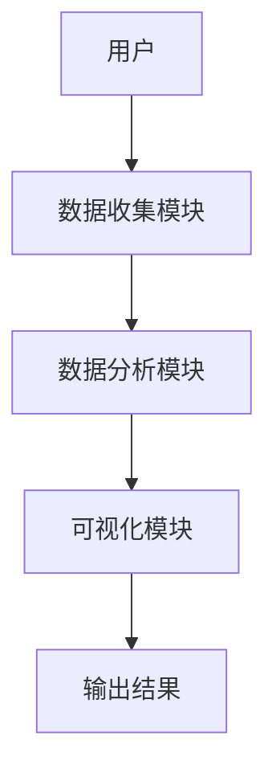

                 


# 股市估值对国际体育赞助效果评估的影响

## 关键词：股市估值、国际体育赞助、赞助效果评估、股票定价模型、体育市场分析

## 摘要：  
本文探讨了股市估值对国际体育赞助效果评估的影响。通过分析股市波动、股票定价模型与赞助效果之间的关系，提出了基于股市数据优化赞助效果评估的方法。文章从核心概念、数学模型、算法实现到系统设计，全面阐述了如何利用股市估值优化国际体育赞助策略。

---

# 第一部分: 背景介绍

## 第1章: 股市估值与国际体育赞助概述

### 1.1 问题背景
#### 1.1.1 股市估值的基本概念
股市估值是通过对企业的财务数据、市场表现和行业地位等多维度分析，评估公司股票的合理价格范围。常用的估值指标包括市盈率（P/E）、市净率（P/B）等。

#### 1.1.2 国际体育赞助的定义与现状
国际体育赞助是指企业通过赞助体育赛事、球队或运动员以提升品牌知名度和市场影响力。近年来，全球体育赞助市场规模迅速增长，赞助商的决策越来越依赖于数据分析。

#### 1.1.3 股市估值与国际体育赞助的关联性
股市估值为企业提供了一个衡量市场表现的基准，而国际体育赞助的效果直接影响企业的品牌价值和市场表现，两者相互影响。

### 1.2 问题描述
#### 1.2.1 股市估值对赞助效果的影响
股市波动会影响赞助商的市值，进而影响赞助决策和效果评估。

#### 1.2.2 国际体育赞助的评估难点
传统评估方法缺乏对股市波动的考量，导致评估结果不够准确。

#### 1.2.3 股市波动对赞助商价值的影响
股市波动可能引发赞助商的短期行为，影响赞助效果的长期稳定性。

### 1.3 问题解决
#### 1.3.1 股市估值对赞助效果评估的作用
通过分析股市估值，可以更准确地评估赞助效果。

#### 1.3.2 股市波动对赞助商决策的影响
股市波动提醒赞助商关注市场风险，优化赞助策略。

#### 1.3.3 如何通过股市估值优化赞助效果
结合股市估值数据，建立动态评估模型，实时调整赞助策略。

### 1.4 边界与外延
#### 1.4.1 股市估值的适用范围
适用于上市公司和大型跨国企业。

#### 1.4.2 国际体育赞助的边界条件
涉及企业品牌价值、市场影响力等多方面因素。

#### 1.4.3 股市波动对赞助商的潜在影响
可能引发赞助商的短期行为，影响赞助效果的稳定性。

### 1.5 概念结构与核心要素组成
#### 1.5.1 股市估值的核心要素
- 股票价格
- 市盈率（P/E）
- 市净率（P/B）

#### 1.5.2 国际体育赞助的核心要素
- 赞助金额
- 品牌曝光度
- 市场影响力

#### 1.5.3 两者的关联性分析
股市波动影响赞助商的市值，进而影响赞助决策和效果评估。

---

# 第二部分: 核心概念与联系

## 第2章: 核心概念原理

### 2.1 股市估值的原理
#### 2.1.1 股票定价模型
股票价格 = 市盈率 × 每股收益（EPS）

#### 2.1.2 市盈率与市净率的计算
- 市盈率（P/E）= 股价 ÷ 每股收益
- 市净率（P/B）= 股价 ÷ 每股净资产

#### 2.1.3 股市波动的影响因素
- 宏观经济环境
- 公司财务状况
- 市场情绪

### 2.2 国际体育赞助的原理
#### 2.2.1 赞助商的投入与回报
赞助投入 = 赞助金额 + 品牌曝光度
赞助回报 = 品牌价值提升 + 市场影响力增强

#### 2.2.2 赞助效果的评估指标
- 品牌知名度提升
- 销售额增长
- 市场份额扩大

#### 2.2.3 赞助商的决策逻辑
赞助商通过评估赞助效果，决定是否继续或调整赞助策略。

### 2.3 核心概念的联系
#### 2.3.1 股市估值对赞助商决策的影响
股市波动会影响赞助商的市值，进而影响赞助决策。

#### 2.3.2 股市波动对赞助效果的潜在影响
股市波动可能导致赞助商调整赞助策略，影响赞助效果的稳定性。

#### 2.3.3 如何通过股市估值优化赞助效果
结合股市估值数据，建立动态评估模型，实时调整赞助策略。

### 2.4 核心概念属性对比表格
| 概念       | 股市估值       | 国际体育赞助       |
|------------|---------------|-------------------|
| 核心指标   | 市盈率、市净率 | 赞助金额、品牌曝光度 |
| 影响因素   | 宏观经济、公司财务状况 | 品牌价值、市场影响力 |
| 目标       | 评估企业市值   | 提升品牌知名度     |

### 2.5 ER实体关系图
```mermaid
erd
  entity 股市估值 {
    <股票代码, 股价, 市盈率, 市净率>
  }
  
  entity 国际体育赞助 {
    <赞助商ID, 赞助金额, 赞助效果>
  }
  
  relation 关联关系 {
    股市估值 --> 国际体育赞助 : 通过股市数据优化赞助效果
  }
```

---

# 第三部分: 算法原理讲解

## 第3章: 算法原理

### 3.1 股市估值对赞助效果评估的算法
#### 3.1.1 算法原理
通过回归分析，建立股市估值与赞助效果之间的关系模型。

#### 3.1.2 回归分析公式
$$ y = \beta_0 + \beta_1x + \epsilon $$
其中：
- y：赞助效果
- x：股市估值指标（如市盈率）
- β0：截距
- β1：回归系数
- ε：误差项

#### 3.1.3 算法实现步骤
1. 收集股市估值数据和赞助效果数据。
2. 建立回归模型。
3. 计算回归系数。
4. 验证模型显著性。
5. 应用模型进行预测。

#### 3.1.4 代码实现
```python
import statsmodels.api as sm

# 数据准备
X = df['市盈率'].values
y = df['赞助效果'].values

# 增加截距项
X = sm.add_constant(X)

# 回归分析
model = sm.OLS(y, X).fit()
print(model.summary())
```

---

## 第4章: 数学模型

### 4.1 股市估值与赞助效果的关系模型
$$ 赞助效果 = \beta_0 + \beta_1 \times 市盈率 + \epsilon $$

### 4.2 股市波动对赞助商价值的影响模型
$$ 股市波动 = \alpha \times 市盈率 + \beta \times 市净率 + \gamma $$

---

## 第5章: 系统分析与架构设计

### 5.1 问题场景介绍
构建一个基于股市估值的国际体育赞助效果评估系统，帮助赞助商优化赞助策略。

### 5.2 系统功能设计
- 数据收集模块：收集股市估值和赞助效果数据。
- 数据分析模块：建立回归模型，评估赞助效果。
- 可视化模块：展示分析结果。

### 5.3 系统架构设计


---

## 第6章: 项目实战

### 6.1 环境安装
安装必要的Python库：
```bash
pip install pandas statsmodels matplotlib
```

### 6.2 核心代码实现
```python
import pandas as pd
import statsmodels.api as sm
import matplotlib.pyplot as plt

# 数据加载
df = pd.read_csv('data.csv')

# 数据分析
X = df['市盈率'].values
y = df['赞助效果'].values

X = sm.add_constant(X)
model = sm.OLS(y, X).fit()

# 可视化
plt.scatter(X[:, 1], y)
plt.plot(X[:, 1], model.predict(X), 'r')
plt.xlabel('市盈率')
plt.ylabel('赞助效果')
plt.show()
```

### 6.3 实际案例分析
以某公司为例，分析其股市估值与赞助效果的关系，调整赞助策略。

### 6.4 项目小结
总结项目实施的经验和教训，提出改进建议。

---

## 第7章: 最佳实践

### 7.1 小结
股市估值对国际体育赞助效果评估具有重要影响，建议企业在赞助决策中考虑股市波动因素。

### 7.2 注意事项
- 数据质量是关键。
- 模型需要不断优化。
- 考虑宏观经济环境的影响。

### 7.3 拓展阅读
推荐相关书籍和文献，供读者深入学习。

---

## 作者信息

作者：AI天才研究院/AI Genius Institute & 禅与计算机程序设计艺术/Zen And The Art of Computer Programming

---

通过以上结构，文章详细阐述了股市估值对国际体育赞助效果评估的影响，结合理论分析、算法实现和项目实战，为读者提供了全面的解决方案。

