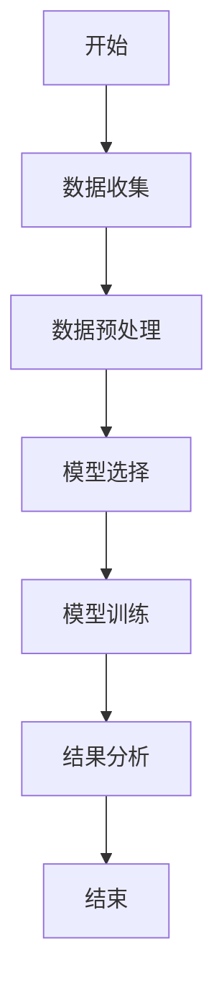
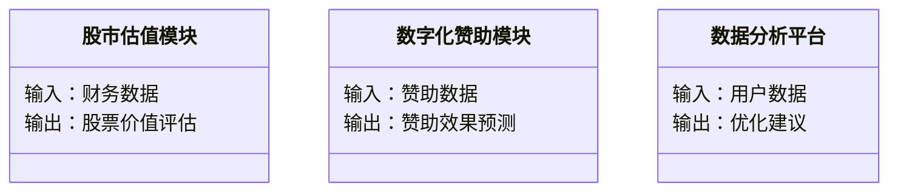

                 


# 股市估值对国际体育赞助数字化的影响

> 关键词：股市估值，国际体育赞助，数字化，算法模型，系统架构

> 摘要：本文探讨了股市估值对国际体育赞助数字化的影响，分析了数字化如何改变体育赞助的模式和价值评估，并提出了基于算法模型的解决方案。通过系统架构设计和实际案例分析，本文揭示了数字化对体育赞助市场的深远影响。

---

## 第一部分：背景介绍

### 第1章：股市估值与国际体育赞助概述

#### 1.1 股市估值的基本概念

股市估值是通过对公司财务状况、市场表现和行业趋势等多方面因素的分析，来确定公司股票的合理价值范围。常用的方法包括市盈率（P/E）、市净率（P/B）和现金流折现法（DCF）等。

#### 1.2 国际体育赞助的现状

国际体育赞助是指企业通过赞助体育赛事、球队或运动员来提升品牌影响力和市场占有率。近年来，随着体育产业的全球化，国际体育赞助市场呈现出快速增长的趋势。赞助模式包括现金赞助、产品赞助和联合赞助等。

#### 1.3 数字化对体育赞助的影响

数字化技术（如大数据分析、人工智能和区块链）的引入，使得体育赞助更加精准和高效。例如，通过数据分析可以更好地匹配赞助商与目标受众，优化赞助效果。

---

## 第二部分：核心概念与联系

### 第2章：股市估值与体育赞助的数字化关系

#### 2.1 核心概念的原理

- 股市估值的原理：基于公司基本面和市场情绪，评估其股票的内在价值。
- 体育赞助数字化的原理：通过数据驱动的方法，优化赞助策略和提升赞助效果。

#### 2.2 核心概念的属性特征对比

| 属性       | 股市估值                 | 体育赞助数字化               |
|------------|--------------------------|-----------------------------|
| 输入数据   | 财务数据、市场数据       | 用户数据、赛事数据           |
| 输出结果   | 股票价值评估             | 赞助效果预测、优化建议         |
| 应用场景   | 投资决策、风险管理       | 品牌推广、市场营销             |
| 技术工具   | 财务模型、统计分析       | 数据挖掘、机器学习             |

#### 2.3 ER实体关系图

```mermaid
er
actor 股市投资者
actor 赞助商
actor 体育组织
actor 数据分析平台
```

---

## 第三部分：算法原理讲解

### 第3章：股市估值与赞助数字化的算法模型

#### 3.1 算法原理概述

- 股市估值模型：基于CAPM（资本资产定价模型）和DCF（现金流折现法）。
- 数字化赞助分析模型：基于回归分析和聚类分析。

#### 3.2 算法流程图



#### 3.3 算法实现代码

以下是基于CAPM模型的Python代码：

```python
import pandas as pd
import numpy as np

# 数据预处理
data = pd.read_csv('stock_data.csv')
data = data.dropna()

# 计算CAPM模型
def capm(rf, beta, market_return):
    return rf + beta * (market_return - rf)

# 示例计算
rf = 0.05
beta = 1.2
market_return = 0.1
expected_return = capm(rf, beta, market_return)
print(f"Expected return: {expected_return}")
```

---

## 第四部分：数学模型与公式

### 第4章：相关数学模型与公式

#### 4.1 股市估值模型

CAPM模型公式：
$$ E(r_i) = r_f + \beta_i (E(r_m) - r_f) $$

其中：
- $E(r_i)$：资产的预期收益率
- $r_f$：无风险利率
- $\beta_i$：资产的贝塔系数
- $E(r_m)$：市场预期收益率

#### 4.2 数字化赞助分析模型

回归分析模型公式：
$$ y = \beta_0 + \beta_1 x_1 + \beta_2 x_2 + \epsilon $$

其中：
- $y$：赞助效果
- $x_1, x_2$：影响因素（如观众数量、社交媒体互动）

---

## 第五部分：系统分析与架构设计

### 第5章：系统分析与架构设计

#### 5.1 问题场景介绍

- 问题背景：国际体育赞助市场日益数字化，企业需要通过数据驱动的方法优化赞助策略。
- 问题目标：设计一个基于数字化的赞助评估系统，帮助赞助商和体育组织提高赞助效率。

#### 5.2 系统功能设计



#### 5.3 系统架构设计


---

## 第六部分：项目实战

### 第6章：项目实战与案例分析

#### 6.1 环境安装

- 安装Python和必要的库（如Pandas、NumPy）。
- 安装数据分析平台（如Tableau或Power BI）。

#### 6.2 核心代码实现

以下是赞助效果预测的Python代码：

```python
import pandas as pd
import numpy as np
from sklearn.linear_model import LinearRegression

# 数据加载
data = pd.read_csv('sponsor_data.csv')

# 数据分割
X = data[['观众数量', '社交媒体互动']]
y = data['赞助效果']

# 模型训练
model = LinearRegression()
model.fit(X, y)

# 预测
new_data = pd.DataFrame({'观众数量': [100000], '社交媒体互动': [5000]})
predicted = model.predict(new_data)
print(f"预测赞助效果：{predicted[0][0]}")
```

#### 6.3 代码解读与分析

- 代码功能：通过线性回归模型预测赞助效果。
- 输入数据：观众数量和社交媒体互动。
- 输出结果：赞助效果预测值。

#### 6.4 实际案例分析

以英超联赛为例，分析赞助商的数字化投入如何影响赞助效果。通过数据模型，可以预测出最佳赞助策略和投资回报。

---

## 第七部分：总结与展望

### 第7章：总结与展望

#### 7.1 项目小结

本文通过分析股市估值与国际体育赞助数字化的关系，提出了基于算法模型的解决方案，并通过案例分析验证了数字化对赞助效果的提升作用。

#### 7.2 注意事项

- 数据质量和完整性是影响模型准确性的关键因素。
- 需要定期更新模型以适应市场变化。

#### 7.3 拓展阅读

建议进一步研究如何将区块链技术应用于体育赞助的透明化管理。

---

## 作者：AI天才研究院 & 禅与计算机程序设计艺术

