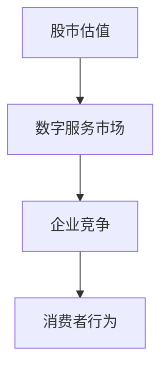
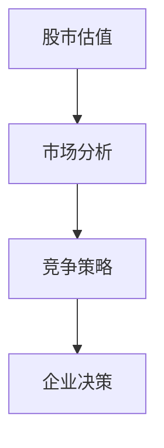
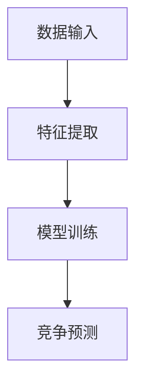

                 


# 股市估值对国际数字服务市场竞争格局的影响

> 关键词：股市估值，国际数字服务市场，市场竞争，企业价值评估，数据驱动决策

> 摘要：本文探讨股市估值对国际数字服务市场竞争格局的影响，从股市估值的核心概念、数字服务市场的现状、股市估值与市场竞争的关系，到具体案例分析和企业应对策略，全面解析股市估值如何影响数字服务市场的竞争格局。通过理论分析、算法原理和实际案例相结合的方式，揭示股市估值对数字服务市场发展的深远影响。

---

# 第一部分：股市估值与国际数字服务市场背景

## 第1章：股市估值与国际数字服务市场背景

### 1.1 股市估值的基本概念

#### 1.1.1 股市估值的定义与作用
股市估值是通过对企业的财务数据、市场表现和行业地位等多方面因素的分析，评估企业的内在价值和市场价值。股市估值不仅是投资者决策的重要依据，也是企业制定战略规划的重要参考。它能够反映出企业的盈利能力、成长潜力和风险水平，从而影响市场的竞争格局。

#### 1.1.2 国际数字服务市场的基本特征
国际数字服务市场是指在全球范围内提供数字化产品和服务的市场，包括互联网、云计算、大数据、人工智能、电子商务等领域。数字服务市场的核心特征是高度的技术依赖性、快速的创新节奏和全球化的竞争格局。数字服务市场的参与者包括科技巨头、新兴企业和创新型初创公司，市场门槛高，竞争激烈。

#### 1.1.3 股市估值与市场竞争的关联性
股市估值是企业市场地位和竞争力的体现。在数字服务市场中，企业的估值往往与其技术创新能力、市场份额、用户黏性和盈利能力密切相关。高估值的企业通常具有更强的市场竞争力，能够吸引更多的投资和人才，从而进一步巩固其市场地位。

---

### 1.2 国际数字服务市场的现状

#### 1.2.1 数字服务市场的定义与范围
数字服务市场是指通过数字化技术提供服务的市场，涵盖信息技术服务、在线教育、金融科技、数字营销等多个领域。数字服务市场的范围随着技术的进步和需求的变化不断扩大，成为推动全球经济增长的重要引擎。

#### 1.2.2 全球数字服务市场的分布与竞争格局
全球数字服务市场的竞争格局呈现出明显的区域化特征。美国、中国和欧洲是数字服务市场的三大主要区域，分别以科技巨头为核心，形成不同的生态系统。例如，美国的硅谷是全球数字服务市场的创新中心，而中国的互联网企业则在本土市场占据主导地位。

#### 1.2.3 数字服务市场的核心驱动因素
数字服务市场的核心驱动力包括技术创新、政策支持、用户需求和资本投入。技术创新是推动数字服务市场发展的核心动力，而政策支持和用户需求则为企业提供了发展的土壤。资本投入则是企业扩张和竞争的重要保障。

---

### 1.3 股市估值对市场竞争的影响

#### 1.3.1 股市估值的多维度分析
股市估值不仅仅是对企业的财务数据进行分析，还包括对其市场地位、技术创新能力和未来发展潜力的综合评估。在数字服务市场中，企业的估值往往与其技术优势、市场份额和用户增长密切相关。

#### 1.3.2 股市估值与企业市场地位的关系
高估值的企业通常具有更强的市场地位和竞争优势。例如，苹果、谷歌和亚马逊等科技巨头的高估值不仅反映了其强大的盈利能力，也体现了其在全球数字服务市场中的领导地位。相反，低估值的企业可能面临市场竞争的压力，需要通过技术创新和市场拓展来提升其市场地位。

#### 1.3.3 股市估值对行业竞争格局的塑造作用
股市估值通过影响企业的市场地位和竞争优势，对行业竞争格局产生深远影响。高估值企业能够吸引更多的投资和人才，进一步巩固其市场地位；而低估值企业则需要通过优化管理和创新来提升其竞争力。这种动态过程推动了数字服务市场的优胜劣汰和良性发展。

---

## 第2章：股市估值与国际数字服务市场的核心概念

### 2.1 核心概念与属性对比

#### 2.1.1 股市估值的核心要素
股市估值的核心要素包括企业的财务数据、市场表现、行业地位和技术创新能力。这些要素共同构成了企业的内在价值和市场价值。

#### 2.1.2 数字服务市场的核心要素
数字服务市场的核心要素包括技术创新能力、用户需求、政策环境和市场竞争。这些要素共同决定了数字服务市场的规模和竞争格局。

#### 2.1.3 两者的属性对比分析
股市估值和数字服务市场的核心要素在许多方面存在差异。例如，股市估值更关注企业的财务表现和市场地位，而数字服务市场更关注技术创新和用户需求。然而，两者在动态竞争中相互影响，共同塑造了市场的竞争格局。

---

### 2.2 实体关系与架构设计

#### 2.2.1 股市估值与数字服务市场的实体关系图


#### 2.2.2 核心概念的系统架构图


---

## 第3章：股市估值对市场竞争的算法原理

### 3.1 股市估值的核心算法

#### 3.1.1 股票估值的数学模型
股票估值的数学模型可以通过以下公式表示：
$$ P = \frac{E}{E_P} $$
其中，P为股票价格，E为每股收益，E_P为折现率。

#### 3.1.2 竞争分析的机器学习算法
竞争分析的机器学习算法可以通过以下流程图表示：


---

### 3.2 算法实现与代码示例

#### 3.2.1 数据预处理
```python
import pandas as pd
data = pd.read_csv('market_data.csv')
```

#### 3.2.2 模型训练
```python
from sklearn.linear_model import LinearRegression
model = LinearRegression()
model.fit(X, y)
```

---

## 第4章：股市估值对国际数字服务市场的影响

### 4.1 股市估值对市场竞争格局的影响
股市估值通过影响企业的市场地位和竞争优势，对数字服务市场的竞争格局产生深远影响。高估值企业能够吸引更多的投资和人才，进一步巩固其市场地位；而低估值企业则需要通过优化管理和创新来提升其竞争力。这种动态过程推动了数字服务市场的优胜劣汰和良性发展。

---

## 第5章：企业应对策略

### 5.1 制定合理的企业估值策略
企业应根据自身的财务状况、市场表现和行业地位，制定合理的估值策略。这包括优化财务数据、提升市场表现和加强技术创新能力。

### 5.2 加强技术创新与研发投入
技术创新是推动数字服务市场发展的核心动力。企业应加大研发投入，不断提升自身的技术创新能力，以应对市场竞争的挑战。

### 5.3 优化管理与提升用户体验
优化管理和提升用户体验是企业提升市场竞争力的重要途径。企业应通过优化内部管理流程，提升用户体验，从而增强市场竞争力。

---

## 第6章：未来趋势与展望

### 6.1 股市估值与数字服务市场的未来发展趋势
随着技术的进步和市场的不断发展，股市估值对数字服务市场的影响将更加深远。未来，数字服务市场将更加依赖技术创新和数据驱动决策，股市估值也将更加关注企业的技术创新能力和未来发展潜力。

### 6.2 数据驱动决策与智能化投资
数据驱动决策和智能化投资将成为未来股市估值的重要趋势。通过大数据和人工智能技术，投资者可以更准确地评估企业的市场价值和竞争优势，从而做出更明智的投资决策。

---

## 第7章：最佳实践与小结

### 7.1 最佳实践 tips
- 企业应根据自身的财务状况、市场表现和行业地位，制定合理的估值策略。
- 加大研发投入，不断提升自身的技术创新能力，以应对市场竞争的挑战。
- 优化管理和提升用户体验，从而增强市场竞争力。

### 7.2 小结
股市估值对国际数字服务市场竞争格局的影响是深远的。通过合理制定企业估值策略、加强技术创新与研发投入，以及优化管理与提升用户体验，企业可以更好地应对市场竞争的挑战，实现可持续发展。

---

## 附录：扩展阅读与参考资料

### 附录A：相关数据来源与工具
- 数据来源：股票数据、市场报告、行业分析报告
- 工具：Python、Pandas、NumPy、Scikit-learn、Mermaid

### 附录B：推荐阅读书籍与文章
- 《股票投资实战技巧》
- 《数字服务市场的现状与未来》
- 《大数据与人工智能技术的应用》

---

作者：AI天才研究院/AI Genius Institute & 禅与计算机程序设计艺术 /Zen And The Art of Computer Programming

