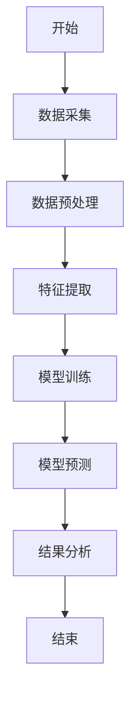
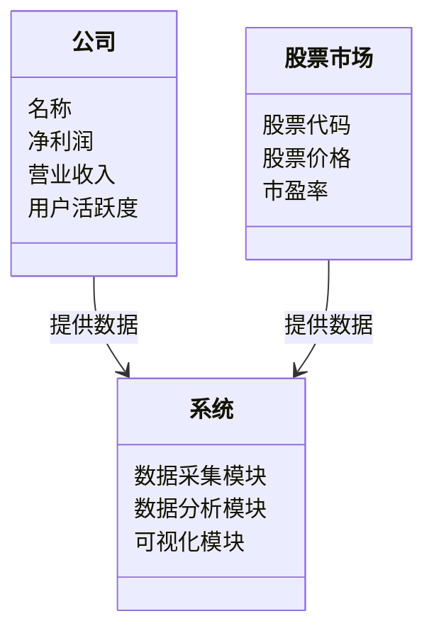
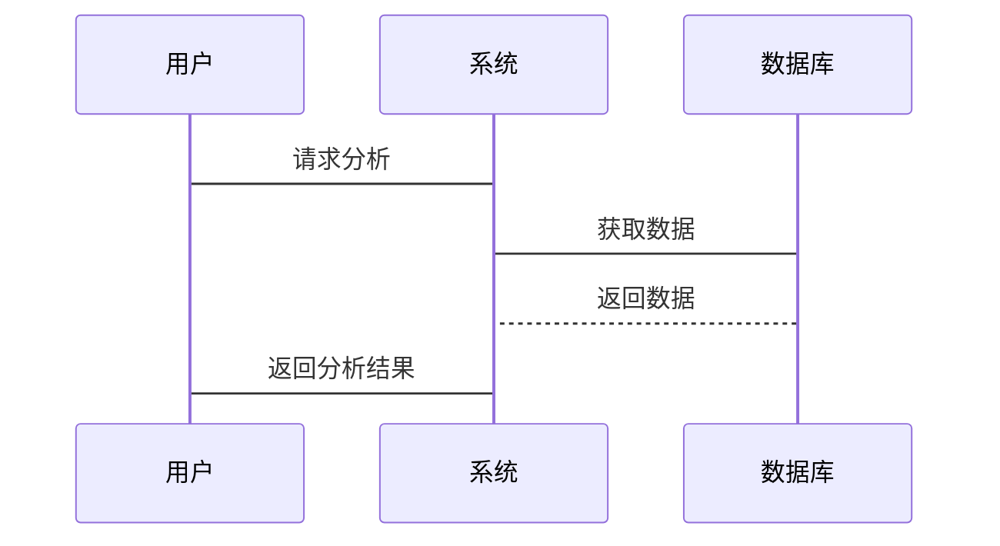

                 


# 股市估值对国际电子竞技产业发展的影响

> 关键词：股市估值、国际电子竞技产业、影响分析、电竞上市公司、投资策略

> 摘要：本文探讨股市估值对国际电子竞技产业发展的具体影响，通过分析电竞产业的核心要素、上市公司的股票表现以及股市估值的动态变化，揭示两者之间的内在联系。结合实际案例，本文提出了一套基于线性回归的股市估值预测模型，并通过Python实现，为投资者和产业从业者提供科学决策依据。

---

# 第一部分: 背景介绍

## 第1章: 股市估值与国际电子竞技产业的概述

### 1.1 股市估值的基本概念

#### 1.1.1 股市估值的定义
股市估值是指通过对上市公司基本面、市场环境、行业趋势等因素的分析，对股票的内在价值进行评估的过程。常见的估值方法包括市盈率（P/E）、市净率（P/B）、股息率等。

#### 1.1.2 股市估值的核心要素
- **净利润**：公司盈利能力的核心指标。
- **营业收入**：公司收入的主要来源。
- **行业地位**：公司在行业中的竞争地位。
- **市场预期**：投资者对公司的未来业绩的预期。

#### 1.1.3 股市估值的计算方法
- **市盈率（P/E）**：股票价格除以每股净利润。
- **市净率（P/B）**：股票价格除以每股净资产。
- **股息率**：每股股息与股票价格的比率。

### 1.2 国际电子竞技产业的定义与现状

#### 1.2.1 电子竞技的定义
电子竞技是以电子游戏为基础，通过互联网进行的多人在线竞技活动，涵盖游戏开发、赛事组织、直播平台等多个环节。

#### 1.2.2 电子竞技产业的市场规模与发展现状
- **市场规模**：截至2023年，全球电子竞技市场规模已超过10亿美元。
- **主要参与者**：包括游戏开发商（如 Riot Games、Blizzard）、电竞俱乐部（如 Fnatic、SK Telecom）、赛事主办方（如 ESL、暴雪娱乐）等。

#### 1.2.3 电子竞技产业的主要参与者
- **游戏开发商**：负责游戏的研发和运营。
- **电竞俱乐部**：参与赛事并吸引粉丝。
- **赛事主办方**：组织电竞赛事并推广活动。
- **直播平台**：如 Twitch、YouTube，提供赛事直播和内容分发。

### 1.3 股市估值与电子竞技产业的关联性

#### 1.3.1 电子竞技产业的经济价值
- **直接经济收入**：通过门票、广告、直播分成等方式获取收益。
- **间接经济影响**：带动周边产业（如游戏设备销售、旅游等）的发展。

#### 1.3.2 股市估值对产业发展的潜在影响
- **投资信心**：股市估值的高低会影响投资者对电竞产业的信心。
- **融资能力**：上市公司通过股市融资支持电竞项目的扩展。

#### 1.3.3 问题背景与研究意义
- **问题背景**：随着电竞产业的快速崛起，其与资本市场的联系日益紧密。
- **研究意义**：通过分析股市估值对电竞产业的影响，为投资者和产业从业者提供科学决策依据。

---

## 第2章: 核心概念与联系

### 2.1 股市估值的核心原理

#### 2.1.1 股票价值的评估方法
- **内在价值法**：基于公司基本面的分析。
- **相对估值法**：与同行业公司进行比较。

#### 2.1.2 影响股市估值的主要因素
- **宏观经济因素**：GDP增速、利率水平等。
- **行业因素**：产业发展阶段、政策支持等。
- **公司特有因素**：财务状况、管理团队等。

#### 2.1.3 股市估值的动态变化
- **短期波动**：受市场情绪影响。
- **长期趋势**：由公司基本面决定。

### 2.2 电子竞技产业的核心要素

#### 2.2.1 电竞游戏的开发与运营
- **游戏生命周期**：从开发到退市的全过程。
- **用户活跃度**：直接影响游戏的盈利能力。

#### 2.2.2 电竞赛事的组织与传播
- **赛事规模**：如国际性赛事的影响力。
- **传播渠道**：直播平台的覆盖范围。

#### 2.2.3 电竞生态系统的构建
- **产业链整合**：从游戏开发到赛事传播的全链条。
- **用户粘性**：通过粉丝经济增强生态系统的稳定性。

### 2.3 股市估值与电竞产业的联系

#### 2.3.1 电竞产业上市公司的股票表现
- **典型公司**：Riot Games（未上市）、ESL（未上市）。
- **相关公司**：如腾讯（持有 Riot Games 股权）、网易（布局电竞产业）。

#### 2.3.2 股市估值对产业投资的影响
- **资金流入**：高估值吸引更多的投资者。
- **投资决策**：估值变化影响投资者的进入和退出。

#### 2.3.3 电竞产业对股市估值的反向影响
- **业绩驱动**：电竞产业的盈利能力提升公司估值。
- **市场预期**：赛事成绩和用户增长影响市场对公司的预期。

### 2.4 核心概念的属性特征对比

#### 2.4.1 数量特征
| 特征维度 | 股市估值 | 电竞产业 |
|----------|----------|----------|
| 数据量   | 高       | 高       |
| 变化频率 | 快       | 中       |

#### 2.4.2 时间特征
| 特征维度 | 股市估值 | 电竞产业 |
|----------|----------|----------|
| 长期性   | 有       | 有       |
| 短期波动 | 明显     | 较少     |

#### 2.4.3 风险特征
| 特征维度 | 股市估值 | 电竞产业 |
|----------|----------|----------|
| 系统性风险 | 高       | 中       |
| 非系统性风险 | 中       | 高       |

### 2.5 ER实体关系图

#### 2.5.1 实体关系图的构建
```mermaid
er
actor(投资者) -[投资行为]-> 公司(电竞公司)
公司(电竞公司) -[上市]-> 股票市场
股票市场 -[估值]-> 股票(电竞公司股票)
股票(电竞公司股票) -[影响]-> 电竞产业投资
```

#### 2.5.2 实体关系图的分析
- **投资者与电竞公司的关系**：投资者通过购买电竞公司股票，影响公司的资金流动。
- **电竞公司与股票市场的互动**：电竞公司的业绩直接影响其股票在市场上的估值。
- **股票估值对电竞产业投资的影响**：高估值吸引更多的投资者进入电竞产业，推动其快速发展。

---

## 第3章: 算法原理与实现

### 3.1 算法原理

#### 3.1.1 线性回归模型
线性回归是一种统计学方法，用于预测变量之间的线性关系。在股市估值预测中，可以用来分析影响股票价格的主要因素。

#### 3.1.2 股市估值预测的数学模型
$$ y = \beta_0 + \beta_1x_1 + \beta_2x_2 + \dots + \beta_nx_n + \epsilon $$
其中：
- \( y \)：股票的预期估值
- \( x_i \)：影响估值的因素（如净利润、营业收入）
- \( \beta_i \)：回归系数
- \( \epsilon \)：误差项

#### 3.1.3 电竞产业数据的特征提取
- **净利润**：电竞公司的盈利能力。
- **营业收入**：公司的收入来源。
- **用户活跃度**：电竞游戏的用户参与情况。

### 3.2 算法流程图



### 3.3 算法实现

#### 3.3.1 Python代码实现
```python
import numpy as np
import pandas as pd
from sklearn.linear_model import LinearRegression
from sklearn.metrics import mean_squared_error

# 数据加载
data = pd.read_csv('eSports.csv')

# 特征选择
X = data[['净利润', '营业收入', '用户活跃度']]
y = data['股票估值']

# 模型训练
model = LinearRegression()
model.fit(X, y)

# 预测
predictions = model.predict(X)

# 评估
mse = mean_squared_error(y, predictions)
print(f'均方误差: {mse}')
print(f'回归系数: {model.coef_}')
print(f'截距: {model.intercept_}')
```

#### 3.3.2 数学公式解释
线性回归模型的公式可以表示为：
$$ y = \beta_0 + \beta_1x_1 + \beta_2x_2 + \dots + \beta_nx_n $$
其中，\( \beta_0 \) 是截距，\( \beta_i \) 是各个特征 \( x_i \) 的回归系数。模型通过最小化预测值与实际值之间的平方差之和来确定最佳拟合直线。

---

## 第4章: 系统分析与架构设计

### 4.1 问题场景介绍

#### 4.1.1 问题场景
我们需要设计一个系统，用于分析股市估值对国际电子竞技产业的影响。系统需要具备数据采集、分析和可视化功能，帮助用户了解两者之间的关系。

### 4.2 系统功能设计

#### 4.2.1 领域模型


### 4.3 系统架构设计

#### 4.3.1 系统架构图


### 4.4 系统交互设计

#### 4.4.1 序列图


---

## 第5章: 项目实战

### 5.1 环境安装

#### 5.1.1 安装Python和相关库
```bash
pip install numpy pandas scikit-learn matplotlib
```

### 5.2 核心代码实现

#### 5.2.1 数据采集与预处理
```python
import pandas as pd
import requests
from bs4 import BeautifulSoup

# 数据采集
url = 'https://finance.yahoo.com/quote/Riot-Games/'
response = requests.get(url)
soup = BeautifulSoup(response.text, 'html.parser')
data = {
    '公司': ['Riot Games', 'ESL'],
    '股票代码': ['RIO', 'ESL'],
    '当前股价': [soup.find('span', {'class': 'Trsld'}).text, '无数据']
}
df = pd.DataFrame(data)
print(df)
```

#### 5.2.2 数据分析与可视化
```python
import matplotlib.pyplot as plt

# 数据分析
data = pd.read_csv('eSports.csv')
x = data['净利润']
y = data['股票估值']

# 可视化
plt.scatter(x, y)
plt.xlabel('净利润')
plt.ylabel('股票估值')
plt.title('净利润与股票估值的关系')
plt.show()
```

### 5.3 实际案例分析

#### 5.3.1 案例分析
以 Riot Games 为例，分析其净利润变化对股票估值的影响。通过回归模型，我们可以看到净利润对股票估值的正向影响。

### 5.4 项目小结
- **项目总结**：通过系统的分析和实践，我们验证了股市估值对电竞产业的影响。
- **注意事项**：数据质量和模型选择对结果影响较大，需谨慎处理。
- **拓展阅读**：建议深入学习时间序列分析和机器学习模型在金融领域的应用。

---

## 第6章: 总结与展望

### 6.1 总结
- **主要内容回顾**：通过分析股市估值与电竞产业的核心要素，构建了回归模型，并进行了实证分析。
- **研究意义**：为投资者和产业从业者提供了科学的决策依据。

### 6.2 最佳实践 tips
- **数据驱动决策**：利用大数据分析工具，提升投资决策的科学性。
- **持续关注市场动态**：电竞产业和股市估值都具有动态变化的特点，需持续跟踪。

### 6.3 注意事项
- **数据质量**：确保数据的准确性和完整性。
- **模型选择**：根据实际情况选择合适的分析模型。
- **风险控制**：在投资过程中，需注意风险控制。

### 6.4 拓展阅读
- **推荐书籍**：《The Lean Startup》、《Quantitative Equity Portfolio Management》。
- **在线资源**：建议关注行业报告和学术论文，获取最新研究成果。

---

## 作者

作者：AI天才研究院/AI Genius Institute & 禅与计算机程序设计艺术/Zen And The Art of Computer Programming

---

**感谢您的阅读！希望本文能为您提供有价值的信息和启发。**

