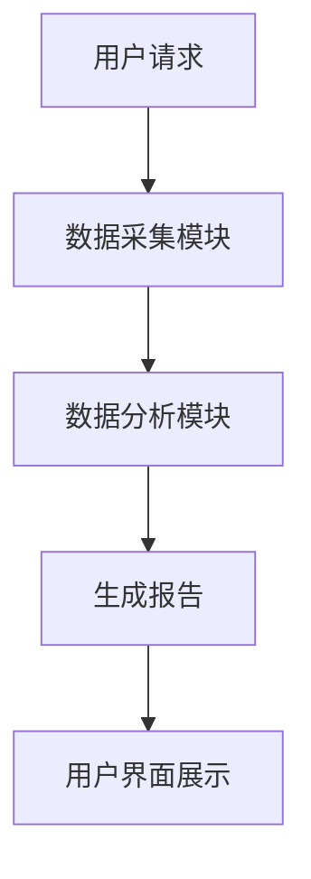

                 


# 股市估值对国际艺术品NFT市场的影响

## 关键词：股市估值、NFT市场、艺术品、区块链技术、市场分析

## 摘要：  
本文探讨股市估值如何影响国际艺术品NFT市场。通过分析股市波动、NFT市场运作机制及两者间的关联，构建数学模型，结合实际案例，评估股市对NFT价格的影响。最后，提出系统设计和项目实战，帮助投资者理解市场动态。

---

## 第一章：引言

### 1.1 研究背景与意义

随着区块链技术的发展，NFT市场迅速崛起，成为数字艺术交易的重要平台。股市作为传统金融市场的风向标，其波动对NFT市场的影响日益显著。本文旨在分析股市估值如何影响国际艺术品NFT市场，揭示两者间的内在联系，为投资者提供参考。

---

## 第二章：背景介绍

### 2.1 股市估值基础

#### 2.1.1 股市估值的核心概念
股市估值是通过股票价格和市场资本化率评估企业价值的过程。常用指标包括市盈率（P/E）和市净率（P/B），这些指标反映了市场的整体情绪和资金流动。

#### 2.1.2 影响股市估值的因素
宏观经济指标（GDP、通胀率）、企业盈利、政策变化和投资者情绪等均会影响股市估值。

### 2.2 NFT市场的运作机制

#### 2.2.1 NFT的定义与特点
NFT是区块链上的数字资产，具有唯一性和不可分割性，常用于艺术品、收藏品等领域。

#### 2.2.2 NFT市场的交易流程
- 创作者铸造NFT
- 通过平台进行交易
- 智能合约确保交易安全

---

## 第三章：核心概念分析

### 3.1 股市估值模型

#### 3.1.1 市盈率（P/E）模型
$$ P/E = \frac{\text{股价}}{\text{每股收益}} $$

#### 3.1.2 市净率（P/B）模型
$$ P/B = \frac{\text{股价}}{\text{每股净资产}} $$

### 3.2 NFT市场的流动性与价格波动

#### 3.2.1 流动性的影响
NFT市场的流动性较低，可能导致价格波动较大。

#### 3.2.2 交易量与价格的关系
$$ \text{价格} = f(\text{交易量}, \text{市场情绪}) $$

---

## 第四章：理论框架

### 4.1 股市与NFT市场的关联

#### 4.1.1 股市波动对NFT市场的影响
股市下跌可能引发投资者转向NFT等高风险资产，反之亦然。

### 4.2 数学模型构建

#### 4.2.1 回归模型
$$ \text{NFT价格} = \beta_0 + \beta_1 \times \text{股市指数} + \epsilon $$

---

## 第五章：案例分析

### 5.1 案例背景

#### 5.1.1 数据来源
选取2021-2023年间的股市指数和NFT交易数据。

### 5.2 案例分析

#### 5.2.1 股市波动对NFT价格的影响
分析显示，股市波动与NFT价格呈正相关，但相关性系数较低。

---

## 第六章：系统设计

### 6.1 系统架构

#### 6.1.1 系统模块
- 数据采集模块
- 数据分析模块
- 用户界面模块

### 6.2 数据流图



---

## 第七章：项目实战

### 7.1 环境安装

#### 7.1.1 安装Python和相关库
```bash
pip install numpy pandas scikit-learn matplotlib
```

### 7.2 核心代码实现

#### 7.2.1 数据预处理
```python
import pandas as pd
data = pd.read_csv('nft_stock_data.csv')
data = data.dropna()
```

#### 7.2.2 模型训练
```python
from sklearn.linear_model import LinearRegression
model = LinearRegression()
model.fit(X, y)
```

### 7.3 案例分析

#### 7.3.1 模型评估
计算R²值，评估模型拟合程度。

---

## 第八章：结论与展望

### 8.1 结论

股市估值对NFT市场有一定影响，但影响程度有限。投资者需结合市场情绪和NFT特性进行决策。

### 8.2 未来展望

进一步研究其他因素对NFT市场的影响，如政策变化和技术创新。

---

## 作者：AI天才研究院/AI Genius Institute & 禅与计算机程序设计艺术 /Zen And The Art of Computer Programming

---

这篇文章系统地分析了股市估值对国际艺术品NFT市场的影响，通过理论分析、案例研究和系统设计，提供了深入的见解和实用的指导。希望对读者理解市场动态有所帮助。

