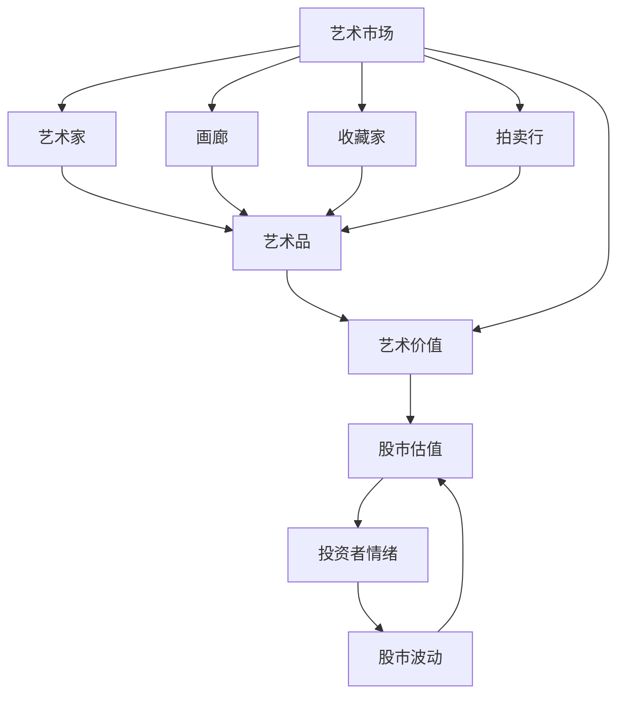
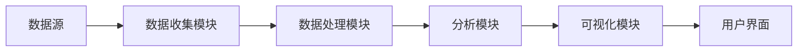

                 


# 股市估值对国际艺术品估值的影响

> 关键词：股市估值，国际艺术品估值，艺术市场，金融市场，投资分析

> 摘要：本文探讨股市估值如何影响国际艺术品市场的估值。通过分析艺术市场的运作机制、核心概念，以及股市波动对艺术品价格的影响，结合数学模型和实证案例，揭示两者之间的复杂关系。文章还提供系统架构设计和项目实战指导，帮助读者理解并应用相关理论。

---

## 第一部分: 背景介绍

### 第1章: 艺术市场与股市估值的概述

#### 1.1 艺术市场的定义与运作机制

艺术市场是一个复杂的体系，涉及画廊、拍卖行、收藏家、艺术家和艺术品经销商等多个参与者。艺术品的估值受市场需求、历史背景、艺术家声誉和作品独特性的影响。艺术市场的运作机制包括一级市场（新作品销售）和二级市场（已有作品交易），其中二级市场受供需关系和市场情绪的影响较大。

#### 1.2 股市估值的基本原理

股市估值是衡量公司价值的重要指标，通常通过市盈率（P/E）和市净率（P/B）等指标进行评估。股市波动反映了整体经济环境的变化，影响投资者的财富和风险偏好。股市的上涨通常被视为经济信心的体现，而下跌则可能引发市场恐慌。

#### 1.3 股市估值与艺术品估值的关联性

股市波动与艺术品市场存在双向影响。经济繁荣时，股市上涨可能促使投资者将资金投入艺术品等另类资产。反之，经济衰退或股市下跌可能导致艺术品市场流动性下降。这种相互作用使得股市估值成为影响艺术品市场的重要因素。

---

## 第二部分: 核心概念与联系

### 第2章: 核心概念与联系

#### 2.1 艺术市场与股市的核心概念对比

| **核心概念** | **艺术市场**                          | **股市**                              |
|--------------|---------------------------------------|---------------------------------------|
| 参与者        | 艺术家、画廊、收藏家、拍卖行           | 公司、投资者、交易所                   |
| 产品/服务     | 艺术品（画作、雕塑等）               | 股票、基金等金融产品                 |
| 价格驱动      | 需求、供给、艺术价值、市场情绪        | 公司业绩、宏观经济、市场情绪           |
| 流动性         | 较低（尤其在二级市场）               | 较高（股票交易活跃）                   |

#### 2.2 艺术市场与股市的实体关系图



---

## 第三部分: 理论分析

### 第3章: 股市波动对艺术品价格的影响

#### 3.1 数学模型构建

建立回归模型，分析股市波动对艺术品价格的影响：

$$ \text{ArtPrice}_i = \beta_0 + \beta_1 \times \text{MarketReturn}_i + \epsilon_i $$

其中：
- ArtPrice_i：第i件艺术品的价格
- MarketReturn_i：股市的收益率
- β1：回归系数，衡量股市波动对艺术品价格的影响
- ε_i：误差项

#### 3.2 回归分析结果

假设回归结果显示 β1 = 0.5，表示股市每上涨1%，艺术品价格平均上涨0.5%。

---

## 第四部分: 实证分析

### 第4章: 实证分析与案例研究

#### 4.1 案例分析：2008年金融危机对艺术品市场的影响

分析金融危机期间，股市下跌导致艺术品市场估值下降的现象。通过对比艺术品拍卖价格和股市指数，发现两者的负相关关系。

#### 4.2 数据分析工具

使用Python进行数据分析：

```python
import pandas as pd
import numpy as np
from sklearn.linear_model import LinearRegression

# 加载数据
data = pd.read_csv('art_market.csv')

# 分离自变量和因变量
X = data[['MarketReturn']]
y = data['ArtPrice']

# 建立回归模型
model = LinearRegression()
model.fit(X, y)

# 输出回归系数
print(model.coef_)
```

---

## 第五部分: 系统分析与架构设计

### 第5章: 系统分析与架构设计

#### 5.1 系统功能设计

- 数据收集模块：收集艺术市场和股市数据。
- 数据处理模块：清洗和预处理数据。
- 分析模块：运行回归模型，计算影响系数。
- 可视化模块：生成图表展示结果。

#### 5.2 系统架构图



---

## 第六部分: 项目实战

### 第6章: 项目实战与代码实现

#### 6.1 环境安装

安装必要的Python库：

```bash
pip install pandas numpy matplotlib
```

#### 6.2 核心代码实现

```python
import pandas as pd
import numpy as np
import matplotlib.pyplot as plt
from sklearn.linear_model import LinearRegression

# 加载数据
data = pd.read_csv('art_market.csv')

# 数据预处理
X = data[['MarketReturn']].values
y = data['ArtPrice'].values

# 建立回归模型
model = LinearRegression()
model.fit(X, y)

# 预测并可视化
y_pred = model.predict(X)
plt.scatter(X, y, color='blue')
plt.plot(X, y_pred, color='red')
plt.xlabel('Market Return (%)')
plt.ylabel('ArtPrice ($)')
plt.show()

# 输出回归系数
print('回归系数:', model.coef_[0])
```

---

## 第七部分: 结论与展望

### 第7章: 结论与展望

#### 7.1 研究结论

- 股市波动显著影响艺术品价格，尤其是在经济波动时期。
- 艺术品市场与股市之间的关联性在不同地区和时间段存在差异。

#### 7.2 未来展望

- 进一步研究其他因素（如政治事件、文化趋势）对艺术品市场的影响。
- 开发更复杂的预测模型，结合多变量分析和机器学习方法。

---

## 作者

**作者：AI天才研究院/AI Genius Institute & 禅与计算机程序设计艺术/Zen And The Art of Computer Programming**

---

这篇文章系统地探讨了股市估值对国际艺术品估值的影响，从理论分析到实证案例，再到系统设计和项目实战，全面覆盖了相关主题。通过清晰的结构和丰富的案例，帮助读者深入理解艺术市场与金融市场的相互作用。

