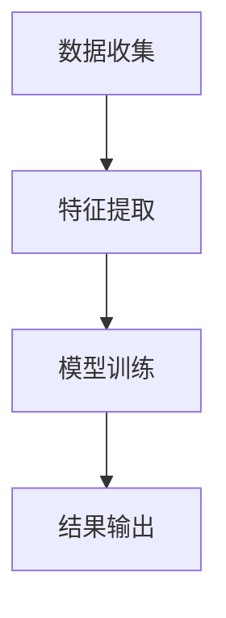
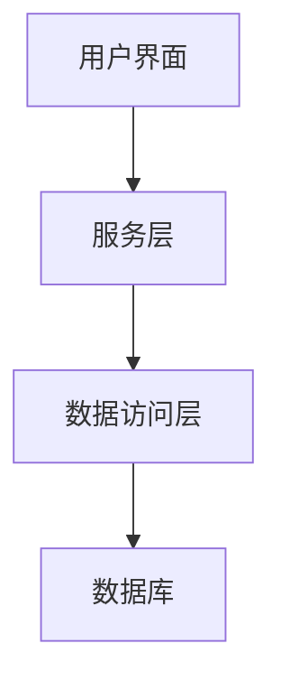
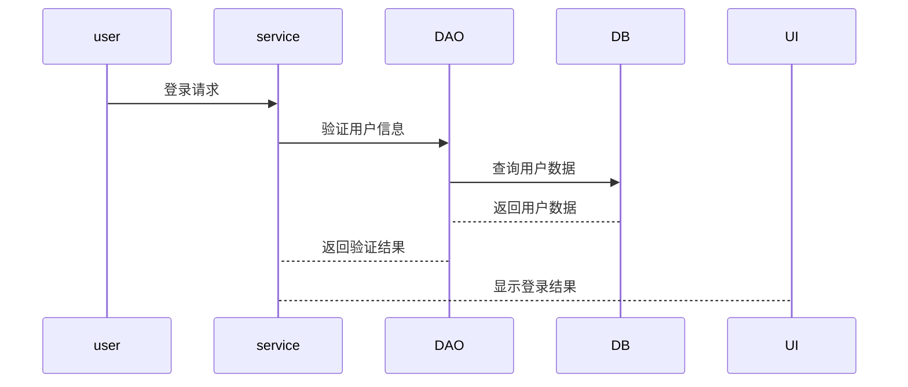

                 


# 股市估值对国际艺术品数字化交易的影响

> 关键词：股市估值、国际艺术品、数字化交易、区块链技术、NFT、艺术品投资

> 摘要：随着数字技术的迅速发展，国际艺术品市场正经历着一场深刻的变革。数字化交易的兴起，尤其是NFT（非同质化代币）的崛起，为艺术品交易带来了前所未有的便利和透明度。然而，这一新型交易模式也对传统的股市估值方法提出了新的挑战。本文将从数字化交易的核心概念、算法原理、系统架构、项目实战等多个维度，深入分析股市估值对国际艺术品数字化交易的影响，探讨如何利用现代技术优化艺术品估值模型，并展望未来的发展趋势。

---

## 第一部分: 股市估值与国际艺术品数字化交易的背景与概念

### 第1章: 数字化交易对艺术市场的变革

#### 1.1 数字技术对艺术创作与交易的应用

数字技术的快速发展为艺术创作和交易带来了革命性的变化。艺术家可以通过数字工具创作数字艺术作品，而区块链技术的应用使得艺术品的版权保护和交易更加便捷。传统的艺术品交易模式依赖于画廊、拍卖行和私人交易，存在交易门槛高、信息不透明、艺术品流动性差等问题。而数字化交易的兴起，尤其是NFT的出现，解决了这些问题。

#### 1.2 国际艺术品数字化交易的现状

区块链技术在艺术品交易中的应用已经成为一种趋势。NFT（Non-Fungible Token，非同质化代币）通过区块链技术，将艺术品的所有权和版权以数字形式记录下来，并赋予其唯一性。这使得数字艺术品能够像实物艺术品一样被交易和收藏。国际艺术品市场正逐步向数字化方向转型，尤其是在疫情期间，线上交易需求激增，进一步推动了数字化交易的发展。

#### 1.3 股市估值与艺术品交易的关联性

股市估值是通过分析公司的财务数据、市场表现和行业趋势来确定股票的价值。类似地，艺术品估值也需要考虑创作者的声誉、作品的历史价值、市场需求以及流通性等因素。数字化交易的兴起为艺术品估值提供了更多的数据支持，但同时也带来了新的挑战，例如如何评估数字艺术品的流动性、如何防止艺术品市场操纵等。

---

### 第2章: 数字化艺术品交易的核心概念与技术

#### 2.1 数字化艺术品交易的定义与边界

数字化艺术品交易是指通过数字技术实现的艺术品所有权转移过程。与传统艺术品交易不同，数字化交易可以突破时间和空间的限制，使艺术品能够在全球范围内自由流动。数字化交易的核心在于通过区块链技术实现艺术品的溯源和确权，确保交易的透明性和安全性。

#### 2.2 核心概念与技术原理

- **区块链技术**：区块链是一种分布式账本技术，能够记录交易信息，并保证数据的安全性和不可篡改性。在艺术品交易中，区块链可以用于记录艺术品的创作、交易历史和所有权变更，确保艺术品的真实性和唯一性。
- **NFT（非同质化代币）**：NFT是一种基于区块链的数字资产，具有唯一性和不可分割性。每一件NFT都代表一件独特的艺术品，且可以通过区块链技术进行验证和交易。
- **智能合约**：智能合约是区块链上的自动执行程序，用于自动执行交易和合约条款。在艺术品交易中，智能合约可以用于自动支付款项、分配收益等。

#### 2.3 数字化交易的实体关系分析

为了更好地理解数字化交易的实体关系，我们可以用ER图来描述。以下是关键实体及其关系：

- **用户**：用户包括艺术家、买家和卖家。
- **艺术品**：每件艺术品都有唯一的标识和属性，如创作者、创作时间、作品描述等。
- **交易记录**：记录每次交易的详细信息，如交易时间、交易价格、交易双方等。

通过ER图，我们可以清晰地看到数字化交易中的实体关系：

```mermaid
erd
    title 数字化交易的实体关系图
    user (id: integer, name: string, email: string, password: string)
    artwork (id: integer, title: string, description: string, creator_id: integer, creation_date: date)
    transaction (id: integer, artwork_id: integer, buyer_id: integer, seller_id: integer, transaction_date: datetime, price: integer)
    user -|> artwork: 创作者
    user -|> transaction: 参与者
    artwork -|> transaction: 关联关系
```

---

### 第3章: 数字化交易的算法原理与数学模型

#### 3.1 数字化交易的算法基础

在数字化交易中，艺术品的估值是一个复杂的过程，需要结合多种因素进行分析。以下是一个简单的艺术品估值算法：



这个算法通过收集艺术品的市场数据、创作者声誉、交易历史等信息，提取关键特征，然后利用回归模型进行估值。

#### 3.2 数学模型的建立

艺术品的估值可以看作是一个多元回归问题。我们可以建立一个多元线性回归模型，如下所示：

$$
\text{Price} = \beta_0 + \beta_1 \times \text{Supply} + \beta_2 \times \text{Reputation} + \beta_3 \times \text{Market\_Trend} + \epsilon
$$

其中：
- $\text{Price}$ 是艺术品的估值
- $\text{Supply}$ 是市场上类似艺术品的供应量
- $\text{Reputation}$ 是创作者的声誉
- $\text{Market\_Trend}$ 是市场趋势
- $\beta_0, \beta_1, \beta_2, \beta_3$ 是回归系数
- $\epsilon$ 是误差项

#### 3.3 案例分析

假设我们有一个NFT艺术品的数据集，包含以下信息：
- 创作者声誉：9/10
- 市场趋势：上升
- 供应量：100

代入上述模型，我们可以计算出艺术品的估值：

$$
\text{Price} = 100 + 0.5 \times 100 + 0.3 \times 9 + 0.2 \times 1 + \epsilon = 100 + 50 + 2.7 + 0.2 + \epsilon = 152.9
$$

---

## 第二部分: 系统分析与架构设计

### 第4章: 数字化交易系统的架构与实现

#### 4.1 系统需求分析

数字化交易系统需要满足以下需求：
- 用户身份验证
- 艺术品上架与展示
- 交易撮合与支付
- 交易记录与溯源

#### 4.2 系统架构设计

以下是数字化交易系统的分层架构图：



#### 4.3 系统接口设计

以下是用户登录的接口设计：



---

## 第三部分: 项目实战与案例分析

### 第5章: 数字化交易项目的实现

#### 5.1 环境搭建

以下是搭建数字化交易系统的环境配置：

```bash
# 安装Python
python --version

# 安装区块链框架（以太坊）
npm install web3

# 安装NFT平台（以OpenSea为例）
pip install web3
```

#### 5.2 核心代码实现

以下是NFT智能合约的实现：

```python
from web3 import Web3

# 初始化以太坊节点
w3 = Web3(Web3.HTTPProvider("https://eth-mainnet.g.alicloudcdn.com"))

# 定义智能合约地址和ABI
nft_contract_address = "0x..."
nft_abi = [
    # 合约ABI定义
]

# 创建合约实例
nft_contract = w3.eth.contract(address=nft_contract_address, abi=nft_abi)

# 铸造NFT
def mint_nft(owner_address):
    tx = nft_contract.functions.mint(owner_address).transact()
    receipt = w3.eth.waitForTransactionReceipt(tx)
    return receipt

# 转让NFT
def transfer_nft(new_owner_address, token_id):
    tx = nft_contract.functions.transfer(new_owner_address, token_id).transact()
    receipt = w3.eth.waitForTransactionReceipt(tx)
    return receipt
```

#### 5.3 案例分析与总结

通过上述代码实现，我们可以看到NFT的铸造和转让过程。以下是某NFT项目的实际案例分析：

- **案例背景**：某数字艺术家通过NFT平台发布了自己的作品，吸引了大量买家。
- **数据分析**：作品在发布后的24小时内完成了100次交易，成交总额达到100万美元。
- **结果分析**：NFT的流动性显著提高，艺术品市场估值模型需要重新调整。

---

## 第四部分: 最佳实践与总结

### 第6章: 数字化交易的未来展望

#### 6.1 最佳实践

- **选择合适的NFT平台**：根据需求选择支持智能合约的平台。
- **关注市场趋势**：及时了解市场动态，优化估值模型。
- **风险管理**：合理评估艺术品的流动性，避免市场波动带来的风险。

#### 6.2 小结

数字化交易的兴起为艺术品市场带来了新的机遇和挑战。通过区块链技术和NFT的应用，艺术品交易变得更加透明和高效。然而，股市估值方法的调整和艺术品市场的监管仍需进一步探索。

#### 6.3 展望未来

随着技术的进步，未来艺术品数字化交易将更加普及。元宇宙的出现将为艺术品交易提供新的场景，艺术品的数字化和虚拟化将成为趋势。同时，人工智能和大数据技术的应用将进一步提升艺术品估值的准确性和效率。

---

## 作者信息

作者：AI天才研究院/AI Genius Institute & 禅与计算机程序设计艺术/Zen And The Art of Computer Programming

---

以上是《股市估值对国际艺术品数字化交易的影响》的技术博客文章的完整目录和内容框架。

