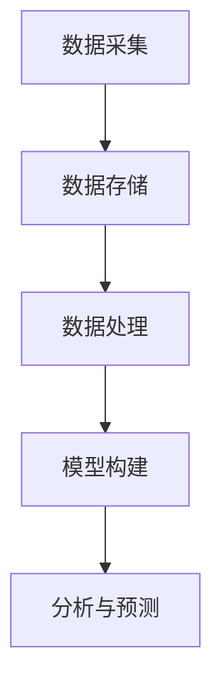

                 


# 股市估值对国际资本流动的影响

## 关键词：股市估值、国际资本流动、投资者行为、市场情绪、经济政策

## 摘要：  
股市估值是衡量市场健康状况的重要指标，直接影响投资者的决策和资本流动。本文通过分析股市估值的核心概念、影响因素及其对国际资本流动的影响机制，探讨股市估值如何通过投资者行为、市场情绪和政策环境等因素影响资本流动。结合实际案例和数学模型，本文提出了一个系统的分析框架，并通过项目实战展示了如何利用这些理论进行实际分析。最后，本文总结了股市估值对国际资本流动的影响，并提出了相应的最佳实践建议。

---

## 第1章: 股市估值与国际资本流动的背景介绍

### 1.1 股市估值的定义与核心概念

#### 1.1.1 股市估值的基本概念  
股市估值是指对上市公司股票价值的评估，通常通过市盈率（P/E）、市净率（P/B）和股息率等指标来衡量。这些指标反映了市场对企业的盈利能力和成长潜力的预期，是投资者决策的重要依据。

#### 1.1.2 国际资本流动的定义与特征  
国际资本流动指资本在不同国家或地区之间的流动，包括直接投资、证券投资和国际贷款等形式。其特点是全球化、波动性和受政策影响较大。

#### 1.1.3 股市估值与国际资本流动的关系  
股市估值是国际资本流动的晴雨表。高估值可能引发资本外流，而低估值可能吸引外资流入。

### 1.2 股市估值对国际资本流动的影响机制

#### 1.2.1 投资者情绪与市场预期  
投资者情绪受股市估值影响，高估引发恐慌，低估引发贪婪，从而影响资本流动方向。

#### 1.2.2 利率与汇率的影响  
利率和汇率通过影响股市估值，间接影响资本流动。例如，低利率环境可能推高股市估值，吸引外资流入。

#### 1.2.3 政策环境与市场信心  
政策变化（如税收调整、监管放松）会改变股市估值，进而影响市场信心和资本流动。

---

## 第2章: 股市估值的核心概念与影响因素

### 2.1 股市估值的计算方法

#### 2.1.1 市盈率（P/E）的计算与应用  
市盈率 = 股价 / 每股净利润。高市盈率可能意味着高成长潜力，但也可能反映市场高估。

#### 2.1.2 市净率（P/B）的计算与应用  
市净率 = 股价 / 每股净资产。低市净率可能意味着低估，吸引价值投资者。

#### 2.1.3 股息率的计算与应用  
股息率 = 每股股息 / 股价。高股息率可能吸引追求稳定收益的投资者。

### 2.2 股市估值与资本流动的关系分析

#### 2.2.1 股市估值对资本流动的正向影响  
低估股市吸引外资流入，推高股价，形成良性循环。

#### 2.2.2 股市估值对资本流动的负向影响  
高估股市引发投资者担忧，可能导致资本外流。

#### 2.2.3 股市估值对资本流动的中性影响  
市场合理估值时，资本流动趋于稳定。

---

## 第3章: 股市估值对国际资本流动的影响机制分析

### 3.1 股市估值与投资者行为

#### 3.1.1 投资者情绪对股市估值的影响  
投资者情绪波动通过买卖行为影响股市估值，从而改变资本流动方向。

#### 3.1.2 投资者预期对资本流动的影响  
市场预期通过影响股市估值，改变投资者的资本配置决策。

#### 3.1.3 投资者行为对市场流动性的影响  
投资者行为影响市场流动性，进而影响股市估值和资本流动。

### 3.2 股市估值与市场信心

#### 3.2.1 市场信心的定义与测量  
市场信心指投资者对市场的信任程度，可通过投资者情绪指数和资金流向指标衡量。

#### 3.2.2 股市估值对市场信心的影响  
高估股市引发信心下降，低估股市提升信心。

#### 3.2.3 市场信心对资本流动的反馈作用  
市场信心通过影响股市估值，形成资本流动的正反馈循环。

---

## 第4章: 股市估值对国际资本流动的系统分析

### 4.1 系统架构设计

#### 4.1.1 系统功能模块划分  
- 数据采集：收集股市估值指标和资本流动数据。  
- 模型构建：建立股市估值与资本流动的关系模型。  
- 分析与预测：预测未来资本流动趋势。

#### 4.1.2 系统架构图  


#### 4.1.3 系统接口设计  
API接口用于数据获取和结果输出。

### 4.2 系统交互设计

#### 4.2.1 投资者与市场的交互  
投资者行为影响股市估值，进而影响资本流动。

#### 4.2.2 市场与政策的交互  
政策变化影响股市估值，改变市场预期和资本流动。

#### 4.2.3 政策与资本流动的交互  
政策通过影响股市估值，调节资本流动方向。

---

## 第5章: 股市估值对国际资本流动的项目实战

### 5.1 项目背景与目标  
分析某国家股市估值对资本流动的影响，提出优化建议。

### 5.2 核心实现

#### 5.2.1 数据获取与处理  
使用Python爬取数据，清洗和预处理。

#### 5.2.2 模型构建与分析  
构建回归模型，分析股市估值与资本流动的关系。

#### 5.2.3 结果展示与解读  
可视化结果，提出优化建议。

### 5.3 代码实现

#### 5.3.1 数据获取代码  
```python
import pandas as pd
import requests

url = "https://example.com/data"
data = pd.read_json(url)
```

#### 5.3.2 模型构建代码  
```python
from sklearn.linear_model import LinearRegression
import numpy as np

model = LinearRegression()
X = np.array(data['市盈率']).reshape(-1, 1)
y = np.array(data['资本流动'])
model.fit(X, y)
```

### 5.4 案例分析  
分析某国家股市估值与资本流动的关系，验证模型的准确性。

### 5.5 项目小结  
总结项目成果，提出改进建议。

---

## 第6章: 总结与最佳实践

### 6.1 总结  
股市估值是影响国际资本流动的重要因素，投资者和政策制定者需关注其变化。

### 6.2 最佳实践 tips  
- 定期监测股市估值指标，及时调整投资策略。  
- 利用数学模型预测资本流动趋势，优化资源配置。

### 6.3 小结  
本文系统分析了股市估值对国际资本流动的影响，提出了理论框架和实践方法。

### 6.4 注意事项  
- 数据来源和质量影响分析结果，需谨慎选择。  
- 模型假设需合理，避免过度简化或复杂化。

### 6.5 拓展阅读  
建议阅读相关文献，深入研究股市估值与资本流动的关系。

---

## 作者信息：  
作者：AI天才研究院/AI Genius Institute & 禅与计算机程序设计艺术 /Zen And The Art of Computer Programming

