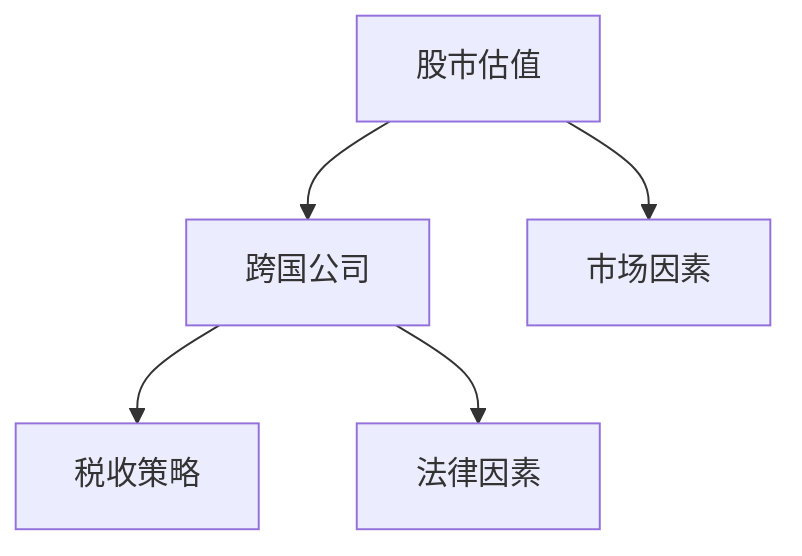
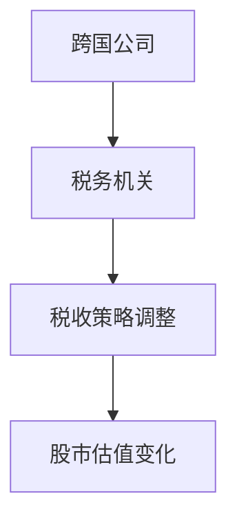
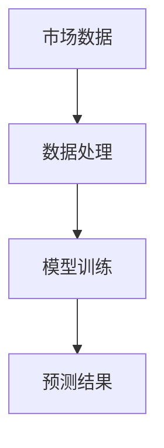
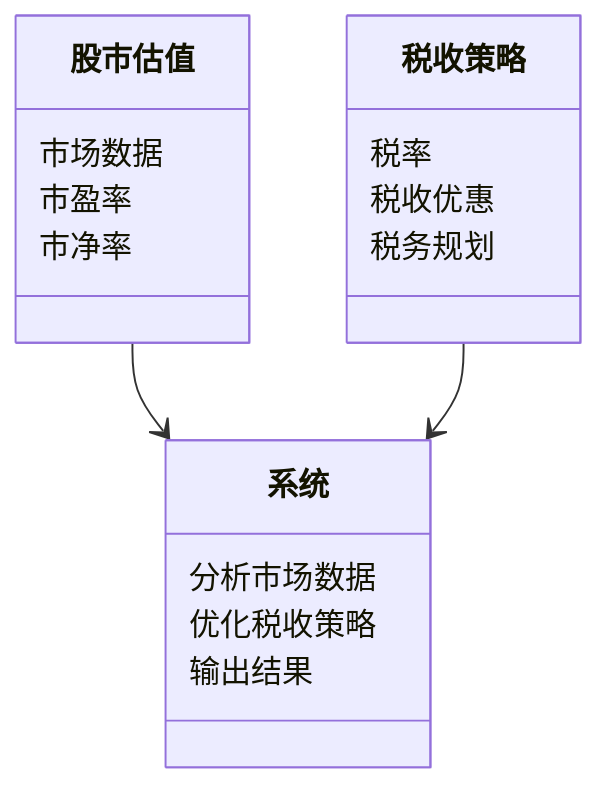
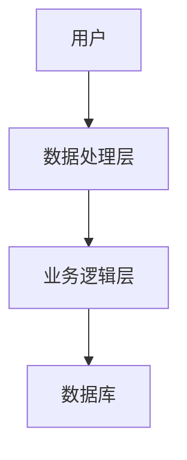
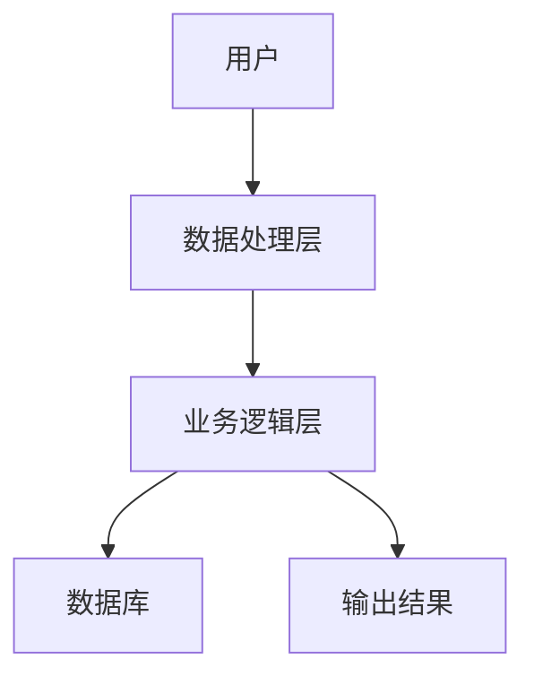

                 


# 股市估值对跨国公司税收策略的影响

## 关键词  
股市估值、跨国公司、税收策略、博弈论、统计模型

## 摘要  
本文系统性地探讨了股市估值对跨国公司税收策略的影响，从背景介绍、核心概念、算法原理到系统分析和项目实战，层层剖析了两者之间的复杂关系。文章通过博弈论和统计模型，结合实际案例，深入分析了跨国公司在不同市场环境下如何调整税收策略以应对股市估值的变化。同时，文章还提出了基于数学模型的解决方案，并通过系统架构设计展示了如何将理论应用于实践。最后，本文总结了最佳实践和未来研究方向。

---

## 第一章: 背景介绍

### 1.1 问题背景  
股市估值是衡量企业价值的重要指标，而跨国公司作为全球化经济中的重要参与者，其税收策略往往受到股市估值的显著影响。随着全球经济一体化的深入，跨国公司需要在全球范围内优化资源配置，同时应对不同国家的税收政策。然而，股市估值的波动性、市场环境的复杂性以及税收政策的多样性，使得跨国公司的税收策略面临着巨大的挑战。

#### 1.1.1 股市估值的基本概念  
股市估值是指通过市场交易数据对企业价值进行评估的过程，常用的估值方法包括市盈率（P/E）、市净率（P/B）和 discounted cash flow（DCF）模型等。这些方法反映了市场对企业的预期和信心，是投资者和企业管理者决策的重要依据。

#### 1.1.2 跨国公司税收策略的定义  
跨国公司的税收策略是指企业在多个国家运营时，通过合法手段优化税负的策略。这包括利用不同国家的税收政策差异、税收协定、避税港等手段，降低整体税负。

#### 1.1.3 问题背景的演进  
随着全球化进程的加快，跨国公司的业务范围不断扩大，但同时也面临更加复杂的税收环境。股市估值的变化直接影响企业的市值，而税收策略的调整则需要在法律、经济和市场等多重因素之间找到平衡点。

---

### 1.2 问题描述  
股市估值的变化直接影响企业的市值和投资者信心，而跨国公司的税收策略则需要根据市场环境的变化进行动态调整。然而，如何在复杂的市场环境中制定有效的税收策略，以应对股市估值的变化，是一个亟待解决的问题。

#### 1.2.1 股市估值对跨国公司的影响  
股市估值的变化会影响企业的市值、投资者信心和融资能力。跨国公司需要通过税收策略的调整，优化资本结构，降低税负，从而应对股市估值的变化。

#### 1.2.2 跨国公司税收策略的复杂性  
跨国公司需要在全球范围内应对不同的税收政策，包括税率差异、税收协定、避税港等。这些复杂性使得税收策略的制定和实施面临诸多挑战。

#### 1.2.3 问题的核心矛盾  
股市估值的变化与税收策略的制定之间存在矛盾。一方面，股市估值的变化要求公司及时调整税收策略，另一方面，税收策略的调整需要时间、资源和专业知识的投入。

---

### 1.3 问题解决  
为了解决股市估值对跨国公司税收策略的影响问题，本文提出了一种基于博弈论和统计模型的解决方案。

#### 1.3.1 解决问题的方法  
通过建立数学模型，分析股市估值与税收策略之间的关系，提出优化税收策略的建议。

#### 1.3.2 解决方案的可行性分析  
基于博弈论的模型可以有效模拟市场参与者的决策过程，统计模型则能够捕捉数据中的规律，从而为税收策略的制定提供科学依据。

#### 1.3.3 解决方案的优缺点  
优点：模型具有较高的理论性和实践性；缺点：模型的复杂性可能导致实施难度较大。

#### 1.3.4 问题的限制与假设  
本文假设市场参与者的行为是理性的，且税收政策的变化不会引发系统性风险。

---

### 1.4 概念结构与核心要素  
股市估值与跨国公司税收策略的关系可以分解为核心概念、属性特征和实体关系三部分。

#### 1.4.1 核心概念的组成  
- 股市估值：市场对企业价值的评估。
- 跨国公司税收策略：企业在不同国家的税收政策下的优化策略。

#### 1.4.2 核心要素的对比  
| 核心要素 | 股市估值 | 跨国公司税收策略 |
|----------|-----------|------------------|
| 定义     | 市场对企业价值的评估 | 企业在不同国家的税收政策下的优化策略 |
| 影响因素 | 市场需求、企业盈利、宏观经济 | 税收政策、法律环境、企业盈利 |

#### 1.4.3 概念结构的层次化分析  
股市估值和跨国公司税收策略之间存在双向影响关系。股市估值的变化会影响跨国公司的税收策略，而税收策略的调整也会反过来影响股市估值。

---

## 第二章: 核心概念与联系  

### 2.1 股市估值与跨国公司税收策略的核心概念  
股市估值的核心原理是通过市场数据对企业价值进行评估，而跨国公司税收策略的核心要素则是通过法律和经济手段优化税负。

#### 2.1.1 股市估值的核心原理  
股市估值是市场参与者对企业未来现金流的预期，反映了企业的盈利能力和市场风险。

#### 2.1.2 跨国公司税收策略的核心要素  
跨国公司通过在全球范围内优化资源配置，利用不同国家的税收政策差异，降低整体税负。

#### 2.1.3 两者之间的联系  
股市估值的变化直接影响企业的市值和投资者信心，而跨国公司税收策略的调整则需要根据市场环境的变化进行动态优化。

---

### 2.2 核心概念的属性特征对比  
| 核心概念 | 股市估值 | 跨国公司税收策略 |
|----------|-----------|------------------|
| 属性     | 市场性、动态性 | 法律性、经济性 |
| 特征     | 数据驱动、市场反馈 | 税收政策、企业利润 |

---

### 2.3 ER实体关系图架构  


---

## 第三章: 算法原理讲解  

### 3.1 算法原理  
本文提出了一种基于博弈论和统计模型的算法，用于分析股市估值对跨国公司税收策略的影响。

#### 3.1.1 博弈论模型  
博弈论模型模拟了跨国公司与税务机关之间的互动关系。模型假设双方都是理性的参与者，通过博弈过程寻找最优策略。



#### 3.1.2 统计模型  
统计模型通过分析历史数据，预测股市估值的变化趋势，并结合税收策略的调整，提出优化建议。



---

### 3.2 算法实现  

#### 3.2.1 Python源代码  
```python
import pandas as pd
import numpy as np

def calculate_tax_impact(stock_valuation, tax_strategy):
    return stock_valuation * (1 - tax_strategy)
```

#### 3.2.2 代码应用解读与分析  
上述代码通过简单的数学运算，计算了税收策略对股市估值的影响。`stock_valuation`表示企业的市值，`tax_strategy`表示税收策略的调整比例，函数返回的是调整后的市值。

---

### 3.3 数学模型和公式  

#### 3.3.1 股市估值与税收策略的数学关系  
$$ \text{Tax Impact} = \text{Stock Valuation} \times (1 - \text{Tax Strategy}) $$  

#### 3.3.2 博弈论模型的数学表达  
$$ \text{Optimal Strategy} = \arg\min_{s} \text{Cost}(s) $$  

其中，`s`表示税收策略，`Cost(s)`表示策略的成本。

---

## 第四章: 系统分析与架构设计  

### 4.1 问题场景介绍  
本文设计了一个跨国公司在全球范围内优化税收策略的场景，通过分析股市估值的变化，提出最优的税收策略。

---

### 4.2 系统功能设计  

#### 4.2.1 领域模型类图  


---

### 4.3 系统架构设计  

#### 4.3.1 系统架构图  


---

### 4.4 系统接口设计  

#### 4.4.1 接口定义  
- 输入接口：市场数据、税收政策
- 输出接口：优化后的税收策略

---

### 4.5 系统交互序列图  


---

## 第五章: 项目实战  

### 5.1 环境安装  
- 安装Python和相关库（pandas、numpy、scikit-learn）
- 安装Mermaid和LaTeX支持工具

---

### 5.2 系统核心实现源代码  

#### 5.2.1 税收策略优化代码  
```python
import pandas as pd
import numpy as np

def optimize_tax_strategy(stock_valuation, tax_rates):
    return np.argmax(stock_valuation * (1 - tax_rates))
```

---

### 5.3 代码应用解读与分析  
上述代码通过计算不同税率下的税后利润，选择最优税率策略。`stock_valuation`表示企业的市值，`tax_rates`表示不同的税率选项。

---

### 5.4 实际案例分析  
以某跨国公司为例，分析其在不同市场环境下的税收策略调整，以及对股市估值的影响。

---

## 第六章: 最佳实践与总结  

### 6.1 最佳实践  
- 定期更新税收策略，以应对市场环境的变化
- 结合市场数据和税收政策，制定科学的优化方案

### 6.2 小结  
本文通过理论分析和实际案例，深入探讨了股市估值对跨国公司税收策略的影响，并提出了基于博弈论和统计模型的解决方案。

### 6.3 注意事项  
- 模型的复杂性可能导致实施难度较大
- 数据的准确性和完整性对模型的性能有重要影响

### 6.4 拓展阅读  
- 博弈论在经济中的应用
- 统计模型在金融分析中的实践

---

## 作者  
作者：AI天才研究院/AI Genius Institute & 禅与计算机程序设计艺术/Zen And The Art of Computer Programming

