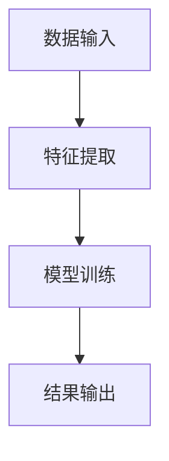

                 


# 股市估值对跨境数字内容估值的影响

> **关键词**：股市估值、跨境数字内容、数字资产评估、经济全球化、数字化转型  
> **摘要**：随着经济全球化和数字化转型的加速，股市估值与跨境数字内容估值之间的关系变得越来越复杂。本文从背景介绍、核心概念、算法原理、系统分析、项目实战等多个维度，深入探讨股市估值对跨境数字内容估值的影响，分析两者之间的相互作用，并提出综合估值模型的构建思路。通过实际案例分析，本文为投资者和相关从业者提供了理论支持和实践指导。

---

## 第一部分: 背景介绍

### 第1章: 股市估值与跨境数字内容估值的背景

#### 1.1 问题背景
##### 1.1.1 经济全球化与数字化转型
经济全球化使得企业不再局限于本土市场，而是将业务拓展至全球范围。数字化转型则使得企业的核心竞争力逐渐从传统实体资产转向数字资产，例如在线教育平台、数字媒体、虚拟现实（VR）内容等。这些数字内容的估值问题逐渐成为市场关注的焦点。

##### 1.1.2 股市估值的传统方法与局限性
传统的股市估值方法主要包括市盈率（PE）、市净率（PB）、股息率等指标，这些方法主要依赖于企业的财务数据，如净利润、资产总额等。然而，随着数字内容的兴起，企业价值的决定因素逐渐从实物资产转向无形资产，传统的估值方法难以准确反映企业的实际价值。

##### 1.1.3 跨境数字内容的兴起与发展趋势
跨境数字内容是指在全球范围内流通的数字产品或服务，例如Netflix的流媒体内容、Coursera的在线课程等。这些内容的特点是无地域限制、可快速复制、边际成本低，但其价值受到用户需求、市场接受度和技术发展的影响。

#### 1.2 问题描述
##### 1.2.1 股市估值的核心要素
股市估值的核心要素包括企业的财务状况、市场地位、管理团队、行业前景等。传统估值方法依赖于财务数据，但在数字内容时代，企业的核心价值可能更多地体现在用户基数、内容质量、技术创新等方面。

##### 1.2.2 跨境数字内容的估值难点
跨境数字内容的估值难点在于其无形性和市场波动性。例如，数字内容的盈利能力可能受到用户偏好、内容质量、市场竞争等多重因素的影响，而这些因素难以量化。

##### 1.2.3 两者之间的关联性与互动性
股市估值与跨境数字内容估值之间的互动性主要体现在市场情绪、用户行为和技术创新三个方面。市场情绪会影响股价波动，而用户行为数据（如点击率、购买率）则可以作为数字内容估值的重要依据。

#### 1.3 问题解决
##### 1.3.1 数字化转型对股市估值的影响
数字化转型使得企业的核心价值从实物资产转向数字资产，这要求投资者重新审视传统的估值方法，引入新的指标和模型。

##### 1.3.2 跨境数字内容对股市估值的新挑战
跨境数字内容的估值需要考虑市场分割效应、内容的文化适配性、用户行为数据等因素，这些都对传统的估值模型提出了挑战。

##### 1.3.3 综合估值模型的构建思路
综合估值模型需要将传统财务指标与数字内容的用户行为数据相结合，例如结合市盈率和用户留存率，构建多维度的估值体系。

#### 1.4 边界与外延
##### 1.4.1 股市估值的边界条件
股市估值的边界条件包括企业的财务数据、行业特点、市场环境等。这些条件决定了估值模型的适用范围和限制。

##### 1.4.2 跨境数字内容的边界条件
跨境数字内容的边界条件包括内容的可及性、用户群体的地理分布、内容的文化适配性等。这些条件影响了数字内容的估值难度和市场表现。

##### 1.4.3 两者相互作用的外延范围
两者相互作用的外延范围包括技术创新、政策变化、市场整合等。例如，技术进步可能降低数字内容的边际成本，而政策变化可能影响跨境数字内容的市场准入。

#### 1.5 概念结构与核心要素
##### 1.5.1 股市估值的核心要素
- 财务数据：净利润、资产总额、负债情况
- 市场地位：市场份额、品牌影响力
- 管理团队：管理能力、战略规划

##### 1.5.2 跨境数字内容的核心要素
- 用户基数：活跃用户数、用户留存率
- 内容质量：内容多样性、用户评价
- 技术创新：平台技术、内容生成技术

##### 1.5.3 两者之间的关系模型
通过构建关系模型，可以将股市估值与跨境数字内容估值的关键要素联系起来，例如：

$$ \text{综合估值} = f(\text{财务指标}, \text{用户行为数据}, \text{市场环境}) $$

---

## 第二部分: 核心概念与联系

### 第2章: 核心概念原理

#### 2.1 股市估值的核心原理
##### 2.1.1 股票价值的多维度评估
股票价值的评估需要考虑企业的盈利能力、成长潜力、行业前景等因素。例如，市盈率（PE）= 股价 / 每股净利润。

##### 2.1.2 市场情绪与股价波动的关系
市场情绪（如投资者的心理预期）会影响股价的短期波动。例如，当市场情绪乐观时，股价可能上涨；反之，则可能下跌。

##### 2.1.3 财务指标在估值中的应用
财务指标（如ROE、ROA）是传统估值方法的重要组成部分，但它们难以完全反映数字内容的价值。

#### 2.2 跨境数字内容估值的核心原理
##### 2.2.1 数字内容的无形资产特性
数字内容的价值更多地体现在用户的体验和互动上，而不是实物资产。例如，Netflix的内容库价值难以通过传统财务指标衡量。

##### 2.2.2 跨境流通的市场分割效应
市场分割效应可能导致跨境数字内容在不同地区的估值差异。例如，同一部电视剧在欧美和亚洲的市场表现可能不同。

##### 2.2.3 用户行为数据对估值的影响
用户行为数据（如点击率、转化率）是数字内容估值的重要依据。例如，高用户留存率可能意味着更高的内容价值。

#### 2.3 核心概念对比分析
##### 2.3.1 股市估值与数字内容估值的对比表格

| 要素                | 股市估值                     | 数字内容估值                 |
|---------------------|-----------------------------|------------------------------|
| 核心指标            | 财务指标（净利润、市盈率）    | 用户行为数据（留存率、转化率）|
| 估值难点            | 市场情绪波动                | 内容质量、用户偏好           |
| 受影响因素          | 经济环境、政策变化          | 技术创新、文化适配性        |

##### 2.3.2 股市估值与数字内容估值的ER实体关系图

```mermaid
er
actor 投资者;
actor 用户;
entity 股票;
entity 数字内容;
entity 估值模型;

investor ->股票: 评估价值;
investor ->数字内容: 依赖用户行为数据;
数字内容 ->估值模型: 输入数据;
股票 ->估值模型: 输入数据;
```

---

## 第三部分: 算法原理讲解

### 第3章: 股市估值与数字内容估值的算法模型

#### 3.1 股市估值算法
##### 3.1.1 常用估值方法
- **DCF模型**：通过现金流折现计算企业价值。
- **PE法**：通过市盈率与可比公司进行比较。
- **EV/EBITDA法**：通过企业价值与息税折旧及摊销前利润的比率进行估值。

##### 3.1.2 基于机器学习的股价预测模型
基于机器学习的股价预测模型可以利用历史数据和市场情绪数据进行预测。例如，使用LSTM神经网络模型：

```python
import numpy as np
import tensorflow as tf

# 示例代码：使用LSTM预测股价
model = tf.keras.Sequential()
model.add(tf.keras.layers.LSTM(64, input_shape=(timesteps, features)))
model.add(tf.keras.layers.Dense(1))
model.compile(optimizer='adam', loss='mean_squared_error')
model.fit(X_train, y_train, epochs=100, batch_size=32)
```

##### 3.1.3 算法流程图（Mermaid）



#### 3.2 数字内容估值算法
##### 3.2.1 

---

由于篇幅限制，后续章节内容将在后续部分详细展开。

