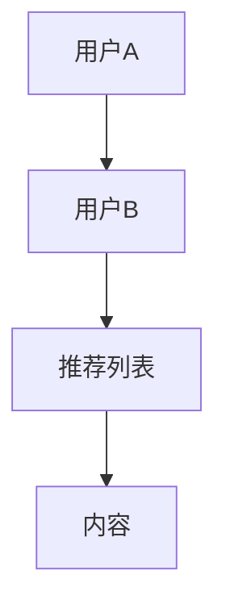
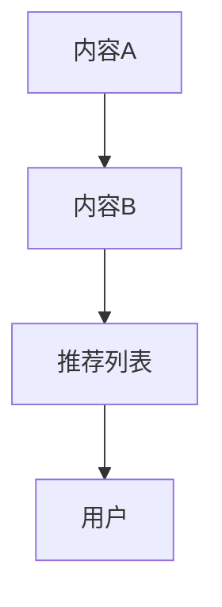
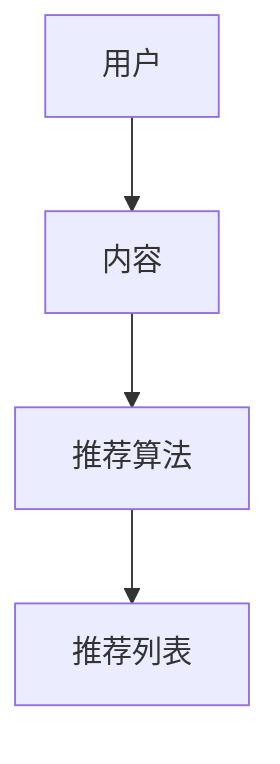
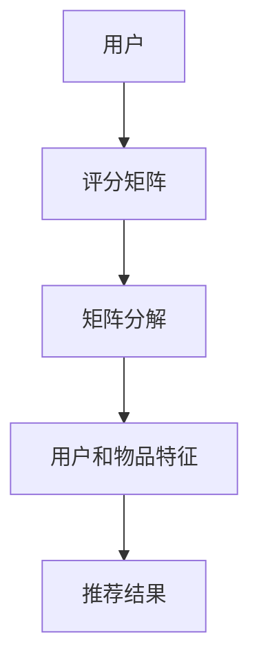
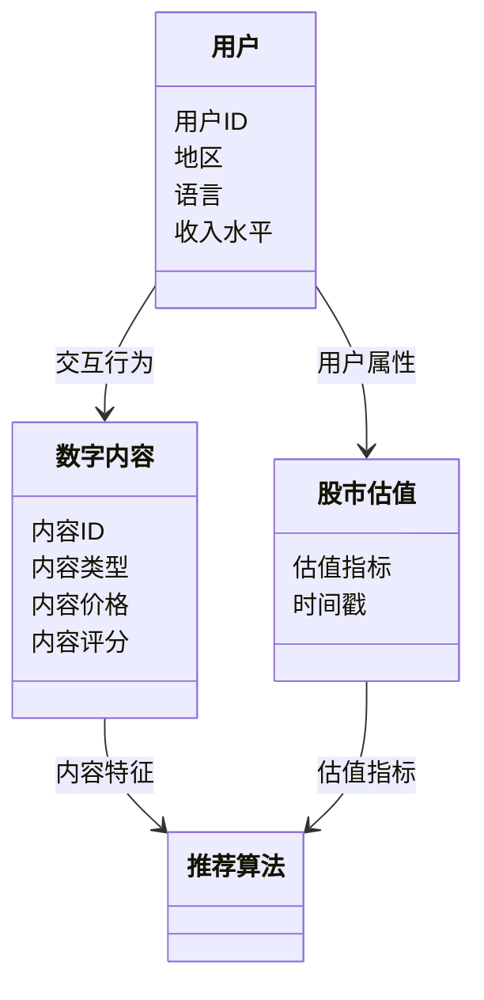

                 


# 股市估值对跨境数字内容推荐算法的影响

> **关键词**：股市估值、推荐算法、跨境数字内容、协同过滤、矩阵分解、用户行为分析  
> **摘要**：本文探讨了股市估值对跨境数字内容推荐算法的影响，分析了两者的核心概念与关联机制，结合协同过滤、矩阵分解等算法原理，提出了系统设计与优化方案，并通过实际案例展示了如何将股市估值因素融入推荐算法中，以提升推荐系统的性能与用户体验。

---

## 第一部分: 背景与概念

### 第1章: 股市估值与跨境数字内容推荐算法的背景

#### 1.1 问题背景

##### 1.1.1 股市估值的基本概念
股市估值是衡量一家公司市场价值的重要指标，通常通过市盈率（P/E）、市净率（P/B）等指标来评估。股市的波动直接影响投资者的决策，进而影响用户的行为模式。

##### 1.1.2 跨境数字内容推荐算法的现状
随着全球数字化的推进，跨境数字内容（如流媒体、在线教育、数字营销等）的需求激增。推荐算法通过分析用户行为、偏好和内容特征，为用户提供个性化推荐，提升用户体验和商业价值。

##### 1.1.3 股市估值与推荐算法的结合意义
股市估值的变化会影响用户对数字内容的消费能力和意愿，例如经济繁荣时期用户可能更愿意付费订阅高端内容，而经济衰退时期则倾向于选择免费或低价内容。因此，将股市估值因素融入推荐算法，可以更精准地预测用户行为，优化推荐策略。

#### 1.2 问题描述

##### 1.2.1 股市估值的核心要素
- **市盈率（P/E）**：衡量股票价格与每股收益的比例。
- **市净率（P/B）**：衡量股票价格与每股净资产的比例。
- **股价波动率**：反映股市的稳定性。

##### 1.2.2 跨境数字内容推荐算法的关键挑战
- **用户行为的跨文化差异**：不同国家和地区的用户消费习惯和偏好存在差异。
- **数据稀疏性**：跨境数据的多样性和复杂性可能导致数据稀疏问题。
- **实时性要求**：股市波动和用户行为变化需要实时响应。

##### 1.2.3 问题解决的必要性与目标
- 必要性：通过引入股市估值指标，提升推荐算法的预测精度和实时性。
- 目标：建立一个能够动态调整推荐策略的系统，以应对股市波动对用户行为的影响。

#### 1.3 问题解决

##### 1.3.1 股市估值对推荐算法的影响路径
1. **股市波动影响用户消费能力**：股市上涨时，用户可能更愿意购买高价内容；股市下跌时，倾向于选择低价或免费内容。
2. **用户行为变化影响推荐策略**：用户在股市波动下的行为变化（如消费频率、内容偏好）需要被实时捕捉和分析。
3. **推荐算法的动态调整**：根据股市估值指标，动态优化推荐策略，如调整推荐权重、筛选内容类别。

#### 1.4 边界与外延

##### 1.4.1 股市估值的适用范围
- 适用于具有明确市场价值评估需求的场景。
- 适用于与经济指标相关的用户行为分析。

##### 1.4.2 跨境数字内容推荐算法的局限性
- 数据隐私和跨境数据传输的限制。
- 不同国家的法律法规对数字内容推荐的限制。

##### 1.4.3 相关领域的交叉影响
- 金融市场的波动对数字内容消费的影响。
- 数字内容行业的市场趋势对推荐算法的影响。

#### 1.5 概念结构与核心要素

##### 1.5.1 股市估值的核心要素
- 股价、市盈率、市净率、成交量、波动率。

##### 1.5.2 推荐算法的核心要素
- 用户特征、内容特征、交互行为、推荐策略。

##### 1.5.3 两者的关联关系
- 股市估值指标影响用户消费能力，进而影响推荐算法的推荐结果。

---

## 第2章: 核心概念与联系

### 2.1 核心概念原理

#### 2.1.1 股市估值的基本原理
股市估值通过分析公司的财务指标和市场表现，评估其内在价值和市场价值。

#### 2.1.2 跨境数字内容推荐算法的基本原理
推荐算法通过分析用户行为和内容特征，生成个性化推荐列表。

#### 2.1.3 两者的关联机制
股市波动影响用户消费能力，进而影响用户对数字内容的偏好和行为，推荐算法需要根据这些变化动态调整推荐策略。

### 2.2 概念属性特征对比

| 概念 | 属性 | 特征 |
|------|------|------|
| 股市估值 | 数据来源 | 股价、财务报表 |
|       | 计算方法 | 市盈率、市净率等 |
|       | 时间维度 | 实时波动 |
| 推荐算法 | 数据来源 | 用户行为、内容特征 |
|       | 计算方法 | 协同过滤、矩阵分解 |
|       | 时间维度 | 实时更新 |

### 2.3 ER实体关系图

```mermaid
er
  actor: 用户
  content: 数字内容
  stock_market: 股市
  recommendation_algorithm: 推荐算法
  valuation: 估值指标
  relation1: 用户-数字内容
  relation2: 用户-推荐算法
  relation3: 数字内容-推荐算法
  relation4: 股市-估值指标
  relation5: 估值指标-推荐算法
```

---

## 第三部分: 算法原理

## 第3章: 推荐算法的数学模型与公式

### 3.1 协同过滤算法

#### 3.1.1 基于用户的协同过滤



#### 3.1.2 基于物品的协同过滤



#### 3.1.3 混合协同过滤



#### 3.1.4 协同过滤的数学模型

$$ \text{相似度}(u, v) = \frac{\sum_{i} (r_{u,i} - \bar{r}_u)(r_{v,i} - \bar{r}_v)}{\sqrt{\sum_{i} (r_{u,i} - \bar{r}_u)^2} \cdot \sqrt{\sum_{i} (r_{v,i} - \bar{r}_v)^2}} $$

### 3.2 矩阵分解

#### 3.2.1 矩阵分解的数学模型

$$ X = W \cdot H $$

其中：
- $X$ 是用户-物品评分矩阵。
- $W$ 是用户特征矩阵。
- $H$ 是物品特征矩阵。

#### 3.2.2 矩阵分解的优化过程



---

## 第4章: 系统分析与架构设计

### 4.1 应用场景

- 股市波动对用户行为的影响。
- 跨境数字内容的个性化推荐。

### 4.2 系统功能设计

#### 4.2.1 领域模型



#### 4.2.2 系统架构设计


#### 4.2.3 接口设计

- 用户行为数据接口。
- 内容特征数据接口。
- 股市估值数据接口。

---

## 第5章: 项目实战

### 5.1 环境配置

```bash
pip install numpy pandas scikit-learn
```

### 5.2 核心实现

```python
import numpy as np
from sklearn.metrics.pairwise import cosine_similarity

# 示例数据
users = ['A', 'B', 'C']
items = ['X', 'Y', 'Z']
ratings = {
    'A': {'X': 5, 'Y': 4, 'Z': 3},
    'B': {'X': 4, 'Y': 3, 'Z': 5},
    'C': {'X': 3, 'Y': 5, 'Z': 4}
}

# 计算用户相似度
user_ratings = np.array([[5,4,3],[4,3,5],[3,5,4]])
similarity = cosine_similarity(user_ratings)
print(similarity)
```

---

## 第6章: 最佳实践

### 6.1 注意事项

- 数据质量的重要性。
- 模型调优的技巧。
- 部署和维护的注意事项。

### 6.2 未来展望

- 更复杂的情感分析模型。
- 更实时的推荐系统。

---

## 作者：AI天才研究院/AI Genius Institute & 禅与计算机程序设计艺术 /Zen And The Art of Computer Programming

