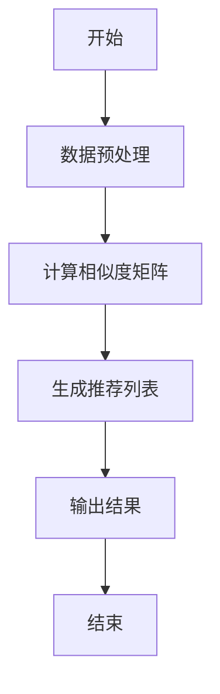
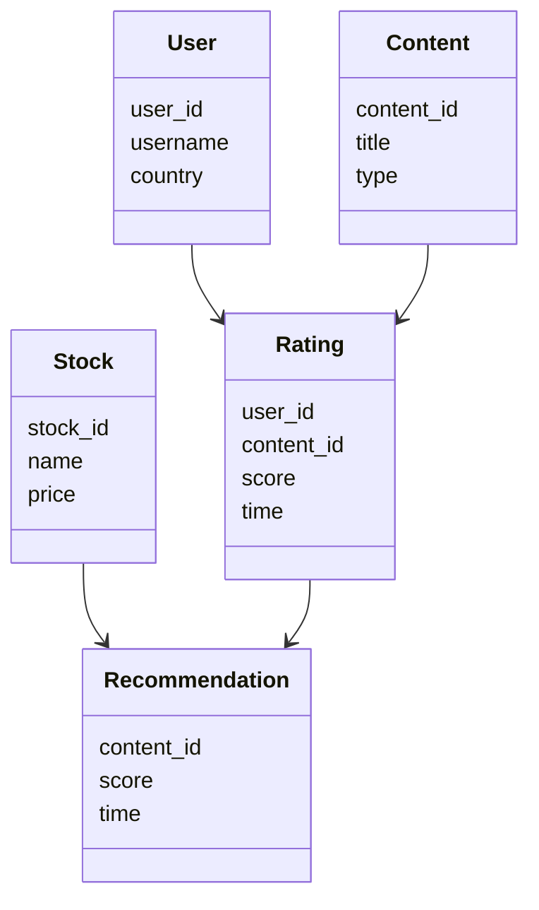

                 


# 股市估值对跨境数字内容推荐算法的影响

## 关键词：股市估值、推荐算法、跨境数字内容、协同过滤、矩阵分解

## 摘要：
本文探讨了股市估值对跨境数字内容推荐算法的影响，分析了股市数据如何影响用户的购买行为，并提出了结合股市特征的推荐算法。通过协同过滤和矩阵分解的方法，结合股市波动数据，优化推荐结果，实现更精准的内容推荐。

---

# 第1章 背景介绍

## 1.1 问题背景

### 1.1.1 股市估值的基本概念
股市估值是通过分析公司财务数据和市场因素，评估股票的内在价值。常用指标包括市盈率（P/E）、市净率（P/B）等。

### 1.1.2 跨境数字内容推荐算法的定义
推荐算法通过分析用户行为和内容特征，预测用户偏好，推荐相关内容。

### 1.1.3 问题的提出与研究意义
股市波动可能影响用户行为，推荐算法需考虑这些外部因素，以提高推荐精准度。

## 1.2 问题描述

### 1.2.1 股市估值对推荐算法的影响
股市波动可能改变用户的购买决策，影响推荐结果。

### 1.2.2 跨境数字内容推荐的挑战
数据异构性、实时性要求高、用户行为复杂等。

### 1.2.3 现有研究的不足
传统推荐算法未充分考虑股市因素，影响推荐效果。

## 1.3 问题解决

### 1.3.1 股市估值与推荐算法的结合
将股市数据整合到推荐模型中，考虑其对用户行为的影响。

### 1.3.2 跨境数字内容推荐的核心目标
提高推荐精准度，满足用户需求，提升平台收益。

## 1.4 边界与外延

### 1.4.1 股市估值的边界条件
数据范围、时间窗口、模型假设。

### 1.4.2 跨境数字内容推荐的适用范围
数字内容领域，用户行为受股市影响的情况。

### 1.4.3 问题的局限性与未来扩展方向
模型的实时性和准确性，未来可结合更多外部因素。

---

# 第2章 核心概念与联系

## 2.1 股市估值的原理

### 2.1.1 市盈率与市净率的计算公式
- 市盈率（P/E）= 股价 / 每股收益
- 市净率（P/B）= 股价 / 每股净资产

### 2.1.2 股票估值的基本模型
股利折现模型（DDM）：股票价值 = ∑（股利 / (1 + r)^t）

### 2.1.3 影响股市估值的主要因素
宏观经济、行业状况、公司业绩等。

## 2.2 跨境数字内容推荐算法的原理

### 2.2.1 基于协同过滤的推荐算法
- 用户-物品矩阵：记录用户对物品的评分。
- 相似度计算：使用余弦相似度或皮尔逊相关系数。

### 2.2.2 基于内容的推荐算法
- 特征提取：文本、图像特征提取。
- 相似度计算：基于内容特征的相似度。

### 2.2.3 混合推荐算法
结合协同过滤和内容推荐，优势互补。

## 2.3 股市估值与推荐算法的联系

### 2.3.1 股市数据对用户行为的影响
股市波动影响用户消费习惯，间接影响推荐结果。

### 2.3.2 股市波动对推荐结果的潜在影响
用户行为变化可能导致推荐算法调整。

### 2.3.3 股市特征在推荐算法中的应用
将股市数据作为特征，优化推荐模型。

---

# 第3章 核心概念对比与ER实体关系图

## 3.1 股市估值与推荐算法的核心概念对比

### 3.1.1 对比表格展示
| 比较维度 | 股市估值 | 推荐算法 |
|----------|----------|----------|
| 数据来源 | 公司财报、市场数据 | 用户行为、内容特征 |
| 目标     | 评估股票价值 | 推荐相关内容 |

## 3.2 ER实体关系图

```mermaid
erd
    User(u_id, username, user_country)
    Content(c_id, content_title, content_type)
    Stock(s_id, stock_name, stock_price)
    User_Stock_ratings(u_id, s_id, rating, rating_time)
    Content_Recommendations(c_id, recommendation_score, recommendation_time)
    User_Content_ratings(u_id, c_id, rating, rating_time)
```

---

# 第4章 算法原理讲解

## 4.1 算法原理

### 4.1.1 协同过滤算法
- 计算用户相似度矩阵：$similarity_{u1,u2} = \frac{\sum_{i} (r_{u1,i} - \mu_{u1}) (r_{u2,i} - \mu_{u2})}{\sqrt{\sum_{i} (r_{u1,i} - \mu_{u1})^2} \sqrt{\sum_{i} (r_{u2,i} - \mu_{u2})^2}}}$

- 推荐评分预测：$\hat{r}_{u,i} = \mu_u + \sum_{v \in N(u)} (similarity_{u,v}) (r_v,i - \mu_v)$

### 4.1.2 矩阵分解算法
- 模型：$X = U \times V^T$
- 优化目标：$\min_{U,V} \sum_{(i,j) \in \Omega} (X_{i,j} - U_i V_j)^2 + \lambda (||U||^2 + ||V||^2)$

## 4.2 算法流程图



## 4.3 Python代码实现

### 协同过滤实现

```python
def user_based_collaborative_filtering(ratings, user_id):
    # 计算用户平均评分
    user_avg = ratings.groupby('user_id').mean()['rating']
    # 计算物品平均评分
    item_avg = ratings.groupby('item_id').mean()['rating']
    # 计算用户与目标用户的相似度
    user_similarities = ratings.pivot_table(index='user_id', columns='item_id', values='rating')
    user_similarities = user_similarities.fillna(0)
    # 计算余弦相似度
    from sklearn.metrics.pairwise import cosine_similarity
    similarity = cosine_similarity(user_similarities.T)
    # 找出与目标用户相似的用户
    similar_users = [i for i in range(len(similarity[user_id])) if i != user_id]
    # 推荐评分预测
    recommendations = {}
    for user in similar_users:
        for item in ratings.columns:
            if ratings[item].notnull().any():
                recommendations[item] += similarity[user][item]
    return recommendations
```

---

# 第5章 系统分析与架构设计

## 5.1 问题场景介绍
用户在不同市场环境下对内容的需求变化，推荐系统需实时调整。

## 5.2 系统功能设计



## 5.3 系统架构设计


## 5.4 系统接口设计

### 接口1：获取推荐内容
- 输入：用户ID
- 输出：推荐列表

### 接口2：更新用户评分
- 输入：用户ID，内容ID，评分
- 输出：更新成功

## 5.5 交互序列图

```mermaid
sequenceDiagram
    用户 --> 接口1：获取推荐
    接口1 --> 后台服务：查询用户数据
    后台服务 --> 数据库：获取历史评分
    数据库 --> 后台服务：返回评分数据
    后台服务 --> 外部API：获取股市数据
    外部API --> 后台服务：返回股市数据
    后台服务 --> 接口1：生成推荐列表
    接口1 --> 用户：返回推荐列表
```

---

# 第6章 项目实战

## 6.1 环境安装
- Python 3.8+
- 安装库：pandas, numpy, scikit-learn

## 6.2 核心代码实现

### 协同过滤实现

```python
from sklearn.metrics.pairwise import cosine_similarity
import pandas as pd

# 示例数据
ratings = pd.DataFrame({
    'user_id': [1, 2, 3],
    'content_id': [1, 2, 3],
    'rating': [5, 4, 3]
})

# 数据预处理
pivot_ratings = ratings.pivot('user_id', 'content_id', 'rating').fillna(0)
similarity = cosine_similarity(pivot_ratings.T)
```

## 6.3 实际案例分析
分析用户在股市波动期间的评分变化，调整推荐策略。

## 6.4 项目小结
通过结合股市数据，优化推荐算法，提升推荐精准度。

---

# 第7章 最佳实践与总结

## 7.1 小结
本文分析了股市估值对推荐算法的影响，提出了结合股市特征的推荐模型。

## 7.2 注意事项
数据质量、模型实时性、用户隐私保护。

## 7.3 拓展阅读
深度学习在推荐系统中的应用，时间序列分析与推荐。

---

# 作者：AI天才研究院 & 禅与计算机程序设计艺术

--- 

这篇文章通过系统分析和实战案例，详细探讨了股市估值对跨境数字内容推荐算法的影响，结合理论与实践，提供了有价值的见解。

