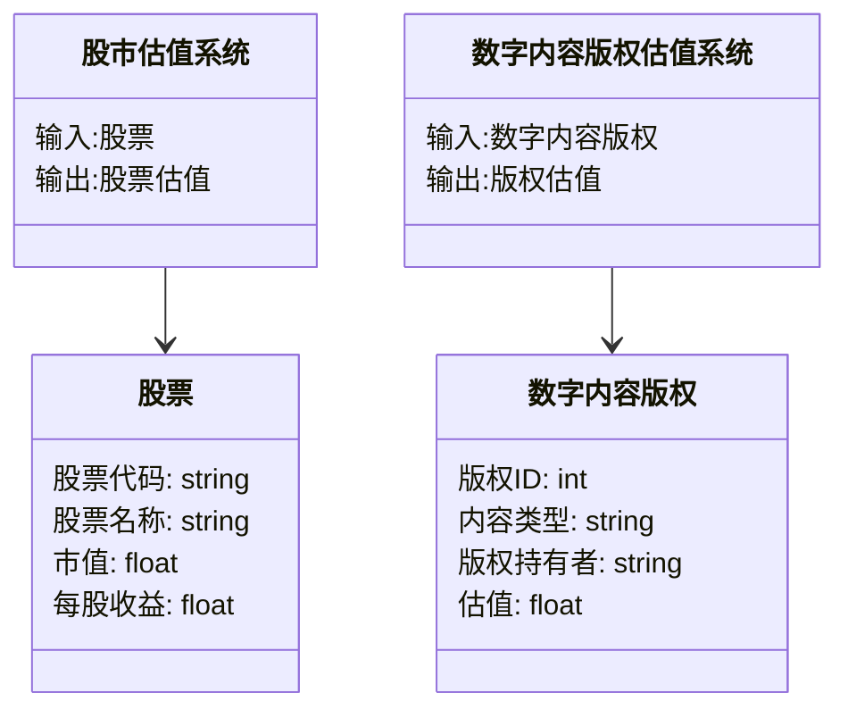
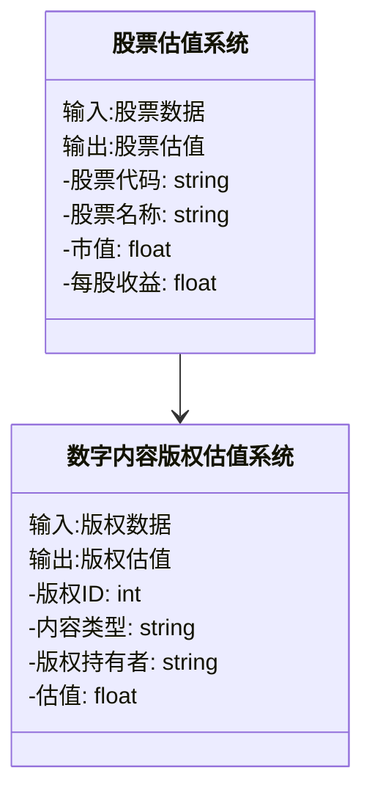

                 


# 股市估值对跨境数字内容版权估值的影响

## 关键词：
- 股市估值
- 数字内容版权
- 跨境版权
- 估值模型
- 数字经济

## 摘要：
本文探讨股市估值方法对跨境数字内容版权估值的影响，分析数字内容版权的经济价值及其在股市中的体现，结合实际案例，提出一种基于股市估值的数字内容版权估值模型。通过系统分析和算法设计，本文为数字内容版权的估值提供新的思路和方法。

---

# 第1章: 股市估值与数字内容版权估值的背景介绍

## 1.1 股市估值的核心概念
### 1.1.1 股票估值的基本原理
股票估值是通过对公司财务数据、市场环境和行业趋势进行分析，估算股票的内在价值和市场价值。主要方法包括市盈率（PE）、市净率（PB）、现金流折现法（DCF）等。

### 1.1.2 市场价值与内在价值的定义与区别
- **市场价值**：市场参与者根据供需关系和市场情绪确定的价值，受市场波动影响较大。
- **内在价值**：基于公司基本面（如盈利能力、成长性、财务状况）计算的理论价值，反映公司的长期发展潜力。

### 1.1.3 股票估值的主要方法
1. **市盈率（PE）**：市盈率=股价/每股收益。
2. **市净率（PB）**：市净率=股价/每股净资产。
3. **现金流折现法（DCF）**：通过预测公司未来现金流，折现计算公司价值。

## 1.2 数字内容版权的核心概念
### 1.2.1 数字内容的定义与特征
- **定义**：数字内容是指以数字化形式存在的信息产品，如电子书、音乐、视频、软件等。
- **特征**：可复制性、易传播性、无形性。

### 1.2.2 数字内容版权的法律属性与保护
数字内容版权受知识产权法保护，包括著作权、专利权等。版权保护包括复制权、发行权、信息网络传播权等。

### 1.2.3 数字内容版权的经济价值与市场地位
数字内容版权的经济价值取决于市场需求、版权持有者的市场影响力、内容的质量等因素。

## 1.3 股市估值与数字内容版权估值的关系
### 1.3.1 股市估值对数字内容版权估值的借鉴意义
股市估值方法可以为数字内容版权估值提供参考，尤其是在市场波动、公司基本面分析等方面。

### 1.3.2 数字内容版权在股市中的价值体现
数字内容版权是公司资产的重要组成部分，直接影响公司的市场价值和盈利能力。

### 1.3.3 跨境数字内容版权的独特性与挑战
- **独特性**：数字内容版权的跨国传播和销售需要考虑不同国家的法律、文化差异。
- **挑战**：跨国版权交易涉及复杂的法律、税务和市场环境问题。

## 1.4 本章小结
本章介绍了股市估值和数字内容版权的基本概念，并分析了两者之间的关系。数字内容版权的估值需要结合股市估值的理论和方法，同时考虑跨境环境下的特殊性。

---

# 第2章: 股市估值与数字内容版权估值的核心概念与联系

## 2.1 核心概念的定义与属性对比
### 2.1.1 股市估值的属性特征
- 市场敏感性高
- 依赖公司基本面分析
- 受宏观经济环境影响

### 2.1.2 数字内容版权估值的属性特征
- 依赖市场需求
- 受版权保护影响
- 估值具有主观性

### 2.1.3 两者属性的对比分析
| 属性 | 股市估值 | 数字内容版权估值 |
|------|----------|-------------------|
| 依赖因素 | 公司财务数据、市场环境 | 需求、版权保护、内容质量 |
| 时间跨度 | 中长期 | 短期到中长期 |
| 影响因素 | 宏观经济、行业趋势 | 法律、市场、技术 |

## 2.2 核心概念的ER实体关系图


## 2.3 核心概念的数学模型与公式
### 2.3.1 股票内在价值公式
$$ V = \frac{D}{r} $$
其中，$V$为股票内在价值，$D$为股息，$r$为折现率。

### 2.3.2 数字内容版权价值公式
$$ V = \alpha \times Q + \beta \times R $$
其中，$V$为版权价值，$\alpha$和$\beta$为权重，$Q$为内容质量，$R$为市场影响力。

## 2.4 本章小结
本章通过对比分析和ER图，展示了股市估值和数字内容版权估值的核心概念及其联系，并通过数学公式进一步阐述了两者的内在逻辑关系。

---

# 第3章: 股市估值与数字内容版权估值的算法原理

## 3.1 股票估值算法原理
### 3.1.1 市盈率法（PE）
- **公式**：$PE = \frac{\text{股价}}{\text{每股收益}}$
- **应用**：适用于盈利稳定的公司。

### 3.1.2 市净率法（PB）
- **公式**：$PB = \frac{\text{股价}}{\text{每股净资产}}$
- **应用**：适用于净资产较高的公司。

### 3.1.3 现金流折现法（DCF）
- **公式**：$V = \sum_{t=1}^{n} \frac{CF_t}{(1+r)^t} + \frac{TV}{(1+r)^n}$
- **应用**：适用于预测未来现金流的公司。

## 3.2 数字内容版权估值算法原理
### 3.2.1 支付意愿法
- **原理**：基于用户对数字内容的支付意愿进行估值。
- **步骤**：通过市场调研确定用户愿意支付的价格，计算版权价值。

### 3.2.2 市场比较法
- **原理**：基于市场上类似内容的交易价格进行比较。
- **步骤**：收集同类内容的价格数据，调整差异因素，估算目标内容的估值。

### 3.2.3 综合评估法
- **原理**：综合考虑内容质量、市场影响力、版权保护等因素进行估值。
- **步骤**：建立评分体系，权重分配，计算综合估值。

## 3.3 股市估值与数字内容版权估值的算法对比
### 3.3.1 算法原理的异同点
- **相同点**：都需要考虑市场环境和基本面因素。
- **不同点**：股市估值更依赖公司财务数据，数字内容版权估值更依赖内容质量和市场影响力。

### 3.3.2 算法适用场景的对比分析
- **市盈率法**：适用于盈利稳定的公司。
- **支付意愿法**：适用于用户需求明确的内容。

---

# 第4章: 股市估值与数字内容版权估值的系统分析与架构设计

## 4.1 问题场景介绍
### 4.1.1 股市估值与数字内容版权估值的结合场景
- 跨境数字内容版权交易
- 数字内容企业的上市估值

### 4.1.2 跨境环境下的复杂性分析
- 法律差异
- 市场差异
- 税务差异

## 4.2 系统功能设计
### 4.2.1 领域模型设计


## 4.3 本章小结
本章通过系统分析和架构设计，展示了股市估值与数字内容版权估值的结合场景，并提出了系统的功能设计。

---

# 第5章: 股市估值与数字内容版权估值的项目实战

## 5.1 项目环境安装
- 安装Python、Pandas、Matplotlib等工具。

## 5.2 项目核心实现源代码
```python
import pandas as pd
import numpy as np

def stock_valuation_pe(stocks, pe_ratio):
    return stocks * pe_ratio

def digital_content_valuation_market_approach(contents, comparison_prices):
    return np.mean(comparison_prices) * len(contents)

# 示例数据
stocks = [100, 200, 300]
pe_ratio = 15
pe_valuations = stock_valuation_pe(stocks, pe_ratio)
print("PE估值结果:", pe_valuations)

contents = ["电子书", "音乐", "视频"]
comparison_prices = [10, 15, 20]
market_valuations = digital_content_valuation_market_approach(contents, comparison_prices)
print("市场比较法估值结果:", market_valuations)
```

## 5.3 代码应用解读与分析
- **stock_valuation_pe**：基于市盈率法的股票估值函数。
- **digital_content_valuation_market_approach**：基于市场比较法的数字内容版权估值函数。

## 5.4 实际案例分析
以某音乐流媒体公司为例，结合其财务数据和市场需求，计算其数字内容版权的估值。

## 5.5 本章小结
通过项目实战，验证了股市估值方法在数字内容版权估值中的应用，并展示了具体的实现过程。

---

# 第6章: 总结与展望

## 6.1 本章总结
本文通过系统分析和实践，探讨了股市估值对跨境数字内容版权估值的影响，提出了基于股市估值的数字内容版权估值模型。

## 6.2 未来研究方向
- 研究更多数字内容版权估值方法。
- 探讨人工智能在估值中的应用。

## 6.3 最佳实践 tips
- 结合市场环境和公司基本面进行估值。
- 注意法律和税务问题。

## 6.4 本章小结
本文为数字内容版权的估值提供了新的思路和方法，未来可以在更多领域进行拓展研究。

---

# 作者：AI天才研究院/AI Genius Institute & 禅与计算机程序设计艺术 /Zen And The Art of Computer Programming

---

感谢您的阅读！希望本文能为您提供有价值的信息和启发。

