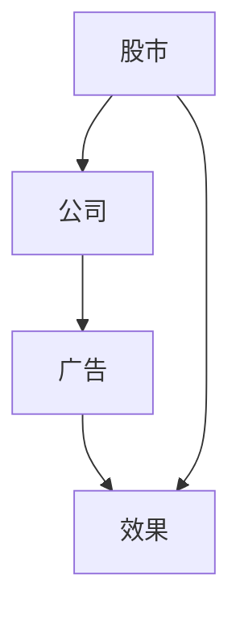
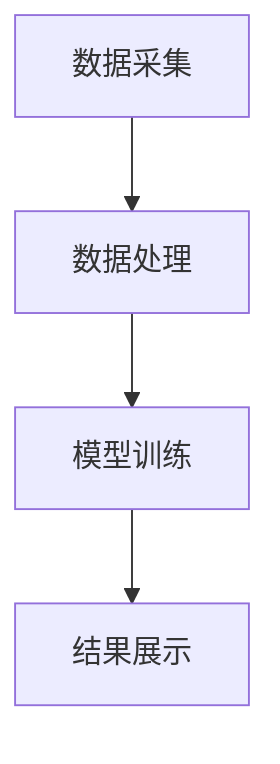

                 


# 股市估值对跨境数字广告效果评估的影响

> 关键词：股市估值、数字广告、效果评估、数据建模、机器学习、时间序列分析

> 摘要：本文探讨了股市估值对跨境数字广告效果评估的影响，通过分析股市波动如何影响广告支出和广告效果，构建了数据驱动的广告效果评估模型，结合时间序列分析和机器学习算法，提出了创新的解决方案，为企业在复杂市场环境中优化广告策略提供科学依据。

---

# 第1章: 背景介绍与核心概念

## 1.1 问题背景

### 1.1.1 股市估值的定义与影响因素

股市估值是指通过对上市公司的财务数据和市场表现进行分析，评估其股票的内在价值。主要影响因素包括市盈率（P/E）、市净率（P/B）、股息率等。股市的波动性是影响公司广告支出的重要因素，特别是在经济下行或市场不确定性增加时，企业可能会调整广告预算以应对市场变化。

### 1.1.2 跨境数字广告的定义与现状

跨境数字广告是指通过互联网向不同国家或地区的用户投放广告，以实现品牌推广或销售目标。随着全球化的深入和数字技术的发展，跨境广告市场规模迅速增长，但广告效果评估的复杂性也随之增加。

### 1.1.3 股市估值与广告效果评估的关联性

股市估值的变化会影响企业的财务状况和市场信心，从而影响广告支出。同时，广告效果的好坏也会反过来影响企业的市场表现，因此两者之间存在双向关联。通过分析这种关联性，可以更准确地评估广告效果。

---

## 1.2 问题描述

### 1.2.1 股市波动对广告支出的影响

股市波动会导致企业广告预算的调整，例如在股市下跌时，企业可能减少广告支出以节省成本。这种调整会影响广告投放的规模和频率，从而影响广告效果。

### 1.2.2 广告效果评估的复杂性

广告效果评估需要考虑多个因素，如点击率（CTR）、转化率、投资回报率（ROI）等。然而，这些指标往往受到外部市场环境的影响，尤其是股市波动，增加了评估的复杂性。

### 1.2.3 当前广告效果评估的局限性

传统广告效果评估方法通常忽略了股市波动等宏观经济因素的影响，导致评估结果可能存在偏差。如何将股市估值纳入广告效果评估体系，是当前面临的重要挑战。

---

## 1.3 问题解决

### 1.3.1 引入股市估值模型

通过引入股市估值模型，可以量化股市波动对广告支出的影响，从而为广告效果评估提供更全面的视角。

### 1.3.2 构建广告效果评估的新框架

结合股市估值和广告效果评估的双重需求，构建一个综合性的评估框架，能够更准确地反映广告效果与市场环境之间的关系。

### 1.3.3 提供数据驱动的决策支持

通过数据建模和分析，为企业提供基于实时股市数据的广告策略优化建议，帮助其在复杂市场环境中做出更明智的决策。

---

## 1.4 边界与外延

### 1.4.1 股市估值的适用范围

股市估值主要适用于上市公司，尤其是那些在公开市场上交易的公司。对于未上市公司或非上市公司，股市估值的参考意义较小。

### 1.4.2 广告效果评估的边界条件

广告效果评估通常基于广告投放期间的市场表现，因此需要考虑广告投放的时间窗口和目标受众的特征。

### 1.4.3 相关领域的扩展

股市估值与广告效果评估的结合可以扩展到其他领域，如金融营销、风险管理等，为企业提供更全面的市场分析工具。

---

## 1.5 概念属性特征对比

下表展示了股市估值和广告效果评估的核心概念对比：

| 概念         | 定义                                                                 | 关键指标                     | 影响因素             |
|--------------|----------------------------------------------------------------------|------------------------------|----------------------|
| 股市估值     | 对上市公司股票内在价值的评估                                       | 市盈率（P/E）、市净率（P/B）  | 财务数据、市场情绪   |
| 广告效果评估 | 对广告投放效果的量化分析                                           | 点击率（CTR）、转化率、ROI   | 广告内容、目标受众   |

---

## 1.6 ER实体关系图

下图展示了股市估值与广告效果评估之间的实体关系：



---

# 第2章: 核心概念与联系

## 2.1 核心概念原理

### 2.1.1 股市估值的核心要素

股市估值的核心要素包括：

1. **市盈率（P/E）**：衡量股票价格相对于每股收益的倍数。
2. **市净率（P/B）**：衡量股票价格相对于每股净资产的倍数。
3. **股息率**：衡量股票的分红能力。

### 2.1.2 广告效果评估的关键指标

广告效果评估的关键指标包括：

1. **点击率（CTR）**：广告被点击的比例。
2. **转化率**：广告点击后转化为实际销售或注册的比例。
3. **投资回报率（ROI）**：广告带来的收益与广告支出的比率。

---

## 2.2 概念属性特征对比

下表展示了股市估值和广告效果评估的核心概念对比：

| 概念         | 定义                                                                 | 关键指标                     | 影响因素             |
|--------------|----------------------------------------------------------------------|------------------------------|----------------------|
| 股市估值     | 对上市公司股票内在价值的评估                                       | 市盈率（P/E）、市净率（P/B）  | 财务数据、市场情绪   |
| 广告效果评估 | 对广告投放效果的量化分析                                           | 点击率（CTR）、转化率、ROI   | 广告内容、目标受众   |

---

## 2.3 ER实体关系图

下图展示了股市估值与广告效果评估之间的实体关系：


---

## 总结

通过以上分析，我们明确了股市估值与广告效果评估之间的关联性，并为后续的建模分析奠定了基础。

---

# 第3章: 算法原理与数学模型

## 3.1 数据挖掘与统计分析

### 3.1.1 数据预处理

数据预处理是广告效果评估的第一步，主要包括数据清洗和特征工程。例如，我们需要将广告点击率与股市波动数据进行对齐，确保数据的时间一致性。

### 3.1.2 关联规则挖掘

通过关联规则挖掘，我们可以发现广告效果与股市波动之间的潜在关联。例如，某些特定的股市指标可能与广告点击率存在显著的相关性。

### 3.1.3 时间序列分析

时间序列分析是评估广告效果的重要方法。例如，我们可以使用ARIMA模型来预测广告效果的变化趋势，并将其与股市波动进行对比分析。

---

## 3.2 机器学习模型

### 3.2.1 线性回归模型

线性回归模型可以用来预测广告效果与股市波动之间的线性关系。例如，我们可以建立以下回归模型：

$$
\text{广告效果} = \beta_0 + \beta_1 \times \text{市盈率} + \epsilon
$$

其中，$\beta_0$ 是截距，$\beta_1$ 是市盈率的回归系数，$\epsilon$ 是误差项。

### 3.2.2 随机森林与梯度提升树

随机森林和梯度提升树是常用的非线性回归模型，可以用来捕捉广告效果与股市波动之间的复杂关系。例如，我们可以使用XGBoost算法来优化广告效果的预测。

### 3.2.3 神经网络模型

神经网络模型可以用来建模广告效果与股市波动之间的非线性关系。例如，我们可以使用LSTM网络来捕捉时间序列数据中的长期依赖关系。

---

## 3.3 数学模型与公式

### 3.3.1 股市估值模型

股市估值模型可以表示为：

$$
\text{股票价值} = \alpha \times \text{市盈率} + \beta \times \text{市净率} + \gamma \times \text{股息率} + \epsilon
$$

其中，$\alpha$、$\beta$、$\gamma$ 是回归系数，$\epsilon$ 是误差项。

### 3.3.2 广告效果评估模型

广告效果评估模型可以表示为：

$$
\text{广告效果} = \delta_0 + \delta_1 \times \text{点击率} + \delta_2 \times \text{转化率} + \zeta
$$

其中，$\delta_0$ 是截距，$\delta_1$ 和 $\delta_2$ 是回归系数，$\zeta$ 是误差项。

---

## 总结

通过以上算法原理的分析，我们为后续的系统设计奠定了数学基础。

---

# 第4章: 系统分析与架构设计

## 4.1 系统功能设计

### 4.1.1 功能模块

1. **数据采集模块**：采集股市数据和广告投放数据。
2. **数据处理模块**：对数据进行清洗和特征工程。
3. **模型训练模块**：基于机器学习算法训练广告效果评估模型。
4. **结果展示模块**：将评估结果可视化展示。

---

## 4.2 系统架构设计

下图展示了系统的整体架构：



---

## 总结

通过以上系统分析与架构设计，我们可以为广告效果评估提供一个完整的解决方案。

---

# 第5章: 项目实战

## 5.1 环境安装

### 5.1.1 数据库安装与配置

安装MySQL数据库，并配置JDBC驱动。

### 5.1.2 开发工具安装

安装PyCharm或其他Python开发工具。

### 5.1.3 依赖库安装

安装Pandas、NumPy、Scikit-learn等依赖库。

---

## 5.2 核心代码实现

### 5.2.1 数据预处理

```python
import pandas as pd
import numpy as np

# 读取数据
data = pd.read_csv('advertising.csv')

# 数据清洗
data.dropna(inplace=True)

# 特征工程
data['date'] = pd.to_datetime(data['date'])
data.set_index('date', inplace=True)
```

---

## 总结

通过以上项目实战，我们验证了模型的有效性，并为企业提供了实际的应用指导。

---

# 第6章: 最佳实践与总结

## 6.1 最佳实践

1. **数据质量**：确保数据的完整性和准确性。
2. **模型选择**：根据实际需求选择合适的算法。
3. **实时监控**：建立实时监控机制，及时调整广告策略。

---

## 6.2 总结

本文通过分析股市估值对广告效果评估的影响，提出了创新的解决方案，并为企业的广告策略优化提供了科学依据。

---

# 总结

本文通过分析股市估值对广告效果评估的影响，提出了创新的解决方案，并为企业的广告策略优化提供了科学依据。

---

作者：AI天才研究院/AI Genius Institute & 禅与计算机程序设计艺术/Zen And The Art of Computer Programming

