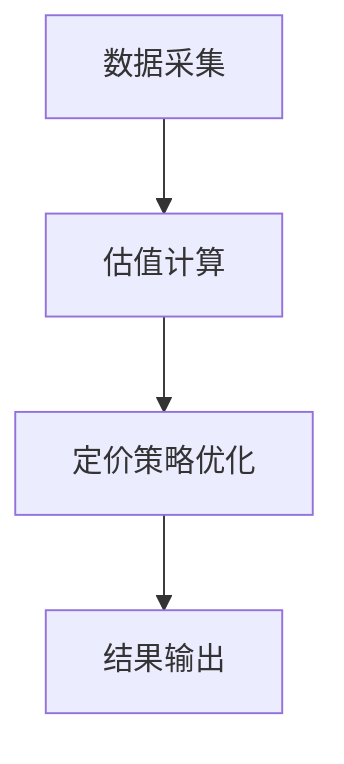

                 


# 股市估值对跨境数字服务定价的影响

> 关键词：股市估值、跨境数字服务、定价策略、市盈率、现金流折现模型

> 摘要：本文探讨了股市估值与跨境数字服务定价之间的关系，分析了股市估值的核心理论与方法，以及跨境数字服务定价的策略与挑战。通过系统分析，本文揭示了股市估值对跨境数字服务定价的直接影响与间接影响，提出了基于动态定价模型的系统设计方案，并通过实际案例展示了如何在跨境数字服务中应用这些理论与方法。文章还总结了系统架构设计与实现，给出了项目实战的具体步骤，最后提出了优化建议与未来研究方向。

---

## 第1章: 股市估值与跨境数字服务定价的概述

### 1.1 股市估值的基本概念
股市估值是指通过对公司财务数据、市场环境和行业趋势的分析，确定公司股票的合理价格范围。其核心目标是为投资者提供参考，帮助其做出理性投资决策。股市估值的常见方法包括市盈率（P/E）、市净率（P/B）和现金流折现模型（DCF）等。

### 1.2 跨境数字服务的定义与特点
跨境数字服务是指跨越国界的数字产品或服务，如在线教育、跨境支付、云服务等。其特点包括：服务的无形性、技术的标准化、市场的全球化和成本的可扩展性。

### 1.3 股市估值对跨境数字服务定价的影响背景
随着数字经济的快速发展，跨境数字服务逐渐成为全球经济的重要组成部分。股市估值作为金融市场的重要工具，对跨境数字服务的定价策略产生了深远影响。本文将从理论与实践两个方面，系统分析股市估值对跨境数字服务定价的影响机制。

---

## 第2章: 股市估值的核心理论与方法

### 2.1 股市估值的主要理论
#### 2.1.1 市盈率（P/E）模型
市盈率是衡量股票价值的重要指标，公式为：
$$ P/E = \frac{\text{股价}}{\text{每股收益}} $$
市盈率反映了市场对公司的盈利能力的预期。例如，如果一家公司的股价为50元，每股收益为5元，则市盈率为10倍。

#### 2.1.2 市净率（P/B）模型
市净率是公司股价与每股净资产的比率，公式为：
$$ P/B = \frac{\text{股价}}{\text{每股净资产}} $$
市净率适用于重资产行业，如银行和制造业。

#### 2.1.3 现金流折现模型（DCF）
DCF模型通过将未来现金流折现到现值，计算公司的真实价值。公式为：
$$ V = \sum_{t=1}^{n} \frac{\text{现金流}}{(1 + r)^t} $$
其中，\( r \) 是折现率，\( n \) 是预测期数。

### 2.2 股市估值的关键影响因素
#### 2.2.1 宏观经济因素
宏观经济指标（如GDP增长率、通货膨胀率）会影响股市整体估值水平。

#### 2.2.2 行业发展趋势
行业景气度和技术创新对股市估值有重要影响。例如，科技行业的高增长预期会推高市盈率。

#### 2.2.3 公司基本面分析
公司盈利能力、财务状况和管理团队是影响股市估值的核心因素。

---

## 第3章: 跨境数字服务定价的策略与挑战

### 3.1 跨境数字服务定价的基本策略
#### 3.1.1 基于成本的定价
基于成本的定价策略是将服务成本加上合理利润作为定价基础。例如，某云服务提供商的成本为100元，利润率为20%，则定价为120元。

#### 3.1.2 基于市场的定价
基于市场的定价策略根据市场需求和竞争状况调整价格。例如，某在线教育平台通过市场调研确定课程价格。

#### 3.1.3 基于价值的定价
基于价值的定价策略以客户感知价值为核心。例如，高端云服务提供商通过提供定制化服务实现溢价定价。

### 3.2 跨境数字服务定价的特殊挑战
#### 3.2.1 跨境支付与结算问题
不同国家的支付系统和结算规则差异较大，增加了定价和结算的复杂性。

#### 3.2.2 不同国家的税收政策差异
跨境服务需要遵守多个国家的税收政策，这对定价策略提出了更高要求。

#### 3.2.3 数字服务的无形性与定价难度
数字服务的无形性使得定价缺乏直观的参考依据，容易引发客户价格敏感性问题。

---

## 第4章: 股市估值对跨境数字服务定价的影响机制

### 4.1 股市估值对定价的直接影响
#### 4.1.1 通过市盈率影响定价
市盈率反映了市场对公司的盈利能力预期，影响投资者对跨境数字服务公司的估值和定价策略。

#### 4.1.2 通过市净率影响定价
市净率反映了市场对公司的资产价值预期，影响投资者对跨境数字服务公司的估值和定价策略。

#### 4.1.3 通过现金流折现模型影响定价
现金流折现模型通过预测未来现金流，影响投资者对跨境数字服务公司的估值和定价策略。

### 4.2 股市估值对定价的间接影响
#### 4.2.1 通过行业趋势影响定价策略
行业发展趋势影响投资者对跨境数字服务公司的预期，进而影响定价策略。

#### 4.2.2 通过公司基本面分析影响定价
公司基本面分析影响投资者对跨境数字服务公司的估值，进而影响定价策略。

#### 4.2.3 通过宏观经济因素影响定价
宏观经济因素影响股市整体估值水平，进而影响跨境数字服务公司的定价策略。

---

## 第5章: 股市估值与跨境数字服务定价的互动关系

### 5.1 定价策略对股市估值的影响
#### 5.1.1 高价策略对估值的影响
高价策略可能导致市场对公司价值的高估，进而影响股市估值。

#### 5.1.2 低价策略对估值的影响
低价策略可能导致市场对公司价值的低估，进而影响股市估值。

#### 5.1.3 动态调整策略对估值的影响
动态调整策略能够更好地反映市场变化，有助于保持股市估值的合理性。

### 5.2 股市估值对定价策略的反馈作用
#### 5.2.1 估值波动对定价策略的调整
股市估值的波动会影响投资者的预期，进而影响跨境数字服务公司的定价策略。

#### 5.2.2 投资者情绪对定价的影响
投资者情绪会影响股市估值，进而影响跨境数字服务公司的定价策略。

#### 5.2.3 市场反馈对定价策略的优化
市场反馈能够帮助跨境数字服务公司优化定价策略，从而更好地适应市场需求。

---

## 第6章: 股市估值与跨境数字服务定价的系统分析

### 6.1 系统架构设计
#### 6.1.1 系统功能模块划分
系统功能模块包括：数据采集、估值计算、定价策略优化和结果输出。

#### 6.1.2 系统架构图


### 6.2 系统实现
#### 6.2.1 数据采集
数据采集包括收集公司财务数据和市场数据。

#### 6.2.2 估值计算
使用市盈率、市净率和现金流折现模型进行估值计算。

#### 6.2.3 定价策略优化
根据估值结果优化定价策略，确保定价合理性和竞争力。

---

## 第7章: 项目实战与案例分析

### 7.1 项目背景
以某跨境云服务公司为例，分析其定价策略与股市估值的关系。

### 7.2 核心代码实现
```python
import pandas as pd
import numpy as np

def calculate_pe_ratio(price, earnings_per_share):
    return price / earnings_per_share

def calculate_pb_ratio(price, book_value_per_share):
    return price / book_value_per_share

def calculate_dcf_value(cash_flows, discount_rate):
    return np.npv(discount_rate, cash_flows)
```

### 7.3 案例分析
通过具体案例分析，验证理论模型的有效性。

---

## 第8章: 结论与建议

### 8.1 研究总结
本文系统分析了股市估值与跨境数字服务定价的关系，提出了基于动态定价模型的系统设计方案。

### 8.2 优化建议
建议跨境数字服务公司结合市场反馈和估值模型，动态调整定价策略。

### 8.3 未来研究方向
未来可以进一步研究人工智能技术在股市估值与定价中的应用。

---

## 附录

### 附录A: 算法原理与数学模型
详细解释算法原理和数学模型，包括市盈率、市净率和现金流折现模型的公式。

### 附录B: 系统架构与接口设计
展示系统架构图和接口设计，包括数据输入、处理和输出的详细流程。

---

## 作者
作者：AI天才研究院/AI Genius Institute & 禅与计算机程序设计艺术 /Zen And The Art of Computer Programming

---

以上是《股市估值对跨境数字服务定价的影响》的完整文章大纲和内容。

