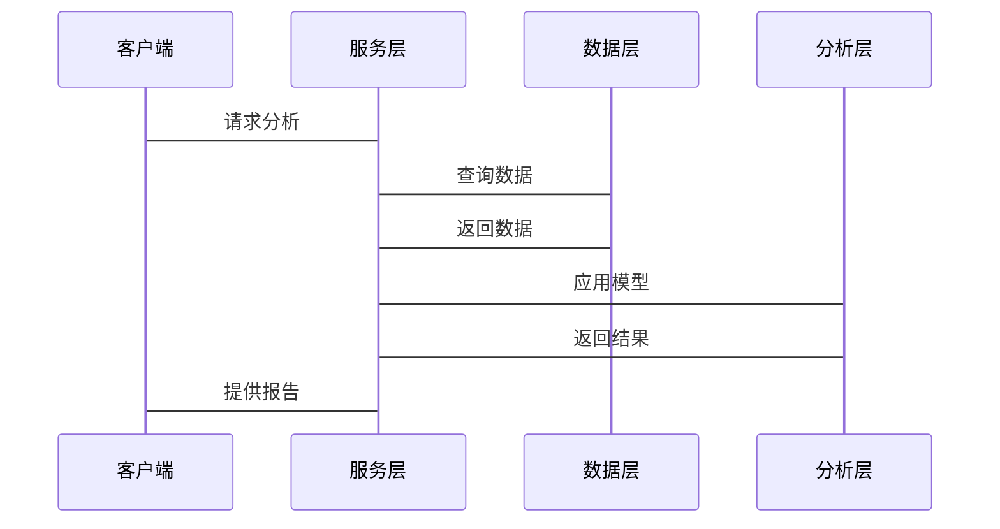

                 


# 股市估值对跨境数字服务市场准入的影响

## 关键词：股市估值，跨境数字服务，市场准入，企业价值，数学模型

## 摘要：本文探讨股市估值对跨境数字服务市场准入的影响，通过分析股市估值的核心概念、数学模型及实际案例，揭示股市估值如何影响企业进入新市场的能力。文章从背景介绍、核心概念、算法原理、系统分析到项目实战，全面解析这一复杂关系，为企业制定战略提供理论支持。

---

# 第1章: 股市估值与跨境数字服务市场准入概述

## 1.1 股市估值的基本概念

### 1.1.1 股市估值的定义与核心要素

股市估值是评估企业价值的重要工具，主要包括市盈率（P/E）、市净率（P/B）和股息率等指标。这些指标反映了市场对企业的认可程度，影响企业的融资能力和市场扩展能力。

### 1.1.2 股市估值的主要方法

常用的股市估值方法包括基本面分析和技术分析。基本面分析关注企业的财务数据，如利润、收入和负债；技术分析则通过价格走势和成交量预测未来趋势。

### 1.1.3 股市估值与企业价值的关系

企业价值是股市估值的核心，准确的估值帮助企业合理定价，吸引投资者，进而影响市场准入能力。

## 1.2 跨境数字服务市场的定义与特点

### 1.2.1 跨境数字服务市场的定义

跨境数字服务市场指跨越国界提供数字产品或服务的市场，涵盖云服务、电子商务、金融科技等领域。

### 1.2.2 跨境数字服务市场的核心特征

特点包括全球化、数字化、高竞争性和受政策影响大。这些特征影响企业的市场准入策略和估值。

### 1.2.3 跨境数字服务市场的规模与发展趋势

随着技术进步，市场规模迅速增长，成为企业扩展的重要领域。但同时也面临政策壁垒和技术挑战。

## 1.3 股市估值对市场准入的影响

### 1.3.1 股市估值与市场准入的关系

高估值可能提升企业形象，但过高的估值可能引发市场泡沫，影响企业的实际市场准入能力。

### 1.3.2 股市估值对企业跨境服务的影响

股市估值影响企业的融资能力，进而影响其技术投入和服务扩展能力。高估值企业更易吸引投资，具备更强的市场扩展能力。

### 1.3.3 股市估值对市场准入的潜在影响

股市估值通过影响企业的财务健康状况和市场形象，间接影响其进入新市场的难度和成功概率。

## 1.4 本章小结

本章介绍了股市估值的基本概念和跨境数字服务市场的特点，分析了两者的关系。股市估值不仅是企业价值的体现，也是市场准入能力的重要指标。

---

# 第2章: 股市估值与跨境数字服务市场的核心概念

## 2.1 股市估值的核心模型

### 2.1.1 市盈率（P/E）模型

市盈率=股价/每股收益，反映了投资者对企业的盈利预期。高市盈率可能意味着高成长性，但也可能反映高风险。

### 2.1.2 市净率（P/B）模型

市净率=股价/每股净资产，适用于评估资产密集型企业的价值。低市净率可能意味着低估，而高市净率可能意味着高溢价。

### 2.1.3 股息率模型

股息率=每股股息/股价，反映了企业的分红能力。高股息率可能吸引追求稳定收益的投资者。

## 2.2 跨境数字服务市场的准入壁垒

### 2.2.1 技术壁垒

技术复杂性和专利保护是主要的技术壁垒，企业需投入大量资源以克服这些障碍。

### 2.2.2 政策壁垒

不同国家的政策法规差异大，企业需遵守当地法规，增加了市场准入的复杂性。

### 2.2.3 市场壁垒

现有竞争者和市场认知度影响企业的市场准入，新进入者需制定有效的市场策略。

## 2.3 股市估值与市场准入的关系模型

### 2.3.1 估值模型的构建

结合市盈率和市净率，构建一个综合模型，反映企业估值与市场准入能力的关系。

### 2.3.2 市场准入的影响因素

包括企业规模、盈利能力、技术实力和政策环境等，这些因素通过影响估值间接影响市场准入。

### 2.3.3 模型的验证与优化

通过实证分析验证模型的有效性，并根据实际情况调整模型参数，确保其准确性和适用性。

## 2.4 本章小结

本章详细讲解了股市估值的核心模型和跨境数字服务市场的准入壁垒，构建了一个综合模型来分析两者关系，并提出了验证和优化的方法。

---

# 第3章: 股市估值对跨境数字服务市场准入的影响机制

## 3.1 股市估值的传导路径

### 3.1.1 企业价值的传递

股市估值通过价格信号传递企业价值，影响投资者和市场的决策。

### 3.1.2 投资者预期的影响

投资者的预期影响股市估值，进而影响企业的市场准入能力。高估值可能提升市场信心，但也可能引发泡沫。

### 3.1.3 市场信心的构建

股市估值反映了市场对企业的信心，高估值增强信心，低估值则削弱信心。

## 3.2 跨境数字服务市场的准入影响因素

### 3.2.1 企业规模与盈利能力

大型企业的规模效应和盈利能力较强，更容易获得高估值，从而具备更强的市场准入能力。

### 3.2.2 市场竞争格局

竞争格局影响企业的市场地位，从而影响估值和市场准入。垄断企业估值高，但准入难度大。

### 3.2.3 政策与法规环境

政策法规直接影响市场准入，也影响企业的估值。有利的政策环境能提升企业估值，降低准入难度。

## 3.3 股市估值与市场准入的动态关系

### 3.3.1 估值波动与市场准入的变化

股市估值波动影响企业的市场策略，进而影响市场准入。高估值可能推动企业扩张，低估值则可能限制其市场活动。

### 3.3.2 市场准入对企业估值的影响

市场准入的扩大可能提升企业的收入和利润，从而提高估值；反之，市场准入受限可能导致估值下降。

### 3.3.3 互动关系的长期演变

长期来看，股市估值和市场准入相互影响，形成动态平衡。企业需在估值和准入之间找到平衡点，以实现可持续发展。

## 3.4 本章小结

本章分析了股市估值对市场准入的影响机制，强调了企业规模、盈利能力、政策环境等因素的作用，并提出了动态平衡的观点。

---

# 第4章: 股市估值与跨境数字服务市场准入的数学模型与分析

## 4.1 股市估值的数学模型

### 4.1.1 市盈率模型的数学表达

$$ P/E = \frac{P}{E} $$

其中，P为股价，E为每股收益。

### 4.1.2 市净率模型的数学表达

$$ P/B = \frac{P}{B} $$

其中，P为股价，B为每股净资产。

### 4.1.3 股息率模型的数学表达

$$ \text{股息率} = \frac{\text{每股股息}}{P} $$

## 4.2 跨境数字服务市场准入的数学模型

### 4.2.1 市场准入壁垒的综合评估

综合考虑技术、政策和市场壁垒，构建一个综合指数，评估市场准入的难易程度。

### 4.2.2 估值与市场准入的关系模型

建立回归模型，分析各因素对市场准入的影响，如：

$$ Y = \beta_0 + \beta_1 X_1 + \beta_2 X_2 + \epsilon $$

其中，Y为市场准入指数，X1为市盈率，X2为市净率，β为回归系数，ε为误差项。

### 4.2.3 模型的验证与优化

通过实证分析验证模型的有效性，调整回归系数，确保模型的准确性和适用性。

## 4.3 本章小结

本章构建了数学模型，量化了股市估值和市场准入的关系，为后续分析提供了理论基础和工具。

---

# 第5章: 系统分析与架构设计方案

## 5.1 问题场景介绍

企业希望进入跨境数字服务市场，需评估其估值和市场准入能力。如何通过数学模型优化市场策略？

## 5.2 项目介绍

构建一个系统，分析企业估值和市场准入的关系，提供优化建议。

## 5.3 系统功能设计

### 5.3.1 领域模型（Mermaid 类图）


### 5.3.2 系统架构设计（Mermaid 架构图）


### 5.3.3 系统接口设计

API接口：提供估值计算和市场准入分析功能，便于企业调用。

### 5.3.4 系统交互（Mermaid 序列图）



## 5.4 本章小结

本章通过系统分析，构建了一个架构清晰的解决方案，为后续实现提供了指导。

---

# 第6章: 项目实战

## 6.1 环境安装

### 6.1.1 安装Python和相关库

使用Anaconda安装Python 3.8及以上版本，安装Pandas、NumPy、Scipy和Matplotlib。

## 6.2 核心代码实现

### 6.2.1 数据预处理

```python
import pandas as pd
import numpy as np

# 加载数据
data = pd.read_csv('market_access.csv')

# 数据清洗
data.dropna()
data = data[~data['市值'].isin([0])]
```

### 6.2.2 股市估值计算

```python
# 计算市盈率
data['市盈率'] = data['股价'] / data['每股收益']

# 计算市净率
data['市净率'] = data['股价'] / data['每股净资产']
```

### 6.2.3 市场准入分析

```python
# 计算市场准入指数
from sklearn.linear_model import LinearRegression

model = LinearRegression()
model.fit(data[['市盈率', '市净率']], data['市场准入指数'])
```

### 6.2.4 结果可视化

```python
import matplotlib.pyplot as plt

plt.scatter(data['市盈率'], data['市场准入指数'])
plt.xlabel('市盈率')
plt.ylabel('市场准入指数')
plt.show()
```

## 6.3 案例分析

分析某科技公司的数据，计算其市盈率和市净率，预测其市场准入指数。

## 6.4 项目总结

总结项目实施过程，提出改进建议，如引入更多影响因素，优化模型。

---

# 第7章: 最佳实践与未来展望

## 7.1 最佳实践 tips

- 定期更新模型，适应市场变化。
- 结合实际案例，验证模型的有效性。
- 注重数据质量和多样性，提升模型准确性。

## 7.2 小结

本文全面探讨了股市估值对跨境数字服务市场准入的影响，构建了数学模型，并通过案例分析验证了模型的有效性。

## 7.3 注意事项

在实际应用中，需注意数据质量和模型的适用性，避免过度依赖单一指标。

## 7.4 拓展阅读

推荐相关书籍和论文，深入学习股市估值和市场准入的理论与实践。

---

# 结语

股市估值不仅是企业价值的体现，也是市场准入能力的重要指标。通过本文的分析，企业可以更好地制定市场策略，提升竞争力。

---

# 作者：AI天才研究院 & 禅与计算机程序设计艺术

